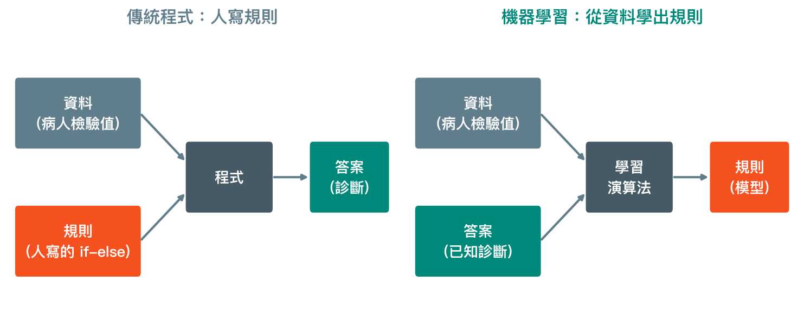
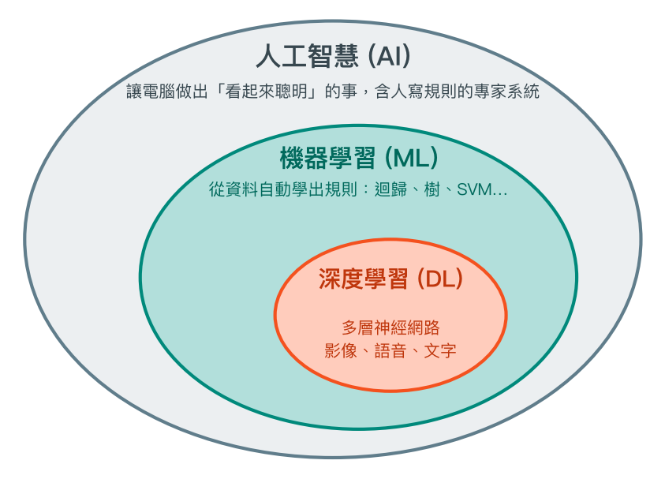
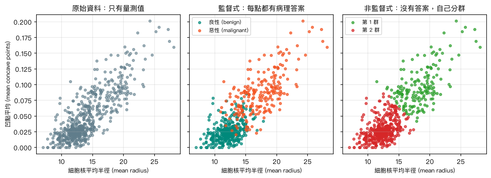
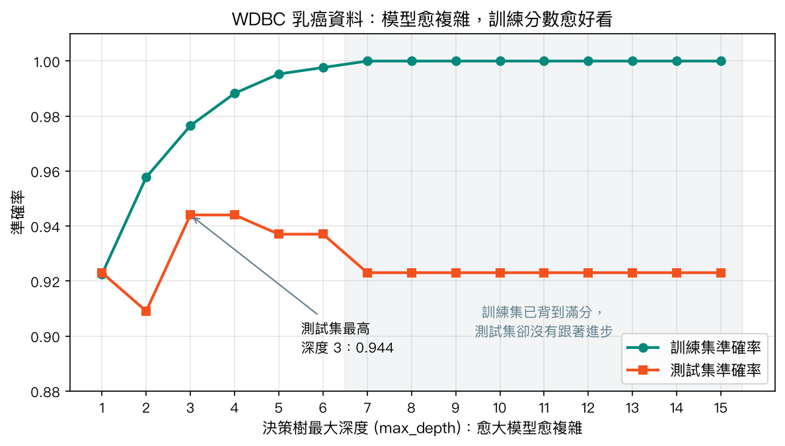

# 第 1 章　機器學習簡介與環境安裝

<p class="chapter-meta">預計閱讀 30 分鐘 ・ 先備：無（會用瀏覽器即可）</p>

!!! abstract "本章你會學到"
    - 分辨機器學習、傳統程式與統計推論各自在解決什麼問題
    - 說出監督式、非監督式、強化學習的差別，並各舉一個醫學例子
    - 畫出一個機器學習專案從資料到評估的完整流程
    - 解釋為什麼一定要留一份「測試集」，以及過擬合長什麼樣子
    - 在 Google Colab 上用五行程式訓練出第一個乳癌分類模型

<div class="nb-links" markdown>
[:simple-googlecolab: 在 Colab 開啟](https://colab.research.google.com/github/GITHUB_REPO_PLACEHOLDER/blob/main/docs/notebooks/ch01_intro.ipynb){ .md-button .md-button--primary }
[:material-download: 下載 Notebook](../notebooks/ch01_intro.ipynb){ .md-button }
</div>

## 1. 直覺：從一個臨床情境開始

想像你剛進病理科見習。第一天，學長姐拿出一疊細針抽吸（fine-needle aspiration）的細胞抹片，一張一張告訴你：「這張是良性，細胞核小而圓；這張是惡性，核大、形狀不規則、邊緣有凹陷。」你看了幾百張之後，就算沒人給你一條條寫死的規則，也慢慢能對一張沒看過的抹片說出「這張看起來像惡性」。

這個過程有三個重點：

1. **你看的是有答案的例子**：每一張抹片都附上病理診斷。
2. **你沒有背下每一張**，而是從中歸納出一種判斷方式，例如「核愈大、愈不規則，愈可能是惡性」。
3. **真正的考驗是沒看過的片子**：如果你只能認出看過的那幾百張，那叫背答案，不叫學會。

機器學習（machine learning）做的事情幾乎一模一樣：給電腦大量「有答案的例子」，讓它自己歸納出判斷規則，再拿規則去預測新的病人。本章後面的程式碼，就是讓電腦去看 569 位病人的細胞核量測值，學著分辨良性與惡性。

再對照另一種做法。在機器學習普及以前，如果要寫一個「自動判讀」的程式，得請資深病理專家把判斷流程寫成一條條規則：「若核半徑大於某值，且凹點數超過某值，則判為惡性……」。這就像把臨床診斷流程圖直接寫死在程式裡。這種做法在規則清楚的問題上很好用，但遇到影像判讀這種連專家都很難把規則講完整的任務，就寫不下去了。

機器學習換了一個思路：與其由人寫規則，不如給電腦一千份病歷和它們的答案，讓它**自己長出一張流程圖**。

## 2. 核心概念

### 2.1 傳統程式 vs 機器學習

{ loading=lazy }

上圖是整章最重要的一張圖。傳統程式是「資料＋規則 → 答案」；機器學習把箭頭反過來，變成「資料＋答案 → 規則」。學出來的這套規則，我們稱為**模型（model）**。你可以把模型想成一位醫師多年經驗的「壓縮檔」：它不是一本記得每位病人的百科全書，而是一套從過去病例提煉出來、拿來判斷新病人的思考方式。

### 2.2 人工智慧、機器學習、深度學習是什麼關係？

新聞常把這三個詞混著用，但它們是一層包一層的關係：

{ loading=lazy }

- **人工智慧（artificial intelligence, AI）**：範圍最大，泛指讓電腦做出看起來聰明的事。早期由人寫規則的「專家系統」也算 AI，但不是機器學習。
- **機器學習**：AI 中「從資料學出規則」的那一大類。本網站第 4 到第 10 章介紹的迴歸、簡單貝氏、支援向量機、決策樹、K-平均分群，都在這一層。
- **深度學習（deep learning）**：機器學習中使用多層神經網路的那一支，特別擅長影像、語音、文字。第 9 章會碰到它的入門版本。

所以「用深度學習判讀胸部 X 光」同時也是機器學習、也是人工智慧；但「用邏輯迴歸預測住院死亡」是機器學習，不是深度學習。

### 2.3 機器學習和統計有什麼不同？

你在流行病學或生物統計課學過的邏輯迴歸（logistic regression，又稱羅吉斯迴歸），在機器學習課本裡也會出現。那兩者到底差在哪？最大的差別在於**問題的重心**：

| | 傳統程式 | 統計推論 | 機器學習 |
|---|---|---|---|
| 核心問題 | 照規則把事情做對 | 某個因子和結果有沒有關聯？效果多大？ | 對新的個案，預測得準不準？ |
| 規則從哪來 | 人寫 | 人先假設模型形式，再由資料估計參數 | 由資料學出，模型形式可以很彈性 |
| 典型輸出 | 答案 | 勝算比、95% 信賴區間、p 值 | 預測值、預測機率 |
| 怎麼算成功 | 結果符合規則 | 估計不偏、推論有效 | 在沒看過的資料上表現好 |
| 醫學例子 | 依公式算 eGFR | 吸菸與肺癌的勝算比 | 用檢驗值預測誰會在 30 天內再住院 |

同一個邏輯迴歸，統計學家關心的是「年齡每增加 10 歲，勝算比是多少、信賴區間有沒有跨過 1」，這是**解釋**；機器學習關心的是「把模型拿去預測下一批病人，猜中幾成」，這是**預測**。兩者使用的數學常常一樣，但評估標準不同。第 4 章講迴歸時會再回來比較。

### 2.4 三種學習方式

依照「給電腦的資料有沒有答案」，機器學習大致分成三種：

{ loading=lazy }

- **監督式學習（supervised learning）**：每筆資料都有答案，稱為**標籤（label）**；模型學習從量測值（稱為**特徵（feature）**）預測標籤。上圖中間就是監督式：每個點都知道病理是良性還是惡性。答案是類別的叫**分類（classification）**，例如良性／惡性；答案是數值的叫**迴歸（regression）**，例如預測住院天數。本網站大部分章節都屬於這類。
- **非監督式學習（unsupervised learning）**：資料沒有答案，演算法自己找出結構。上圖右邊是 K-平均分群（第 8 章）在「完全不知道病理結果」的情況下把病人分成兩群；它分出的兩群和真實診斷有幾分像，但並不完全一致。醫學上常用來探索疾病的亞型，例如把心衰竭病人依臨床特徵分群。
- **強化學習（reinforcement learning）**：模型像在玩遊戲，每做一個決策就得到獎勵或懲罰，從試錯中學出最好的策略。研究上有人嘗試用來調整加護病房的升壓劑與輸液劑量，但離臨床常規使用還很遠。本網站不會深入這一類。

### 2.5 一個機器學習專案的完整流程

不管用哪個演算法，流程都差不多：


幾個容易忽略的地方：

- **第一步是問題，不是演算法**。「我要用神經網路」不是研究問題；「能不能用門診常規檢驗值，提早找出三年內會進展到透析的病人」才是。
- **切分要在訓練之前**，而且測試集從頭到尾都不能拿來調整模型，否則就像考前偷看考卷。第 3 章會談到前處理也要小心這件事。
- **在自己的測試集上表現好，不代表在別家醫院也好**。模型要進臨床之前，還需要用另一家醫院、另一段時間的資料做外部驗證（external validation），再評估它到底有沒有改善病人結果。

### 2.6 訓練集、測試集與過擬合

回到見習的比喻。學長姐給你看的那幾百張抹片是**訓練集（training set）**；期末考那些你沒看過的抹片是**測試集（test set）**。訓練集用來學規則，測試集只用來打分數。

為什麼一定要分開？因為一個模型如果夠複雜，它可以把訓練資料「整本背下來」，包括裡面的雜訊與巧合。這種模型在訓練集上滿分，碰到新病人卻表現平平，這個現象叫**過擬合（overfitting）**；樂詞網的官方譯名是「過度配適」，意思相同。反過來，模型太簡單、連訓練資料的規律都抓不到，叫**配適不足（underfitting）**。

下圖是用決策樹（第 7 章）做的實驗：樹的深度愈深，模型愈複雜。

{ loading=lazy }

訓練集準確率（綠線）一路爬升到 100%，但測試集準確率（橘線）在深度 3、4 就到頂，之後反而下滑。只看訓練集分數，你會以為深度 15 最好；看了測試集，才知道它只是背得比較熟。**只報告訓練集分數的模型，就像只報告「考古題原題」的模擬考成績。**

??? note "數學補充（可跳過）：模型在「學」什麼？"
    以監督式學習來說，模型是一個帶有未知參數 $\theta$ 的函數 $f_\theta(x)$，輸入特徵 $x$、輸出預測 $\hat{y}$。「學習」就是找一組參數，讓訓練集上的平均損失最小：

    $$
    \hat{\theta} = \arg\min_{\theta} \frac{1}{n}\sum_{i=1}^{n} L\big(y_i,\, f_\theta(x_i)\big)
    $$

    其中 $L$ 是損失函數（loss function），衡量預測 $f_\theta(x_i)$ 和真實答案 $y_i$ 差多少。但我們真正在乎的是**沒看過的資料**上的損失，也就是期望值 $\mathbb{E}\,[L(y, f_\theta(x))]$。訓練集損失只是它的樂觀估計，所以需要獨立的測試集來估計真正的表現。模型愈彈性（參數愈多），兩者的落差通常愈大，這就是過擬合的數學樣貌。

## 3. 動手做

### 3.1 環境安裝

寫機器學習程式需要 Python 和幾個套件（package）。本網站以 **Google Colab** 為主，完全不用安裝；想在自己電腦跑的話，再看另外兩個選項。

=== "Google Colab（推薦）"

    Colab 是 Google 提供的免費線上 Jupyter Notebook 環境，程式在 Google 的雲端主機上執行，你只需要瀏覽器和 Google 帳號。

    1. 點本章上方的「在 Colab 開啟」按鈕，notebook 會直接在 Colab 打開。
    2. 第一次執行時可能會跳出「這個筆記本並非由 Google 建立」的提醒，確認來源後按「仍要執行」。
    3. 點選程式碼格子，按 ++shift+enter++ 執行並跳到下一格；或從上方選單「執行階段 → 全部執行」。
    4. 想保留自己的修改：選單「檔案 → 在雲端硬碟中儲存副本」。

    Colab 已預裝 numpy、pandas、matplotlib、scikit-learn 等本網站會用到的套件。免費版閒置一段時間會自動斷線，斷線後變數會消失，重新「全部執行」即可。

=== "Anaconda + Jupyter（選配）"

    想離線使用、或之後要處理不能上傳雲端的資料，可以在自己電腦安裝 Anaconda。

    1. 到 [Anaconda 官網](https://www.anaconda.com/download) 下載對應作業系統的安裝檔，照預設選項安裝。
    2. 打開 Anaconda Navigator，啟動 **JupyterLab**；瀏覽器會出現一個本機的 notebook 介面。
    3. 用本章上方「下載 Notebook」取得 `.ipynb` 檔，在 JupyterLab 中打開即可執行。

    Anaconda 已內含本網站需要的主要套件。若缺某個套件，在 notebook 中執行 `%pip install 套件名稱` 安裝。

=== "VS Code（選配）"

    如果你已經習慣用 VS Code 寫程式，安裝 Python 與 Jupyter 兩個擴充功能後，就能直接打開 `.ipynb` 檔。右上角「Select Kernel」選一個已安裝 scikit-learn 的 Python 環境（例如 Anaconda 的 base 環境），就能像在 Colab 一樣逐格執行。

!!! tip "版本差異"
    不同環境的套件版本不同。本網站的 notebook 以 Colab 當下的版本為基準（scikit-learn 1.6），也在較新版本（scikit-learn 1.9、pandas 3）測試過。每個 notebook 第一格會印出版本號，遇到錯誤時先看這裡。

### 3.2 載入資料

本章使用 **Breast Cancer Wisconsin (Diagnostic)** 資料集（簡稱 WDBC），它是 scikit-learn 內建的資料，一行就能載入，不需網路。下面這段程式碼載入資料並印出基本資訊：

```python
from sklearn.datasets import load_breast_cancer

data = load_breast_cancer(as_frame=True)
df = data.frame

print("資料大小（列, 欄）:", df.shape)
print("target 的意義:", dict(enumerate(data.target_names.tolist())))
print(df["target"].value_counts().rename(index=dict(enumerate(data.target_names.tolist()))))
```

```text
資料大小（列, 欄）: (569, 31)
target 的意義: {0: 'malignant', 1: 'benign'}
target
benign       357
malignant    212
```

一共 569 位病人、30 個特徵加 1 個答案欄，其中良性 357 位、惡性 212 位。請特別記住：這份資料的編碼是 **0 = 惡性、1 = 良性**，跟一般「1 = 有病」的直覺相反。

### 3.3 五行程式跑出第一個模型

接下來把資料切成訓練集與測試集，用訓練集訓練一棵決策樹，再到測試集上打分數。扣掉兩行 import，核心只有五行：

```python
from sklearn.model_selection import train_test_split
from sklearn.tree import DecisionTreeClassifier

X, y = load_breast_cancer(return_X_y=True)
X_train, X_test, y_train, y_test = train_test_split(X, y, test_size=0.25, stratify=y, random_state=42)
model = DecisionTreeClassifier(max_depth=3, random_state=42)
model.fit(X_train, y_train)
print("測試集準確率:", round(model.score(X_test, y_test), 3))
```

```text
測試集準確率: 0.944
```

逐行看：`X` 是 569 × 30 的特徵表、`y` 是答案；`train_test_split` 把 25% 的病人藏起來當測試集，`stratify=y` 讓兩邊的惡性比例相同，`random_state=42` 固定隨機切法以便重現；`fit` 就是「學習」這個動作；`score` 算出測試集中判對的比例。0.944 代表 143 位測試病人中大約 94% 被判對。

把同一個模型在訓練集與測試集的分數放在一起比：

```python
print("訓練集準確率:", round(model.score(X_train, y_train), 3))
print("測試集準確率:", round(model.score(X_test, y_test), 3))
print("訓練集人數:", len(y_train), "／ 測試集人數:", len(y_test))
```

```text
訓練集準確率: 0.977
測試集準確率: 0.944
訓練集人數: 426 ／ 測試集人數: 143
```

訓練集分數比測試集高，是正常現象；關鍵在差距有沒有大到不合理。你可以在 notebook 第 5 節把深度從 1 調到 15，重現上一節的過擬合圖。

### 3.4 換成你熟悉的邏輯迴歸

最後，用同一份切分訓練一個邏輯迴歸。這裡先用 `StandardScaler` 把每個特徵轉成 z 分數（平均 0、標準差 1），再接上邏輯迴歸；`make_pipeline` 把兩個步驟串成一個模型，`solver="liblinear"` 是一種適合小型資料的求解方式：

```python
from sklearn.pipeline import make_pipeline
from sklearn.preprocessing import StandardScaler
from sklearn.linear_model import LogisticRegression

logit = make_pipeline(StandardScaler(), LogisticRegression(solver="liblinear"))
logit.fit(X_train, y_train)
print("邏輯迴歸 訓練集準確率:", round(logit.score(X_train, y_train), 3))
print("邏輯迴歸 測試集準確率:", round(logit.score(X_test, y_test), 3))
```

```text
邏輯迴歸 訓練集準確率: 0.988
邏輯迴歸 測試集準確率: 0.986
```

在這一次切分中，邏輯迴歸的測試集準確率（0.986）高於深度 3 的決策樹（0.944）。但測試集只有 143 人，兩者只差幾位病人，換一個 `random_state` 結果可能就不同；只憑這一次切分，還不能說邏輯迴歸比較好。要公平比較模型，需要第 11 章的交叉驗證。

## 4. 醫學案例

!!! info "僅供學習"
    本例使用公開的 WDBC 教學資料集示範機器學習流程，僅供學習，不構成臨床建議。

**資料來源**：WDBC 由美國威斯康辛大學的研究者建立，每筆資料是一位乳房腫塊病人的細針抽吸影像，由電腦描出細胞核輪廓後，計算 10 種形態量測（半徑、紋理、周長、面積、平滑度、緊密度、凹陷程度、凹點數、對稱性、碎形維度），每種各取平均值、標準誤與最差值，共 30 個特徵；答案是病理診斷。資料以 CC BY 4.0 授權公開於 UCI Machine Learning Repository，scikit-learn 內建的是同一份資料。

**把準確率翻成醫學語言**。準確率把所有錯誤一視同仁，但在癌症診斷中，把惡性判成良性（偽陰性）可能延誤治療，代價遠高於把良性判成惡性（偽陽性，多做一次切片）。我們把惡性當作陽性，計算你熟悉的敏感度與特異度：

```python
import pandas as pd
from sklearn.metrics import confusion_matrix

y_pred = model.predict(X_test)
cm = confusion_matrix(y_test, y_pred, labels=[0, 1])   # 列 = 真實，欄 = 預測；順序 [惡性, 良性]
print(pd.DataFrame(cm,
                   index=["真實：惡性", "真實：良性"],
                   columns=["預測：惡性", "預測：良性"]))

sensitivity = cm[0, 0] / cm[0].sum()   # 惡性中被抓到的比例
specificity = cm[1, 1] / cm[1].sum()   # 良性中被正確排除的比例
print("\n敏感度 (sensitivity):", round(sensitivity, 3))
print("特異度 (specificity):", round(specificity, 3))
```

```text
       預測：惡性  預測：良性
真實：惡性     48      5
真實：良性      3     87

敏感度 (sensitivity): 0.906
特異度 (specificity): 0.967
```

這個 2 × 2 表就是機器學習說的**混淆矩陣（confusion matrix）**。53 位惡性病人中有 5 位被判成良性，敏感度約 0.91；90 位良性病人中有 3 位被誤判為惡性，特異度約 0.97。整體準確率 94% 聽起來不錯，但「每 10 位惡性病人就漏掉將近 1 位」這個說法，才是臨床端真正在意的事。

**看到高分時要冷靜**。這份資料的分數普遍很高（本章邏輯迴歸接近 99%），但請記得：

- 資料只有 569 筆，來自單一機構、1990 年代初期的影像；
- 特徵是研究者精心量測的細胞核形態，不是臨床上隨手可得的資料；
- 模型沒有經過其他醫院的外部驗證。

回顧性研究中的漂亮數字，放到真實臨床常常會打折。2015 年一篇回顧指出，當時已有數千篇將機器學習用於醫學資料的論文，但真正對臨床照護有實質貢獻的很少（Deo, 2015）；JAMA 的讀者指引也強調，評估一個診斷工具要經過「建立、驗證、確認臨床效益」三個步驟（Liu et al., 2019）。這是讀任何一篇「AI 準確率 9X%」研究時都該帶著的眼光。

## 5. 互動體驗

第 9 章會嵌入 [TensorFlow Playground](https://playground.tensorflow.org)（Apache-2.0），讓你直接在瀏覽器裡調整神經網路、觀察過擬合。現在就可以先點進去玩：選螺旋形的資料，按播放鍵，看模型怎麼慢慢學出分界線；再把「Ratio of training to test data」拉低，比較 Training loss 和 Test loss 的差距。

## 6. 常見陷阱

!!! warning "陷阱 1：用訓練集分數評估模型"
    訓練集是模型「看過的題目」，分數一定偏高。本章的決策樹在深度 7 以上訓練集就滿分，但測試集反而比淺的樹差。報告模型表現時，一律看模型沒見過的資料。

!!! warning "陷阱 2：搞反 WDBC 的陽性類別"
    scikit-learn 版 WDBC 的 `target` 是 **0 = 惡性、1 = 良性**。如果直接用 `recall_score(y_test, y_pred)` 這類預設把 1 當陽性的函式，算出來的會是「良性的敏感度」。第一次使用資料集時，先印出 `target_names` 確認編碼。

!!! warning "陷阱 3：只跑一次切分就下結論"
    143 位測試病人中，只要多判對或判錯 1 位，準確率就差 0.7 個百分點。改一下 `random_state`，決策樹和邏輯迴歸的分數可能都會變。比較模型時要用交叉驗證（第 11 章），並注意差異是否大過隨機波動。

## 7. 小測驗

??? question "Q1. 某研究用 2 萬張已由放射科判讀的胸部 X 光，訓練模型判斷有無肺炎。這屬於哪一種學習？"
    **答案：** 監督式學習中的分類問題。每張影像都有「有／無肺炎」這個標籤，模型學的是從影像預測標籤；標籤是類別，所以是分類。

??? question "Q2. 同學的模型訓練集準確率 100%、測試集 78%，他說：「訓練集滿分，模型很成功。」你會怎麼回應？"
    **答案：** 這是典型的過擬合訊號。訓練集滿分只代表模型記住了看過的資料；測試集 78% 才接近它面對新病人的表現。可以試著降低模型複雜度（例如限制決策樹深度），看測試集分數會不會上升。

??? question "Q3. 研究 A 用邏輯迴歸報告「糖尿病與中風的勝算比 1.8（95% CI 1.4–2.3）」；研究 B 用邏輯迴歸預測中風，報告測試集 AUC 0.82。兩者目的有何不同？"
    **答案：** 研究 A 是統計推論，目的是**解釋**某個因子與結果的關聯強度（觀察性研究的關聯，不等於因果）；研究 B 是機器學習式的**預測**，目的是對新病人預測得準不準。同一種模型，評估標準不同：A 看估計值與信賴區間，B 看模型在沒見過資料上的表現。

## 8. 重點整理

- 傳統程式是「資料＋規則 → 答案」，機器學習是「資料＋答案 → 規則（模型）」。
- 人工智慧 ⊃ 機器學習 ⊃ 深度學習，三者不是同義詞。
- 統計推論重「解釋」，機器學習重「預測」；邏輯迴歸兩邊都用，但評估方式不同。
- 監督式學習有標籤（分類、迴歸）；非監督式學習沒有標籤（分群）；強化學習從獎懲中學策略。
- 一定要保留測試集；訓練集分數高、測試集分數低就是過擬合。
- 臨床模型除了內部測試集，還需要外部驗證與臨床效益評估。
- 本網站以 Google Colab 為主要環境，點按鈕就能執行每章的 notebook。

## 延伸閱讀

- [Google Machine Learning Crash Course](https://developers.google.com/machine-learning/crash-course) — Google 的免費入門課，過擬合與分類指標單元圖解清楚。
- [Microsoft ML-For-Beginners](https://github.com/microsoft/ML-For-Beginners) — 以專案為主的入門課程，第一單元介紹機器學習歷史與環境設定。
- [Deo RC. Machine Learning in Medicine. *Circulation* 2015](https://pubmed.ncbi.nlm.nih.gov/26572668/) — 從臨床角度介紹監督式與非監督式學習，適合當第一篇醫學 ML 綜論。
- [Rajkomar A, Dean J, Kohane I. Machine Learning in Medicine. *NEJM* 2019](https://pubmed.ncbi.nlm.nih.gov/30943338/) — 談機器學習進入臨床的機會與限制。
- [Liu Y, et al. How to Read Articles That Use Machine Learning. *JAMA* 2019](https://pubmed.ncbi.nlm.nih.gov/31714992/) — 教你讀醫學 ML 論文時該問哪些問題。
- [scikit-learn 官方入門（Getting Started）](https://scikit-learn.org/stable/getting_started.html) — 本網站主要使用的套件，官方入門頁。
