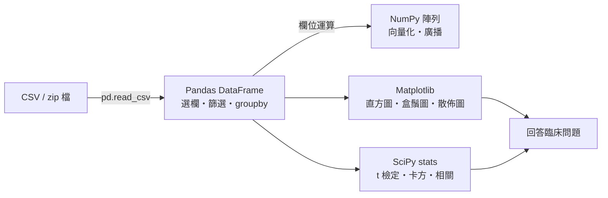
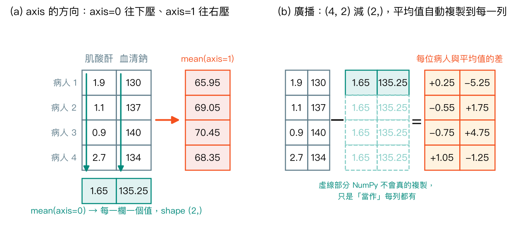
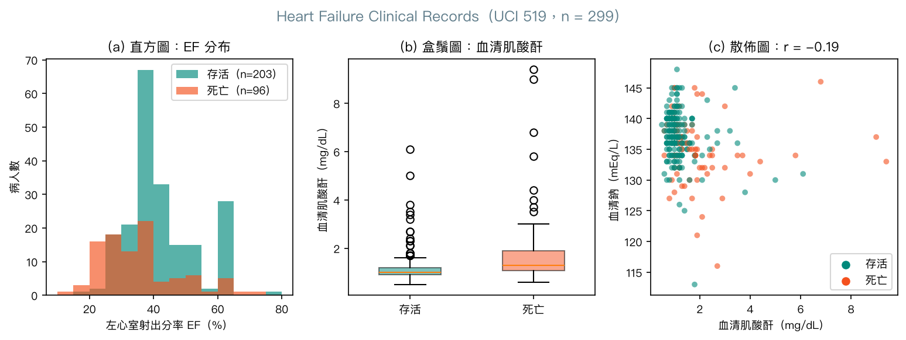
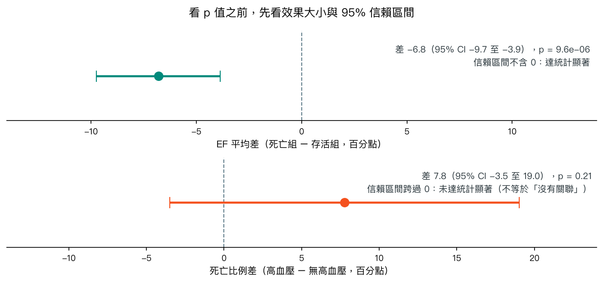

# 第 2 章　必備 Python 四大套件：NumPy、Pandas、Matplotlib、SciPy

<p class="chapter-meta">預計閱讀 30 分鐘 ・ 先備：第 1 章</p>

!!! abstract "本章你會學到"
    - 用 NumPy 陣列做向量化運算，看懂 `axis` 的方向與廣播（broadcasting）
    - 用 Pandas 讀入一份真實的心衰竭病人資料，完成選欄、篩選、新增欄位與 `groupby` 分組彙整
    - 用 Matplotlib 畫出直方圖、盒鬚圖、散佈圖，並知道每種圖適合回答什麼問題
    - 用 SciPy 做 t 檢定、Mann-Whitney U 檢定、卡方檢定與相關分析，並用嚴謹的措辭解讀結果
    - 分辨「p 值」與「效果大小」，知道未達統計顯著不等於沒有差異

<div class="nb-links" markdown>
[:simple-googlecolab: 在 Colab 開啟](https://colab.research.google.com/github/GITHUB_REPO_PLACEHOLDER/blob/main/docs/notebooks/ch02_python-toolkit.ipynb){ .md-button .md-button--primary }
[:material-download: 下載 Notebook](../notebooks/ch02_python-toolkit.ipynb){ .md-button }
</div>

## 1. 直覺：從一個臨床情境開始

想像你跟著心臟內科的研究團隊，學長丟給你一份 Excel：299 位 heart failure（心衰竭）病人，每人一列，欄位有年齡、ejection fraction（EF，左心室射出分率）、serum creatinine（血清肌酸酐）、serum sodium（血清鈉）、有沒有高血壓、追蹤期間有沒有死亡。學長問了三個問題：

1. 死亡的病人，EF 平均是不是比較低？
2. 有高血壓的人，死亡比例是不是比較高？
3. 肌酸酐越高的人，血清鈉是不是越低？

用 Excel 當然做得到：篩選、插入樞紐分析表、畫圖、再把數字貼進統計軟體。但下個月資料更新成 400 人時，你得從頭再點一次滑鼠，而且沒人知道你當初篩了哪些條件。用 Python 寫成程式，只要重跑一次，每一步都留有紀錄，可以重現、可以給別人檢查。

這一章的四個套件剛好對應四件事：

| 套件 | 在做什麼 | 臨床比喻 |
|---|---|---|
| NumPy | 大量數字的快速運算 | 整排檢體架一起放進生化分析儀，而不是一支一支手動吸 |
| Pandas | 有欄名、有列號的表格 | 有欄名的病歷總表，但每個篩選條件都寫成可重跑的程式 |
| Matplotlib | 畫圖 | 把一整欄數字變成一眼看得出分布的圖 |
| SciPy（`scipy.stats`） | 統計檢定 | 你在生統課學過的 t 檢定、卡方檢定，改用一行程式完成 |

後面所有機器學習章節，都是站在這四個套件上：scikit-learn 吃的是 NumPy 陣列或 Pandas 表格，模型好不好要靠 Matplotlib 畫圖檢查。先把工具摸熟，後面才不會卡在語法上。



## 2. 核心概念

### 2.1 NumPy：陣列與向量化

Python 內建的 list 是「一個袋子裝很多東西」，它不知道裡面裝的是數字，所以 `list * 2` 的意思是「把袋子複製一次」。NumPy 的陣列（array）則規定裡面全部是同一種型別的數字，存放在連續的記憶體裡，因此可以把整排數字一次丟給底層用 C 語言寫好的迴圈計算。這種「對整個陣列下一個指令，而不是自己寫迴圈逐一處理」的寫法叫做向量化（vectorization）。

向量化有兩個好處。第一是快：在 notebook 裡，把 100 萬個數字平方加總，Python 迴圈比 NumPy 慢了數十倍（實際倍數依電腦不同）。第二是好讀：`ef < 40` 一眼就看得出是「EF 小於 40 的人」，不用追蹤迴圈裡的索引。

### 2.2 `axis` 與廣播

二維陣列最讓初學者頭痛的是 `axis`。記一句話就好：**`axis` 是「要被壓扁消失的那個方向」**。我們習慣一列（row）是一位病人、一欄（column）是一項檢驗：

- `axis=0` 沿著列往下壓，把所有病人壓成一列，得到「每項檢驗的平均」。
- `axis=1` 沿著欄往右壓，把所有檢驗壓成一欄，得到「每位病人的平均」。

廣播（broadcasting）則是 NumPy 處理「形狀不同的陣列相減」的規則。形狀 (4, 2) 的檢驗值表，減掉形狀 (2,) 的平均值，NumPy 會把平均值「當作」複製到每一列，再逐格相減。它並不會真的在記憶體中複製，只是計算時這樣對齊。這就是把「每位病人的檢驗值都減掉全體平均」寫成一行的祕訣，第 3 章的標準化會一直用到。

{ loading=lazy }

??? note "數學補充（可跳過）：z 分數與樣本標準差"
    對第 $j$ 項檢驗，$n$ 位病人的平均與樣本標準差為

    $$ \bar{x}_j = \frac{1}{n}\sum_{i=1}^{n} x_{ij}, \qquad s_j = \sqrt{\frac{1}{n-1}\sum_{i=1}^{n}(x_{ij}-\bar{x}_j)^2} $$

    z 分數 $z_{ij} = (x_{ij}-\bar{x}_j)/s_j$。NumPy 的 `std()` 預設分母是 $n$（`ddof=0`），統計課的樣本標準差分母是 $n-1$，要寫 `ddof=1`；Pandas 的 `.std()` 預設就是 `ddof=1`。兩個套件預設不同，是常見的小數點差異來源。

### 2.3 Pandas：DataFrame

Pandas 的核心是資料框（DataFrame）：一張有欄名、有列索引的表。每一欄單獨拿出來是一個 Series，底下其實就是一個 NumPy 陣列。你會最常用到五個動作：

1. **讀取**：`pd.read_csv()` 可以直接吃網址，連 zip 檔都能自動解壓縮。
2. **先看全貌**：`info()` 看型別與遺漏值（missing value），`describe()` 看平均、標準差、四分位數。
3. **選欄與篩選**：`df.loc[列條件, 欄名]`，多個條件用 `&`、`|`，每個條件要加括號。
4. **新增欄位**：一律寫 `df["新欄"] = ...`。
5. **分組彙整**：`groupby` 就是「依某個類別分堆，每堆各算一次」，等於自動幫你做論文 Table 1 的骨架。

### 2.4 Matplotlib：選對圖

本章只教一種寫法：`fig, ax = plt.subplots()`。`fig` 是整張紙，`ax` 是紙上的一格座標軸，所有設定都對 `ax` 下指令。網路上常看到直接呼叫 `plt.xxx()` 的另一套寫法，兩套混用最容易出錯，初學先固定一種。

選圖的原則是「你想回答什麼問題」：

| 問題 | 圖 | 本章例子 |
|---|---|---|
| 一個連續變數長什麼樣？兩組分布差在哪？ | 直方圖（histogram） | 死亡組與存活組的 EF 分布 |
| 兩組的中位數與離散程度？有沒有離群值（outlier）？ | 盒鬚圖（box plot） | 兩組的血清肌酸酐 |
| 兩個連續變數有沒有一起變動？ | 散佈圖（scatter plot） | 肌酸酐與血清鈉 |

每張圖至少要有標題與兩個軸標籤（含單位），有兩組以上就加圖例。這不是美觀問題，而是讓看圖的人不用猜。

### 2.5 SciPy：選對檢定

`scipy.stats` 把生統課教過的檢定都包成函式。選哪一個取決於變數型態：

| 你要比較的 | 資料型態 | SciPy 函式 |
|---|---|---|
| 兩組的平均值 | 連續、大致對稱 | `stats.ttest_ind(a, b, equal_var=False)`（Welch t 檢定） |
| 兩組的分布位置 | 連續但明顯偏態、離群值多 | `stats.mannwhitneyu(a, b)` |
| 兩個類別變數有無關聯 | 類別 × 類別（列聯表） | `stats.chi2_contingency(table)` |
| 兩個連續變數的線性關係 | 連續 × 連續 | `stats.pearsonr(x, y)`；受離群值影響大時搭配 `stats.spearmanr(x, y)` |

Welch t 檢定不假設兩組變異數相同，實務上比傳統的 Student t 檢定穩健，建議當作預設選擇。

??? note "數學補充（可跳過）：Welch t 統計量與 Pearson r"
    Welch t 檢定的統計量為

    $$ t = \frac{\bar{x}_1-\bar{x}_2}{\sqrt{s_1^2/n_1 + s_2^2/n_2}} $$

    自由度用 Welch–Satterthwaite 公式估計，不一定是整數。

    Pearson 相關係數為

    $$ r = \frac{\sum_i (x_i-\bar{x})(y_i-\bar{y})}{\sqrt{\sum_i (x_i-\bar{x})^2}\sqrt{\sum_i (y_i-\bar{y})^2}} $$

    分子裡每一項都是「離平均多遠」的乘積，所以一個極端值就能大幅改變 $r$。Spearman 相關是先把 $x$、$y$ 各自換成排名再算 Pearson，極端值最多只佔最高名次，影響被壓小。

## 3. 動手做

以下程式碼與 Colab notebook 一致（notebook 另有印版本、`info()`、`describe()` 等幾格），建議開著 notebook 邊看邊跑。notebook 第一格已經 `import numpy as np`、`import pandas as pd`、`import matplotlib.pyplot as plt`、`from scipy import stats`。

### 3.1 NumPy 暖身

先用 5 位病人的 EF 看看 list 和陣列的差別。

```python
ef_list = [25, 38, 60, 20, 45]          # Python list
ef = np.array(ef_list)                   # NumPy array
print(ef, ef.dtype, ef.shape)
print(ef_list * 2)                       # list: repeats the list
print(ef * 2)                            # array: element-wise math
```

輸出中，`ef_list * 2` 變成 10 個元素（list 被複製一次），`ef * 2` 則是每個數字乘以 2；`shape` 是 `(5,)`，代表一維、5 個元素。

接著用布林遮罩篩出 EF 低於 40% 的病人，並算平均與標準差。

```python
low = ef < 40                            # boolean mask
print(low)
print(ef[low])                           # patients with EF < 40%
print(low.sum(), "of", ef.size, "patients have EF < 40%")
print("mean =", ef.mean(), " SD (ddof=1) =", round(ef.std(ddof=1), 2))
```

`low` 是 `[True True False True False]`，`ef[low]` 只留下 25、38、20 三位；`low.sum()` 等於 3，因為 True 會被當成 1 相加。

然後是二維陣列與 `axis`。

```python
labs = np.array([
    [1.9, 130],
    [1.1, 137],
    [0.9, 140],
    [2.7, 134],
])                                       # rows = patients, cols = [creatinine, sodium]
print(labs.shape)
print("mean of each column (axis=0):", labs.mean(axis=0))
print("mean of each row    (axis=1):", labs.mean(axis=1))
```

`axis=0` 得到 `[1.65, 135.25]`，是兩項檢驗各自的平均；`axis=1` 得到 4 個數字，是每位病人把肌酸酐和鈉混在一起平均，這在醫學上毫無意義，放在這裡只是讓你看清楚方向。

最後用廣播把每項檢驗轉成 z 分數（z-score），順便把肌酸酐從 mg/dL 換算成 µmol/L（乘以 88.4）。

```python
mu = labs.mean(axis=0)                   # shape (2,)
sd = labs.std(axis=0, ddof=1)            # shape (2,)
z = (labs - mu) / sd                     # (4, 2) - (2,) -> broadcasting
print(np.round(z, 2))

creat_umol = labs[:, 0] * 88.4           # scalar broadcast to every patient
print(creat_umol)
```

z 分數表中，第 4 位病人的肌酸酐是 +1.28，代表比這 4 人的平均高了約 1.3 個標準差；`labs[:, 0]` 的意思是「所有列、第 0 欄」，也就是整欄肌酸酐。

### 3.2 用 Pandas 讀入心衰竭資料

資料直接從 UCI 下載。網路失敗時會嘗試 `ucimlrepo`，兩者都失敗就丟出清楚的錯誤訊息，告訴你可以手動下載。

```python
URL = "https://archive.ics.uci.edu/static/public/519/heart+failure+clinical+records.zip"

def load_heart_failure():
    try:
        return pd.read_csv(URL)
    except Exception as e_url:
        try:
            from ucimlrepo import fetch_ucirepo
            r = fetch_ucirepo(id=519)
            return r.data.features.join(r.data.targets)
        except Exception as e_uci:
            raise RuntimeError(
                "Download failed. Check your internet connection, "
                "or download the zip manually from "
                "https://archive.ics.uci.edu/dataset/519 and use pd.read_csv('<file>.csv'). "
                f"URL error: {e_url!r}; ucimlrepo error: {e_uci!r}"
            ) from e_uci

df = load_heart_failure()
df = df.rename(columns={"DEATH_EVENT": "death_event"})
print(df.shape)
df.head()
```

`(299, 13)` 代表 299 位病人、13 欄：12 個變數加上結果 `death_event`（1 = 追蹤期間死亡）。接著 `df.info()` 會顯示每欄都是 299 個非空值，也就是沒有遺漏值；`df.describe().T.round(2)` 會列出每欄的摘要統計。你會看到 EF 平均約 38%、肌酸酐平均 1.39 mg/dL 但最大值 9.4，平均和中位數（1.1）有落差，這是右偏分布的第一個線索。

用 `.loc` 同時篩選列與選欄，找出「EF 低於 30% 且 70 歲以上」的病人。

```python
cols = ["age", "ejection_fraction", "serum_creatinine", "death_event"]
severe = df.loc[(df["ejection_fraction"] < 30) & (df["age"] >= 70), cols]
print(len(severe), "patients: EF < 30% and age >= 70")
severe.head()
```

結果是 13 位。注意兩個條件各自加了括號，而且用的是 `&` 不是 Python 的 `and`。

用 `pd.cut` 新增一個 EF 分組欄位，並新增 µmol/L 單位的肌酸酐欄。

```python
df["ef_group"] = pd.cut(
    df["ejection_fraction"],
    bins=[0, 40, 49, 100],
    labels=["EF<=40", "EF41-49", "EF>=50"],
)
df["creatinine_umol"] = df["serum_creatinine"] * 88.4
df["ef_group"].value_counts().sort_index()
```

三組人數分別是 219、20、60。這個切點只是示範程式寫法，實際的心衰竭分類請依最新指引。

### 3.3 `groupby`：自動化的 Table 1

依死亡與否分組，一次算出四個連續變數的平均與標準差。

```python
num_cols = ["age", "ejection_fraction", "serum_creatinine", "serum_sodium"]
df.groupby("death_event")[num_cols].agg(["mean", "std"]).round(2)
```

死亡組（96 人）EF 平均 33.47%，存活組（203 人）40.27%；肌酸酐平均分別是 1.84 與 1.18 mg/dL。這只是描述，差異是否超出隨機變動的範圍，要等 3.5 節的檢定。

因為 `death_event` 是 0/1，對它取平均就等於死亡比例。

```python
df.groupby("ef_group", observed=True)["death_event"].agg(["count", "mean"]).round(3)
```

EF≤40 組死亡比例 0.352，EF41-49 組 0.250，EF≥50 組 0.233。中間那組只有 20 人，比例很不穩定，讀的時候要打折。

用 `pd.crosstab` 做高血壓 × 死亡的列聯表，這張表等一下直接交給卡方檢定。

```python
tab = pd.crosstab(df["high_blood_pressure"], df["death_event"])
print(tab)
print(pd.crosstab(df["high_blood_pressure"], df["death_event"], normalize="index").round(3))
```

`normalize="index"` 表示每一列加總為 1：有高血壓者死亡比例 0.371，無高血壓者 0.294。

### 3.4 Matplotlib：三張圖

先把資料拆成兩組，再用 `plt.subplots(1, 3)` 一次畫三張子圖。

```python
dead = df[df["death_event"] == 1]
alive = df[df["death_event"] == 0]

fig, axes = plt.subplots(1, 3, figsize=(15, 4.2))

# (a) histogram
bins = np.arange(10, 85, 5)
axes[0].hist(alive["ejection_fraction"], bins=bins, alpha=0.6, label="Survived", color="#00897B")
axes[0].hist(dead["ejection_fraction"], bins=bins, alpha=0.6, label="Died", color="#F4511E")
axes[0].set_title("Ejection fraction by outcome")
axes[0].set_xlabel("Ejection fraction (%)")
axes[0].set_ylabel("Number of patients")
axes[0].legend()

# (b) box plot
axes[1].boxplot([alive["serum_creatinine"], dead["serum_creatinine"]],
                tick_labels=["Survived", "Died"])
axes[1].set_title("Serum creatinine by outcome")
axes[1].set_ylabel("Serum creatinine (mg/dL)")

# (c) scatter plot
axes[2].scatter(df["serum_creatinine"], df["serum_sodium"], c=df["death_event"],
                cmap="coolwarm", alpha=0.7, edgecolors="none")
axes[2].set_title("Creatinine vs sodium (red = died)")
axes[2].set_xlabel("Serum creatinine (mg/dL)")
axes[2].set_ylabel("Serum sodium (mEq/L)")

fig.tight_layout()
plt.show()
```

下面是網站用中文標籤重畫的同一組圖（notebook 裡用英文標籤，因為 Colab 沒有中文字型）：

{ loading=lazy }

三張圖各自告訴我們一件事：(a) 死亡組的 EF 分布整體偏左，而且 EF 大多落在 20、25、30、35、38 這類固定數值，推測是臨床紀錄時取整，不是連續量測；(b) 肌酸酐是明顯的右偏分布，兩組都有不少離群值，平均值會被拉高，提示比較兩組時可以考慮不假設常態的方法；(c) 大部分點擠在肌酸酐 1–2 mg/dL，右側幾個極端值很顯眼，整體只看得出微弱的負向趨勢。

### 3.5 SciPy：四個檢定

**Welch t 檢定**：比較兩組的 EF 平均。除了 p 值，也印出平均差與 95% 信賴區間。

```python
res = stats.ttest_ind(dead["ejection_fraction"], alive["ejection_fraction"], equal_var=False)
diff = dead["ejection_fraction"].mean() - alive["ejection_fraction"].mean()
ci = res.confidence_interval(confidence_level=0.95)
print(f"mean EF: died {dead['ejection_fraction'].mean():.1f}%, survived {alive['ejection_fraction'].mean():.1f}%")
print(f"difference = {diff:.1f} percentage points, 95% CI {ci.low:.1f} to {ci.high:.1f}")
print(f"t = {res.statistic:.2f}, p = {res.pvalue:.2g}")
```

輸出：死亡組 EF 平均 33.5%、存活組 40.3%，差 −6.8 個百分點（95% CI −9.7 至 −3.9），p = 9.6e-06。信賴區間整段都小於 0，達統計顯著。

**Mann-Whitney U 檢定**：肌酸酐偏態明顯，改比較分布位置，並用中位數描述。

```python
print("median creatinine: died", dead["serum_creatinine"].median(),
      "| survived", alive["serum_creatinine"].median())
mw = stats.mannwhitneyu(dead["serum_creatinine"], alive["serum_creatinine"])
print(f"Mann-Whitney U = {mw.statistic:.0f}, p = {mw.pvalue:.2g}")
```

中位數分別是 1.3 與 1.0 mg/dL，p = 1.6e-10，達統計顯著。

**卡方檢定**：高血壓與死亡是否有關聯。

```python
chi2 = stats.chi2_contingency(tab)
print(f"chi2 = {chi2.statistic:.2f}, dof = {chi2.dof}, p = {chi2.pvalue:.3f}")
print("expected counts:")
print(np.round(chi2.expected_freq, 1))
rate = tab[1] / tab.sum(axis=1)
print("death rate: HTN =", round(rate[1], 3), "| no HTN =", round(rate[0], 3))
```

χ² = 1.54，自由度 1，p = 0.214，**未達統計顯著**。期望次數每格都大於 5，卡方檢定的使用條件成立（2×2 表時 SciPy 預設會做 Yates 連續性校正）。要特別注意結論怎麼寫：死亡比例在有高血壓者是 37.1%、無高血壓者是 29.4%，相差約 8 個百分點，只是在這 299 人的樣本裡，這個差距還不足以排除隨機變動。正確的說法是「本資料中高血壓與死亡的關聯未達統計顯著」，而**不是**「高血壓跟死亡沒有關係」。

**Pearson 與 Spearman 相關**：肌酸酐與血清鈉。

```python
pr = stats.pearsonr(df["serum_creatinine"], df["serum_sodium"])
pci = pr.confidence_interval(confidence_level=0.95)
sr = stats.spearmanr(df["serum_creatinine"], df["serum_sodium"])
print(f"Pearson  r   = {pr.statistic:.3f} (95% CI {pci.low:.3f} to {pci.high:.3f}), p = {pr.pvalue:.2g}")
print(f"Spearman rho = {sr.statistic:.3f}, p = {sr.pvalue:.2g}")
```

Pearson r = −0.189（95% CI −0.296 至 −0.077），Spearman ρ = −0.300，兩者都達統計顯著，但都屬於弱相關。Spearman 的絕對值比 Pearson 大，呼應散佈圖上少數極端值對 Pearson 的干擾。

把兩個檢定的效果大小畫在一起比較，就能看出「顯著」與「未達顯著」到底差在哪：

{ loading=lazy }

上圖下半部的死亡比例差用的是簡單的常態近似（Wald）信賴區間，只是為了示意，產圖程式在專案的 `scripts/figs_ch02.py`。區間從約 −3.5 延伸到 +19 個百分點，意思是：這份資料和「高血壓者死亡率略低」相容，也和「高出將近 19 個百分點」相容。在這麼寬的區間下，p > 0.05 反映的是「資訊不夠」，不是「證明沒有關聯」。

## 4. 醫學案例

!!! info "僅供學習"
    本例使用公開資料集 Heart Failure Clinical Records（UCI Machine Learning Repository，ID 519，授權 CC BY 4.0，DOI 10.24432/C5Z89R）。原始資料來自 Ahmad 等人 2017 年發表於 *PLoS One* 的研究，為巴基斯坦 Faisalabad 兩家醫院（Institute of Cardiology 與 Allied Hospital）於 2015 年收案的 299 位左心室收縮功能不全病人；Chicco 與 Jurman 2020 年在 *BMC Medical Informatics and Decision Making* 以機器學習重新分析。本例僅供學習，不構成臨床建議。

回到開頭學長的三個問題，這一章的程式可以給出這樣的描述性答案：

1. **EF 與死亡**：死亡組 EF 平均比存活組低 6.8 個百分點（95% CI −9.7 至 −3.9），達統計顯著。方向與「心衰竭病人 EF 越低、預後通常越差」的一般臨床認知一致。
2. **高血壓與死亡**：有高血壓者的死亡比例較高（37.1% vs 29.4%），但未達統計顯著（卡方檢定 p = 0.214），信賴區間很寬，這份資料不足以下定論。
3. **肌酸酐與血清鈉**：呈弱的負相關（Pearson r = −0.19，Spearman ρ = −0.30）。

在把這些結果寫進任何報告之前，要記得幾個限制：

- **觀察性資料，只能說關聯**：死亡組 EF 較低，不代表「EF 低導致死亡」；年齡、腎功能、用藥等都可能同時影響兩者，本章沒有校正任何干擾因子（confounder）。
- **單一地區、樣本小**：299 人、同一城市的兩家醫院，結果不一定能推廣到台灣的心衰竭族群。
- **多重比較**：本章做了四個檢定，notebook 的練習還會請你換變數再做。檢定做越多，純靠運氣「撞到」p < 0.05 的機會越大，探索性分析的 p 值不宜當作確證。
- **`time` 欄位要小心**：`time` 是追蹤天數，死亡的病人追蹤期自然較短。探索資料時無妨，但到了第 7 章若用它來「預測」死亡，就等於偷看答案，這叫資料洩漏（data leakage），後面章節會再談。
- **資料本身的痕跡**：`platelets`（血小板）欄有多筆 263358.03 這種不像實際檢驗報告的數字，看起來像原始研究以平均值填補過的遺漏值（此為推測）。資料集顯示「沒有遺漏值」，不一定代表當初真的全部量到，這是第 3 章資料前處理的伏筆。

## 5. 常見陷阱

!!! warning "陷阱 1：連鎖賦值與 `inplace=True`，在 pandas 3 會靜默失效"
    `df[df["age"] > 70]["ejection_fraction"] = 0` 或 `df["a"].fillna(0, inplace=True)` 這類寫法，在舊版 pandas 只是出警告，到了 pandas 3.0 會**直接沒有作用**，而且程式不會中斷。修改資料一律寫成 `df.loc[df["age"] > 70, "ejection_fraction"] = 0` 或 `df["a"] = df["a"].fillna(0)`。需要一份獨立副本就明確寫 `.copy()`。

!!! warning "陷阱 2：`axis` 方向搞反"
    `labs.mean(axis=1)` 不會報錯，只會安靜地給你一組沒有意義的數字（例如把肌酸酐和鈉平均）。每次用 `axis` 前先想：「我要讓哪個方向消失？」算完再印出 `.shape` 核對長度：幾項檢驗就該有幾個值，幾位病人就該有幾個值。另外 NumPy 的 `std()` 預設 `ddof=0`，Pandas 的 `.std()` 預設 `ddof=1`，同一欄算出來小數點不同是正常的。

!!! warning "陷阱 3：把 p 值當效果大小，把未達顯著當作沒差異"
    p = 9.6e-06 不代表 EF 的差距「比較大」或「比較重要」，它只反映在這個樣本量下，差距有多難用隨機變動解釋；樣本夠大時，臨床上微不足道的差距也能極度顯著。反過來，高血壓的 p = 0.214 只代表「這份資料沒有偵測到統計顯著的關聯」。報告時要同時給效果大小（平均差、比例差、相關係數）與 95% 信賴區間，p 值放在後面。

!!! warning "陷阱 4：偏態資料與離群值，直接套 t 檢定與 Pearson r"
    肌酸酐、creatine phosphokinase（CPK，肌酸磷酸激酶）這類檢驗值常常嚴重右偏。平均值會被少數極端病人拉高，Pearson r 也可能被幾個點主導。先畫盒鬚圖或散佈圖，再決定要用平均還是中位數、用 t 檢定還是 Mann-Whitney、用 Pearson 還是 Spearman。**先畫圖、再檢定**是這一章最重要的習慣。

## 6. 小測驗

??? question "Q1. `labs` 的形狀是 (4, 2)（4 位病人 × 2 項檢驗），`labs.mean(axis=0)` 的形狀是什麼？代表什麼？"
    **答案：** `(2,)`，代表兩項檢驗各自在 4 位病人中的平均。`axis=0` 是把「列」這個方向壓掉，剩下的是欄的數目。

??? question "Q2. 哪一行在 pandas 2 與 pandas 3 都能正確把 70 歲以上病人的 `flag` 欄設成 1？（A）`df[df['age'] >= 70]['flag'] = 1`（B）`df.loc[df['age'] >= 70, 'flag'] = 1`（C）`df['flag'][df['age'] >= 70] = 1`"
    **答案：** B。A 與 C 都是連鎖賦值，在 pandas 3 不會改到原本的 `df`；用 `.loc[列條件, 欄名]` 一次指定位置才可靠。

??? question "Q3. 某研究比較兩組的死亡比例，卡方檢定 p = 0.21。哪個結論最恰當？（A）兩組死亡率相同（B）該因子與死亡無關（C）兩組死亡比例的差異未達統計顯著，信賴區間很寬，無法排除有臨床意義的差異"
    **答案：** C。未達統計顯著只代表這個樣本沒有偵測到差異，不能反推「沒有差異」；要主張兩組相當，需要事先設定界限的非劣性或等效性設計。

## 7. 重點整理

- NumPy 陣列裝的是同型別的數字，可以向量化運算：一行指令處理整排資料，又快又好讀。
- `axis` 是「要壓掉的方向」：`axis=0` 得到每欄一個值，`axis=1` 得到每列一個值；廣播讓不同形狀的陣列自動對齊。
- Pandas DataFrame 是有欄名的表：`read_csv` 讀取、`info`／`describe` 看全貌、`.loc` 篩選、`df["新欄"] = ...` 新增、`groupby` 分組彙整、`crosstab` 做列聯表。
- Matplotlib 固定用 `fig, ax = plt.subplots()`；直方圖看分布、盒鬚圖看中位數與離群值、散佈圖看兩個連續變數的關係。
- `scipy.stats` 依資料型態選檢定：Welch t、Mann-Whitney U、卡方、Pearson／Spearman。
- 報告時先給效果大小與 95% 信賴區間，再給 p 值；未達統計顯著不等於沒有差異，觀察性關聯不等於因果。

## 延伸閱讀

- [NumPy: the absolute basics for beginners](https://numpy.org/doc/stable/user/absolute_beginners.html) — NumPy 官方入門頁，陣列建立、索引、廣播都有圖解。
- [10 minutes to pandas](https://pandas.pydata.org/docs/user_guide/10min.html) — pandas 官方十分鐘導覽，涵蓋本章所有 DataFrame 操作。
- [Copy-on-Write (CoW)](https://pandas.pydata.org/docs/user_guide/copy_on_write.html) — pandas 官方說明為什麼連鎖賦值在 pandas 3 不再有效。
- [Matplotlib Quick start guide](https://matplotlib.org/stable/users/explain/quick_start.html) — 官方說明 `fig, ax` 物件導向寫法與兩種 API 的差別。
- [SciPy statistics tutorial](https://docs.scipy.org/doc/scipy/tutorial/stats.html) — `scipy.stats` 官方教學，列出各種分布與檢定。
- [Python Data Science Handbook（VanderPlas）](https://jakevdp.github.io/PythonDataScienceHandbook/) — 免費線上書，前幾章深入介紹 NumPy、Pandas、Matplotlib（文字採 CC BY-NC-ND 授權，本章未改作其內容）。
- [Chicco D, Jurman G. BMC Med Inform Decis Mak 2020;20:16](https://doi.org/10.1186/s12911-020-1023-5) — 本章資料集的機器學習分析論文，第 7 章會再用到。
