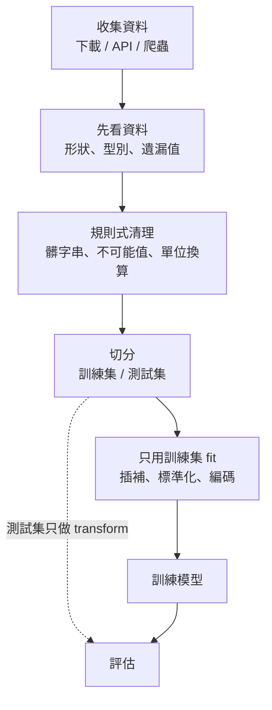
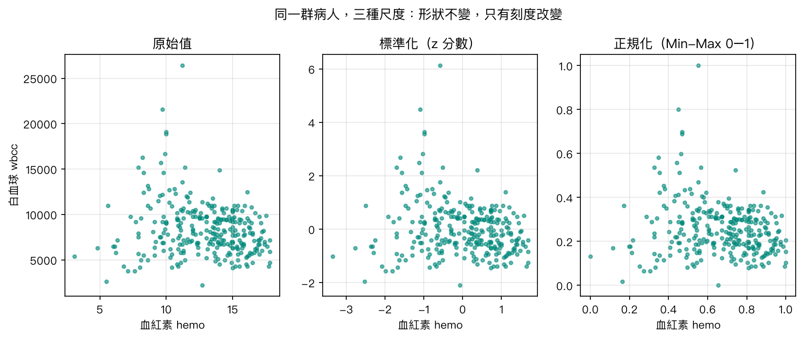
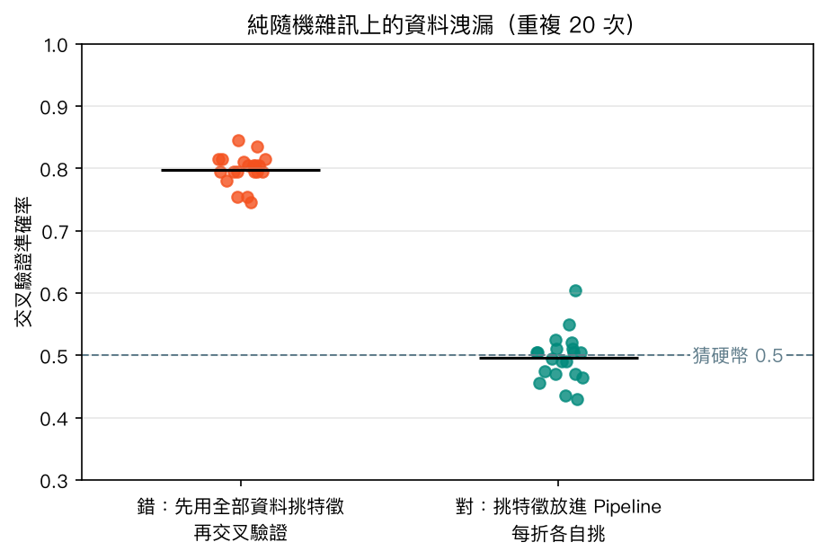
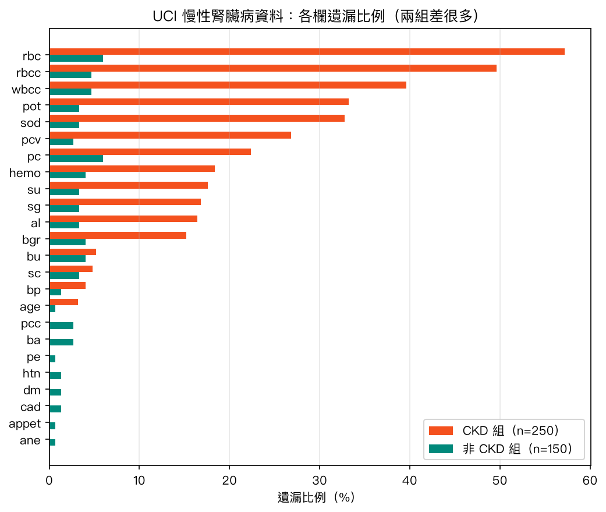
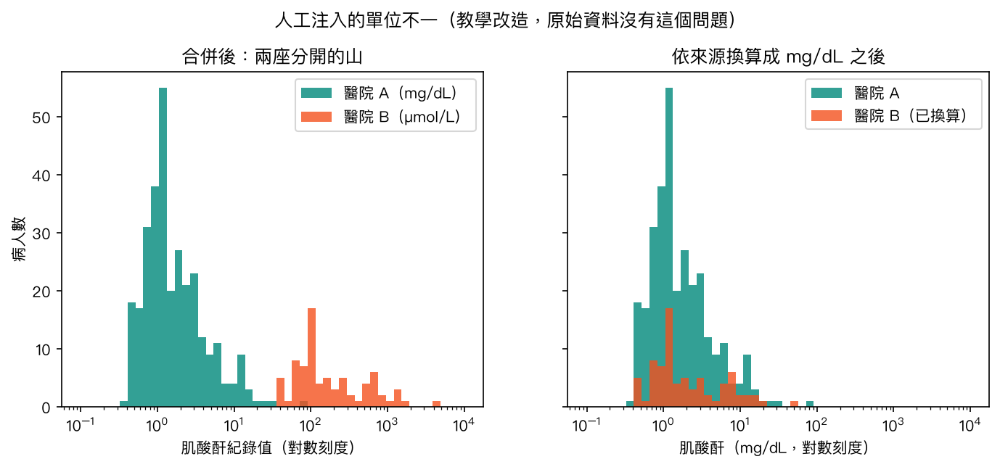

# 第 3 章　大數據收集與資料前處理實戰

<p class="chapter-meta">預計閱讀 35 分鐘 ・ 先備：第 2 章（Pandas 基本操作）</p>

!!! abstract "本章你會學到"
    - 分辨公開資料集、CSV 網址、開放資料 API、網頁爬蟲四種資料來源，並說出爬蟲的倫理與法律界線
    - 檢查資料的形狀、型別、遺漏值，找出肉眼看不到的髒字串、生理上不可能的數值與混雜的單位
    - 選擇遺漏值的處理方式，並理解「缺值本身可能是訊號」
    - 區分標準化與正規化，用獨熱編碼處理類別變數
    - 用「先切分、再前處理」與 `Pipeline`＋`ColumnTransformer` 避免資料洩漏

<div class="nb-links" markdown>
[:simple-googlecolab: 在 Colab 開啟](https://colab.research.google.com/github/fireman333/ml-for-med-students/blob/main/docs/notebooks/ch03_data-preprocessing.ipynb){ .md-button .md-button--primary }
[:material-download: 下載 Notebook](../notebooks/ch03_data-preprocessing.ipynb){ .md-button }
</div>

## 1. 直覺：從一個臨床情境開始

想像你在某家醫院做研究助理，老師丟給你一份從病歷系統匯出的 Excel：四百位病人、二十幾個欄位，希望你「跑個模型看看能不能預測慢性腎臟病」。你打開檔案，看到的是這樣的東西：有些格子是空的；糖尿病欄位裡有「yes」「no」，還有一個看起來也是「no」、但電腦堅持它跟「no」不一樣的值；血鉀欄出現 47；另一家合作醫院傳來的肌酸酐，數字動不動就是一百多。

直接丟進模型，模型不會報錯，它會安靜地給你一個準確率，只是那個數字可能毫無意義。

臨床檢驗有「分析前（pre-analytical）」品管：檢體溶血、標籤貼錯，後面的儀器再精準也救不回來。**資料前處理（data preprocessing）就是機器學習的分析前品管**。本章前半講資料從哪裡來（含開放資料 API 與爬蟲倫理），後半用一份真實的髒資料把前處理走一遍，最後用 `Pipeline` 收成一條不會洩漏答案的流程。

## 2. 核心概念

### 2-1 先誠實談「大數據」

大數據（big data，台灣也常稱「巨量資料」）原本指傳統工具處理不來的資料：量大（volume）、產生快（velocity）、型態多樣（variety）。全國健保申報資料、醫學中心十年的電子病歷、穿戴裝置每秒回傳的心率，才比較接近這個定義。

本章的資料集只有 400 位病人，是「小資料」，這點要誠實說。但學前處理不需要真的有巨量資料，因為**髒的方式都一樣**：缺值、錯字、單位混雜、收集流程不一致，資料變大只是讓問題更難用肉眼發現。

另一個常見誤解是「資料夠多，偏差就會被平均掉」。不會。資料庫若只收了某一群人（例如只有某家醫院的病人），收一百萬筆也還是那群人，你只是對一個偏掉的答案更有信心而已。

### 2-2 資料從哪裡來：四種來源

| 來源 | 例子 | 要注意 |
|---|---|---|
| 公開資料集 | UCI、Kaggle、PhysioNet | 授權各不相同；有些需簽使用協議 |
| CSV／檔案網址 | 資料集頁面的直接下載連結 | 網址可能失效，要處理下載失敗 |
| 開放資料 API | WHO GHO、美國 CDC、data.gov.tw | 要讀文件；有速率限制；網域可能遷移 |
| 網頁爬蟲 | 自己寫程式下載網頁再解析 | 倫理、法律、網站負擔；改版就壞 |

原則：**能下載就不用 API，能用 API 就不爬蟲**。越往下越脆弱，也越容易踩到別人的權利。

**API（應用程式介面）**像一張檢驗申請單：照規定格式填好「要什麼、篩選條件」送出，對方回傳格式固定的報告。WHO 的 GHO API 用網址指定指標代碼、用查詢參數寫篩選條件，回傳 JSON。台灣的政府資料開放平臺（data.gov.tw）多提供 CSV 或 JSON 下載，採「政府資料開放授權條款－第 1 版」，使用時要註明資料提供機關。

### 2-3 爬蟲的倫理與法律界線

網頁爬蟲（web scraping）是寫程式代替你開網頁、把內容存下來。技術不難，難的是「可不可以」。動手前至少過這五關：

1. **有沒有更好的管道？** 先找官方下載、API，或直接寫信問資料擁有者。
2. **robots.txt 怎麼說？** 網站根目錄的 `robots.txt`（格式見 RFC 9309）寫明哪些爬蟲、哪些路徑不歡迎。它是網站主的意願，不是技術防線，但無視它說不過去。
3. **服務條款與著作權。** 條款可能禁止自動化存取，內容也可能受著作權保護；robots.txt 允許不代表條款允許。
4. **個人資料。** 病友論壇、社群貼文即使公開，仍可能含可識別個人的健康資訊。《個人資料保護法》將病歷、醫療、健康檢查列為特種個資；做研究還要考慮倫理審查。
5. **不要造成負擔。** 表明身分（User-Agent）、設定逾時、每次請求之間暫停。

本章的爬蟲示範刻意很小：只讀 robots.txt、只解析寫在程式裡的 HTML，不實際爬任何網站。

### 2-4 前處理的整體流程



這張圖最重要的是中間那條分界線。**分界線以上的步驟不從資料「學」任何參數**：去掉多餘空白、把血鉀 47 標成缺值、把 µmol/L 換成 mg/dL，這些規則對每一筆資料都一樣，跟其他病人長什麼樣無關，切分前做沒有問題。**分界線以下的步驟會從資料學東西**：插補要算中位數、標準化要算平均與標準差、獨熱編碼要知道有哪些類別。這些數字只能從訓練集算。

### 2-5 遺漏值：刪掉還是補起來

遺漏值（missing value）是臨床資料的常態。處理前先想「為什麼缺」，統計上常分三類：

- **完全隨機遺漏（MCAR）**：與任何事無關，例如檢體打翻。
- **隨機遺漏（MAR）**：與**其他已觀察變數**有關，例如年長者較常沒做某項檢查。
- **非隨機遺漏（MNAR）**：與**那個值本身**有關，例如病況穩定的人沒被開檢驗。

常見做法有三種：

1. **刪除**：丟掉有缺值的列或缺太多的欄。最簡單，但常一刪就剩一半，被刪的人也往往不是隨機的。
2. **簡單插補（imputation）**：數值欄補中位數或平均、類別欄補最常見值。快速，但會讓分布變窄。
3. **加上「是否遺漏」指標欄**：保留「這格原本是空的」的資訊。

**缺值本身可能就是訊號**：某項檢驗有沒有開，常反映臨床上懷疑什麼。3-6 節會看到，本章資料光憑「哪些格子是空的」就能猜中大部分診斷，這既是資訊，也是警訊。

### 2-6 類別變數的編碼

模型只看得懂數字，類別變數要先轉換：

- **獨熱編碼（one-hot encoding）**：每個類別變成一個 0/1 欄位，「貧血 = yes」變成 `ane_yes = 1, ane_no = 0`。用於沒有順序的類別。
- **順序編碼（ordinal encoding）**：有順序時（尿蛋白 0、1+、2+）可直接用整數。

不要把沒有順序的類別編成 1、2、3，模型會以為「3 比 1 大」。

### 2-7 標準化 vs 正規化

血紅素大約 3 到 18 g/dL，白血球大約 2,000 到 26,000 /µL。對很多模型來說，數字大的欄位天生「聲音比較大」，算距離時白血球一點小變動就蓋過血紅素。所以要先換到同一把尺上。

| | 標準化（standardization） | 正規化（normalization, Min-Max） |
|---|---|---|
| 做法 | 減平均、除以標準差（z 分數） | 減最小值、除以全距 |
| 結果範圍 | 平均 0、標準差 1，沒有固定上下限 | 0 到 1 |
| 對離群值 | 也會被拉動（平均與標準差都受極端值影響），但不像 Min-Max 那樣把其他人壓扁 | 很敏感：一個極端值就會把其他人擠在一小段 |
| sklearn | `StandardScaler` | `MinMaxScaler` |

??? note "數學補充（可跳過）"
    標準化：$$ z = \frac{x - \bar{x}}{s} $$
    正規化：$$ x' = \frac{x - x_{\min}}{x_{\max} - x_{\min}} $$
    其中 $\bar{x}$、$s$、$x_{\min}$、$x_{\max}$ 都**只能用訓練集算**，再拿同一組數字去轉換測試集。

兩者都只是線性縮放，不會改變資料的形狀，也不會讓偏態分布變成常態。

{ loading=lazy }

注意右圖：因為有一位白血球 26,400 的病人，Min-Max 之後其他人的白血球幾乎全被壓在 0 到 0.8 之間，這就是「正規化對離群值敏感」的樣子。決策樹、隨機森林這類以「切點」判斷的模型，則基本上不需要縮放（見[第 7 章](07-tree-forest.md)）。

### 2-8 離群值：統計上極端 ≠ 錯誤

離群值（outlier）常用 IQR 規則找：低於第一四分位數減 1.5 倍四分位距，或高於第三四分位數加 1.5 倍四分位距。但在醫學資料裡要分兩種：

- **真實但極端**：末期腎病的 BUN 就是會很高，刪掉就學不到最需要辨識的人。
- **生理上不可能**：血鈉 4.5 mEq/L、血鉀 47 mEq/L，多半是小數點打錯。

前者保留，後者才修正或標為缺值。判斷依據是醫學知識，這正是醫學背景的優勢。

### 2-9 資料洩漏：考前偷看考卷

資料洩漏（data leakage）是模型在訓練時接觸到實際使用時拿不到的資訊，於是評估分數漂亮、上線卻失靈。常見兩種：

1. **前處理洩漏**：先用全部資料標準化或挑特徵，再切訓練／測試集，測試集的資訊已滲進前處理。
2. **特徵洩漏**：放進「結果發生後才知道」的欄位，例如用術後住院天數預測術後併發症。

第一種靠程式結構（`Pipeline`）杜絕；第二種要靠臨床理解，逐欄問「這個資訊在預測的時間點拿得到嗎？」

{ loading=lazy }

上圖的資料是**純隨機雜訊**（5,000 個無意義特徵、隨機標籤），真實能力應該是 0.5（猜硬幣）。若先用全部資料挑出與標籤最相關的 20 個特徵再交叉驗證，重複 20 次平均約 0.80；把挑特徵放進 Pipeline、每折各自挑，就回到 0.50 附近。構想改寫自 scikit-learn 官方文件「Common pitfalls」。

## 3. 動手做

以下程式碼與 [Notebook](../notebooks/ch03_data-preprocessing.ipynb) 一致，建議在 Colab 邊讀邊跑。Notebook 裡多了幾格（版本檢查、離線備用資料產生器、畫圖、混淆矩陣），這裡只列重點。

### 3-1 讀 CSV 網址

UCI 的慢性腎臟病資料集有直接的 CSV 網址。我們用 `requests` 下載並設定 `timeout`，萬一網路失敗，就改用 notebook 裡預先寫好的模擬資料，讓後面的程式碼能繼續練習。

```python
CKD_URL = "https://archive.ics.uci.edu/static/public/336/data.csv"

def load_ckd(url=CKD_URL):
    """Download UCI CKD (id 336); fall back to synthetic data if offline."""
    try:
        r = requests.get(url, timeout=30)
        r.raise_for_status()
        df = pd.read_csv(io.StringIO(r.text))
        print("Loaded UCI CKD:", df.shape)
        return df
    except Exception as e:
        print("Download failed:", type(e).__name__, "-> using SYNTHETIC fallback (not real patients)")
        return make_fake_ckd()

ckd = load_ckd()
ckd.head()
```

印出 `Loaded UCI CKD: (400, 25)` 代表拿到真資料（400 人、24 個特徵＋診斷）；若印出 `SYNTHETIC fallback`，後面數字會不同，但流程一樣。

### 3-2 呼叫 WHO 的開放資料 API

查詢出生時平均餘命（指標代碼 `WHOSIS_000001`），只要男女合計、四個國家。`$filter` 是這個 API 使用的 OData 篩選語法。

```python
GHO = "https://ghoapi.azureedge.net/api/"
params = {"$filter": "Dim1 eq 'SEX_BTSX' and SpatialDim in ('JPN','KOR','USA','IND')"}

try:
    r = requests.get(GHO + "WHOSIS_000001", params=params, timeout=30)
    r.raise_for_status()
    life = pd.DataFrame(r.json()["value"])[["SpatialDim", "TimeDim", "NumericValue"]]
    print("Rows from WHO API:", len(life))
except Exception as e:
    print("WHO API unavailable:", type(e).__name__, "-> using a small offline sample")
    life = pd.DataFrame({
        "SpatialDim": ["IND", "JPN", "KOR", "USA"] * 2,
        "TimeDim": [2019] * 4 + [2021] * 4,
        "NumericValue": [70.7, 84.5, 83.7, 78.7, 67.3, 84.5, 83.8, 76.4]})

wide = life.pivot_table(index="TimeDim", columns="SpatialDim", values="NumericValue").round(1)
wide.tail(3)
```

撰寫本章時（2026 年 9 月）API 回傳 88 列（2000–2021 年），寬表顯示 2019 到 2021 年美國與印度的數值下降。`ghoapi.azureedge.net` 是 WHO 文件目前寫的網址，但日後可能遷移，所以程式要有備案。

### 3-3 讀 robots.txt

Python 內建 `urllib.robotparser` 能判斷某個爬蟲能不能抓某個路徑。我們先用 `requests`（有 timeout）取得檔案，再交給它解析。

```python
from urllib import robotparser

ROBOTS_URL = "https://www.who.int/robots.txt"
rp = robotparser.RobotFileParser()
try:
    r = requests.get(ROBOTS_URL, timeout=15)
    r.raise_for_status()
    rp.parse(r.text.splitlines())
except Exception as e:
    print("Could not fetch robots.txt:", type(e).__name__, "-> using an example file")
    rp.parse(["User-agent: AhrefsBot", "Disallow: /"])

for agent in ["*", "AhrefsBot"]:
    print(f"{agent:>10} may fetch /news ?", rp.can_fetch(agent, "https://www.who.int/news"))
```

輸出 `*` 為 `True`、`AhrefsBot` 為 `False`：WHO 封鎖了一串特定爬蟲，但沒限制一般存取。

### 3-4 極小的 HTML 解析示範

真的需要從網頁表格取資料時，流程是「確認可以抓 → 下載一頁 → 解析」。這裡只解析一段寫在程式裡的 HTML，示範 BeautifulSoup 的用法。

```python
from bs4 import BeautifulSoup

html = """
<table id="labs">
  <tr><th>test</th><th>value</th><th>unit</th></tr>
  <tr><td>Creatinine</td><td>1.4</td><td>mg/dL</td></tr>
  <tr><td>Creatinine</td><td>124</td><td>umol/L</td></tr>
  <tr><td>Hemoglobin</td><td>11.2</td><td>g/dL</td></tr>
</table>
"""
soup = BeautifulSoup(html, "html.parser")
rows = [[td.get_text(strip=True) for td in tr.find_all("td")]
        for tr in soup.find("table", id="labs").find_all("tr")[1:]]
labs = pd.DataFrame(rows, columns=["test", "value", "unit"])
labs["value"] = pd.to_numeric(labs["value"])
labs
```

得到三列的 DataFrame，注意兩筆肌酸酐單位不同（3-8 節回收）。真要連網抓頁面，至少做到下面模板的四件事（只定義、不執行）：

```python
import time

def polite_get(url, rp, agent="med-ml-course-demo", pause=2.0):
    """Fetch one page only if robots.txt allows it, then wait."""
    if not rp.can_fetch(agent, url):
        raise PermissionError(f"robots.txt disallows {url}")
    r = requests.get(url, headers={"User-Agent": agent}, timeout=15)
    r.raise_for_status()
    time.sleep(pause)
    return r.text
```

### 3-5 先看資料

形狀、型別、遺漏比例是三個第一眼。

```python
print(ckd.shape)
print(ckd.dtypes.value_counts())
missing_rate = ckd.isna().mean().sort_values(ascending=False)
missing_rate.head(8).round(2)
```

14 個數值欄、11 個文字欄，共 1,012 格遺漏，紅血球形態（rbc）缺了 38%。文字欄在 pandas 2 是 `object`、pandas 3 是 `str`，所以用 `select_dtypes(exclude="number")` 挑，兩版都適用。

接著看類別欄的所有可能值：

```python
for col in ["dm", "class"]:
    print(col, ckd[col].unique())
```

糖尿病欄出現 `'\tno'`、診斷欄出現 `'ckd\t'`：前後多了一個肉眼看不到的 tab 字元，電腦會把它當成另一個類別。用 `.str.strip()` 去掉每個文字欄前後的空白：

```python
text_cols = ckd.select_dtypes(exclude="number").columns
for col in text_cols:
    ckd[col] = ckd[col].str.strip()

print(ckd["class"].value_counts())
```

清理後是 CKD 250 位、非 CKD 150 位。注意寫法是**把結果指派回欄位**，不是 `inplace=True`，理由見第 5 節的陷阱 2。

### 3-6 遺漏值是訊號，也是警訊

比較兩組病人平均每列缺了幾格：

```python
row_missing = ckd.isna().sum(axis=1)
row_missing.groupby(ckd["class"]).mean().round(2)
```

CKD 組平均每人缺 3.63 格，非 CKD 組只缺 0.69 格。如果只用「哪些格子是空的」當特徵呢？

```python
from sklearn.linear_model import LogisticRegression
from sklearn.model_selection import cross_val_score

X_na = ckd.drop(columns="class").isna().astype(int)
y_all = (ckd["class"] == "ckd").astype(int)
acc_na = cross_val_score(LogisticRegression(max_iter=1000), X_na, y_all, cv=5)
print("Accuracy using ONLY missingness pattern:", acc_na.mean().round(3))
```

這裡的交叉驗證（cross-validation）是把資料切成 5 份，輪流拿其中 1 份當考卷、其餘 4 份當課本，考 5 次取平均，比只切一次訓練／測試集更穩定（第 11 章會細談）。沒看任何檢驗數值，五折交叉驗證準確率就有 0.81，高於「全部猜 CKD」的 0.625。

{ loading=lazy }

兩組的**資料收集過程很不一樣**，資料集文件沒有交代原因。模型因此可能學到「收集流程的差異」而非「疾病本身」，換到收集方式不同的醫院，表現可能大幅下滑。

另一種常見的遺漏值偽裝是用 0 代替。Pima Indians Diabetes 資料集的血壓、BMI、胰島素等欄位出現 0，生理上不可能，實際上是「沒測」：

```python
from sklearn.datasets import fetch_openml

try:
    pima = fetch_openml(data_id=37, as_frame=True).data
    zero_cols = ["plas", "pres", "skin", "insu", "mass"]
    print("Zeros per column:", (pima[zero_cols] == 0).sum().to_dict())
    pima[zero_cols] = pima[zero_cols].replace(0, np.nan)
    print("Missing after replace:", pima[zero_cols].isna().sum().to_dict())
except Exception as e:
    print("OpenML unavailable:", type(e).__name__, "- skip this optional example")
```

768 人裡胰島素有 374 個 0、皮褶厚度有 227 個 0；不先換成缺值，模型會把「沒測」當成「數值是 0」。

### 3-7 離群值與不可能值

先用 IQR 規則數一數各欄「統計上偏離」的值：

```python
num_cols = ckd.select_dtypes("number").columns
q1 = ckd[num_cols].quantile(0.25)
q3 = ckd[num_cols].quantile(0.75)
iqr = q3 - q1
is_out = (ckd[num_cols] < q1 - 1.5 * iqr) | (ckd[num_cols] > q3 + 1.5 * iqr)
is_out.sum().sort_values(ascending=False).head(6)
```

尿糖（su）61 個、肌酸酐（sc）51 個、BUN 38 個被標為離群，多半是真正病重的人，不能刪。該處理的是生理上不可能的值，用寬鬆的合理範圍把超出的改成缺值：

```python
limits = {"sod": (100, 180), "pot": (1.5, 10)}
for col, (lo, hi) in limits.items():
    bad = ckd[col].notna() & ~ckd[col].between(lo, hi)
    print(col, "implausible values:", ckd.loc[bad, col].tolist())
    ckd.loc[bad, col] = np.nan
```

抓到血鈉 4.5 與血鉀 39、47，之後交給插補處理。範圍怎麼訂是判斷，寫進程式的好處是別人看得到、也能提出異議。

### 3-8 單位不一：偵測與換算

**以下是刻意改造的資料，原始 UCI 檔案沒有這個問題。** 假設 20% 的病人來自醫院 B，B 的肌酸酐用 µmol/L 回報（1 mg/dL = 88.4 µmol/L）：

```python
ckd["site"] = "A"
site_b = ckd.sample(frac=0.2, random_state=42).index
ckd.loc[site_b, "site"] = "B"
ckd.loc[site_b, "sc"] = ckd.loc[site_b, "sc"] * 88.4  # hospital B reports umol/L

ckd.groupby("site")["sc"].median().round(2)
```

醫院 A 中位數 1.20、醫院 B 123.76，差了約 100 倍，這是單位問題。對數刻度上會看到兩座分開的山：

{ loading=lazy }

知道來源就依醫院換算，再拿掉注入的 `site` 欄（它不該進模型）。

```python
is_b = ckd["site"] == "B"
ckd.loc[is_b, "sc"] = ckd.loc[is_b, "sc"] / 88.4
ckd = ckd.drop(columns="site")

print("sc median after conversion:", round(ckd["sc"].median(), 2))
```

換算後中位數回到 1.3 mg/dL。真實世界更麻煩的是**沒有來源欄位**：可以看對數直方圖是否分成兩群、比對各醫院或各時期的中位數、查檢驗系統設定。落在交界無法判斷的值，寧可標為缺值也不要硬猜。

### 3-9 先切分，再前處理

接下來會學參數的步驟只能看訓練集，所以先切分；`stratify=y` 讓兩集合的 CKD 比例相同。

```python
from sklearn.model_selection import train_test_split

X = ckd.drop(columns="class")
y = (ckd["class"] == "ckd").astype(int)
X_train, X_test, y_train, y_test = train_test_split(
    X, y, test_size=0.25, stratify=y, random_state=42)
print(X_train.shape, X_test.shape, "| CKD share in train:", y_train.mean().round(3))
```

訓練集 300 位、測試集 100 位，訓練集 CKD 比例 0.627，和全體的 0.625 幾乎一樣。

比較兩種縮放在訓練集上的效果：

```python
from sklearn.preprocessing import MinMaxScaler, StandardScaler

demo = X_train[["hemo", "wbcc"]].dropna()
scaled = {
    "raw": demo,
    "standardized": pd.DataFrame(StandardScaler().fit_transform(demo), columns=demo.columns),
    "min-max": pd.DataFrame(MinMaxScaler().fit_transform(demo), columns=demo.columns),
}
for name, d in scaled.items():
    print(f"{name:>13}:", d.agg(["mean", "std", "min", "max"]).round(2).to_dict("list"))
```

標準化後兩欄平均 0、標準差 1；Min-Max 後都落在 0 到 1。原本標準差差了約一千倍，現在站在同一把尺上。

### 3-10 Pipeline＋ColumnTransformer：一條不會洩漏的管線

`ColumnTransformer` 讓數值欄與類別欄各走各的前處理；`Pipeline` 把前處理和模型串成一體。`fit` 時只看訓練資料；`score`／`predict` 時測試資料只被 `transform`。

```python
from sklearn.compose import ColumnTransformer
from sklearn.impute import SimpleImputer
from sklearn.pipeline import Pipeline
from sklearn.preprocessing import OneHotEncoder

num_cols = X.select_dtypes("number").columns.tolist()
cat_cols = X.select_dtypes(exclude="number").columns.tolist()

numeric = Pipeline([("impute", SimpleImputer(strategy="median")),
                    ("scale", StandardScaler())])
categorical = Pipeline([("impute", SimpleImputer(strategy="most_frequent")),
                        ("onehot", OneHotEncoder(handle_unknown="ignore", sparse_output=False))])
prep = ColumnTransformer([("num", numeric, num_cols), ("cat", categorical, cat_cols)])

model = Pipeline([("prep", prep), ("clf", LogisticRegression(max_iter=1000))])
model.fit(X_train, y_train)
print("Test accuracy:", round(model.score(X_test, y_test), 3))
```

測試集準確率 0.98，前處理後共 34 個特徵（14 個數值欄＋10 個類別欄各展開成 2 欄）。`handle_unknown="ignore"` 讓測試集出現沒看過的類別時填 0 而不報錯。舊教材的 `OneHotEncoder(sparse=False)` 已不能用，要寫 `sparse_output=False`。

最後是洩漏示範。`SelectKBest` 會逐一檢定每個特徵和標籤的關聯強度，只留下最強的 k 個；問題在於「檢定關聯」本身就要看標籤。如果在切分之前用全部資料挑特徵，測試集的答案已經參與了挑選，等於考前偷看考卷。下面用 5,000 個純雜訊特徵示範，把挑特徵放在交叉驗證外面和裡面，結果差多少：

```python
from sklearn.feature_selection import SelectKBest, f_classif
from sklearn.pipeline import make_pipeline

rng = np.random.default_rng(42)
X_noise = rng.normal(size=(200, 5000))
y_noise = rng.integers(0, 2, size=200)

X_picked = SelectKBest(f_classif, k=20).fit_transform(X_noise, y_noise)  # sees ALL labels
wrong = cross_val_score(LogisticRegression(max_iter=1000), X_picked, y_noise, cv=5).mean()

pipe = make_pipeline(SelectKBest(f_classif, k=20), LogisticRegression(max_iter=1000))
right = cross_val_score(pipe, X_noise, y_noise, cv=5).mean()

print(f"Leaky  (select, then CV): {wrong:.2f}")
print(f"Proper (select inside CV): {right:.2f}")
```

這次錯誤做法 0.84、正確做法 0.55；後者與 0.5 的差距是隨機波動，重複 20 次平均就回到 0.50。

## 4. 醫學案例

!!! info "僅供學習"
    本例使用 UCI Chronic Kidney Disease 公開資料集（Rubini L, Soundarapandian P, Eswaran P，2015；CC BY 4.0；DOI [10.24432/C5G020](https://doi.org/10.24432/C5G020)），為教學示範，僅供學習，不構成臨床建議。

依資料集說明，這份資料在醫院中約兩個月期間收集（常被引述的來源為印度 Apollo Hospitals），含年齡、血壓、尿蛋白、血糖、BUN、serum creatinine（血清肌酸酐）、電解質、血紅素、血球計數，以及高血壓、糖尿病、pedal edema（下肢水腫）、anemia（貧血）等欄位，結果是有無 chronic kidney disease（CKD，慢性腎臟病）。

管線在 100 位測試病人上得到 0.98 的準確率。比起興奮，更該問：

1. **樣本很小**：錯一個就差 1 個百分點，換 `random_state` 重切，數字會跳動。
2. **單一來源、未經外部驗證**：一家醫院、兩個月，沒在其他醫院驗證過。
3. **任務偏容易**：肌酸酐、尿蛋白本身就是 CKD 的診斷依據，用診斷依據「預測」診斷，準確率高並不意外，也不代表能提早預警。
4. **收集流程不一致**：光靠遺漏型態就有 0.81，高分有多少來自疾病、多少來自收集方式，這份資料分不開。

所以 0.98 比較適合解讀成「前處理流程跑通了」，而不是「做出可用的篩檢工具」。後者需要前瞻資料、明確的預測時間點與外部驗證，[第 11 章](11-model-selection.md)再談。

## 5. 常見陷阱

!!! warning "陷阱 1：先對全部資料做標準化或插補，才切訓練／測試集"
    平均、標準差、中位數都含有測試集的資訊。單純標準化時分數差異通常不大，所以容易被忽略；同樣的習慣用在特徵選取，就會出現「雜訊也能 0.84」的假象。解法：先切分，會學參數的步驟都放進 `Pipeline`。

!!! warning "陷阱 2：`fillna(..., inplace=True)` 在 pandas 3 靜默失效"
    `df["hemo"].fillna(df["hemo"].median(), inplace=True)` 在 pandas 2 還能改到原表（附帶警告），在 pandas 3 則**不會改到原表**，缺值還在，而你可能沒注意到。連鎖賦值 `df["a"][mask] = 0` 也一樣。一律寫成 `df["hemo"] = df["hemo"].fillna(...)` 或 `df.loc[mask, "a"] = 0`。

!!! warning "陷阱 3：看得到的髒只是一部分"
    `'ckd'` 和 `'ckd\t'` 印出來幾乎一樣；Pima 資料的 0 看起來是正常數字；混了 µmol/L 的肌酸酐只是「有些人數字比較大」。每個類別欄都要看 `unique()`，每個數值欄都要問「這個範圍在生理上合理嗎？」

!!! warning "陷阱 4：同一位病人的多筆紀錄被拆到訓練集和測試集"
    若資料是「每次就診一列」，同一人可能同時出現在兩邊，模型等於在測試時認出老朋友。要以病人為單位切分（`GroupShuffleSplit`、`GroupKFold`），第 11 章再介紹。

## 6. 小測驗

??? question "Q1. 哪一個步驟可以在切分訓練／測試集之前，對全部資料做？"
    （A）用全體中位數插補遺漏值（B）把 `'ckd\t'` 的前後空白去掉（C）用全體平均與標準差做標準化（D）用全體資料挑出與結果最相關的特徵

    **答案：（B）。** 去除空白是對每一筆資料都一樣的固定規則，不需要從其他病人身上學任何參數；其他三項都會把測試集的資訊帶進前處理。

??? question "Q2. 醫院 A 的血清肌酸酐中位數是 1.1，醫院 B 是 97。最可能的解釋與處理是什麼？"
    **答案：醫院 B 用 µmol/L 回報，應依來源除以 88.4 換算成 mg/dL。** 差距剛好接近換算係數，是單位不一的典型訊號。

??? question "Q3. 只用「哪些格子是空的」建模就有 0.81 的準確率，代表什麼？"
    **答案：兩組的資料收集過程不同。** 這個訊號可能反映收集流程而非疾病，換到別家醫院可能失效，要揭露並做外部驗證。

## 7. 重點整理

- 巨量資料不等於「有點多的資料」；資料多也不能修正取樣偏差。
- 取得資料：官方下載 > 開放資料 API > 爬蟲；爬蟲前過 robots.txt、條款、著作權、個資、伺服器負擔五關。
- 先看形狀、型別、遺漏比例，再逐欄看 `unique()` 與數值範圍。
- 統計離群值不等於錯誤；生理上不可能的值才修正或標為缺值。
- 缺值可刪除、插補或加指標欄；缺值本身可能是訊號，也可能是收集流程不一致的警訊。
- 標準化與正規化都只改刻度；Min-Max 對離群值敏感。
- 規則式清理可在切分前做；會學參數的步驟一律放進 `Pipeline`，只用訓練集 fit。
- pandas 3 不要用 `inplace=True` 與連鎖賦值。

## 延伸閱讀

- [scikit-learn: Common pitfalls and recommended practices](https://scikit-learn.org/stable/common_pitfalls.html) — 官方整理的前處理不一致與資料洩漏範例，本章洩漏示範的構想來源。
- [scikit-learn: Column Transformer with Mixed Types](https://scikit-learn.org/stable/auto_examples/compose/plot_column_transformer_mixed_types.html) — `ColumnTransformer` 處理數值與類別混合資料的官方範例。
- [UCI: Chronic Kidney Disease](https://archive.ics.uci.edu/dataset/336/chronic+kidney+disease) — 本章主資料集的頁面與欄位說明。
- [WHO GHO OData API](https://www.who.int/data/gho/info/gho-odata-api) — WHO 全球衛生觀測站 API 的官方說明與查詢範例。
- [政府資料開放平臺](https://data.gov.tw/) — 台灣各機關的開放資料，含衛生福利類別。
- [RFC 9309: Robots Exclusion Protocol](https://www.rfc-editor.org/rfc/rfc9309) — robots.txt 格式的正式標準。
- [Google ML Crash Course: Numerical data](https://developers.google.com/machine-learning/crash-course/numerical-data) — 數值特徵縮放的另一種講法（英文）。

<!-- Code blocks mirror docs/notebooks/ch03_data-preprocessing.ipynb; figures from scripts/figs_ch03.py -->
