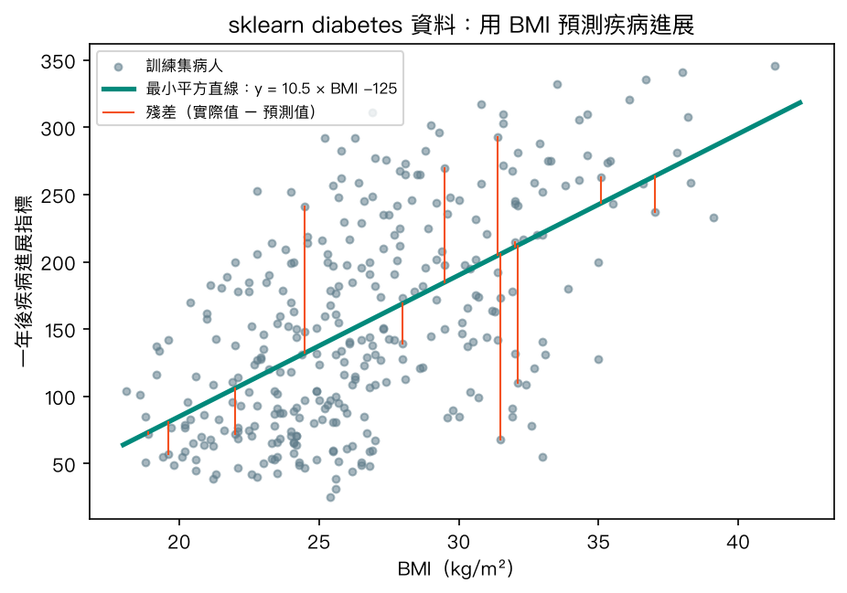
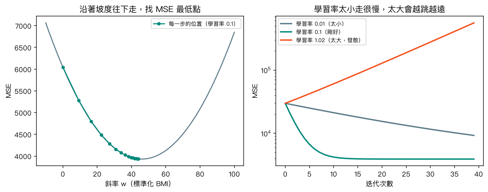
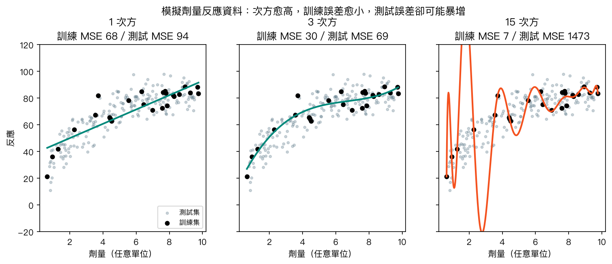
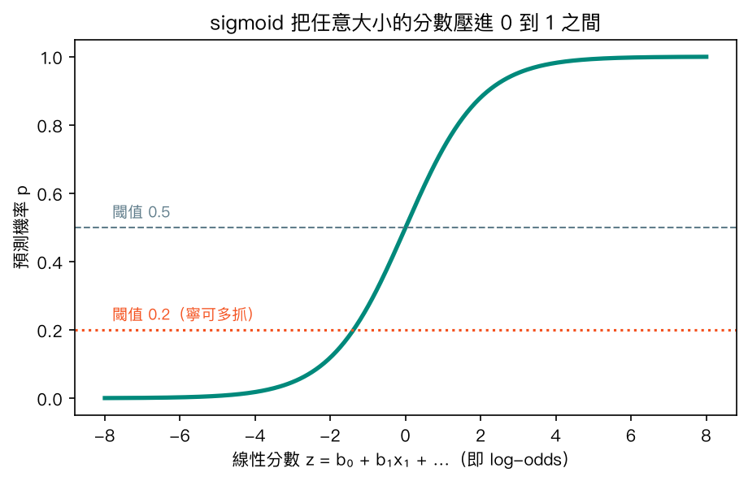
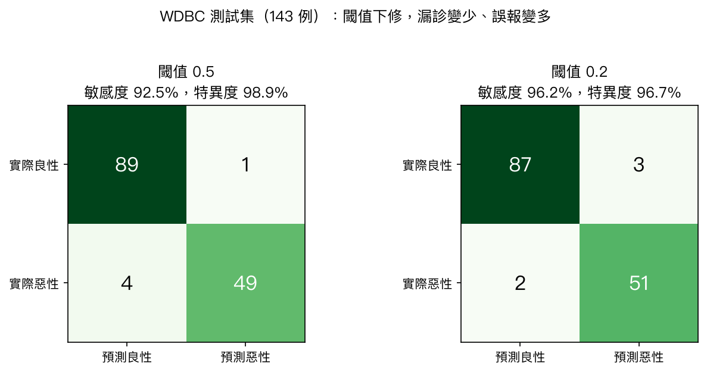
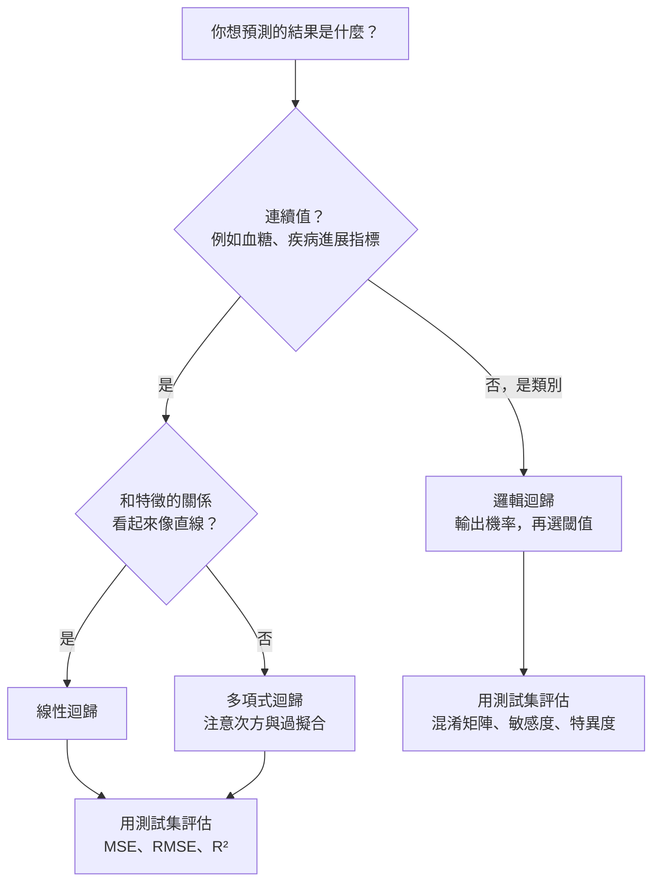

# 第 4 章　迴歸分析：線性、多項式與邏輯迴歸

<p class="chapter-meta">預計閱讀 30 分鐘 ・ 先備：第 2 章、第 3 章</p>

!!! abstract "本章你會學到"
    - 說出線性迴歸在做什麼：用最小平方找一條「整體誤差最小」的直線，並解讀斜率、MSE 與 R²
    - 用下山的比喻理解梯度下降，知道學習率太大或太小會發生什麼事
    - 用多項式迴歸親眼看到過擬合，並用測試集與正則化揪出它
    - 用邏輯迴歸把風險分數變成機率，再用閾值與混淆矩陣連回敏感度、特異度
    - 分辨「為了預測」與「為了解釋」的迴歸，知道勝算比該怎麼謹慎解讀

<div class="nb-links" markdown>
[:simple-googlecolab: 在 Colab 開啟](https://colab.research.google.com/github/fireman333/ml-for-med-students/blob/main/docs/notebooks/ch04_regression.ipynb){ .md-button .md-button--primary }
[:material-download: 下載 Notebook](../notebooks/ch04_regression.ipynb){ .md-button }
</div>

## 1. 直覺：從一個臨床情境開始

想像你在新陳代謝科門診跟診。主治醫師看著一位新診斷糖尿病的病人，心裡其實在想兩種不同的問題：

- 「以他現在的 BMI、血壓和抽血結果，**一年後病情大概會惡化多少**？」——答案是一個連續的數字。
- 「這顆乳房腫塊切片的細胞核看起來這樣，**它是惡性的機率有多高**？」——答案是「是或不是」，或者更好一點，是一個介於 0 和 1 之間的機率。

第一種叫**迴歸（regression）**問題，第二種叫**分類（classification）**問題。這一章要講的三種模型剛好橫跨兩邊：線性迴歸與多項式迴歸預測連續值，邏輯迴歸（logistic regression，又稱羅吉斯迴歸）名字裡雖然有「迴歸」，做的卻是分類。

你早就用過迴歸的思考方式：劑量反應曲線、生長曲線，都在回答「x 多一點，y 平均會變多少」。流行病學課上算勝算比（odds ratio）時用的多變項邏輯迴歸，更是這一章後半段的主角。機器學習沒有發明新的迴歸，它只是換了一個問題來問：**這個模型對「沒看過的新病人」預測得準不準？**

## 2. 核心概念

### 2.1 線性迴歸：畫一條最不冤枉大家的直線

把 442 位糖尿病病人的 BMI 放在橫軸、一年後的疾病進展指標放在縱軸，會得到一片往右上方散開的點。線性迴歸（linear regression）要做的，就是在這片點雲裡畫一條直線。

哪一條最好？每位病人的實際值和直線預測值之間都有一段落差，叫做**殘差（residual）**。有的點在線上方（殘差為正）、有的在下方（殘差為負），直接相加會正負抵銷，所以把每段殘差平方後再加總。讓這個「殘差平方和」最小的那條線，就是**最小平方法（least squares）**的答案。

{ loading=lazy }

圖中直線的斜率約 10.5，意思是：在這份資料中，BMI 每高 1 kg/m²，模型預測的一年後進展指標平均高約 10.5。這句話只描述**關聯**，不代表「幫病人減 1 單位 BMI，病情就會少惡化 10.5」——那是因果推論，需要不同的研究設計。

特徵不只一個時，道理完全一樣，只是直線變成高維空間裡的一個「平面」：

$$\hat{y} = b_0 + b_1 x_1 + b_2 x_2 + \dots + b_p x_p$$

每個係數 $b_j$ 的意思是「其他特徵固定不動時，$x_j$ 多 1 單位，預測值平均變多少」。醫學統計課上的「校正後」，說的就是這件事。

??? note "數學補充（可跳過）：最小平方與評估指標"
    最小平方法要最小化的目標是

    $$\text{SSE} = \sum_{i=1}^{n} (y_i - \hat{y}_i)^2$$

    除以樣本數 $n$ 就是均方誤差 $\text{MSE} = \frac{1}{n}\sum (y_i - \hat{y}_i)^2$；開根號得到 RMSE，單位和 $y$ 相同，比較好解讀。

    決定係數

    $$R^2 = 1 - \frac{\sum (y_i - \hat{y}_i)^2}{\sum (y_i - \bar{y})^2}$$

    分母是「完全不用模型、每個人都猜平均值」時的誤差。$R^2 = 0.3$ 代表模型比「猜平均」少掉 30% 的平方誤差。在測試集上，$R^2$ 甚至可能是負的，表示模型比猜平均還差。

### 2.2 怎麼找到那條線：梯度下降

線性迴歸有公式可以一步算出答案，但之後的邏輯迴歸、神經網路就沒有這種好事。機器學習通用的做法是**梯度下降（gradient descent）**。

想像你在濃霧中的山上，看不到山谷在哪，只感覺得到腳下的坡度。最穩當的策略是：往最陡的下坡方向踏一小步，再重新感覺坡度，再踏一步……直到腳下變平。這裡的「山」就是 MSE 隨著斜率與截距變化形成的地形，「坡度」就是梯度，「一步多大」由**學習率（learning rate）**決定。

{ loading=lazy }

右圖是三種步伐的下場。學習率 0.01 太小，走了 40 步還在半山腰；0.1 大約 15 步就走到谷底；1.02 太大，每一步都跨過谷底、落在對面更高的地方，越跳越遠，誤差反而爆增，這叫**發散**。學習率是你要自己決定的**超參數（hyperparameter）**，第 9 章訓練神經網路時會再遇到它。

??? note "數學補充（可跳過）：梯度下降的更新式"
    以一個特徵為例，MSE 對斜率 $w$ 與截距 $b$ 的偏微分為

    $$\frac{\partial\, \text{MSE}}{\partial w} = \frac{2}{n}\sum (\hat{y}_i - y_i)\, x_i, \qquad \frac{\partial\, \text{MSE}}{\partial b} = \frac{2}{n}\sum (\hat{y}_i - y_i)$$

    每一步更新 $w \leftarrow w - \eta \cdot \partial \text{MSE}/\partial w$，$b$ 同理，$\eta$ 就是學習率。特徵先標準化，各方向的坡度才不會差太多，比較好走。

### 2.3 多項式迴歸：曲線愈彎愈好嗎？

真實世界的關係很少是直線。藥物的劑量反應曲線通常一開始爬得快，接著趨於飽和。想用迴歸描述曲線，最直接的做法是把 $x^2$、$x^3$ 也當成新特徵丟進去，這就是**多項式迴歸（polynomial regression）**。

有個常見的誤會：「多項式迴歸是非線性模型」。其實它對**係數**仍然是線性的，$b_0 + b_1 x + b_2 x^2$ 裡的 $b$ 彼此沒有相乘，所以同一套最小平方法照用不誤。「線性」指的是參數怎麼組合，不是畫出來的線直不直。

那次方是不是愈高愈好？下圖用模擬的劑量反應資料（真實曲線會飽和，再加上隨機雜訊），比較 1、3、15 次方：

{ loading=lazy }

- **1 次方**是直線，彎不過來，訓練和測試誤差都偏高，這叫**配適不足（underfitting）**。
- **3 次方**抓到了「先快後慢」的形狀，測試誤差最低。
- **15 次方**為了穿過每一個訓練點而劇烈扭動，訓練 MSE 只剩 7，測試 MSE 卻高達約 1,473。

15 次方的模型沒有「學會」劑量反應關係，它是把 25 個訓練點連同雜訊一起背了下來。這就是**過擬合（overfitting）**：像一個把考古題答案逐字背熟的同學，換一份新考卷就露餡。**判斷過擬合最可靠的方法，是看模型在沒參與訓練的資料上的表現**，這也是第 3 章一再強調要先切訓練集、測試集的原因。

對付過擬合，除了降低次方、增加資料，還有一招叫**正則化（regularization）**：在最小化誤差的同時，對「係數太大」加上懲罰，逼模型不要亂扭。Ridge 迴歸用係數平方和當懲罰（L2），Lasso 用係數絕對值和（L1）。下面動手做會看到，同樣是 15 次方，加上 Ridge 之後測試誤差從上千降到約 80。

### 2.4 邏輯迴歸：把分數壓成機率

回到乳房腫塊的問題。如果直接用線性迴歸去預測「惡性 = 1、良性 = 0」，直線會跑出 1.3 或 −0.2 這種不像機率的數字。邏輯迴歸的解法很聰明：先照舊算出一個線性分數 $z = b_0 + b_1x_1 + \dots$，再把它丟進一個 S 形的 **sigmoid 函數**，壓進 0 到 1 之間。

{ loading=lazy }

分數很負，機率趨近 0；分數很正，機率趨近 1；分數等於 0，機率剛好 0.5。臨床上常見的風險計算機，很多就是這種結構：把年齡、血壓、膽固醇等加權加總成一個分數，再轉成事件機率。

訓練邏輯迴歸時，損失改用**對數損失（log loss）**：模型給正確答案的機率愈低，懲罰愈重，「很有把握卻答錯」罰得最慘。

??? note "數學補充（可跳過）：sigmoid、勝算與勝算比"
    $$p = \sigma(z) = \frac{1}{1 + e^{-z}}, \qquad z = b_0 + b_1 x_1 + \dots + b_p x_p$$

    把式子移項，會得到

    $$\log\frac{p}{1-p} = z$$

    左邊 $\frac{p}{1-p}$ 就是流行病學的**勝算（odds）**，取對數叫 log-odds 或 logit。所以邏輯迴歸其實是「對 log-odds 做線性迴歸」。某個特徵 $x_j$ 增加 1 單位，log-odds 增加 $b_j$，勝算就乘上 $e^{b_j}$，這個 $e^{b_j}$ 就是**勝算比（odds ratio, OR）**。

    對數損失（二元交叉熵）為 $-\frac{1}{n}\sum \left[ y_i \log p_i + (1-y_i)\log(1-p_i) \right]$。

### 2.5 閾值：切在哪裡是臨床決定

邏輯迴歸輸出的是機率，要變成「判惡性／判良性」，還得選一個**分類閾值（classification threshold）**。很多人以為閾值天生就是 0.5，其實它和篩檢工具的 cutoff 完全是同一件事：切得低，漏診少、誤報多（敏感度升、特異度降）；切得高則相反。

{ loading=lazy }

上圖是同一個模型、同一批 143 位測試病人。閾值 0.5 時漏掉 4 個惡性；降到 0.2，漏診剩 2 個，代價是誤報從 1 個變成 3 個。哪個比較好，要看漏診和誤報各自的代價。這張 2×2 的**混淆矩陣（confusion matrix）**，就是你在流病課畫過的那張表。

### 2.6 預測 vs 解釋：同一個模型，兩種用法

醫學生最容易卡住的地方在這裡：統計課和機器學習課都在教迴歸，重點卻不一樣。

| | 統計推論（解釋） | 機器學習（預測） |
|---|---|---|
| 核心問題 | 某個因子和結果有沒有關聯、關聯多大？ | 對新病人預測得準不準？ |
| 關心的輸出 | 係數、95% 信賴區間、p 值 | 測試集上的 MSE、R²、敏感度等 |
| 資料怎麼用 | 通常全部資料一起配適 | 一定要切訓練集／測試集，或做交叉驗證 |
| 正則化 | 通常不加（會讓係數偏誤） | 常加（犧牲一點偏誤換穩定） |
| 常用工具 | statsmodels、R、SAS | scikit-learn |

兩者目的不同：預測很準的模型，係數不一定能當危險因子的證據；係數解讀漂亮的模型，也不保證能準確預測下一位病人。



## 3. 動手做

以下程式碼和 [notebook](../notebooks/ch04_regression.ipynb) 內容一致（notebook 另外有畫圖的程式碼）。兩份資料集都內建在 scikit-learn，不需要網路下載。

### 3.1 載入資料與簡單線性迴歸

先匯入套件、印出版本。

```python
import sys

import matplotlib.pyplot as plt
import numpy as np
import pandas as pd
import sklearn

print("Python", sys.version.split()[0])
print("numpy", np.__version__, "| pandas", pd.__version__, "| scikit-learn", sklearn.__version__)
```

載入 sklearn diabetes 資料。`scaled=False` 讓特徵保留原始單位（BMI 是 kg/m²、血壓是 mmHg），係數才讀得懂。

```python
from sklearn.datasets import load_diabetes

df = load_diabetes(as_frame=True, scaled=False).frame
print(df.shape)
df.head()
```

輸出 `(442, 11)`：442 位病人、10 個特徵加 1 欄目標 `target`（一年後疾病進展指標）。

接著切出 25% 當測試集，只用訓練集找 BMI 的最小平方直線。

```python
from sklearn.linear_model import LinearRegression
from sklearn.model_selection import train_test_split

X = df[["bmi"]]
y = df["target"]
X_train, X_test, y_train, y_test = train_test_split(X, y, test_size=0.25, random_state=42)

lin = LinearRegression().fit(X_train, y_train)
print(f"slope = {lin.coef_[0]:.2f}, intercept = {lin.intercept_:.1f}")
```

得到 `slope = 10.51, intercept = -125.2`。截距是 BMI 為 0 時的預測值，現實中不存在，只是讓直線放在正確高度的定位點。

### 3.2 用測試集評估

拿模型沒見過的測試集算 MSE、RMSE 與 R²。

```python
from sklearn.metrics import mean_squared_error, r2_score

pred = lin.predict(X_test)
mse = mean_squared_error(y_test, pred)
print(f"Test MSE = {mse:.0f}, RMSE = {np.sqrt(mse):.1f}, R2 = {r2_score(y_test, pred):.3f}")
```

結果約為 `RMSE = 61.4, R2 = 0.317`：只靠 BMI，預測平均偏差 61 個單位左右，能解釋測試集大約三成的變異。

把 10 個特徵全部放進去，變成多元線性迴歸：

```python
X_all = df.drop(columns="target")
Xtr, Xte, ytr, yte = train_test_split(X_all, y, test_size=0.25, random_state=42)

multi = LinearRegression().fit(Xtr, ytr)
pred_m = multi.predict(Xte)
print(f"Train R2 = {r2_score(ytr, multi.predict(Xtr)):.3f}, Test R2 = {r2_score(yte, pred_m):.3f}")
print(f"Test RMSE = {np.sqrt(mean_squared_error(yte, pred_m)):.1f}")
pd.Series(multi.coef_, index=X_all.columns).round(2)
```

測試集 R² 升到約 0.485，RMSE 降到 53.4。係數表裡 `s5` 高達 63，`bmi` 只有 5.7，但這**不代表** s5 比 BMI 重要十倍：s5 是取過對數的三酸甘油酯，數值範圍只有 3 到 6，單位一小，係數自然就大。

### 3.3 自己寫一次梯度下降

用 NumPy 手寫梯度下降，驗證它會走到和 `LinearRegression` 一樣的答案。BMI 先標準化，學習率設 0.1，走 200 步。

```python
x = X_train["bmi"].to_numpy()
x_std = (x - x.mean()) / x.std()
yv = y_train.to_numpy()

w, b = 0.0, 0.0
learning_rate = 0.1
losses = []
for step in range(200):
    error = (w * x_std + b) - yv
    losses.append(np.mean(error ** 2))
    w -= learning_rate * 2 * np.mean(error * x_std)   # d(MSE)/dw
    b -= learning_rate * 2 * np.mean(error)           # d(MSE)/db

print(f"gradient descent slope (original BMI units) = {w / x.std():.2f}")
print(f"LinearRegression slope                       = {lin.coef_[0]:.2f}")
```

兩行都印出 `10.51`。把標準化後的斜率除以 BMI 的標準差，就換算回原始單位；一步一步爬下山的結果，和公式一次算出的答案相同。

### 3.4 換成「解釋」的工具：statsmodels

同一個多元線性迴歸，改用 statsmodels 配適全部 442 人，拿到係數的信賴區間與 p 值。

```python
import statsmodels.api as sm

ols = sm.OLS(y, sm.add_constant(X_all)).fit()
ci = ols.conf_int()
table = pd.DataFrame({"coef": ols.params, "CI_low": ci[0], "CI_high": ci[1], "p": ols.pvalues})
print(f"R2 = {ols.rsquared:.3f}")
table.round(3)
```

`bmi` 的係數為 5.60（95% CI 4.19–7.01），`age` 的 p 值約 0.87。後者的正確說法是：「校正其他 9 個變數後，年齡與一年後進展指標的關聯**未達統計顯著**」。這不等於「年齡沒有影響」，只代表這份資料沒偵測到。另外注意 `sm.add_constant` 要自己加，否則模型沒有截距。

### 3.5 多項式迴歸與過擬合

用模擬的劑量反應資料比較 1、3、15 次方。Pipeline 先用 `MinMaxScaler` 把劑量縮到 −1 到 1，否則 $10^{15}$ 這種數字會讓計算失準。

```python
from sklearn.pipeline import make_pipeline
from sklearn.preprocessing import MinMaxScaler, PolynomialFeatures

def true_curve(dose):
    return 100 * dose / (2 + dose)

rng = np.random.default_rng(42)
x_tr = np.sort(rng.uniform(0, 10, 25))
y_tr = true_curve(x_tr) + rng.normal(0, 8, 25)
x_te = rng.uniform(x_tr.min(), x_tr.max(), 200)
y_te = true_curve(x_te) + rng.normal(0, 8, 200)

models = {}
for degree in [1, 3, 15]:
    model = make_pipeline(MinMaxScaler(feature_range=(-1, 1)),
                          PolynomialFeatures(degree),
                          LinearRegression())
    model.fit(x_tr.reshape(-1, 1), y_tr)
    models[degree] = model
    train_mse = mean_squared_error(y_tr, model.predict(x_tr.reshape(-1, 1)))
    test_mse = mean_squared_error(y_te, model.predict(x_te.reshape(-1, 1)))
    print(f"degree {degree:2d}: train MSE = {train_mse:7.1f}, test MSE = {test_mse:7.1f}")
```

輸出和 2.3 節的圖一致：訓練 MSE 從 68.4、30.3 一路降到 7.0，測試 MSE 則是 94.4、69.4，接著暴增到 1472.8。

給 15 次方加上 Ridge 正則化，`alpha` 是懲罰的力道：

```python
from sklearn.linear_model import Ridge

for alpha in [0.001, 0.01, 0.1]:
    ridge = make_pipeline(MinMaxScaler(feature_range=(-1, 1)),
                          PolynomialFeatures(15),
                          Ridge(alpha=alpha))
    ridge.fit(x_tr.reshape(-1, 1), y_tr)
    test_mse = mean_squared_error(y_te, ridge.predict(x_te.reshape(-1, 1)))
    print(f"Ridge alpha = {alpha:<5}: test MSE = {test_mse:.1f}")
```

三種力道的測試 MSE 都在 80 左右，比沒有正則化的 1472.8 好得多，但仍比 3 次方的 69.4 差一點：正則化能踩剎車，選對模型複雜度還是最根本的解法。

## 4. 醫學案例：乳癌細胞核特徵的邏輯迴歸

!!! info "僅供學習"
    本例使用公開的 Breast Cancer Wisconsin (Diagnostic) 資料集（WDBC，569 例，30 個由細針抽吸影像計算的細胞核特徵；UCI Machine Learning Repository，CC BY 4.0，scikit-learn 內建），是教學示範。本例僅供學習，不構成臨床建議。

第一步：載入資料並**翻轉標籤**。scikit-learn 裡 WDBC 的編碼是 0 = 惡性、1 = 良性，和醫學上「陽性 = 有病」的習慣相反，不翻的話之後算出的「敏感度」其實是在抓良性。邏輯迴歸前一律標準化，並放進 Pipeline，確保標準化只從訓練集學參數。

```python
from sklearn.datasets import load_breast_cancer
from sklearn.linear_model import LogisticRegression
from sklearn.preprocessing import StandardScaler

bc = load_breast_cancer(as_frame=True)
Xb = bc.data
yb = 1 - bc.target   # 1 = malignant, 0 = benign

Xb_tr, Xb_te, yb_tr, yb_te = train_test_split(
    Xb, yb, test_size=0.25, stratify=yb, random_state=42)

clf = make_pipeline(StandardScaler(), LogisticRegression(max_iter=1000))
clf.fit(Xb_tr, yb_tr)
proba = clf.predict_proba(Xb_te)[:, 1]   # predicted probability of malignancy
print("first 5 probabilities:", proba[:5].round(3))
```

`predict_proba` 的第二欄是「惡性」的預測機率。`stratify=yb` 讓訓練集與測試集的惡性比例一致。

第二步：在兩個閾值下算混淆矩陣、敏感度與特異度。

```python
from sklearn.metrics import confusion_matrix

for threshold in [0.5, 0.2]:
    pred_label = (proba >= threshold).astype(int)
    tn, fp, fn, tp = confusion_matrix(yb_te, pred_label).ravel()
    print(f"threshold {threshold}: TP={tp} FN={fn} FP={fp} TN={tn} | "
          f"sensitivity={tp / (tp + fn):.3f}, specificity={tn / (tn + fp):.3f}")
```

閾值 0.5：敏感度 0.925、特異度 0.989；閾值 0.2：敏感度 0.962、特異度 0.967。準確率兩者都約 96.5%，看起來很漂亮，但要記得：這是單一來源、569 例、細胞核輪廓由人工初步圈選的資料，而且只在同一份資料切出來的測試集上評估，沒有經過外部驗證。換到另一家醫院、另一套影像系統，表現可能差很多。

第三步：把係數換成勝算比。為了好解讀，只用 3 個特徵建一個小模型。特徵已標準化，所以勝算比的意思是「該特徵增加 1 個標準差，惡性勝算乘上幾倍」。

```python
features = ["worst radius", "worst texture", "worst concave points"]
small = make_pipeline(StandardScaler(), LogisticRegression(max_iter=1000))
small.fit(Xb_tr[features], yb_tr)
coef = small[-1].coef_[0]
pd.DataFrame({"coef (per SD)": coef, "odds ratio (per SD)": np.exp(coef)}, index=features).round(2)
```

scikit-learn 給出的勝算比約為 27.9、3.7、9.5。再用 statsmodels 的不懲罰版本對照：

```python
Xs = pd.DataFrame(StandardScaler().fit_transform(Xb_tr[features]),
                  columns=features, index=Xb_tr.index)
logit = sm.Logit(yb_tr, sm.add_constant(Xs)).fit(disp=0)
or_table = pd.DataFrame({"OR": np.exp(logit.params),
                         "CI_low": np.exp(logit.conf_int()[0]),
                         "CI_high": np.exp(logit.conf_int()[1])})
or_table.round(2)
```

statsmodels 算出 worst radius 的勝算比約 160.5，95% 信賴區間 28.8 到 894.2。同一份資料、同樣三個特徵，勝算比卻從 28 跳到 160，原因有兩個：

1. **scikit-learn 的 `LogisticRegression` 預設有 L2 正則化**，會把係數往 0 拉，這對預測有利，但係數不再是教科書上的最大概似估計（maximum likelihood estimation，找出「讓觀察到的資料出現機率最大」的那組係數，也就是流病課邏輯迴歸的標準做法）。
2. **三個特徵彼此高度相關**（腫瘤大，凹陷點通常也多），單一係數很不穩定，信賴區間寬到上下限差了 30 倍。

所以比較嚴謹的讀法是：「在此資料中，校正另外兩個特徵後，worst radius 較大與惡性勝算較高有關聯，但效果大小的估計非常不精確」。它描述的是觀察到的關聯，不是「腫瘤變大導致惡性」。

## 5. 互動體驗

### 5.1 多項式次方滑桿：親眼看過擬合

拖動滑桿改變多項式次方。上圖是模型曲線（深色點是訓練集、淺灰點是測試集），下圖是訓練誤差與測試誤差隨次方的變化。留意在大約 10 次方之後，訓練誤差仍繼續下降，測試誤差卻往上跳。

<div class="demo-box"><div id="ch04-poly-demo"></div><div class="controls"><label for="ch04-poly-degree">多項式次方：<b id="ch04-poly-degree-val">3</b></label><input type="range" id="ch04-poly-degree" min="1" max="15" step="1" value="3"><span id="ch04-poly-readout"></span></div></div>

### 5.2 邏輯迴歸閾值滑桿：敏感度與特異度的拉鋸

這是一個模擬的生物標記：70 位良性、40 位惡性，數值愈高愈可能是惡性。灰色 S 形曲線是瀏覽器即時用梯度下降配適的邏輯迴歸，橘色區塊是「會被判為惡性」的範圍。拖動閾值，看混淆矩陣怎麼變。

<div class="demo-box"><div id="ch04-sigmoid-demo"></div><div class="controls"><label for="ch04-sigmoid-th">分類閾值：<b id="ch04-sigmoid-th-val">0.50</b></label><input type="range" id="ch04-sigmoid-th" min="0.05" max="0.95" step="0.01" value="0.5"></div></div>

另一種呈現方式可以到 [setosa.io 的最小平方法互動頁](https://setosa.io/ev/ordinary-least-squares-regression/) 拖動資料點，或到 [MLU-Explain 的邏輯迴歸](https://mlu-explain.github.io/logistic-regression/) 看捲動式圖解。

## 6. 常見陷阱

!!! warning "陷阱 1：訓練集 R² 很高，就以為模型很好"
    訓練集上的誤差只說明模型「記得多少」，不說明它「學會多少」。3.5 節的 15 次方模型訓練 MSE 最低，測試 MSE 卻最高。任何效能數字都要問一句：這是在哪一份資料上算的？沒有測試集或交叉驗證的數字，不能拿來宣稱模型好。

!!! warning "陷阱 2：把係數大小當成特徵重要性"
    係數的大小取決於特徵的單位。diabetes 資料中 s5 的係數是 BMI 的十倍，只因為 s5 的數值範圍很小。想比較，至少要先把特徵標準化；即使標準化了，特徵間高度相關時係數仍會很不穩定（WDBC 的例子就是）。

!!! warning "陷阱 3：把 scikit-learn 的邏輯迴歸係數當成論文裡的勝算比"
    `LogisticRegression()` 預設帶 L2 正則化，係數被刻意縮小過，也不提供信賴區間或 p 值。要做統計推論，請用 statsmodels 等工具，並事先處理共線性。另外，網路上常見用 `penalty=...` 調整正則化的寫法，這個參數從 scikit-learn 1.8 起已進入淘汰流程；而新版建議的 `l1_ratio=...`，在 Colab 目前的 1.6 版若沒有搭配 `penalty`，只會印一行警告就被忽略，實際跑出來的是和你以為不一樣的模型。入門階段就用預設值，不要寫這兩個參數。

!!! warning "陷阱 4：預設閾值 0.5 就是正確答案"
    0.5 只是數學上的中點，和臨床代價無關。篩檢情境通常寧可多抓（閾值低），確診或要做侵入性處置前則寧可謹慎（閾值高）。另外，當陽性個案很少時（例如盛行率 2% 的疾病），0.5 往往會讓模型幾乎全部判陰性。第 11 章會用 ROC 曲線系統性地選閾值。

## 7. 小測驗

??? question "Q1. 某模型用 20 次方多項式預測血糖，訓練集 R² = 0.99，測試集 R² = 0.21。最可能的問題是什麼？該怎麼改善？"
    **答案：** 過擬合。模型把訓練集的雜訊也背下來了，所以只在訓練集上表現好。可以降低多項式次方、加入正則化（例如 Ridge），或收集更多資料；並用交叉驗證挑選次方與正則化強度。

??? question "Q2. 邏輯迴歸中，某特徵（已標準化）的係數為 0.69。這代表什麼？"
    **答案：** 該特徵增加 1 個標準差，在其他特徵固定下，結果的 log-odds 增加 0.69，也就是勝算乘上 $e^{0.69} \approx 2$ 倍（勝算比約 2）。注意是**勝算**加倍，不是機率加倍；而且在觀察性資料中，這描述的是關聯，不是因果。

??? question "Q3. 一個預測敗血症的模型，把閾值從 0.5 降到 0.3。敏感度和特異度通常會怎麼變？"
    **答案：** 敏感度上升、特異度下降。閾值降低後，更多病人會被判為陽性，真正的敗血症較不容易漏掉（偽陰性減少），但沒有敗血症的人也更常被誤判為陽性（偽陽性增加）。

## 8. 重點整理

- 線性迴歸用最小平方法找殘差平方和最小的直線；係數是「其他特徵固定時」的平均變化，描述的是關聯。
- MSE、RMSE、R² 都要在測試集上算才有意義；RMSE 的單位和結果相同，最好解讀。
- 梯度下降像在霧中下山，學習率太小走不到、太大會發散；這套方法之後會一路用到神經網路。
- 多項式迴歸對係數仍是線性；次方太高會過擬合，判斷依據是測試誤差，解法包括降低複雜度、增加資料與正則化。
- 邏輯迴歸 = 線性分數 + sigmoid，輸出機率；$e^{b}$ 就是勝算比，但 scikit-learn 的係數帶有正則化，不能直接當統計推論的結果。
- 閾值是臨床決定，決定了敏感度與特異度的取捨；混淆矩陣就是流病課的 2×2 表。
- 為了預測（機器學習）和為了解釋（統計推論）的迴歸，目的、工具和評估方式都不同。

## 延伸閱讀

- [Google Machine Learning Crash Course：Linear regression 與 Logistic regression](https://developers.google.com/machine-learning/crash-course) — 從損失、梯度下降到閾值的簡短互動教材。
- [scikit-learn 使用手冊：Linear Models](https://scikit-learn.org/stable/modules/linear_model.html) — `LinearRegression`、`Ridge`、`Lasso`、`LogisticRegression` 的官方說明與範例。
- [Microsoft ML-For-Beginners：Regression 單元](https://github.com/microsoft/ML-For-Beginners/tree/main/2-Regression) — 從相關性探索到邏輯迴歸的完整課程（MIT 授權）。
- [Jake VanderPlas《Python Data Science Handbook》In Depth: Linear Regression](https://jakevdp.github.io/PythonDataScienceHandbook/05.06-linear-regression.html) — 用基底函數解釋多項式迴歸與正則化，程式範例清楚。

<script src="../../assets/js/demos/ch04-poly.js"></script>
<script src="../../assets/js/demos/ch04-sigmoid.js"></script>
