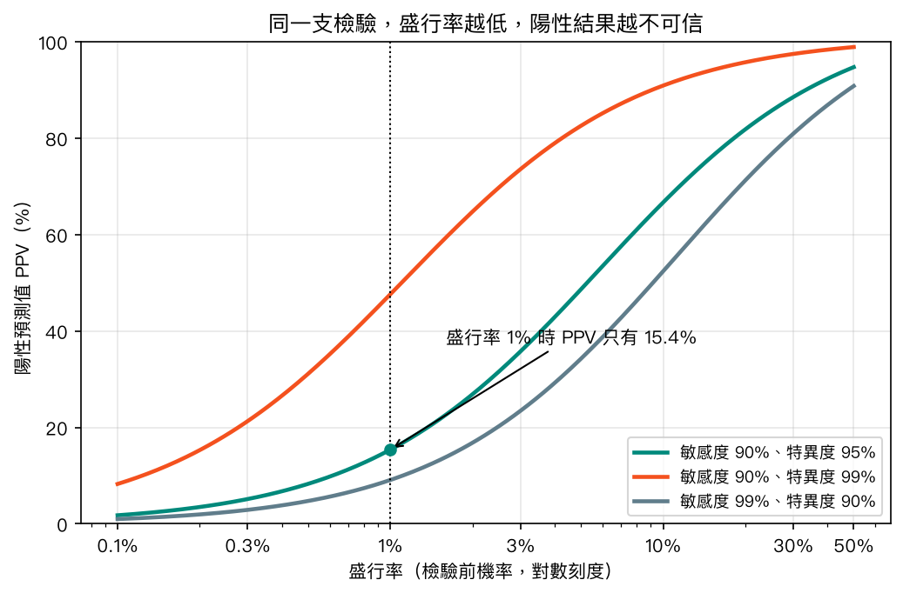
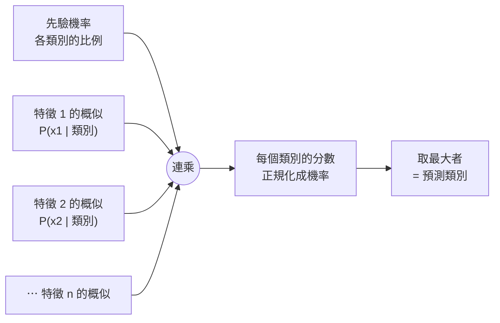
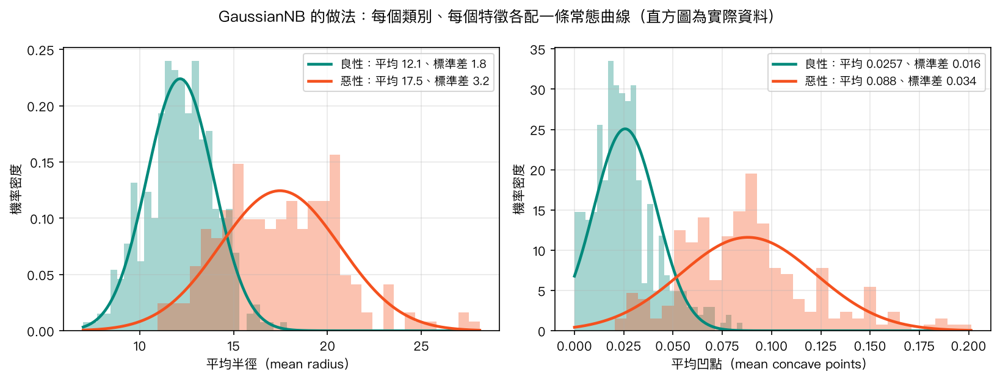
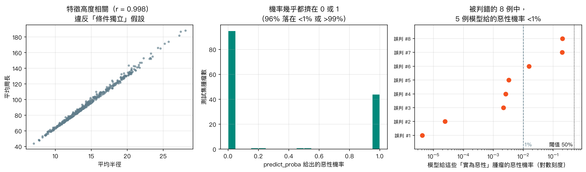

# 第 5 章　簡單貝氏分類

<p class="chapter-meta">預計閱讀 30 分鐘 ・ 先備：第 4 章（混淆矩陣、邏輯迴歸）</p>

!!! abstract "本章你會學到"
    - 用盛行率、敏感度、特異度親手算出陽性預測值，看懂它就是貝氏定理
    - 說明簡單貝氏分類器（naive Bayes classifier）「天真」在哪裡，以及為什麼它還是好用
    - 區分 Gaussian、Multinomial、Bernoulli 三種變體各自適合什麼資料
    - 用 scikit-learn 訓練 `GaussianNB` 與 `MultinomialNB`，並解讀混淆矩陣
    - 判斷什麼時候 `predict_proba` 的機率不能照單全收

<div class="nb-links" markdown>
[:simple-googlecolab: 在 Colab 開啟](https://colab.research.google.com/github/GITHUB_REPO_PLACEHOLDER/blob/main/docs/notebooks/ch05_naive-bayes.ipynb){ .md-button .md-button--primary }
[:material-download: 下載 Notebook](../notebooks/ch05_naive-bayes.ipynb){ .md-button }
</div>

## 1. 直覺：從一個臨床情境開始

想像你在健檢中心看到一份報告：某項癌症篩檢呈陽性。這支檢驗的敏感度（sensitivity）是 90%，特異度（specificity）是 95%。受檢者問：「所以我有 90% 的機率得癌症嗎？」

學過流病的你大概已經察覺陷阱：答案取決於這種癌症在受檢族群裡有多常見。我們用「每 10,000 人」來數一次，假設盛行率（prevalence）是 1%：

- 10,000 人裡真正有病的是 100 人。敏感度 90%，所以其中 90 人驗出陽性（真陽性），10 人被漏掉（偽陰性）。
- 沒病的 9,900 人，特異度 95%，所以 9,405 人正確驗出陰性，但還有 495 人被誤判為陽性（偽陽性）。
- 所有陽性共 90 + 495 = 585 人，其中真的有病的只有 90 人。

所以陽性預測值（positive predictive value, PPV）是 90 ÷ 585 ≈ **15.4%**。一支看起來很準的檢驗，在低盛行率的族群裡，每 100 個陽性大約只有 15 個真的有病。

這個計算你在流病課一定做過，但你可能沒意識到：**這就是貝氏定理**。盛行率是「看到檢驗結果之前」對疾病的相信程度，叫做先驗機率（prior）；PPV 是「看到陽性之後」更新過的相信程度，叫做後驗機率（posterior）；敏感度與特異度描述「如果有病／沒病，會看到什麼結果」，叫做概似（likelihood）。

臨床推理本來就是這樣運作的：先根據年紀、病史估一個檢驗前機率，每拿到一個新的檢查結果就往上或往下修正。簡單貝氏分類器做的事完全一樣，只是它一次看幾十個、甚至幾萬個「檢查結果」（特徵），然後替每一個候選診斷（類別）各算一個後驗機率，挑最大的那個當答案。

## 2. 核心概念

### 2.1 盛行率決定陽性結果有多可信

同一支檢驗，換到不同族群，PPV 可以天差地遠。下圖畫出三種敏感度／特異度組合下，PPV 隨盛行率變化的樣子。

{ loading=lazy }

幾個值得停下來看的地方：

- 橘線（特異度 99%）遠高於綠線（特異度 95%）。**在低盛行率時，特異度比敏感度更能決定 PPV**，因為偽陽性是從龐大的健康人群裡冒出來的。
- 灰線的敏感度高達 99%，但特異度只有 90%，PPV 反而是三條裡最低的。
- 盛行率到 30% 以上，三條線都爬得很高。這就是為什麼同一支檢驗用在「症狀典型、被轉介來的病人」身上比用在「全民篩檢」更可信。

用表格整理貝氏定理和臨床用語的對應：

| 貝氏定理的名詞 | 臨床上的說法 | 在分類器裡是什麼 |
|---|---|---|
| 先驗機率 $P(\text{病})$ | 盛行率、檢驗前機率 | 訓練資料中各類別的比例 |
| 概似 $P(\text{陽性} \mid \text{病})$ | 敏感度（或 1 − 特異度） | 某類別下，看到這組特徵值的機率 |
| 後驗機率 $P(\text{病} \mid \text{陽性})$ | PPV、檢驗後機率 | 模型輸出的類別機率 |
| 概似比（likelihood ratio） | LR+、LR− | 每個特徵把勝算乘上多少倍 |

??? note "數學補充（可跳過）"
    貝氏定理：

    $$
    P(D \mid +) = \frac{P(+ \mid D)\,P(D)}{P(+ \mid D)\,P(D) + P(+ \mid \bar D)\,P(\bar D)}
    = \frac{\text{敏感度} \times \text{盛行率}}{\text{敏感度} \times \text{盛行率} + (1-\text{特異度}) \times (1-\text{盛行率})}
    $$

    代入 0.9、0.01、0.95：$\dfrac{0.9 \times 0.01}{0.9 \times 0.01 + 0.05 \times 0.99} = \dfrac{0.009}{0.0585} \approx 0.154$。

    改寫成勝算（odds）形式更好用：

    $$
    \underbrace{\frac{P(D \mid +)}{P(\bar D \mid +)}}_{\text{檢驗後勝算}} = \underbrace{\frac{P(D)}{P(\bar D)}}_{\text{檢驗前勝算}} \times \underbrace{\frac{P(+ \mid D)}{P(+ \mid \bar D)}}_{\text{LR+}}
    $$

    檢驗前勝算 $1/99$，LR+ $= 0.9/0.05 = 18$，檢驗後勝算 $18/99 \approx 0.182$，換回機率 $0.182/1.182 \approx 15.4\%$，和上面一致。

### 2.2 從一個檢驗到很多個：「天真」在哪裡

臨床上我們很少只看一個檢查。假設病人發燒、咳嗽、胸部 X 光有浸潤，懷疑肺炎。如果每個發現都有自己的概似比，最直接的做法是把它們全部乘起來：

檢驗後勝算 ＝ 檢驗前勝算 × LR(發燒) × LR(咳嗽) × LR(X 光浸潤)

這一步隱含了一個很強的假設：**在已知「有肺炎」或「沒肺炎」的前提下，這幾個發現彼此獨立**，也就是條件獨立（conditional independence）。現實中，即使同樣是肺炎病人，發燒比較厲害的人往往咳嗽也比較明顯，兩者在同一類別內仍然相關，並不獨立；把它們當成兩份獨立證據相乘，等於同一份資訊被算了兩次，機率就會被推得過度極端。

簡單貝氏分類器之所以叫「天真」（naive），就是因為它明知道特徵之間通常有關聯，還是照樣做這個假設。好處是計算極度簡單：每個特徵只需要各自估計「在某類別下的分布」，不用管特徵之間的交互關係。三十個特徵就是三十個小模型，再連乘起來。



那為什麼它還能用？關鍵在於**分類只需要排名對，不需要機率準**。就算每個類別的分數都被誇大了，只要「惡性的分數比良性高」這個相對順序大致正確，預測的類別就是對的。scikit-learn 的官方文件也說得很直白：簡單貝氏是不錯的分類器，但是很差的機率估計器。這句話請記住，本章後面會用實際資料證明它。

??? note "數學補充（可跳過）"
    對類別 $y$ 與特徵 $x_1, \dots, x_n$，條件獨立假設讓聯合概似可以拆開：

    $$
    P(y \mid x_1, \dots, x_n) \propto P(y) \prod_{i=1}^{n} P(x_i \mid y)
    $$

    預測時取 $\hat y = \arg\max_y \; P(y) \prod_i P(x_i \mid y)$。實作上會取對數，把連乘變成連加，避免很多個小機率相乘後變成電腦無法表示的極小數。

### 2.3 三種常見變體

差別只在「每個特徵在某類別下的分布」用什麼形狀來描述：

| 變體 | 假設每個特徵是… | 適合的資料 | 醫學例子 |
|---|---|---|---|
| `GaussianNB` | 常態分布（每類別各自估平均與變異數） | 連續數值 | 腫瘤半徑、血壓、肌酸酐 |
| `MultinomialNB` | 次數（出現幾次） | 詞頻、計數 | 病歷或論文摘要裡每個字出現幾次 |
| `BernoulliNB` | 有／無（0 或 1） | 二元特徵 | 症狀有沒有出現、某個字有沒有出現 |

下圖是 `GaussianNB` 在乳癌資料上實際做的事：對「良性」與「惡性」兩類，各自為每個特徵配一條常態曲線。新的腫瘤進來時，就看它的數值落在哪一條曲線比較高。

{ loading=lazy }

可以看到右圖的平均凹點（mean concave points）並不是漂亮的鐘形，良性那一類緊貼 0 的左邊界。常態分布只是近似，資料偏態時會有誤差，這也是 NB 機率不準的另一個來源。

## 3. 動手做

以下程式碼與 notebook 相同，建議在 Colab 邊讀邊跑。第一步先載入套件並印出版本。

```python
import numpy as np
import pandas as pd
import matplotlib.pyplot as plt
import sklearn

print("numpy", np.__version__, "| pandas", pd.__version__, "| scikit-learn", sklearn.__version__)
```

本教材以 Colab 的 scikit-learn 1.6 為相容底線，較新的版本也能執行。

### 3.1 用程式算 PPV

先把第 1 節的「每 10,000 人」計算方式寫成函式，一次試幾種盛行率。

```python
def ppv_npv(prevalence, sensitivity, specificity, n=10_000):
    diseased = prevalence * n
    healthy = n - diseased
    tp = sensitivity * diseased          # true positive
    fn = diseased - tp                   # false negative
    tn = specificity * healthy           # true negative
    fp = healthy - tn                    # false positive
    return tp / (tp + fp), tn / (tn + fn)

for prev in [0.001, 0.01, 0.1, 0.3]:
    ppv, npv = ppv_npv(prev, sensitivity=0.90, specificity=0.95)
    print(f"prevalence {prev:>6.1%}  ->  PPV {ppv:6.1%}   NPV {npv:7.2%}")
```

輸出顯示盛行率 0.1%、1%、10%、30% 時，PPV 分別約為 1.8%、15.4%、66.7%、88.5%，而陰性預測值（NPV）一直都在 95% 以上。低盛行率時「陰性很可信、陽性不太可信」，這正是篩檢檢驗的典型特性。

接著用勝算與概似比的形式，模擬連續做兩次**彼此獨立**的陽性檢驗。

```python
def to_odds(p):
    return p / (1 - p)

def to_prob(odds):
    return odds / (1 + odds)

sens, spec = 0.90, 0.95
lr_pos = sens / (1 - spec)               # LR+ = 18
pretest = 0.01

post1 = to_prob(to_odds(pretest) * lr_pos)
post2 = to_prob(to_odds(pretest) * lr_pos * lr_pos)   # a second, independent positive test
print(f"LR+ = {lr_pos:.1f}")
print(f"after 1 positive test : {post1:.1%}")
print(f"after 2 positive tests: {post2:.1%}  (only valid if the tests are conditionally independent)")
```

一次陽性後機率從 1% 升到 15.4%，第二次獨立的陽性再升到 76.6%。這個「一路乘下去」的動作，就是簡單貝氏分類器的全部精神；但如果第二個檢驗和第一個原理相同、結果高度相關，這個 76.6% 就是高估的。

### 3.2 GaussianNB：乳癌細胞核特徵

資料用全站共用的 WDBC（Breast Cancer Wisconsin Diagnostic），569 個腫瘤、30 個細胞核影像特徵。要注意 sklearn 內建版本的標籤是 `0 = 惡性、1 = 良性`，和直覺相反，所以先翻過來。

```python
from sklearn.datasets import load_breast_cancer
from sklearn.model_selection import train_test_split

X, y = load_breast_cancer(return_X_y=True, as_frame=True)
y = (y == 0).astype(int)                 # flip: 1 = malignant, 0 = benign
X_train, X_test, y_train, y_test = train_test_split(
    X, y, test_size=0.25, stratify=y, random_state=42)
print(X_train.shape, X_test.shape, "malignant rate:", round(y.mean(), 3))
```

訓練集 426 例、測試集 143 例，惡性比例約 37%，`stratify=y` 讓兩邊的惡性比例相同。

`GaussianNB` 只要建立、`fit`、`predict` 三步。它對每個特徵各自估計平均與變異數，所以**不需要先標準化**。

```python
from sklearn.naive_bayes import GaussianNB
from sklearn.metrics import accuracy_score, confusion_matrix, classification_report

nb = GaussianNB()
nb.fit(X_train, y_train)
y_pred = nb.predict(X_test)

print("accuracy:", round(accuracy_score(y_test, y_pred), 3))
print(confusion_matrix(y_test, y_pred))          # rows: true 0/1, cols: predicted 0/1
print(classification_report(y_test, y_pred, target_names=["benign", "malignant"], digits=3))
```

測試集準確率約 0.944。混淆矩陣是 `[[90, 0], [8, 45]]`：90 個良性全部判對；53 個惡性抓到 45 個、漏掉 8 個，對惡性的召回率（recall，也就是敏感度）約 0.85。在醫學情境裡，這 8 個偽陰性比準確率數字本身更值得關心。

模型學到的東西非常透明：每一類的先驗機率，加上每一類、每個特徵的平均與變異數。

```python
params = pd.DataFrame({"benign_mean": nb.theta_[0], "malignant_mean": nb.theta_[1]},
                      index=X.columns)
print("class prior:", nb.class_prior_.round(3))
params.loc[["mean radius", "mean concave points", "worst area"]].round(3)
```

`class_prior_` 是 `[0.627, 0.373]`，就是訓練集裡良性與惡性的比例。以平均半徑為例，良性平均約 12.2、惡性約 17.5，差距明顯，所以它是有鑑別力的特徵。

一個模型好不好，要和別的模型比。用 5 折交叉驗證（cross-validation）和第 4 章的邏輯迴歸比一比：

```python
from sklearn.model_selection import cross_val_score, StratifiedKFold
from sklearn.pipeline import make_pipeline
from sklearn.preprocessing import StandardScaler
from sklearn.linear_model import LogisticRegression

cv = StratifiedKFold(n_splits=5, shuffle=True, random_state=42)
models = {
    "GaussianNB": GaussianNB(),
    "LogisticRegression": make_pipeline(StandardScaler(), LogisticRegression(max_iter=1000)),
}
for name, model in models.items():
    scores = cross_val_score(model, X, y, cv=cv)
    print(f"{name:20s} accuracy {scores.mean():.3f} (+/- {scores.std():.3f})")
```

GaussianNB 平均約 0.939，邏輯迴歸約 0.974。簡單貝氏在這份資料上輸了幾個百分點，但它幾乎沒有需要調的超參數（hyperparameter）、訓練一瞬間完成，很適合當作基準線（baseline）：之後任何更複雜的模型，至少要贏過它才有意義。

### 3.3 為什麼機率不能當真

WDBC 的 30 個特徵裡，半徑、周長、面積幾乎在描述同一件事。下面的程式碼看看這對 `predict_proba` 造成什麼影響。

```python
proba = nb.predict_proba(X_test)[:, 1]          # predicted probability of malignant
print("corr(mean radius, mean perimeter) =", round(X["mean radius"].corr(X["mean perimeter"]), 3))
print("share of predictions < 1% or > 99%:", round(np.mean((proba < 0.01) | (proba > 0.99)), 3))

wrong = y_pred != y_test.to_numpy()
print("misclassified cases:", wrong.sum())
print("their predicted P(malignant):", np.sort(proba[wrong]).round(4))

fig, ax = plt.subplots(figsize=(6, 3.5))
ax.hist(proba, bins=20, range=(0, 1), color="#00897B", edgecolor="white")
ax.set_xlabel("predicted P(malignant)")
ax.set_ylabel("number of test tumors")
ax.set_title("GaussianNB probabilities pile up at 0 and 1")
plt.show()
```

結果很驚人：平均半徑與平均周長的相關係數高達 0.998；測試集中 95.8% 的預測機率落在 <1% 或 >99%。而被判錯的 8 個惡性腫瘤裡，有 5 個模型給的惡性機率不到 1%。

{ loading=lazy }

這就是第 2.2 節說的「同一份證據被算好幾次」：半徑大、周長大、面積大被當成三份獨立證據相乘，機率一路被推到牆角。模型在排序上大致正確，但它的「信心」是虛胖的。如果真的需要可靠的機率，要做機率校準（calibration），第 11 章會介紹。

### 3.4 MultinomialNB：把醫學摘要分類

簡單貝氏最經典的舞台其實是文字，例如垃圾郵件過濾。這裡用 Medical Abstracts TC Corpus，約 1.4 萬篇醫學論文摘要，標記為 5 個疾病大類：腫瘤、消化系統、神經系統、心血管、一般病理狀態。

```python
base = "https://raw.githubusercontent.com/sebischair/Medical-Abstracts-TC-Corpus/main/"
try:
    train_df = pd.read_csv(base + "medical_tc_train.csv")
    test_df = pd.read_csv(base + "medical_tc_test.csv")
except Exception as e:
    raise RuntimeError(
        "下載 Medical Abstracts 失敗，請確認網路連線，或稍後再執行此格。原始錯誤：" + str(e))

label_names = {1: "neoplasms", 2: "digestive", 3: "nervous", 4: "cardiovascular", 5: "general"}
print(train_df.shape, test_df.shape)
print(train_df["condition_label"].map(label_names).value_counts())
print(train_df["medical_abstract"].iloc[0][:300], "...")
```

訓練集 11,550 篇、測試集 2,888 篇。類別並不平均：「一般病理」最多（3,844 篇），消化系統最少（1,195 篇）。

電腦看不懂文字，要先轉成數字。最簡單的做法是詞袋模型（bag-of-words）：每個字一欄，數它出現幾次，**字的順序全部丟掉**。先用三句玩具句子看清楚：

```python
from sklearn.feature_extraction.text import CountVectorizer

toy = ["chest pain and dyspnea",
       "tumor biopsy shows carcinoma",
       "chest tumor with pain"]
vec = CountVectorizer()
counts = vec.fit_transform(toy)
pd.DataFrame(counts.toarray(), columns=vec.get_feature_names_out(), index=["doc1", "doc2", "doc3"])
```

輸出是一個 3 列 × 9 欄的表，每一格是某個字在某句出現的次數。「chest pain」和「pain chest」在詞袋裡是一樣的，這是它最大的簡化。

接著把「詞袋 → MultinomialNB」串成 Pipeline，在真正的摘要上訓練。`stop_words="english"` 移除 the、and 這類虛詞，`min_df=2` 忽略整個訓練集只出現在一篇的字。

```python
from sklearn.naive_bayes import MultinomialNB
from sklearn.metrics import ConfusionMatrixDisplay

text_clf = make_pipeline(CountVectorizer(stop_words="english", min_df=2), MultinomialNB())
text_clf.fit(train_df["medical_abstract"], train_df["condition_label"])
pred = text_clf.predict(test_df["medical_abstract"])
print("test accuracy:", round(accuracy_score(test_df["condition_label"], pred), 3))

ConfusionMatrixDisplay.from_predictions(
    test_df["condition_label"], pred,
    display_labels=list(label_names.values()), cmap="Greens", colorbar=False,
    xticks_rotation=30)
plt.show()
```

測試準確率約 0.587。聽起來不高，但看混淆矩陣就知道原因：

{ loading=lazy }

前四類的對角線都很深，模型分得相當清楚；問題集中在最下面一列「一般病理狀態」，它本來就是雜項類別，很多摘要同時也談腫瘤或心血管，卻只被標了一個標籤。**分數低不一定是模型差，也可能是標籤本身模糊**，這在醫學資料很常見。

簡單貝氏的另一個優點是可解釋：`feature_log_prob_` 存的是「在每一類中，每個字出現的機率（取對數）」，可以直接印出各類最具代表性的字。

```python
vec = text_clf.named_steps["countvectorizer"]
mnb = text_clf.named_steps["multinomialnb"]
words = vec.get_feature_names_out()
for i, label in enumerate(mnb.classes_):
    top = np.argsort(mnb.feature_log_prob_[i])[::-1][:8]
    print(f"{label_names[label]:15s}", ", ".join(words[top]))
```

腫瘤類的高頻字是 cancer、tumor、carcinoma，心血管類是 coronary、blood、artery，大致符合醫學直覺；但每一類都排進了 patients、study 這種到處都有的字，這是只數次數的限制。練習題會請你換成 `TfidfVectorizer` 試試看。

最後比較三種變體在同一份文字資料上的表現：

```python
from sklearn.naive_bayes import BernoulliNB, ComplementNB

variants = {
    "MultinomialNB": make_pipeline(CountVectorizer(stop_words="english", min_df=2), MultinomialNB()),
    "BernoulliNB": make_pipeline(CountVectorizer(stop_words="english", min_df=2, binary=True), BernoulliNB()),
    "ComplementNB": make_pipeline(CountVectorizer(stop_words="english", min_df=2), ComplementNB()),
}
for name, model in variants.items():
    model.fit(train_df["medical_abstract"], train_df["condition_label"])
    acc = accuracy_score(test_df["condition_label"], model.predict(test_df["medical_abstract"]))
    print(f"{name:14s} test accuracy {acc:.3f}")
```

Multinomial 約 0.587、Bernoulli 約 0.559、Complement（專為類別不平衡設計的變形）約 0.595。三者只差幾個百分點，這份資料的瓶頸在類別界線，而不是選哪一種變體。以上只是單次切分的結果，沒有做統計檢定，不宜解讀成哪個變體「比較好」。

## 4. 醫學案例

!!! info "僅供學習"
    本章兩份資料都是公開資料集的教學示範，本例僅供學習，不構成臨床建議。WDBC 源自 UCI（CC BY 4.0，Street、Wolberg、Mangasarian 1993）；Medical Abstracts TC Corpus 來自 sebischair 的 GitHub 專案，HuggingFace 資料卡標示 CC BY-SA 3.0，GitHub repo 本身未標明授權。

回到乳癌的例子，我們把結果放回臨床脈絡：

1. **準確率 0.944 的意義有限**。測試集只有 143 例，而且 WDBC 來自單一機構、年代久遠、沒有經過外部驗證。換到另一家醫院的影像設備與病人族群，表現可能大不相同。
2. **偽陰性才是重點**。8 個被漏掉的惡性腫瘤，其中 5 個模型給的惡性機率不到 1%。如果有人把這個輸出當成「惡性風險 <1%，不必切片」，後果會很嚴重。這說明分類器的機率輸出和臨床風險估計是兩回事。
3. **盛行率會改變一切**。WDBC 的惡性比例約 37%，是轉介到病理檢查的族群，不是一般篩檢族群。簡單貝氏把訓練資料的類別比例當作先驗，把同一個模型拿到盛行率 1% 的族群，PPV 會像第 2.1 節的曲線一樣大幅下滑。`GaussianNB(priors=[...])` 可以手動指定先驗，這正是「換族群就要換檢驗前機率」的程式版本。

文字分類的例子則提醒我們：模型的上限常常受限於標籤品質。「一般病理狀態」這種定義模糊的類別，再好的演算法也很難分乾淨；在自己的研究裡設計標籤時，類別之間要互斥、定義要清楚。

## 5. 互動體驗

拖動下面三個滑桿，觀察 PPV 如何隨盛行率、敏感度、特異度改變。表格顯示「每 10,000 人」的 2×2 表，曲線顯示在目前的敏感度與特異度下，PPV 隨盛行率變化的全貌（橘點是目前設定）。預設值就是第 1 節的例子（盛行率 1%、敏感度 90%、特異度 95% → PPV 15.4%）。

<div class="demo-box">
  <div id="ch05-demo">
    <div id="ch05-out"></div>
    <div id="ch05-plot"></div>
  </div>
  <div class="controls">
    <label>盛行率 <input type="range" id="ch05-prev" min="-3" max="-0.301" step="0.01" value="-2"> <span id="ch05-prev-v"></span></label>
    <label>敏感度 <input type="range" id="ch05-sens" min="50" max="100" step="1" value="90"> <span id="ch05-sens-v"></span></label>
    <label>特異度 <input type="range" id="ch05-spec" min="50" max="100" step="1" value="95"> <span id="ch05-spec-v"></span></label>
  </div>
</div>

可以試試這幾件事：

- 把盛行率拉到最低（0.1%），再把特異度從 95% 調到 99%，看 PPV 變化多大；接著把敏感度調到 99%，比較哪一個滑桿影響比較大。
- 把特異度調到 100%，PPV 會變成 100%，因為不會有任何偽陽性。現實中幾乎沒有這種檢驗。
- 觀察 LR+ 的數值：它只由敏感度與特異度決定，和盛行率無關。這就是為什麼概似比比 PPV 更適合拿來比較不同檢驗。

## 6. 常見陷阱

!!! warning "陷阱 1：把 predict_proba 當成真實風險"
    簡單貝氏的機率常被推到接近 0 或 1，尤其特徵彼此相關時更明顯。本章的 WDBC 例子裡，有 5 個惡性腫瘤被給予 <1% 的惡性機率。需要可信的機率時，要另外做校準並檢查校準曲線，或改用機率輸出較可靠的模型。

!!! warning "陷阱 2：以為「敏感度、特異度都很高，陽性就一定有病」"
    PPV 取決於盛行率。敏感度 90%、特異度 95% 的檢驗，盛行率 1% 時 PPV 只有約 15%。同理，一個在高盛行率資料集上訓練的分類器，搬到低盛行率族群時，陽性預測會充滿偽陽性。

!!! warning "陷阱 3：沒見過的字讓整個機率變成 0"
    如果某個字在「消化系統」類的訓練資料從沒出現過，它在該類的機率估計是 0，連乘後整類直接歸零，不管其他證據多強。`MultinomialNB` 預設的 `alpha=1.0` 就是拉普拉斯平滑（Laplace smoothing）：每個字的次數都先加 1，避免零機率。把 `alpha` 設成 0 會讓這個問題重新出現。

!!! warning "陷阱 4：用錯變體"
    把連續的檢驗數值丟給 `MultinomialNB`（它期待非負的次數），或把詞頻丟給 `GaussianNB`，程式可能照樣跑得動，結果卻沒有意義，甚至在有負值時直接報錯。先想清楚特徵是「連續數值」「次數」還是「有／無」，再選對應的變體。

## 7. 小測驗

??? question "Q1. 某檢驗敏感度 80%、特異度 90%，用在盛行率 10% 的族群。每 1,000 人中，PPV 約為多少？"
    **答案：** 約 47%。有病 100 人中真陽性 80 人；沒病 900 人中偽陽性 90 人。PPV = 80 ÷ (80 + 90) ≈ 0.47。即使檢驗還不錯，陽性的人仍有一半以上沒病。

??? question "Q2. 簡單貝氏分類器的「天真」指的是什麼假設？這個假設被違反時，最先受影響的是分類結果還是機率？"
    **答案：** 假設在已知類別的條件下，各特徵彼此獨立（條件獨立）。違反時，相關的特徵會被重複計算，最先失真的是機率（被推向 0 或 1）；分類結果只要類別間的相對排序大致正確，常常仍然不錯。

??? question "Q3. 想用病歷中「是否出現某些關鍵字」（有／無，不管出現幾次）來分類，最適合哪一種變體？"
    **答案：** `BernoulliNB`。它把每個特徵當成 0／1 的有無；`MultinomialNB` 看的是出現次數，`GaussianNB` 則用於連續數值。

## 8. 重點整理

- 貝氏定理就是檢驗前機率 → 檢驗後機率：先驗（盛行率）× 概似（敏感度、特異度）→ 後驗（PPV）。
- 低盛行率時，就算敏感度、特異度都很高，PPV 仍可能很低；特異度對 PPV 的影響尤其大。
- 簡單貝氏分類器假設特徵在已知類別下條件獨立，把每個特徵的概似連乘，像是把一連串概似比乘在檢驗前勝算上。
- 這個假設常被違反，但分類只需要排序對，所以它仍是快速、透明、幾乎不用調參的好基準線。
- 連續數值用 `GaussianNB`，詞頻用 `MultinomialNB`，有／無用 `BernoulliNB`；文字資料記得詞袋會丟掉字序，平滑參數 `alpha` 避免零機率。
- `predict_proba` 的數字不要當成真實風險；在 WDBC 上，95.8% 的預測擠在 <1% 或 >99%。
- 資料集小、單一來源、未經外部驗證：本章的準確率只是教學示範，不代表臨床可用。

## 延伸閱讀

- [scikit-learn：Naive Bayes 使用手冊](https://scikit-learn.org/stable/modules/naive_bayes.html) — 官方文件，涵蓋各變體的公式與「機率輸出不可盡信」的說明
- [scikit-learn：Probability calibration](https://scikit-learn.org/stable/modules/calibration.html) — 想讓分類器機率變可信時要讀的章節
- [Python Data Science Handbook：In Depth: Naive Bayes Classification](https://jakevdp.github.io/PythonDataScienceHandbook/05.05-naive-bayes.html) — VanderPlas 的經典教學，含文字分類範例（CC BY-NC-ND，僅連結）
- [StatQuest：Naive Bayes, Clearly Explained（YouTube 搜尋）](https://www.youtube.com/results?search_query=statquest+naive+bayes+clearly+explained) — 用圖解把連乘與平滑講得很清楚的英文影片
- [Medical Abstracts TC Corpus（GitHub）](https://github.com/sebischair/Medical-Abstracts-TC-Corpus) — 本章文字分類資料集的原始出處

<script src="../../assets/js/demos/ch05-ppv.js"></script>
