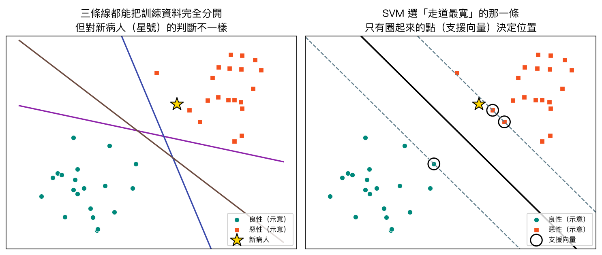
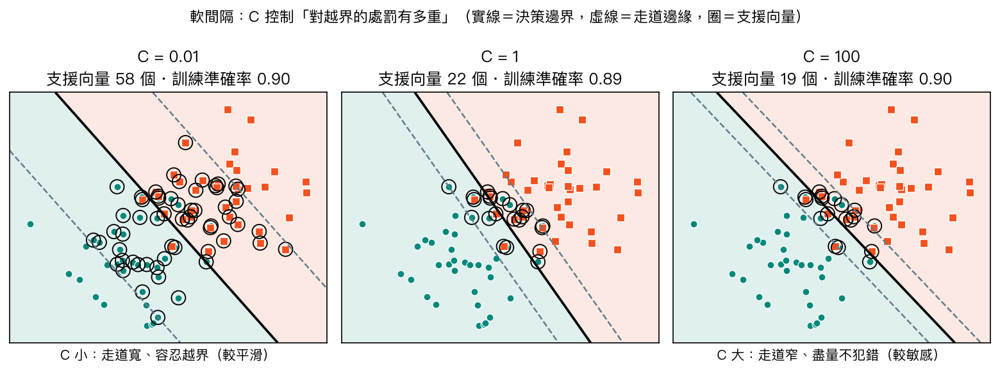
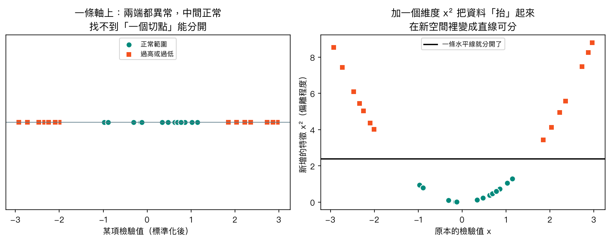
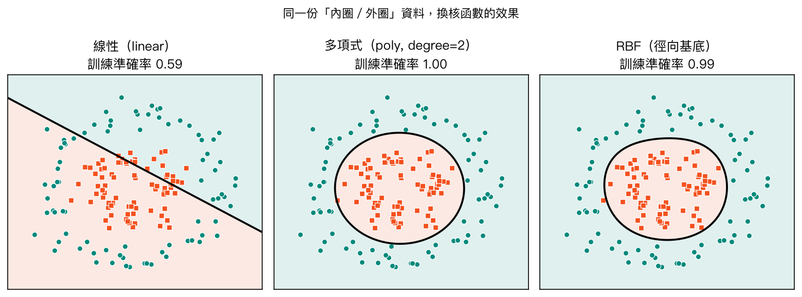
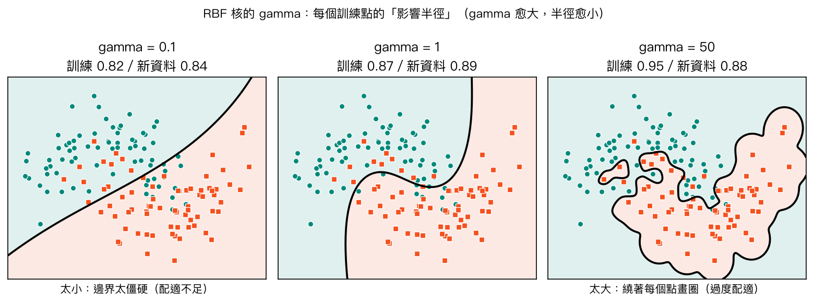
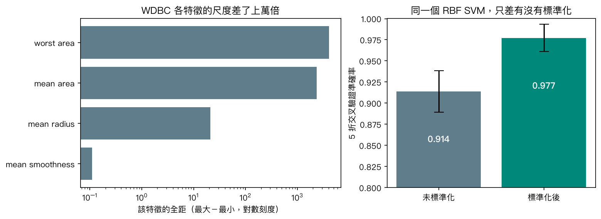

# 第 6 章　支援向量機（SVM）

<p class="chapter-meta">預計閱讀 30 分鐘 ・ 先備：第 3 章（標準化、Pipeline）、第 4 章（邏輯迴歸、混淆矩陣）</p>

!!! abstract "本章你會學到"
    - 說明「最大間隔」為什麼能讓分類器對新病人判斷更穩
    - 分辨支援向量、軟間隔與超參數 C 的角色
    - 用「把資料抬到高維」的直覺理解核函數，並知道 RBF 核的 gamma 會怎麼造成過擬合
    - 用 `Pipeline` 把標準化與 SVM 綁在一起，並用 `GridSearchCV` 調 C 與 gamma
    - 正確解讀 SVM 的輸出：`decision_function` 是距離不是機率，需要機率時另外校準

<div class="nb-links" markdown>
[:simple-googlecolab: 在 Colab 開啟](https://colab.research.google.com/github/GITHUB_REPO_PLACEHOLDER/blob/main/docs/notebooks/ch06_svm.ipynb){ .md-button .md-button--primary }
[:material-download: 下載 Notebook](../notebooks/ch06_svm.ipynb){ .md-button }
</div>

## 1. 直覺：從一個臨床情境開始

想像你在乳房外科門診跟診。每位病人做完 fine needle aspiration（FNA，細針抽吸），病理影像會量出一堆細胞核的特徵：半徑、面積、邊緣凹陷程度……。假設我們先只看兩個特徵，把過去已確診的病人畫在一張散佈圖上：良性一群、惡性一群，中間隔著一段空白。

現在要畫一條線把兩群分開。問題來了：**能完全分開訓練資料的線有無限多條**。下圖左邊三條線都零錯誤，可是星號那位新病人，有的線判良性、有的判惡性。哪一條最值得信任？

{ loading=lazy }

一個很直觀的答案是：**選離兩群都最遠的那條線**。你可以把它想成兩間病房之間的緩衝走道——走道愈寬，新病人就算量測有點誤差、落點稍微偏一點，也不容易被分到錯的那一邊。支援向量機（support vector machine, SVM）做的就是這件事：在所有能分開資料的線裡，找出「走道最寬」的那一條。

右圖裡被圈起來的三個點，正好站在走道邊緣。它們就是**支援向量（support vector）**——整條決策線完全由這幾位「站在邊界上的關鍵病人」決定。其他離邊界很遠、典型到不行的病人，就算把他們移動一點、甚至刪掉，線都不會動。

這和第 4 章的邏輯迴歸（logistic regression，又稱羅吉斯迴歸）想法不太一樣：邏輯迴歸會考慮**每一個**病人的貢獻，而 SVM 只在乎邊界附近那些「難判的病例」。

!!! note "名詞小註"
    本教材統一用「支援向量機」；統計學名詞裡也寫作「支持向量機」，兩者指同一件事。

## 2. 核心概念

### 2.1 最大間隔與支援向量

SVM 的決策規則其實很簡單：把病人的特徵代入一條線（在高維度叫「超平面」）的方程式，算出一個分數。分數大於 0 判一類、小於 0 判另一類，**分數的絕對值代表離邊界多遠**。訓練時，SVM 要找的是讓走道寬度——也就是**間隔（margin）**——最大的那條線，同時要求所有訓練點都待在自己那一側的走道外面。

??? note "數學補充（可跳過）"
    決策邊界是超平面 $w \cdot x + b = 0$，預測時看 $f(x) = w \cdot x + b$ 的正負號。
    把走道兩側邊緣定為 $f(x) = +1$ 與 $f(x) = -1$，走道寬度就是 $\dfrac{2}{\lVert w \rVert}$。
    所以「走道最寬」等價於「讓 $\lVert w \rVert$ 最小」：

    $$
    \min_{w,b}\ \frac{1}{2}\lVert w \rVert^2 \quad \text{使得}\quad y_i\,(w \cdot x_i + b) \ge 1,\ \ y_i \in \{-1, +1\}
    $$

    解出來的 $w$ 只由落在走道邊緣（或走道內）的點線性組合而成，這些點就是支援向量。

### 2.2 軟間隔與 C：對越界有多寬容

真實資料很少能乾淨地一刀兩斷。WDBC 裡就有少數良性腫瘤的細胞核長得很像惡性，反之亦然。如果硬要求每個點都不能越界，要不是根本找不到線，就是被一兩個特例拉著走，畫出一條很奇怪的邊界。

所以實務上用的是**軟間隔（soft margin）**：允許某些點站進走道、甚至跑到對面，但每越界一次就要付出代價。代價有多重，由超參數（hyperparameter）**C** 決定：

- **C 小**：處罰輕，模型寧可走道寬一點、放幾個點越界。邊界比較平滑，支援向量比較多。
- **C 大**：處罰重，模型拚命讓每個訓練點都分對，走道變窄，邊界容易被個別點牽著走。

{ loading=lazy }

這很像篩檢門檻的取捨：你要不要為了一兩個很難判的病例，把整個判讀標準扭過去？C 太大，模型在訓練集上幾乎零失誤，卻可能是在「背答案」，也就是過擬合（overfitting）。

??? note "數學補充：軟間隔的目標函數（可跳過）"
    引入鬆弛變數 $\xi_i \ge 0$ 表示第 $i$ 個點越界的程度：

    $$
    \min_{w,b,\xi}\ \frac{1}{2}\lVert w \rVert^2 + C\sum_i \xi_i \quad \text{使得}\quad y_i\,(w \cdot x_i + b) \ge 1 - \xi_i
    $$

    第一項要走道寬，第二項要越界少，C 就是兩者之間的權重。

### 2.3 核函數：把資料「抬」到高維

有些資料不管怎麼畫直線都分不開。舉一個臨床上很常見的型態：某項檢驗值**太高或太低都異常，只有中間正常**（想想血鈉、血鉀）。把病人排在一條數線上，異常者在兩端、正常者在中間，你找不到「一個切點」分開他們。

但如果多加一個特徵「偏離程度」$x^2$，把每個點往上抬，兩端的異常值會被抬得很高、中間的正常值留在底部——這時一條水平線就分開了。

{ loading=lazy }

這就是**核函數（kernel）**背後的直覺：在原本的空間分不開，就把資料映射到更高維的空間，在那裡用「直線」（超平面）分開；投影回原本的空間時，這條直線就變成彎曲的邊界。

厲害的地方在於，SVM 的計算只需要「兩個點之間有多相似」，核函數直接算出高維空間裡的相似度，**不必真的把每個點的高維座標算出來**，所以就算映射到無限多維也算得動。這個技巧叫 **kernel trick（核技巧）**。

scikit-learn 的 `SVC` 常用三種核：

| 核函數 | 邊界形狀 | 主要超參數 | 什麼時候先試 |
|---|---|---|---|
| `linear`（線性） | 直線／平面 | C | 特徵很多、樣本不多；想先看看線性是否就夠 |
| `poly`（多項式） | 曲線（二次、三次…） | C、degree | 已知特徵間有交互作用時；實務上較少當首選 |
| `rbf`（徑向基底，**預設**） | 任意彎曲的封閉區域 | C、gamma | 不確定邊界形狀時的通用選擇 |

{ loading=lazy }

### 2.4 RBF 核的 gamma：每個點的影響半徑

RBF 核衡量兩個點的相似度時，距離愈近愈相似，而且相似度隨距離快速衰減。**gamma** 控制衰減得多快，你可以把它想成「每個訓練點的影響半徑」：

- **gamma 小**：半徑大，每個點影響一大片，邊界平滑，太小會變得跟直線差不多（配適不足，underfitting）。
- **gamma 大**：半徑小，每個點只管自己附近，邊界會繞著個別點畫小圈圈——訓練分數漂亮，新資料就垮了。

{ loading=lazy }

注意右圖：gamma = 50 時訓練準確率最高（0.95），對新資料卻比 gamma = 1 還差。這就是第 4 章多項式迴歸裡 degree 15 的翻版。**C 與 gamma 要一起調**，因為兩者都在控制「邊界有多彎、多貼訓練資料」。

??? note "數學補充：RBF 核（可跳過）"
    $$
    K(x, x') = \exp\left(-\gamma\,\lVert x - x' \rVert^2\right)
    $$

    兩點重合時 $K = 1$，距離愈遠愈接近 0；$\gamma$ 愈大，衰減愈快。scikit-learn 預設 `gamma="scale"`，也就是 $1 / (\text{特徵數} \times \text{特徵的變異數})$，對標準化後的資料是個合理起點。

### 2.5 為什麼一定要標準化

SVM 看的是「距離」與「走道寬度」，所以特徵的尺度直接影響結果。WDBC 裡 `worst area` 的範圍是幾千，`mean smoothness` 只有零點幾，差了上萬倍。不標準化的話，距離幾乎只由面積類特徵決定，其他特徵等於被消音。

{ loading=lazy }

右圖是 5 折交叉驗證（cross-validation）的平均準確率：未標準化約 0.91，標準化後約 0.98（注意縱軸從 0.8 開始）。這不是 SVM 變聰明了，只是讓每個特徵有公平發言的機會。記得第 3 章的原則：標準化要放進 `Pipeline`，讓它只從訓練資料學平均與標準差。

## 3. 動手做

以下程式碼與 [本章 notebook](../notebooks/ch06_svm.ipynb) 一致，數字是在 scikit-learn 1.6.1（Colab 現況）與 1.9.1 實跑的結果，兩版相同。

**載入資料。** WDBC 內建在 scikit-learn，不用網路。第一件事是確認標籤編碼：

```python
from sklearn.datasets import load_breast_cancer

data = load_breast_cancer(as_frame=True)
X, y = data.data, data.target
print("X shape:", X.shape)
print("target_names:", data.target_names.tolist())  # index 0 = malignant, 1 = benign
print(y.map(dict(enumerate(data.target_names.tolist()))).value_counts())
```

輸出顯示 569 位病人、30 個特徵，良性 357、惡性 212。注意 **0 代表惡性、1 代表良性**，和多數人的直覺相反，後面讀報表時要特別小心。

**切出測試集。** 所有調參都只在訓練集上做，測試集留到最後：

```python
from sklearn.model_selection import train_test_split

X_train, X_test, y_train, y_test = train_test_split(
    X, y, test_size=0.25, stratify=y, random_state=42)
print(len(X_train), "train /", len(X_test), "test")
```

得到 426 筆訓練、143 筆測試，`stratify=y` 讓兩邊的惡性比例相同。

**故意做錯一次：不標準化。** 同樣用預設的 RBF 核，比較有沒有 `StandardScaler`（`SVC` 已在 notebook 前面的格子匯入）：

```python
from sklearn.pipeline import make_pipeline
from sklearn.preprocessing import StandardScaler

raw = SVC().fit(X_train, y_train)
scaled = make_pipeline(StandardScaler(), SVC()).fit(X_train, y_train)
print(f"No scaling  : test accuracy = {raw.score(X_test, y_test):.3f}")
print(f"With scaling: test accuracy = {scaled.score(X_test, y_test):.3f}")
```

未標準化的測試準確率 0.923，標準化後 0.979。程式碼只差一個步驟，結果差了五個百分點以上。

**比較三種核函數。** 用訓練集做 5 折交叉驗證：

```python
from sklearn.model_selection import StratifiedKFold, cross_val_score

cv = StratifiedKFold(n_splits=5, shuffle=True, random_state=42)
for kernel in ["linear", "poly", "rbf"]:
    model = make_pipeline(StandardScaler(), SVC(kernel=kernel))
    scores = cross_val_score(model, X_train, y_train, cv=cv)
    print(f"{kernel:>6}: CV accuracy {scores.mean():.3f} ± {scores.std():.3f}")
```

linear 0.972、rbf 0.967，兩者差距落在標準差範圍內；poly（預設三次）只有 0.894。在這份資料上，最簡單的線性核就已經很夠用——「核函數愈複雜愈好」並不成立。

**用網格搜尋（grid search）調 C 與 gamma。** 第 11 章會完整介紹 `GridSearchCV`，這裡先體驗一下。`svc__C` 的意思是「Pipeline 裡名叫 svc 那一步的 C 參數」：

```python
from sklearn.model_selection import GridSearchCV

param_grid = {"svc__C": [0.1, 1, 10, 100], "svc__gamma": [0.001, 0.01, 0.1, 1]}
search = GridSearchCV(make_pipeline(StandardScaler(), SVC()), param_grid, cv=cv)
search.fit(X_train, y_train)
print("Best params:", search.best_params_)
print(f"Best CV accuracy: {search.best_score_:.3f}")
print(f"Test accuracy   : {search.score(X_test, y_test):.3f}")
```

最佳組合是 C = 10、gamma = 0.001，交叉驗證 0.974，測試集 0.979。notebook 裡把 16 組分數排成表格，會看到 gamma = 1 的那一欄全部掉到 0.63 左右——差不多等於「全部猜良性」的水準（良性占 357/569 ≈ 0.63），就是 gamma 太大、每個點只管自己的結果。

**看混淆矩陣。** 臨床上最在意把惡性判成良性（偽陰性），所以要看 malignant 那一列的 recall，也就是惡性的敏感度：

```python
from sklearn.metrics import classification_report, ConfusionMatrixDisplay

best = search.best_estimator_
y_pred = best.predict(X_test)
print(classification_report(y_test, y_pred, target_names=data.target_names, digits=3))
ConfusionMatrixDisplay.from_predictions(
    y_test, y_pred, display_labels=data.target_names, cmap="Greens")
plt.title("SVM on WDBC test set")
plt.show()
```

測試集 53 位惡性中，模型抓到 51 位（recall 0.962），漏掉 2 位；良性的 recall 是 0.989。

**SVM 的分數不是機率。** `decision_function` 回傳的是「離邊界多遠」，帶正負號：

```python
print("decision_function:", best.decision_function(X_test.iloc[:5]).round(2))
print("true labels      :", y_test.iloc[:5].map(dict(enumerate(data.target_names.tolist()))).tolist())
```

前五位病人的分數是 1.04、−2.06、0.19、0.79、0.05。正值偏向類別 1（良性），負值偏向類別 0（惡性）。第五位只有 0.05，幾乎壓在邊界上，模型判良性，但他實際上是惡性——這正是分數接近 0 時要特別小心的例子。

真的需要機率（例如要畫校準曲線、或要跟臨床風險分數比較），就另外做**校準（calibration）**：

```python
from sklearn.calibration import CalibratedClassifierCV

calibrated = CalibratedClassifierCV(search.best_estimator_, ensemble=False, cv=5)
calibrated.fit(X_train, y_train)
proba_malignant = calibrated.predict_proba(X_test.iloc[:5])[:, 0]
print("P(malignant):", proba_malignant.round(3))
```

校準後第五位病人的惡性機率是 0.577，第三位是 0.471——兩位都落在五五波附近。校準模型是另外用交叉驗證重新擬合的，它和原本的 `best` 在邊界附近的病人身上可能給出不同判斷（第五位在這裡反而偏向惡性）。這也提醒我們：靠近邊界的病例，任何模型都不太有把握。

## 4. 醫學案例

!!! info "僅供學習"
    本章使用的是公開教學資料集，所有數字只用來示範演算法，本例僅供學習，不構成臨床建議。

**資料來源。** Breast Cancer Wisconsin (Diagnostic)，簡稱 WDBC，由 Wolberg、Street 與 Mangasarian 在 1990 年代於美國威斯康辛大學建立，收錄於 UCI Machine Learning Repository（授權 CC BY 4.0），scikit-learn 以 `load_breast_cancer` 內建。每筆資料是一位病人乳房腫塊 FNA 檢體的數位影像，量測 10 種細胞核特徵（半徑、紋理、周長、面積、平滑度、緊密度、凹陷度、凹點數、對稱性、碎形維度），每種各取平均、標準誤、最差值，共 30 個特徵。

**結果怎麼讀。** 調好的 RBF SVM 在 143 位測試病人上準確率 0.979，惡性敏感度 0.962。看起來很漂亮，但要記得三件事：

1. **資料量小、單一機構**：569 位病人都來自同一個醫學中心、同一套影像系統，模型沒有在其他醫院、其他掃描條件下做過外部驗證（external validation）。
2. **測試集只有 53 位惡性**：敏感度 0.962 背後是「漏掉 2 位」，換一個隨機切分，這個數字可能差好幾個百分點；報告時應該附上信賴區間或交叉驗證的變異範圍。
3. **特徵是影像量測值，不是完整的臨床資料**：真實門診還有年齡、家族史、乳房攝影、超音波等資訊，這份資料只回答了「細胞核長相能不能區分良惡性」這個窄問題。

**為什麼這個題目適合 SVM？** WDBC 有 30 個高度相關的連續特徵、樣本只有幾百筆，剛好落在 SVM 最擅長的範圍：特徵維度不低、樣本不多、邊界大致清楚。相對地，如果面對的是數十萬筆健保申報資料，標準的 `SVC` 會非常慢（訓練時間大約隨樣本數的平方到三次方成長），這時會改用 `LinearSVC` 或第 7 章的樹模型、第 11 章的集成學習。

**臨床上的延伸思考。** 惡性漏判的代價遠高於良性誤判。如果要讓模型更傾向「寧可多抓」，可以在 `SVC` 加上 `class_weight` 調整類別權重，或是把 `decision_function` 的判斷切點從 0 往良性那側移。這些調整會用特異度換敏感度，第 11 章會用 ROC 曲線完整討論這個取捨。

## 5. 互動體驗

下面是 2D 玩具資料（`make_moons`，兩個交錯的月牙，帶雜訊）。拉動滑桿改變核函數、C 與 gamma，觀察決策邊界（粗實線）、走道邊緣（虛線）與支援向量（空心圈）怎麼變。底色愈深代表離邊界愈遠、模型愈有把握。勾選「改看測試資料」可以看模型在沒見過的點上表現如何。

<div class="demo-box">
  <div id="ch06-demo"></div>
  <div class="controls">
    <label>核函數
      <select id="ch06-kernel">
        <option value="rbf" selected>RBF</option>
        <option value="linear">線性</option>
      </select>
    </label>
    <label>C <input type="range" id="ch06-c" min="0" max="3" step="1" value="1"> <span id="ch06-c-val"></span></label>
    <label>gamma <input type="range" id="ch06-gamma" min="0" max="4" step="1" value="2"> <span id="ch06-gamma-val"></span></label>
    <label><input type="checkbox" id="ch06-sv" checked> 標出支援向量</label>
    <label><input type="checkbox" id="ch06-test"> 改看測試資料</label>
  </div>
  <p id="ch06-info"></p>
</div>

建議這樣玩：

1. 固定 C = 1，把 gamma 從 0.1 拉到 20，看邊界從近乎直線變成一顆顆小島；同時看訓練與測試準確率怎麼分道揚鑣。
2. 固定 gamma = 1，把 C 從 0.1 拉到 100，看支援向量的數量怎麼變化、走道怎麼變窄。
3. 切換成線性核對照一下：月牙形的資料用直線能做到幾分？

所有邊界都是事先用 scikit-learn 算好存起來的，瀏覽器只負責切換顯示。想要可以自己點新資料點的版本，可以玩 Karpathy 的 [ConvNetJS 2D 分類 demo](https://cs.stanford.edu/people/karpathy/convnetjs/demo/classify2d.html)（MIT 授權）。

## 6. 常見陷阱

!!! warning "陷阱 1：忘記標準化"
    SVM 靠距離運作，不具尺度不變性。WDBC 不標準化時測試準確率從 0.979 掉到 0.923。一律寫成 `make_pipeline(StandardScaler(), SVC())`，而不是先對整份資料 `fit_transform` 再切分（那樣會把測試集的資訊洩漏進訓練）。

!!! warning "陷阱 2：把 decision_function 當成機率，或用 probability=True"
    `decision_function` 是有正負號的距離，數值 2 不代表「兩倍把握」，也不是百分比。舊教材常寫 `SVC(probability=True)`，它在 scikit-learn 1.9 已被標為即將移除（會出現 FutureWarning）。需要機率時請用 `CalibratedClassifierCV(SVC(), ensemble=False)`，在新舊版本都能跑。

!!! warning "陷阱 3：以為 RBF 一定比線性好、gamma 愈大愈準"
    本章 WDBC 上線性核與 RBF 的交叉驗證分數差距在標準差範圍內；而 gamma = 1 時分數掉到 0.63。更彎的邊界只是讓訓練分數好看，不保證對新病人更準。先從線性核或預設參數開始，再用交叉驗證決定要不要加複雜度。

!!! warning "陷阱 4：拿測試集來挑 C 與 gamma"
    如果你試了 20 組參數，挑測試集分數最高的那組回報，這個分數就已經被「挑過」而偏樂觀。調參只能在訓練集裡用交叉驗證（`GridSearchCV`）做，測試集最後只看一次。

## 7. 小測驗

??? question "Q1. 在一個訓練好的線性 SVM 中，把一個遠離決策邊界、而且被分對的訓練點刪掉，重新訓練後邊界會怎樣？"
    **答案：** 幾乎不會變。決策邊界只由支援向量（站在走道邊緣或走道內的點）決定，遠離邊界、分類正確的點不是支援向量，刪掉它不影響解。

??? question "Q2. 你的 RBF SVM 訓練準確率 1.00，交叉驗證只有 0.85。以下哪個調整最合理？(A) 把 gamma 調大 (B) 把 C 調大 (C) 把 gamma 或 C 調小 (D) 拿掉 StandardScaler"
    **答案：** (C)。訓練分數遠高於驗證分數是過擬合的訊號；gamma 與 C 都是「讓邊界更貼訓練資料」的旋鈕，調小它們能讓邊界變平滑。拿掉標準化只會讓情況更糟。

??? question "Q3. 模型對某位病人的 decision_function 輸出是 −0.03（負值代表惡性）。可以跟病人說「惡性機率是 3%」嗎？"
    **答案：** 不行。`decision_function` 是離邊界的有號距離，不是機率；−0.03 只表示這位病人非常靠近邊界、模型很沒把握。要得到機率必須另外校準，例如用 `CalibratedClassifierCV`。

## 8. 重點整理

- SVM 在所有能分開資料的邊界中，選「間隔最寬」的那條，對新資料的判斷較穩。
- 決策邊界只由支援向量決定，也就是站在邊界附近、最難判的那些樣本。
- 軟間隔允許越界，C 控制處罰：C 大 → 走道窄、容易過擬合；C 小 → 走道寬、邊界平滑。
- 核函數把資料映射到高維再用超平面切，kernel trick 讓這件事不必真的算出高維座標；RBF 是預設核，gamma 控制每個點的影響半徑。
- **一定要標準化**，並放在 `Pipeline` 裡；C 與 gamma 用交叉驗證一起調。
- `decision_function` 是距離不是機率；需要機率用 `CalibratedClassifierCV`，不要用 `probability=True`。
- 標準 `SVC` 適合幾百到幾萬筆的資料；樣本數很大時改用 `LinearSVC` 或其他模型。

## 延伸閱讀

- [scikit-learn User Guide：Support Vector Machines](https://scikit-learn.org/stable/modules/svm.html) — 官方說明，含各種核函數、C 與 gamma 的實用建議（BSD 授權）
- [scikit-learn 範例：RBF SVM parameters](https://scikit-learn.org/stable/auto_examples/svm/plot_rbf_parameters.html) — 用熱圖看 C × gamma 組合的交叉驗證分數
- [Python Data Science Handbook：In-Depth: Support Vector Machines](https://jakevdp.github.io/PythonDataScienceHandbook/05.07-support-vector-machines.html) — VanderPlas 的圖解，從「很多條線都能分開」講起
- [UCI：Breast Cancer Wisconsin (Diagnostic)](https://archive.ics.uci.edu/dataset/17/breast+cancer+wisconsin+diagnostic) — 本章資料集原始頁面與特徵說明
- [ConvNetJS 2D classification demo](https://cs.stanford.edu/people/karpathy/convnetjs/demo/classify2d.html) — 可以自己點資料點的互動分類器

<script src="../../assets/js/demos/ch06-svm-data.js"></script>
<script src="../../assets/js/demos/ch06-svm.js"></script>
