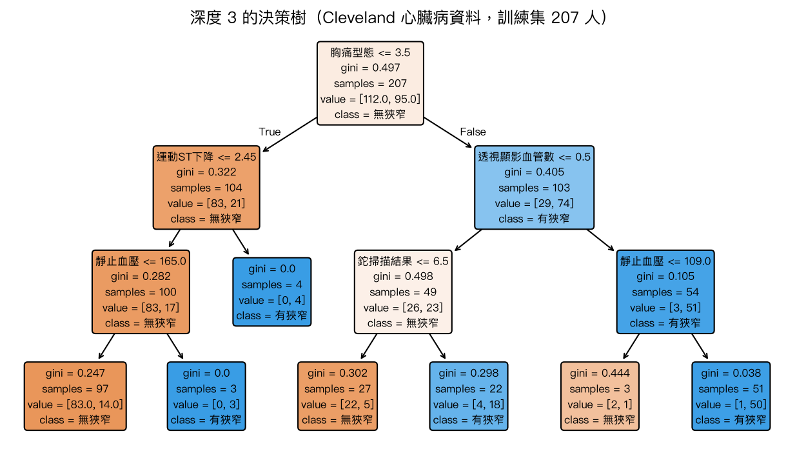
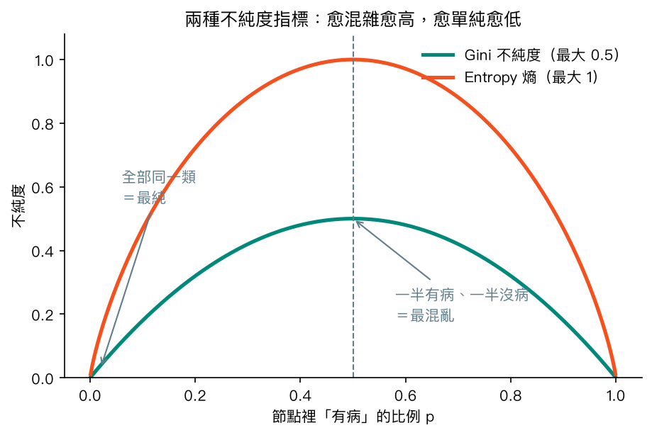
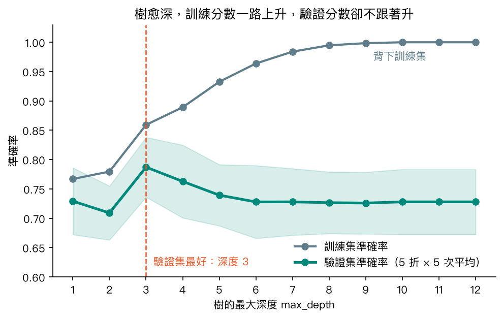
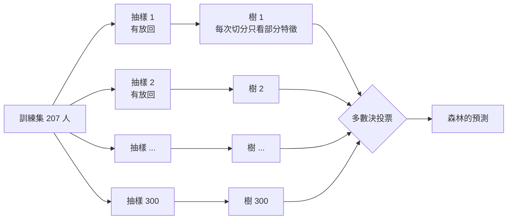
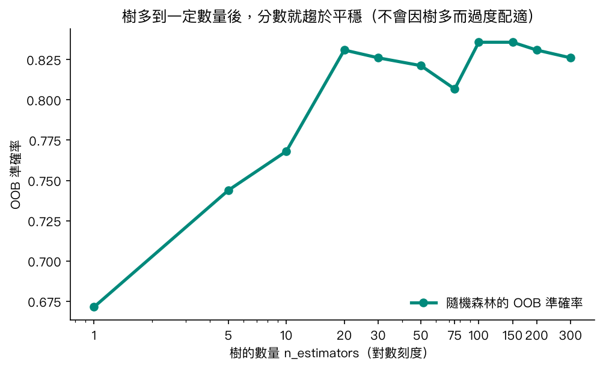
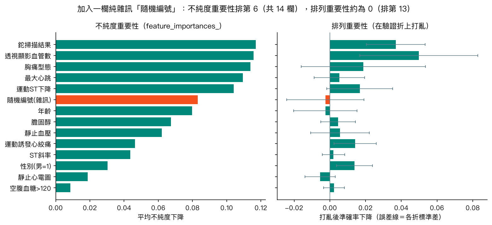

# 第 7 章　決策樹與隨機森林

<p class="chapter-meta">預計閱讀 30 分鐘 ・ 先備：第 3 章（訓練集／測試集、資料洩漏）、第 4 章（過擬合、混淆矩陣）</p>

!!! abstract "本章你會學到"
    - 把決策樹讀成一張「臨床決策流程圖」，並說出每個節點在做什麼
    - 用 Gini 不純度解釋樹怎麼挑「下一個要問的問題」
    - 觀察樹太深造成的過擬合，並用 `max_depth`、`ccp_alpha` 修剪
    - 說明隨機森林為什麼像「多位醫師會診投票」，以及袋外（OOB）分數的用途
    - 分辨兩種特徵重要性的差別，避免把「模型常用」讀成「造成疾病」

<div class="nb-links" markdown>
[:simple-googlecolab: 在 Colab 開啟](https://colab.research.google.com/github/GITHUB_REPO_PLACEHOLDER/blob/main/docs/notebooks/ch07_tree-forest.ipynb){ .md-button .md-button--primary }
[:material-download: 下載 Notebook](../notebooks/ch07_tree-forest.ipynb){ .md-button }
</div>

## 1. 直覺：從一個臨床情境開始

想像急診來了一位胸痛病人。你腦中跑的是一連串「是／否」問題：疼痛像不像壓迫感？心電圖有沒有 ST 段變化？肌鈣蛋白有沒有上升？每答一題就往流程圖某一邊走，最後停在「留觀」、「會診心臟科」或「回家追蹤」。

教科書和指引裡的臨床演算法（clinical algorithm）長這樣，**決策樹（decision tree）**也長這樣。差別只在於：臨床流程圖是專家根據經驗與研究「畫」出來的，決策樹則是電腦從一堆過去病人的資料裡「長」出來的——它自己決定先問哪個問題、閾值切在哪裡。

這個比喻可以一路延伸：

- **樹太深**＝一個學弟把每位病人的病歷號碼都背下來，考古題滿分，遇到新病人就不會。這就是第 4 章提過的過擬合（overfitting）。
- **隨機森林（random forest）**＝同一個病例請很多位醫師會診，每位只看得到部分病歷、各有各的盲點，最後多數決。個別的判斷失誤互相抵銷，整體判斷通常比任何一位單獨判斷更穩。

本章用的資料是 UCI 的 **Cleveland 心臟病資料**：Cleveland Clinic 接受 coronary angiography（冠狀動脈血管攝影）的 303 位病人（Detrano 等人 1989 年發表，1988 年捐贈給 UCI），13 個特徵包括年齡、胸痛型態、靜止血壓、運動測試的最大心跳與 ST 段下降、thallium scan（鉈心肌灌注掃描）結果等。我們要預測的是：血管攝影有沒有看到至少一條主要冠狀動脈狹窄超過 50%。

## 2. 核心概念

### 2.1 一棵樹由什麼組成

先看成品。下面這棵樹是用 207 位訓練集病人、限制最多問三層問題所長出來的：

{ loading=lazy }

讀法：

- 最上面的方框叫**根節點（root node）**，所有病人都從這裡出發。第一行是問題，例如「胸痛型態 ≤ 3.5」；答「是」往左、答「否」往右。
- 中間的方框是**內部節點（internal node）**，繼續問下一個問題。
- 最底下不再分支的方框是**葉節點（leaf node）**，就是最終預測。落在某片葉子的新病人，會被預測成那片葉子裡人數較多的那一類。
- `samples` 是走到這個節點的人數；`value = [a, b]` 是其中「無狹窄」與「有狹窄」各幾人；顏色愈深代表愈偏向某一類。

值得停下來想：根節點用「胸痛型態」，資料把 4 號編成「asymptomatic（無症狀）」，而樹分到右邊的「無症狀」這群，有狹窄的比例反而高。這不是說「沒胸痛比較危險」，較可能是轉診偏誤（referral bias）：沒症狀卻被送去做血管攝影的人，多半已有其他強烈證據（例如運動測試異常）。這是我們的推論，資料集沒有記錄轉診原因。**樹只會抓出「這群病人裡」的規律，不會分辨那是生理機轉還是選樣造成的**。

### 2.2 樹怎麼挑問題：不純度

每一個節點，樹都要從 13 個特徵、每個特徵的所有可能閾值裡，挑出「最好的一刀」。什麼叫好？切完之後，兩邊各自愈「純」愈好——最理想的情況是一邊全是有病、一邊全是沒病。

衡量「混雜程度」的指標叫**不純度（impurity）**，最常用的兩種是 **Gini 不純度**和**熵（entropy）**：

{ loading=lazy }

兩條曲線形狀很像：節點裡如果全是同一類（比例 0 或 1），不純度是 0；一半一半時最混亂，不純度最高。sklearn 預設用 Gini，實務上兩者選出的切點通常差不多。

樹的做法很「貪心」：在當下這一層找讓不純度下降最多的切點就切，不回頭考慮對之後幾層的影響；再對切出來的每一邊重複，直到碰到停止條件（到達最大深度、節點人數太少、或已經全純）。

??? note "數學補充（可跳過）"
    設節點中第 $k$ 類的比例為 $p_k$，

    $$\text{Gini} = 1 - \sum_k p_k^2, \qquad \text{Entropy} = -\sum_k p_k \log_2 p_k$$

    以上圖的根節點為例：207 人中 112 人無狹窄、95 人有狹窄，

    $$\text{Gini} = 1 - \left(\tfrac{112}{207}\right)^2 - \left(\tfrac{95}{207}\right)^2 \approx 0.497$$

    切下去之後，左邊 104 人（Gini 0.322）、右邊 103 人（Gini 0.405）。子節點的加權平均不純度為

    $$\tfrac{104}{207}\times 0.322 + \tfrac{103}{207}\times 0.405 \approx 0.363$$

    不純度下降 $0.497 - 0.363 \approx 0.134$。樹會把每個特徵、每個候選閾值都算一次這個「下降量」，挑最大的那一刀。

### 2.3 樹太深會怎樣：過擬合與剪枝

如果不限制，樹會一直切，切到每片葉子只剩一兩個病人、全部都純為止。那時訓練集準確率是 100%，但它學到的多半是個別病人的巧合，而不是可以推廣的規律。

下圖把最大深度從 1 調到 12，每個深度都用 5 折交叉驗證重複 5 次，比較訓練分數與驗證分數（色帶為驗證分數的 ±1 個標準差）：

{ loading=lazy }

訓練分數一路爬到 100%，驗證分數卻在深度 3 附近達到最高（約 0.79），之後回落到 0.73 左右。兩條線之間愈拉愈開的距離，就是過擬合的程度。

控制樹的複雜度有兩類做法：

- **事前限制（預先剪枝）**：`max_depth`（最多幾層）、`min_samples_leaf`（每片葉子至少幾人）、`min_samples_split`（節點至少幾人才准再切）。
- **事後剪枝（post-pruning）**：先讓樹長滿，再把「貢獻不夠」的分支剪掉。sklearn 用的是成本複雜度剪枝（cost-complexity pruning），由參數 `ccp_alpha` 控制，數字愈大剪得愈多。

這些參數都是**超參數（hyperparameter）**，要用交叉驗證挑，不能看測試集挑——第 11 章會系統性地介紹。

### 2.4 從一棵樹到一片森林

單棵樹有個惱人的特性：**不穩定**。訓練資料換掉幾個病人，根節點的問題可能就變了，整棵樹完全不同，也就是變異大。

**隨機森林**用兩個「隨機」來解決這件事：

1. **每棵樹看不同的病人**：從訓練集中「抽出後放回」（bootstrap 抽樣）抽出同樣多的人，所以每棵樹的訓練資料有人重複、有人沒被抽到。這一步叫 **自助聚合法（Bagging，bootstrap aggregating）**。
2. **每次切分只看部分特徵**：每個節點只從隨機挑出的幾個特徵裡找最佳切點（分類問題預設是 $\sqrt{\text{特徵數}}$ 個，本例 13 個特徵約看 3 個）。這讓樹與樹之間更不相像，投票時才真的能互相截長補短。

最後，所有樹投票，多數決就是森林的預測。



回到會診的比喻：每位醫師（每棵樹）只看過部分病人、每次只參考部分檢查，個別都會出錯，但錯的地方不太一樣。只要每位都比亂猜好一點、彼此的錯誤不太相關，多數決就比任何一位單獨判斷可靠。

### 2.5 袋外（OOB）分數：免費的驗證集

bootstrap 抽樣時，每棵樹大約有三分之一的病人沒被抽到，這些人叫做這棵樹的**袋外（out-of-bag, OOB）**樣本。對每位病人，只讓「沒看過他」的那些樹投票，就能得到一個不需要另外切驗證集的準確率估計，這就是 OOB 分數。

{ loading=lazy }

樹從 1 棵增加到 20 棵左右，OOB 準確率明顯上升；之後就在 0.81–0.84 之間小幅上下晃動。這也說明一件常被誤會的事：**樹種多一點不會造成過擬合**，只會讓結果更穩定、計算更久。

??? note "數學補充：為什麼大約三分之一"
    訓練集有 $n$ 人，有放回地抽 $n$ 次，某位病人一次都沒被抽到的機率是

    $$\left(1 - \frac{1}{n}\right)^n \xrightarrow{n\to\infty} e^{-1} \approx 0.368$$

    所以每棵樹約有 36.8% 的病人是袋外樣本。

### 2.6 單棵樹 vs 隨機森林

| | 單棵決策樹 | 隨機森林 |
|---|---|---|
| 可解釋性 | 高，整棵樹畫得出來、能逐條講規則 | 低，幾百棵樹無法逐一閱讀 |
| 穩定性 | 低，資料小變動、樹就大變 | 高，投票平均掉個別樹的變異 |
| 過擬合 | 容易，需要限制深度或剪枝 | 較不易，但單棵樹仍是長滿的 |
| 需要標準化 | 不需要（只比大小、切閾值） | 不需要 |
| 內建驗證 | 無 | OOB 分數 |
| 典型用途 | 需要向人說明規則、教學、初步探索 | 表格資料的強力基準模型 |

兩者共同的限制：只能在訓練資料看過的範圍內切，**不會外推**；類別極不平衡時，會偏向多數類（第 11 章會處理）。

## 3. 動手做

以下程式碼都在 notebook 裡，可以直接在 Colab 執行。

先從 UCI 讀入原始檔。檔案沒有表頭、遺漏值寫成 `?`；如果網路下載失敗，程式會改用 `ucimlrepo` 套件：

```python
URL = "https://archive.ics.uci.edu/ml/machine-learning-databases/heart-disease/processed.cleveland.data"
cols = ["age", "sex", "cp", "trestbps", "chol", "fbs", "restecg", "thalach",
        "exang", "oldpeak", "slope", "ca", "thal", "num"]
try:
    df = pd.read_csv(URL, names=cols, na_values="?")
except Exception as e:
    print("直接下載失敗，改用 ucimlrepo：", e)
    try:
        from ucimlrepo import fetch_ucirepo
    except ImportError:
        raise ImportError("請先執行 %pip install -q ucimlrepo 再重跑這格") from e
    r = fetch_ucirepo(id=45)
    df = r.data.features.join(r.data.targets)

print(df.shape)
print("遺漏值：", df.isna().sum()[df.isna().sum() > 0].to_dict())
df.head()
```

輸出顯示 303 列、14 欄，只有 `ca` 4 格、`thal` 2 格遺漏。接著刪掉這 6 列，並把 0–4 級的 `num` 轉成二元目標：

```python
df = df.dropna().reset_index(drop=True)
y = (df["num"] > 0).astype(int)
X = df.drop(columns="num")
print(X.shape, "有狹窄的比例：", round(y.mean(), 3))
```

剩下 297 人，有狹窄的比例約 46%，兩類大致平衡。然後切出 30% 當測試集，`stratify=y` 讓兩邊的有病比例一致：

```python
X_train, X_test, y_train, y_test = train_test_split(
    X, y, test_size=0.3, stratify=y, random_state=42)
print(X_train.shape, X_test.shape)
```

訓練集 207 人、測試集 90 人。注意這裡**沒有做標準化**——決策樹只比較「大於或小於某個閾值」，特徵的單位與尺度不影響結果。

訓練一棵最多三層的樹：

```python
tree3 = DecisionTreeClassifier(max_depth=3, random_state=42)
tree3.fit(X_train, y_train)
print("訓練集準確率：", round(tree3.score(X_train, y_train), 3))
print("測試集準確率：", round(tree3.score(X_test, y_test), 3))
```

訓練集 0.879、測試集 0.733。用 `plot_tree` 畫出來就是第 2.1 節那張圖（notebook 版的標籤是英文）：

```python
fig, ax = plt.subplots(figsize=(14, 7))
plot_tree(tree3, feature_names=list(X.columns), class_names=["no disease", "disease"],
          filled=True, rounded=True, fontsize=9, ax=ax)
plt.show()
```

`filled=True` 讓節點依多數類上色；`export_text(tree3, ...)` 可把同一棵樹印成文字規則。

接下來「故意做錯」：比較深度 1 到 12 的訓練分數與交叉驗證分數。

```python
depths = range(1, 13)
cv_rep = RepeatedStratifiedKFold(n_splits=5, n_repeats=5, random_state=42)
train_acc, val_acc = [], []
for d in depths:
    res = cross_validate(DecisionTreeClassifier(max_depth=d, random_state=42), X, y,
                         cv=cv_rep, return_train_score=True)
    train_acc.append(res["train_score"].mean())
    val_acc.append(res["test_score"].mean())

plt.plot(depths, train_acc, "o-", label="train")
plt.plot(depths, val_acc, "o-", label="validation (CV)")
plt.xlabel("max_depth"); plt.ylabel("accuracy"); plt.legend(); plt.show()
print("驗證分數最高的深度：", list(depths)[int(np.argmax(val_acc))])
```

結果就是第 2.3 節的曲線，驗證分數最高的深度是 3。換成事後剪枝，讓交叉驗證替我們挑 `ccp_alpha`：

```python
path = DecisionTreeClassifier(random_state=42).cost_complexity_pruning_path(X_train, y_train)
alphas = path.ccp_alphas[:-1]          # 最後一個 alpha 會剪到只剩根節點，排除
cv5 = StratifiedKFold(n_splits=5, shuffle=True, random_state=42)
scores = [cross_val_score(DecisionTreeClassifier(ccp_alpha=a, random_state=42),
                          X_train, y_train, cv=cv5).mean() for a in alphas]
best_alpha = alphas[int(np.argmax(scores))]
pruned = DecisionTreeClassifier(ccp_alpha=best_alpha, random_state=42).fit(X_train, y_train)
print("最佳 ccp_alpha =", round(best_alpha, 4))
print("剪枝後葉子數：", pruned.get_n_leaves(), "（不剪：",
      DecisionTreeClassifier(random_state=42).fit(X_train, y_train).get_n_leaves(), "）")
print("剪枝後測試集準確率：", round(pruned.score(X_test, y_test), 3))
```

剪枝把葉子從 32 片減到 11 片，測試集準確率 0.744。挑 alpha 只用訓練集的交叉驗證，測試集最後才碰。

換隨機森林上場，順便開啟 OOB 分數，並用混淆矩陣算出醫學生熟悉的敏感度與特異度：

```python
rf = RandomForestClassifier(n_estimators=300, oob_score=True, random_state=42, n_jobs=-1)
rf.fit(X_train, y_train)
print("訓練集準確率：", round(rf.score(X_train, y_train), 3))
print("OOB 準確率：  ", round(rf.oob_score_, 3))
print("測試集準確率：", round(rf.score(X_test, y_test), 3))

tn, fp, fn, tp = confusion_matrix(y_test, rf.predict(X_test)).ravel()
print(f"測試集敏感度 = {tp / (tp + fn):.3f}，特異度 = {tn / (tn + fp):.3f}")
```

訓練集準確率 1.0（每棵樹都長滿，沒有參考價值）、OOB 0.826、測試集 0.833；敏感度 0.762、特異度 0.896。OOB 和測試集分數接近，可見 OOB 是合理的內建估計。

測試集只有 90 人，單次切分的分數會隨運氣晃動。比較模型時，改用同一組 5 折交叉驗證：

```python
models = {
    "tree (no limit)": DecisionTreeClassifier(random_state=42),
    "tree (depth 3)": DecisionTreeClassifier(max_depth=3, random_state=42),
    "random forest": RandomForestClassifier(n_estimators=300, random_state=42, n_jobs=-1),
}
for name, m in models.items():
    s = cross_val_score(m, X, y, cv=cv5)
    print(f"{name:16s} 平均準確率 {s.mean():.3f}（各折標準差 {s.std():.3f}）")
```

平均準確率：不限深度的樹 0.721、深度 3 的樹 0.788、隨機森林 0.815。森林平均最高，但各折標準差約 0.05，深度 3 的樹與森林的差距落在晃動範圍內；以 297 人的資料，不足以斷言森林「確定比較好」。

## 4. 醫學案例

!!! info "僅供學習"
    本節使用公開資料集做教學示範，本例僅供學習，不構成臨床建議。資料來源：UCI Heart Disease（Cleveland 子集，Detrano et al., 1989）與 UCI Heart Failure Clinical Records（Chicco & Jurman, 2020），兩者授權皆為 CC BY 4.0。

### 4.1 特徵重要性：模型「常用」不等於臨床「重要」

隨機森林有個很誘人的輸出：`feature_importances_`，看起來像是在告訴你「哪個危險因子最重要」。它的計算方式（sklearn 稱為 mean decrease in impurity，**不純度重要性**）是：把某個特徵在所有樹、所有節點帶來的不純度下降加總平均。

問題是，它有一個已知的偏差：**可切點愈多的特徵（連續變數、類別很多的變數）愈容易拿到高分**，即使它和結果毫無關係（Strobl et al., 2007）。另一種做法叫**排列重要性（permutation importance）**：在模型沒看過的資料上，把某一欄的值隨機打亂，看預測準確率掉多少。掉得多，代表模型真的依賴這欄資訊。

我們來做個實驗：加一欄**純雜訊**「隨機編號」（0–999 的隨機整數），用 5 折交叉驗證，每一折都在沒參與訓練的那一折上計算排列重要性：

```python
rng = np.random.default_rng(42)
X_noise = X.copy()
X_noise["random_id"] = rng.integers(0, 1000, len(X_noise))

imps, perms = [], []
for tr, te in cv5.split(X_noise, y):
    m = RandomForestClassifier(n_estimators=300, random_state=42, n_jobs=-1)
    m.fit(X_noise.iloc[tr], y.iloc[tr])
    imps.append(m.feature_importances_)
    pi = permutation_importance(m, X_noise.iloc[te], y.iloc[te], n_repeats=10,
                                random_state=42, n_jobs=-1)
    perms.append(pi.importances_mean)

imp_table = pd.DataFrame({"impurity": np.mean(imps, axis=0),
                          "permutation": np.mean(perms, axis=0)}, index=X_noise.columns)
imp_table["rank_impurity"] = imp_table["impurity"].rank(ascending=False).astype(int)
imp_table["rank_permutation"] = imp_table["permutation"].rank(ascending=False).astype(int)
imp_table.sort_values("impurity", ascending=False).round(3)
```

輸出表格把兩種重要性與排名並列，畫成圖就是：

{ loading=lazy }

完全沒意義的隨機編號，在不純度重要性排第 6 名（14 欄中），贏過年齡、膽固醇與血壓；在排列重要性則約等於 0，排倒數第二。只看左圖，可能會寫出「隨機編號是冠心病第六大預測因子」這種荒謬結論。

排列重要性也不是萬靈丹，右圖有幾點要一起讀：

- **誤差線很寬**。297 人切 5 折，每折只有約 60 人，打亂一欄造成的準確率變化本來就很晃。
- **年齡的排列重要性也接近 0**，但這不代表年齡與冠心病無關。可能是年齡的資訊已被相關特徵（例如最大心跳，年長者通常較低）涵蓋，打亂年齡時模型能靠別的特徵補回來。
- 兩種重要性都只回答「**這個模型**做預測時依賴了什麼」，都不能回答「改變這個因子會不會改變疾病風險」。那是因果推論的問題，需要研究設計，不是特徵重要性能給的。

### 4.2 心衰竭資料的 `time`：看起來很準，其實是作弊

第二條臨床線是 UCI 的 Heart Failure Clinical Records：299 位 heart failure（心衰竭）病人，預測追蹤期間是否死亡。這份資料有一欄 `time`，是**追蹤天數**。死亡的病人追蹤自然就停在死亡那天，所以追蹤天數短本身就大量洩漏了答案。

```python
HF_URL = ("https://archive.ics.uci.edu/ml/machine-learning-databases/00519/"
          "heart_failure_clinical_records_dataset.csv")
try:
    hf = pd.read_csv(HF_URL)
except Exception as e:
    raise RuntimeError("下載心衰竭資料失敗，請確認網路；或改用 ucimlrepo 的 fetch_ucirepo(id=519)") from e

y_hf = hf["DEATH_EVENT"]
for label, drop_cols in [("with time (leak)", ["DEATH_EVENT"]),
                         ("without time", ["DEATH_EVENT", "time"])]:
    X_hf = hf.drop(columns=drop_cols)
    auc = cross_val_score(RandomForestClassifier(n_estimators=300, random_state=42, n_jobs=-1),
                          X_hf, y_hf, cv=cv5, scoring="roc_auc")
    print(f"{label:17s} 5 折平均 AUC = {auc.mean():.3f}")
```

放進 `time` 時，5 折平均 AUC 是 0.904；拿掉之後是 0.775。那 0.13 的差距不是模型變聰明，而是偷看了未來。判斷準則：**在真正要做預測的時間點，這個資訊拿得到嗎？**入院當下不可能知道之後會追蹤幾天。這種「結果發生後才產生的變數」在電子病歷研究很常見，例如住院天數、出院診斷、後續才開的藥。

### 4.3 這些數字能拿去臨床用嗎？

不能直接用。本章的隨機森林在 Cleveland 資料上的交叉驗證準確率約 0.8，看起來不錯，但請同時記得：

- 只有 297 人，來自 1980 年代**單一醫學中心**，且全是被轉介做血管攝影的病人，不代表一般門診族群；
- 所有評估都在同一份資料內切分（內部驗證），**沒有外部驗證**；換醫院、換年代，表現可能明顯下降。

模型要走進臨床，至少需要外部驗證、校準評估與臨床效益的研究，第 11 章會再談。

## 5. 互動體驗

拖動滑桿改變樹的最大深度。背景顏色是模型的預測（橘色偏向有狹窄、綠色偏向無狹窄），圓點是訓練集、叉叉是測試集。為了能畫在平面上，這個示範只用兩個特徵：運動時最大心跳與運動 ST 段下降。

<div class="demo-box">
  <div id="ch07-demo"></div>
  <div class="controls">
    <label for="ch07-depth">最大深度：<b id="ch07-depth-val">3</b></label>
    <input type="range" id="ch07-depth" min="1" max="12" step="1" value="3">
    <span id="ch07-info"></span>
  </div>
</div>

試著觀察：深度 1–3 時邊界是幾個大方塊；拉到 8 以上，邊界為了個別訓練點畫出小碎塊，訓練集準確率超過九成，測試集卻掉到六成左右。只用兩個特徵、測試集只有 90 人，數字會晃，重點是看趨勢。

想看更精緻的視覺化，推薦 Amazon MLU-Explain 的兩篇互動文章（CC BY-SA 4.0，請到原站閱讀）：

- [Decision Trees](https://mlu-explain.github.io/decision-tree/) — 一步步看樹怎麼挑切點、熵怎麼下降
- [Random Forest](https://mlu-explain.github.io/random-forest/) — 用動畫解釋 bagging 與多數決

## 6. 常見陷阱

!!! warning "陷阱 1：樹愈深愈準"
    深度增加只保證訓練分數上升。本章資料中，驗證分數在深度 3 左右就到頂，不限深度的樹交叉驗證只有 0.72。一律用交叉驗證挑 `max_depth`、`min_samples_leaf` 或 `ccp_alpha`，不要看訓練分數，也不要用測試集挑。

!!! warning "陷阱 2：把特徵重要性當成危險因子排名"
    `feature_importances_` 偏好可切點多的特徵，純雜訊都能排到中段；排列重要性比較可靠，但一樣只描述「模型依賴什麼」。兩者都**不是因果證據**，也不能取代多變項迴歸或研究設計去回答「某因子是否獨立相關」。寫報告時用「模型較常使用」「對預測貢獻較大」，不要寫「是主要致病因子」。

!!! warning "陷阱 3：隨機森林的訓練集準確率 100%"
    森林裡每棵樹預設長滿，訓練集幾乎一定 100%，這個數字沒有意義。要看 OOB 分數、交叉驗證或獨立測試集。

!!! warning "陷阱 4：放進「結果之後才知道」的變數"
    心衰竭資料的 `time` 讓 AUC 從 0.78 虛胖到 0.90。建模前逐欄確認：預測當下拿得到這個資訊嗎？樹模型特別會抓住這種強烈訊號，而且把它排到重要性第一名，讓人誤以為找到了重大發現。

## 7. 小測驗

??? question "Q1. 一棵決策樹某節點有 50 人，其中 25 人有病、25 人沒病。這個節點的 Gini 不純度是多少？如果全部 50 人都有病呢？"
    **答案：** 分別是 0.5 與 0。一半一半是二元分類最混亂的狀態（$1 - 0.5^2 - 0.5^2 = 0.5$）；全部同一類時完全純，不純度為 0。

??? question "Q2. 為什麼隨機森林在每次切分時只讓樹看「部分特徵」，而不是全部？"
    **答案：** 為了讓樹與樹彼此不同。如果每棵樹都能看全部特徵，強特徵（例如本例的鉈掃描結果）會在每棵樹的上層反覆出現，樹長得很像、錯誤也很相關，投票就沒辦法互相抵銷；限制特徵讓各棵樹「各有專長」，多數決才有效。

??? question "Q3. 同事的隨機森林模型把「住院天數」排在特徵重要性第一名，他想在論文寫「住院天數是院內死亡最重要的預測因子」。你會提醒他什麼？"
    **答案：** 至少兩點。第一，住院天數是住院結束才知道的資訊，如果目的是入院時預測死亡，這是資料洩漏，應該拿掉重做；第二，不純度重要性偏好連續、可切點多的變數，且重要性只代表模型依賴程度，不能寫成因果或臨床重要性。

## 8. 重點整理

- 決策樹用一連串「特徵 ≤ 閾值？」把病人分群，像臨床流程圖；不需標準化、能處理非線性，但不會外推。
- 每個節點挑「不純度下降最多」的切點；Gini 與熵效果相近。
- 樹太深會過擬合；用 `max_depth`、`min_samples_leaf` 或 `ccp_alpha` 控制，以交叉驗證挑選。
- 隨機森林＝bootstrap 抽樣＋隨機挑特徵＋多數決；比單棵樹穩定，但難以逐條解讀。
- OOB 分數是免費的內部驗證；樹多不會造成過擬合。
- 不純度重要性偏好可切點多的特徵，排列重要性較可靠；兩者都不是因果。
- 小型、單一中心、只有內部驗證的準確率，不等於臨床表現。

## 延伸閱讀

- [scikit-learn User Guide：Decision Trees](https://scikit-learn.org/stable/modules/tree.html) — 官方說明，含優缺點清單與剪枝範例
- [scikit-learn User Guide：Forests of randomized trees](https://scikit-learn.org/stable/modules/ensemble.html#forest) — 隨機森林與 OOB 的官方說明
- [scikit-learn User Guide：Permutation feature importance](https://scikit-learn.org/stable/modules/permutation_importance.html) — 為什麼不純度重要性會誤導，附官方範例
- [Strobl C, et al. Bias in random forest variable importance measures. BMC Bioinformatics 2007;8:25](https://doi.org/10.1186/1471-2105-8-25) — 不純度重要性偏差的經典論文
- [Breiman L. Random Forests. Machine Learning 2001;45:5–32](https://doi.org/10.1023/A:1010933404324) — 隨機森林的原始論文
- [MLU-Explain：Decision Trees](https://mlu-explain.github.io/decision-tree/)、[Random Forest](https://mlu-explain.github.io/random-forest/) — 互動式圖解（CC BY-SA 4.0）
- [VanderPlas, Python Data Science Handbook：In-Depth: Decision Trees and Random Forests](https://jakevdp.github.io/PythonDataScienceHandbook/05.08-random-forests.html) — 另一個角度的入門講解（英文）
- [UCI Heart Disease 資料集](https://archive.ics.uci.edu/dataset/45/heart+disease)、[UCI Heart Failure Clinical Records](https://archive.ics.uci.edu/dataset/519/heart+failure+clinical+records) — 本章資料來源與欄位說明

<script src="../../assets/js/demos/ch07-depth.js"></script>
