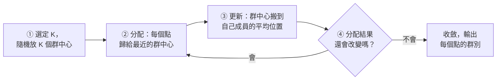
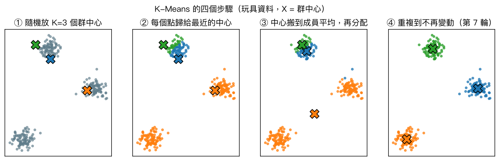
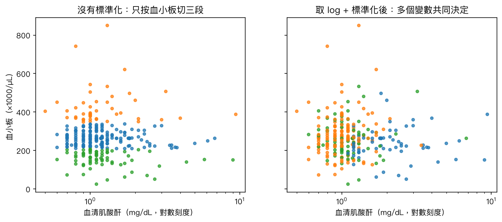
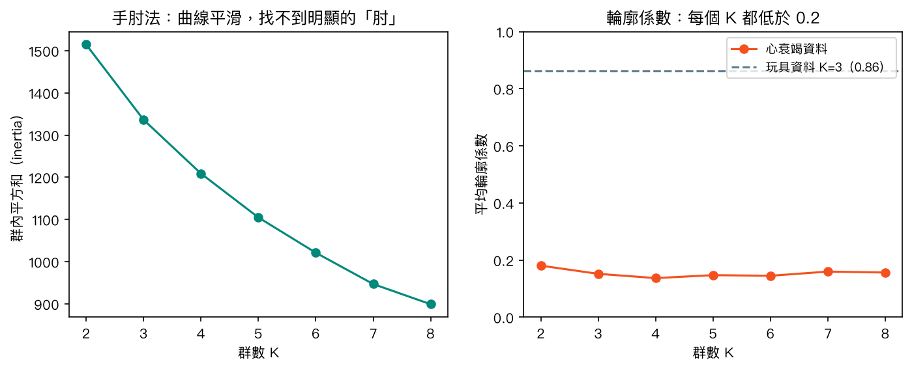
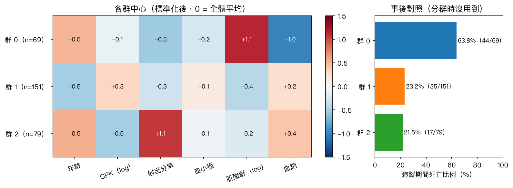
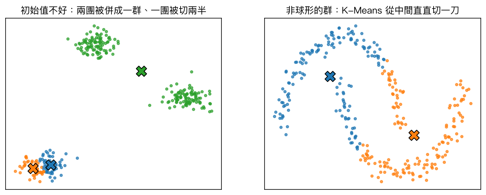

# 第 8 章　K-平均分群（K-Means Clustering）

<p class="chapter-meta">預計閱讀 30 分鐘 ・ 先備：第 2 章（Pandas、Matplotlib）、第 3 章（標準化）</p>

!!! abstract "本章你會學到"
    - 分辨監督式學習與非監督式學習（unsupervised learning），說出「沒有答案也能找結構」是什麼意思
    - 用「分配、更新、重複」的步驟理解 K-Means，並用 scikit-learn 實作
    - 解釋為什麼分群前一定要標準化，以及偏態變數、離群值會怎麼干擾結果
    - 用手肘法與輪廓係數挑選 K，並誠實判讀「這份資料其實沒有明顯分群」的訊號
    - 把分群結果和臨床結果做事後對照，並說明為什麼「分群不等於診斷」

<div class="nb-links" markdown>
[:simple-googlecolab: 在 Colab 開啟](https://colab.research.google.com/github/GITHUB_REPO_PLACEHOLDER/blob/main/docs/notebooks/ch08_kmeans.ipynb){ .md-button .md-button--primary }
[:material-download: 下載 Notebook](../notebooks/ch08_kmeans.ipynb){ .md-button }
</div>

## 1. 直覺：從一個臨床情境開始

想像你在心臟內科病房見習，手上有 299 位 heart failure（心衰竭）病人的抽血與超音波結果：年齡、ejection fraction（射出分率）、serum creatinine（血清肌酸酐）、serum sodium（血鈉）……主治醫師問你：「這群病人看起來是一整群，還是其實可以分成幾種不太一樣的人？」

前面幾章做的都是**監督式學習（supervised learning）**：每筆資料都附了答案（良性或惡性、死亡或存活），模型的任務是學會從特徵猜出答案。這一章的問題不一樣——**我們手上沒有答案欄位**，或者說，我們刻意先不看答案，只想知道「哪些病人彼此比較像」。這就是**非監督式學習**，而**分群（clustering）**是其中最常見的一種任務。

分群在醫學研究並不陌生。例如 2018 年一篇瑞典研究用 K-Means 與階層式分群，依 6 個變數把新診斷的成人糖尿病病人分成 5 群，並在另外三個世代重現；2015 年也有研究用階層式分群與模型式分群，把 HFpEF（heart failure with preserved ejection fraction，射出分率保留型心衰竭）病人分成 3 個表型群。這類研究的共同出發點是：傳統診斷分類可能把異質性很高的病人放在同一格裡，資料驅動的分群也許能幫忙找出更細的亞群。

K-平均分群（K-Means clustering）是最直覺的分群演算法。你可以把它想成**分配病房**：

- 醫院有 K 間病房，每間病房有一位「代表病人」（群中心，centroid）。
- 每位病人被送到跟自己**最像**的代表所在的病房。
- 人都分好之後，每間病房重新選代表：把房內所有病人的數值取平均，當成新的代表。
- 代表換了，有些病人可能覺得隔壁病房的代表更像自己，於是換房。
- 一直重複，直到沒有人要換房為止。

整個過程完全沒有用到「誰最後死亡」這種答案，只用了病人之間的**相似程度**。

## 2. 核心概念

### 2.1 四個步驟



下圖用一份「答案很明顯」的玩具資料示範：300 個點其實來自 3 團，但演算法不知道。

{ loading=lazy }

第一次隨機放下的中心有兩個擠在同一團，所以一開始的分配很糟（左下那團整個被劃給橘色）。但每一輪「分配、更新」之後，中心會慢慢挪到合理的位置，到第 7 輪分配不再改變，三群各 100 點，剛好找回原本的三團。

### 2.2 「像不像」怎麼算：距離

K-Means 判斷「最近」用的是**歐氏距離（Euclidean distance）**，也就是國中學過的兩點距離公式推廣到多個變數。這帶來一個很實際的後果：**數字大的變數會主導距離**。

以本章的資料為例，platelets（血小板）以每微升幾十萬計，而血清肌酸酐大多在 1 mg/dL 上下。兩位病人血小板差 5 萬，在距離裡的份量遠遠超過肌酸酐差 3 倍。不處理的話，演算法其實只是在按血小板排序切段。所以分群前一定要**標準化（standardization）**：把每個變數減去平均、除以標準差，讓大家都變成「平均 0、標準差 1」，站在同一個起跑點（第 3 章介紹過 `StandardScaler`）。

### 2.3 K-Means 在最佳化什麼

K-Means 想讓**群內平方和（within-cluster sum of squares，WCSS）**越小越好：每個點到自己群中心的距離平方加總起來。scikit-learn 把這個值叫 `inertia_`。「分配」和「更新」這兩步都只會讓它變小或不變，所以演算法一定會停下來。

??? note "數學補充（可跳過）"
    給定 $n$ 個資料點 $x_1, \dots, x_n$ 與群數 $K$，K-Means 要找群別 $C_1,\dots,C_K$ 與群中心 $\mu_1,\dots,\mu_K$，使

    $$
    \text{WCSS} = \sum_{k=1}^{K} \sum_{x_i \in C_k} \lVert x_i - \mu_k \rVert^2
    $$

    最小。固定群中心時，把每個點分給最近的中心可讓 WCSS 最小（分配步驟）；固定群別時，令 $\mu_k = \frac{1}{|C_k|}\sum_{x_i \in C_k} x_i$（平均）可讓 WCSS 最小（更新步驟）。兩步交替，WCSS 單調不增，因此會收斂；但只保證收斂到**局部最佳解（local optimum）**，不保證是全域最小。

### 2.4 初始值與 `n_init`

因為起點是隨機的，K-Means 可能卡在不好的局部最佳解。常見的兩個對策：

1. **k-means++ 初始化**：挑初始中心時刻意讓它們彼此分散，scikit-learn 預設就用這個。
2. **多跑幾次取最好**：`n_init=10` 代表用 10 組不同初始值各跑一次，留下 WCSS 最小的那次。

!!! tip "版本差異"
    scikit-learn 1.4 之後 `n_init` 的預設是 `"auto"`，搭配 k-means++ 時實際上**只跑 1 次**。本章一律明寫 `n_init=10`，並固定 `random_state=42` 讓結果可重現。

### 2.5 要分幾群：手肘法與輪廓係數

K 必須由你事先決定。兩個常用的參考工具：

| 工具 | 怎麼做 | 怎麼看 |
|---|---|---|
| 手肘法（elbow method） | 試不同 K，畫出 WCSS | WCSS 必然隨 K 增加而下降；找「下降突然變緩」的轉折點 |
| 輪廓係數（silhouette coefficient） | 每個點比較「跟自己群的平均距離」與「跟最近的別群的平均距離」 | 介於 −1 到 1；接近 1 = 群內緊密、群間分明；接近 0 = 群與群之間重疊 |

用病房比喻：K 太小，不同病況的人被塞在同一間；K 太大，每人一間，分了等於沒分。這兩個工具只提供參考，最後的 K 還要看臨床上能不能解讀、在別的資料上能不能重現。

## 3. 動手做

以下程式碼與 [Notebook](../notebooks/ch08_kmeans.ipynb) 一致，建議直接在 Colab 邊看邊跑。

### 3.1 徒手寫出兩個核心函式

K-Means 的核心只有兩個函式：分配（找最近的中心）與更新（算平均）。

```python
def assign(X, centers):
    # distance from every point to every center: shape (n_points, k)
    d = np.linalg.norm(X[:, None, :] - centers[None, :, :], axis=2)
    return d.argmin(axis=1)

def update(X, labels, k):
    return np.array([X[labels == j].mean(axis=0) for j in range(k)])
```

在 notebook 裡把這兩個函式放進迴圈反覆執行，會印出每一輪群中心移動的距離；移動距離變成 0 時就是收斂。

### 3.2 載入心衰竭資料

資料是 UCI Machine Learning Repository 的 Heart Failure Clinical Records（ID 519，CC BY 4.0）：299 位心衰竭住院病人，2015 年收案於巴基斯坦 Faisalabad 的 Institute of Cardiology 與 Allied Hospital。先試 CSV 直連，失敗再改用 `ucimlrepo`。

```python
URL = ("https://archive.ics.uci.edu/ml/machine-learning-databases/00519/"
       "heart_failure_clinical_records_dataset.csv")
try:
    df = pd.read_csv(URL)
except Exception as e:
    print("Direct CSV download failed:", e)
    try:
        from ucimlrepo import fetch_ucirepo
        r = fetch_ucirepo(id=519)
        df = r.data.features.join(r.data.targets)
    except Exception as e2:
        raise RuntimeError(
            "Cannot download the Heart Failure dataset. Check the internet connection, "
            "or run `%pip install ucimlrepo` and retry."
        ) from e2
df.columns = df.columns.str.lower()
print(df.shape)
```

輸出 `(299, 13)`：12 個特徵加上 `death_event`（追蹤期間是否死亡）。

我們只拿 6 個**連續變數**分群：年齡、creatinine phosphokinase（CPK，肌酸磷酸激酶）、射出分率、血小板、血清肌酸酐、血鈉。二元變數（貧血、糖尿病、性別等）只有 0 和 1，用歐氏距離衡量「像不像」意義不大，本章先不放；`time`（追蹤天數）和結果綁在一起，也不放。`death_event` 則**刻意藏起來**，最後才拿出來對照。

### 3.3 故意做錯：不標準化

先看不標準化會發生什麼事。

```python
cols = ["age", "creatinine_phosphokinase", "ejection_fraction",
        "platelets", "serum_creatinine", "serum_sodium"]
km_raw = KMeans(n_clusters=3, n_init=10, random_state=42).fit(df[cols])
print(df.assign(cluster=km_raw.labels_).groupby("cluster")["platelets"]
        .agg(["size", "min", "max"]))
```

三群的血小板範圍分別是 210,000–338,000（184 人）、348,000–850,000（45 人）、25,100–208,000（70 人），**完全不重疊**。換句話說，演算法只是按血小板把病人切成中、高、低三段，其他五個變數幾乎沒發言權。

{ loading=lazy }

### 3.4 正確做法：偏態變數取對數，再標準化

CPK 與肌酸酐右偏很嚴重（CPK 中位數 250，最大值 7,861）。極端值會把群中心拉走，所以先取對數壓縮長尾，再標準化。

```python
X = df[cols].copy()
X["creatinine_phosphokinase"] = np.log(X["creatinine_phosphokinase"])
X["serum_creatinine"] = np.log(X["serum_creatinine"])
X_scaled = StandardScaler().fit_transform(X)
```

執行後每一欄的平均都是 0、標準差都是 1。

### 3.5 選 K

K 從 2 試到 8，記錄 WCSS 與輪廓係數。

```python
ks = range(2, 9)
inertias, sils = [], []
for k in ks:
    km = KMeans(n_clusters=k, n_init=10, random_state=42).fit(X_scaled)
    inertias.append(km.inertia_)
    sils.append(silhouette_score(X_scaled, km.labels_))
```

{ loading=lazy }

這張圖要誠實地讀：手肘曲線一路平滑下降，找不到明顯的肘；輪廓係數在 K=2 最高（0.181），其餘 K 落在 0.137 到 0.160 之間，**全部低於 0.2**。對照玩具資料的 0.863，意思很清楚——**這 299 位病人並沒有涇渭分明的天然分群**，比較像一片連續分布。真實臨床資料常常就是這樣。

K-Means 仍然會乖乖交出你要的群數，但這時的群比較像「把連續光譜切成幾段」，而不是發現了幾種不同的病。為了示範多一點亞群的樣貌，下面用 K=3；這是一個**需要寫明理由的主觀選擇**，K=2 留在 notebook 當練習。

### 3.6 分群與各群輪廓

```python
km = KMeans(n_clusters=3, n_init=10, random_state=42).fit(X_scaled)
df["cluster"] = km.labels_
profile = df.groupby("cluster")[cols].median().round(2)
```

三群人數分別是 69、151、79。用**原始單位的中位數**描述比較好讀：

| 群 | 人數 | 年齡 | CPK（mcg/L） | 射出分率（%） | 血清肌酸酐（mg/dL） | 血鈉（mEq/L） |
|---|---|---|---|---|---|---|
| 群 0 | 69 | 65 | 246 | 30 | 1.83 | 134 |
| 群 1 | 151 | 53 | 478 | 35 | 1.00 | 138 |
| 群 2 | 79 | 65 | 129 | 50 | 1.10 | 138 |

群 0 的肌酸酐較高、血鈉較低、射出分率較低；群 1 相對年輕、CPK 較高；群 2 的射出分率最高、CPK 最低。三群的血小板中位數相近，血小板在這次分群裡的影響很小。

## 4. 醫學案例：分群之後，才打開答案

!!! info "僅供學習"
    本例使用公開教學資料集（UCI Heart Failure Clinical Records，CC BY 4.0；原始研究 Ahmad 等，PLoS One 2017），僅供學習機器學習方法，不構成臨床建議。

分群時完全沒用到 `death_event`。現在才把它拿出來，看各群在追蹤期間的死亡比例：

```python
outcome = df.groupby("cluster")["death_event"].agg(n="size", deaths="sum", death_rate="mean")
```

{ loading=lazy }

| 群 | 人數 | 死亡人數 | 死亡比例 |
|---|---|---|---|
| 群 0 | 69 | 44 | 63.8% |
| 群 1 | 151 | 35 | 23.2% |
| 群 2 | 79 | 17 | 21.5% |

全體的死亡比例是 32.1%（96/299）。群 0 的死亡比例高於另外兩群，群 1 與群 2 則相近。這個「無監督分群 → 事後對照結果」的流程很常見，但判讀時要非常小心：

1. **這是描述性比較，不是因果。** 群 0 是依較高的肌酸酐、較低的血鈉與射出分率劃出來的，而這些指標本身就和心衰竭預後相關。死亡比例較高是可以預期的，不代表「屬於群 0」本身造成死亡，也不代表分群找到了新的機轉。我們也沒有做任何統計檢定，這裡只是描述。
2. **群不一定真實存在。** 前面的輪廓係數已經告訴我們，這份資料沒有清楚的群界。換一個 K、換一組變數、換一個前處理方式，群的樣貌都會改變。
3. **穩定性有限。** 在 notebook 裡換 10 個亂數種子重跑：只用 1 組初始值（`n_init=1`）時，和第一次結果的調整蘭德指數（adjusted Rand index，ARI；1 代表完全相同）中位數只有 0.47，最低 0.22；改用 `n_init=10` 後中位數升到 0.94，但最低仍只有 0.46。結構不明顯的資料上，分群結果本來就容易搖擺。
4. **樣本小、單一來源、沒有外部驗證。** 299 人、單一城市的兩家醫院、單一時期。前面提到的糖尿病分群研究之所以受到重視，一個關鍵是它在另外三個獨立世代重現了類似的群；我們這裡完全沒有做到這一步。

所以比較恰當的結論是：「在這份資料中，K-Means 分出的其中一群肌酸酐較高、血鈉較低，追蹤期間的死亡比例也較高。」而不是「我們發現了一種高死亡率的心衰竭亞型」。**分群是提出假說的工具，不是診斷。**

## 5. 互動體驗

按「下一步」一步一步看 K-Means 怎麼跑：先隨機放中心，接著每個點連線到最近的中心（分配），再看中心搬到成員的平均位置（更新）。可以試試：

- 在「分明的團塊」上按幾次「重新放中心」，看看有沒有卡在不好結果的時候。
- 切到「均勻散布」：這份資料根本沒有群，K-Means 還是會照樣分出 K 群。
- 切到「兩個半月」：K-Means 會怎麼切？
- 點畫布新增離群點，看群中心被拉走多少。

<div class="demo-box"><div id="ch08-demo"></div><div class="controls"></div></div>

想看更多初始化方式與資料形狀，可以玩 Naftali Harris 的 [Visualizing K-Means Clustering](https://www.naftaliharris.com/blog/visualizing-k-means-clustering/)（外部網站）。

## 6. 常見陷阱

!!! warning "陷阱 1：忘記標準化"
    K-Means 用距離判斷相似度，單位大的變數會主導一切。本章的心衰竭資料若不標準化，三群只是按血小板切成三段。量級差很多的醫學資料（血小板、白血球、肌酸酐混在一起）分群前一定要先標準化；嚴重右偏的變數也可先取對數。

!!! warning "陷阱 2：以為 K-Means 會告訴你「有幾群」"
    K 是你事先指定的，就算資料是均勻散布、根本沒有群，K-Means 也會照樣分出 K 群。手肘法與輪廓係數只是參考；輪廓係數普遍偏低時，應該在報告裡寫明「資料的群結構不明顯」，而不是硬選一個 K 當作發現。

!!! warning "陷阱 3：把分群結果當成診斷或疾病亞型"
    分群只保證「群內比較像」，不保證這些群有生物學或臨床意義。要主張某種分群有價值，需要在獨立資料重現、檢查穩定性，並說明它比既有的分類多提供了什麼資訊。事後比較各群結果時，差異只能描述為關聯，不能解讀為因果。

!!! warning "陷阱 4：用在形狀不適合的資料"
    K-Means 假設每群大致是「圓的一團」、大小差不多。遇到半月形、長條形或大小懸殊的群時會切錯（下圖兩個半月的例子，和真實分組的 ARI 只有 0.25）；離群值也會把群中心拉走。這類資料可考慮 DBSCAN、階層式分群或高斯混合模型（Gaussian mixture model）。

{ loading=lazy }

## 7. 小測驗

??? question "Q1. K-Means 的「更新」步驟在做什麼？"
    **答案：** 把每個群中心移到該群所有成員的平均位置。這一步和「分配」交替進行，每一輪都讓群內平方和變小或不變，直到分配不再改變為止。

??? question "Q2. 一份資料有年齡（40–95 歲）與血小板（25,000–850,000 /µL），不標準化直接跑 K-Means，會發生什麼事？"
    **答案：** 分群幾乎只由血小板決定。因為歐氏距離裡血小板的差異數值遠大於年齡，年齡的影響微乎其微；標準化後兩者才有相近的份量。

??? question "Q3. 某研究用 K-Means 把病人分成 3 群，發現其中一群的死亡比例較高，就宣稱「找到一種高死亡率的新亞型」。這個推論缺了什麼？"
    **答案：** 至少缺三件事：群結構是否明顯（例如輪廓係數）與結果是否穩定、是否在獨立資料重現（外部驗證）、以及死亡比例的差異是否只是反映了用來分群的變數（如腎功能）本身就和預後相關。事後比較只能描述關聯，不能說明因果。

## 8. 重點整理

- 非監督式學習沒有答案欄位，目的是找資料本身的結構；分群是最常見的非監督任務。
- K-Means 四步驟：選 K 並隨機放中心 → 分配到最近的中心 → 中心更新為成員平均 → 重複到不再改變。
- K-Means 用距離判斷相似度，分群前要標準化；偏態變數可先取對數。
- 起點是隨機的，只保證局部最佳；用 k-means++、`n_init=10` 與固定 `random_state` 提高穩定性與可重現性。
- K 要事先指定；手肘法與輪廓係數只是參考。輪廓係數普遍偏低時，代表資料沒有明顯分群。
- K-Means 假設群是球形、大小相近，對離群值敏感。
- 分群≠診斷：事後比較各群結果屬描述性關聯，需要穩定性檢查與外部驗證才能談臨床意義。

## 延伸閱讀

- [scikit-learn User Guide：Clustering（K-means）](https://scikit-learn.org/stable/modules/clustering.html#k-means) — 官方說明，含各分群演算法適用形狀的比較圖。
- [Microsoft ML-For-Beginners：Clustering](https://github.com/microsoft/ML-For-Beginners/tree/main/5-Clustering) — 免費課程的分群單元，用音樂資料示範 K-Means（MIT 授權）。
- [Python Data Science Handbook：In Depth: k-Means Clustering](https://jakevdp.github.io/PythonDataScienceHandbook/05.11-k-means.html) — VanderPlas 的經典教學，圖解局部最佳與非線性邊界。
- [Naftali Harris：Visualizing K-Means Clustering](https://www.naftaliharris.com/blog/visualizing-k-means-clustering/) — 可以自己放中心、逐步執行的互動視覺化。
- [Ahlqvist E, et al. Novel subgroups of adult-onset diabetes. Lancet Diabetes Endocrinol 2018](https://pubmed.ncbi.nlm.nih.gov/29503172/) — 用 K-Means 與階層式分群把新診斷糖尿病分成 5 群，並在 3 個獨立世代重現。
- [Shah SJ, et al. Phenomapping for novel classification of HFpEF. Circulation 2015](https://pubmed.ncbi.nlm.nih.gov/25398313/) — 用階層式分群與模型式分群為 HFpEF 病人分出 3 個表型群，並在驗證世代重現。
- [Chicco D, Jurman G. BMC Med Inform Decis Mak 2020;20:16](https://doi.org/10.1186/s12911-020-1023-5) — 本章心衰竭資料集的機器學習分析論文。

<script src="../../assets/js/demos/ch08-kmeans.js"></script>
