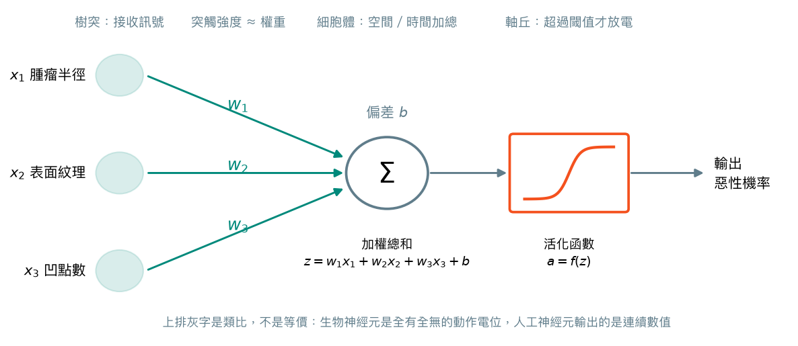
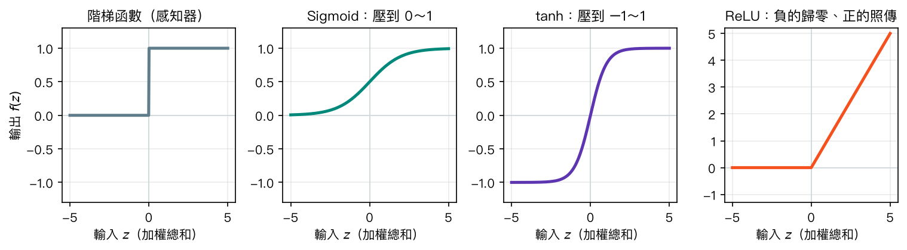
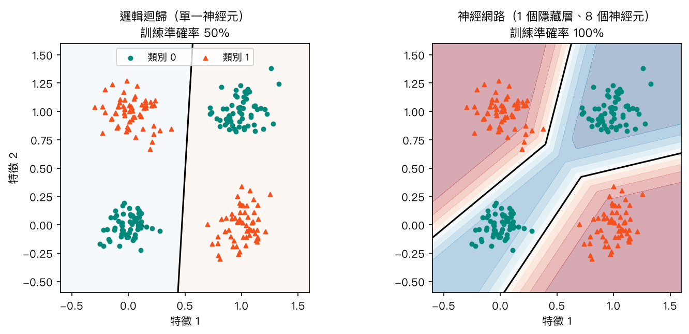
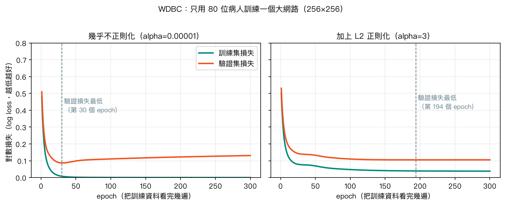

# 第 9 章　人工神經網路（ANN）基礎

<p class="chapter-meta">預計閱讀 30 分鐘 ・ 先備：第 4 章（邏輯迴歸、梯度下降）</p>

!!! abstract "本章你會學到"
    - 說明一個人工神經元如何用「加權總和＋活化函數」做判斷，並指出它和生物神經元的差異
    - 解釋為什麼需要隱藏層與非線性活化函數，才能處理 XOR 這類非線性問題
    - 用直覺理解損失、梯度下降、反向傳播、epoch、batch 與學習率
    - 用 scikit-learn 的 `MLPClassifier` 訓練乳癌分類模型，並用 Keras 3 在胸部 X 光小圖上看學習曲線
    - 判斷什麼時候值得用神經網路、什麼時候樹模型或邏輯迴歸就夠了

<div class="nb-links" markdown>
[:simple-googlecolab: 在 Colab 開啟](https://colab.research.google.com/github/fireman333/ml-for-med-students/blob/main/docs/notebooks/ch09_ann.ipynb){ .md-button .md-button--primary }
[:material-download: 下載 Notebook](../notebooks/ch09_ann.ipynb){ .md-button }
</div>

## 1. 直覺：從一個臨床情境開始

想像你在乳房外科門診，桌上有一份細針抽吸的細胞學報告：細胞核的半徑、紋理、凹點數……十幾個數值。你的腦袋其實在做一件事：**把每一項證據乘上它的重要性，加起來，超過某個程度就懷疑惡性**。凹點多很可疑、權重大；紋理稍粗只是加一點點分數。這就是一個人工神經元（artificial neuron）在做的事。

第 4 章的邏輯迴歸已經會這一招了，那為什麼還需要神經網路？因為真實世界的規則常常不是「分數越高越危險」這麼單純。舉個例子：某個檢驗值「太高不好、太低也不好」，或兩個因子「單獨出現沒事、同時出現才危險」。這種關係畫在平面上，沒辦法用一條直線把兩類病人分開。

神經網路的想法很樸素：**一位醫師做不到，就請一群醫師分工**。第一層的神經元各自看一個面向（例如「細胞大不大」「形狀規不規則」），第二層再把這些初步判讀整合起來，最後一層給出結論，像是「初級篩檢 → 專科判讀 → 主治總結」的層層彙整。每一層都只做簡單的加權與門檻判斷，但疊起來之後，就能畫出彎彎曲曲的決策邊界。

## 2. 核心概念

### 2.1 一個神經元：加權總和＋活化函數

{ loading=lazy }

一個神經元做兩步：

1. **加權總和**：每個輸入 $x_i$ 乘上權重（weight）$w_i$，再加上一個偏差（bias）$b$，得到一個數 $z$。權重代表「這項證據有多重要」，偏差則是「整體門檻高低」。
2. **活化函數（activation function）**：把 $z$ 丟進一個非線性的函數，得到輸出。若活化函數用 sigmoid，輸出就落在 0～1 之間，可以解讀成機率——**這正是邏輯迴歸**。所以你可以把邏輯迴歸看成「只有一個神經元的神經網路」。

活化函數在其他教材也常被叫做「激活函數」或「啟動函數」，指的是同一件事。

學過神經生理的你一定會聯想到生物神經元：樹突接收訊號、突觸強弱不同、細胞體做空間與時間加總、軸丘（axon hillock）超過閾值才產生動作電位（action potential）。這個類比有助於記憶，但請記得**它只是靈感來源，不是模擬**：

| | 生物神經元 | 人工神經元 |
|---|---|---|
| 輸出 | 全有全無的動作電位，用放電頻率編碼強度 | 一個連續的數值（例如 0.73） |
| 時間 | 有不反應期、時間加總、各種離子通道動力學 | 沒有時間，一次算完 |
| 學習 | 突觸可塑性（如長期增益效應 LTP），機制多元且仍在研究 | 用反向傳播＋梯度下降統一調整權重 |
| 連結 | 一個神經元可接上千個突觸，分興奮性與抑制性神經元 | 權重正負皆可，層與層之間整齊地全連接 |

所以「神經網路就是模擬大腦」並不正確。更精確的說法是：神經網路是**一大串可微分的數學函數組合**，名字借自神經科學而已。

### 2.2 常見的活化函數

{ loading=lazy }

- **階梯函數**：最早的感知器（perceptron）用的，超過 0 就輸出 1，否則 0，最像「全有全無」。但它在 0 以外的地方斜率都是 0，沒辦法用梯度下降學習，現在幾乎不用。
- **Sigmoid**：平滑版的階梯，輸出 0～1，常放在**二元分類的輸出層**，把結果轉成機率。
- **tanh**：形狀跟 sigmoid 一樣，但輸出在 −1～1 之間。
- **ReLU（Rectified Linear Unit）**：負的一律歸零、正的照原樣傳出去。計算簡單、訓練快，是現在**隱藏層的預設選擇**。
- **Softmax**（圖中未畫）：用在多類別分類的輸出層，把好幾個分數轉成加總為 1 的機率，例如「正常／細菌性肺炎／病毒性肺炎」三類各有多少機率。

為什麼一定要非線性？因為如果每一層都只是加權總和，那麼「線性的線性還是線性」：疊一百層，數學上仍等同於一層，還是只能畫直線。活化函數就是讓每一層能「轉彎」的關鍵。

### 2.3 隱藏層：一條直線不夠時

{ loading=lazy }

上圖是經典的 XOR 問題：左下與右上是同一類，左上與右下是另一類。邏輯迴歸不管怎麼擺那條直線，都只能分對一半（50%，跟丟銅板一樣）。加上一個有 8 個神經元的**隱藏層（hidden layer）**，網路就能把平面切成幾塊，訓練準確率達到 100%。

在輸入層與輸出層之間的每一層都叫隱藏層，因為我們不直接看到它的輸出。這種「每一層的每個神經元都和下一層全部相連」的網路，稱為多層感知器（multilayer perceptron, MLP），也就是本章說的人工神經網路（artificial neural network, ANN）。

### 2.4 網路怎麼學：損失、梯度下降、反向傳播

訓練一個神經網路，就是反覆做下面這個循環：


- **前向傳播（forward propagation）**：資料從輸入層一層層往後算，得到預測機率。
- **損失函數（loss function）**：衡量預測有多錯。二元分類常用對數損失（log loss，又稱 binary cross-entropy）：把惡性病例判成「惡性機率 0.02」會被重罰，判成 0.45 則罰得輕一點。
- **梯度下降（gradient descent）**：第 4 章講過的「蒙眼下山」——站在損失的山坡上，摸出最陡的下坡方向，往那裡走一小步。這一步走多大就是**學習率（learning rate）**：太大會在山谷兩側來回彈跳甚至越走越高，太小則要走到天荒地老。
- **反向傳播（backpropagation）**：網路有幾百到幾百萬個權重，每個該往哪邊調？反向傳播從輸出端的錯誤出發，**一層層往回分攤責任**：這個錯誤有多少是最後一層造成的、又有多少要追溯到前一層的哪些神經元，就像病例討論時回頭檢視每個判讀環節各自的貢獻。好消息是，這些微積分完全由套件自動完成，你不需要手推。

??? note "數學補充（可跳過）"
    一個隱藏層、sigmoid 輸出的網路可以寫成：

    $$ \mathbf{h} = \mathrm{ReLU}(W_1 \mathbf{x} + \mathbf{b}_1), \qquad \hat{p} = \sigma(\mathbf{w}_2^\top \mathbf{h} + b_2) $$

    對數損失（對 $n$ 筆資料取平均）：

    $$ L = -\frac{1}{n}\sum_{i=1}^{n} \left[ y_i \log \hat{p}_i + (1-y_i)\log(1-\hat{p}_i) \right] $$

    梯度下降更新每個參數 $\theta$（$\eta$ 為學習率）：

    $$ \theta \leftarrow \theta - \eta \, \frac{\partial L}{\partial \theta} $$

    反向傳播就是用微積分的連鎖律（chain rule），從輸出端一路往回算出每個 $\partial L / \partial \theta$。scikit-learn 與 Keras 都會自動計算。

### 2.5 epoch、batch 與學習率

這三個名詞在訓練過程的輸出裡會一直出現：

| 名詞 | 意思 | 醫學生版比喻 |
|---|---|---|
| 批次（batch） | 每次拿幾筆資料算損失、更新一次權重 | 每寫完 64 題考古題就對一次答案、修正觀念 |
| 訓練週期（epoch） | 把整份訓練資料全部看完一遍 | 整本考古題寫完一輪 |
| 學習率（learning rate） | 每次修正的幅度 | 每次錯題後「改觀念」改得多用力 |

例如 4,708 張訓練影像、batch size 64，一個 epoch 就會更新 74 次權重。

### 2.6 過擬合與正則化

神經網路的參數通常非常多。本章乳癌範例的小網路就有 641 個參數，比訓練資料的 455 筆還多——給它夠多的時間，它可以把訓練資料「背起來」，這就是過擬合（overfitting）。

{ loading=lazy }

上圖故意只用 80 位病人訓練一個很大的網路（兩層各 256 個神經元）。左圖中，訓練損失（綠）一路降到幾乎是 0，但驗證損失（橘）在第 30 個 epoch 左右觸底後開始回升——模型開始背答案，對沒看過的病人反而變差。這兩條曲線分岔的時刻，就是過擬合的訊號。

常見的對策：

- **L2 正則化（regularization）**：在損失裡加上「權重太大的懲罰」，逼模型用比較溫和的權重。scikit-learn 的 `alpha`、Keras 的 `kernel_regularizer` 都是它。右圖加了較強的 L2 後，驗證損失不再明顯回升。
- **早停（early stopping）**：盯著驗證損失，連續幾個 epoch 沒進步就停下，並還原到最好的那一刻。
- **Dropout**：訓練時每次隨機關掉一部分神經元，逼網路不能只依賴少數幾條路徑，有點像「每次查房隨機少一位住院醫師，團隊仍要能運作」。
- **更多資料、更小的網路**：最根本的解法。

## 3. 動手做

完整程式在 notebook，下面挑重點。notebook 第一格會印出套件版本；scikit-learn 的部分只需要 Colab 預裝套件。

### 3.1 單一神經元畫不出 XOR

先造一份 XOR 資料，比較邏輯迴歸和有一個隱藏層的 `MLPClassifier`：

```python
from sklearn.linear_model import LogisticRegression
from sklearn.neural_network import MLPClassifier

rng = np.random.default_rng(RS)
centers = np.array([[0, 0], [1, 1], [0, 1], [1, 0]], dtype=float)
X_xor = np.vstack([c + rng.normal(0, 0.13, size=(60, 2)) for c in centers])
y_xor = np.repeat([0, 0, 1, 1], 60)

logit = LogisticRegression().fit(X_xor, y_xor)
mlp_xor = MLPClassifier(hidden_layer_sizes=(8,), max_iter=3000, random_state=RS).fit(X_xor, y_xor)
print(f"Logistic regression training accuracy: {logit.score(X_xor, y_xor):.2f}")
print(f"MLP (8 hidden neurons) training accuracy: {mlp_xor.score(X_xor, y_xor):.2f}")
```

輸出是 0.50 對 1.00：邏輯迴歸等於亂猜，加了隱藏層的網路全部分對，和 2.3 節的圖一致。

### 3.2 乳癌資料：MLPClassifier

載入 WDBC（569 筆、30 個細胞核特徵），先印出類別名稱，再切出測試集：

```python
from sklearn.datasets import load_breast_cancer
from sklearn.model_selection import train_test_split

X, y = load_breast_cancer(return_X_y=True, as_frame=True)
print(X.shape, "| target_names:", load_breast_cancer().target_names)
print(y.value_counts().rename({0: "malignant(0)", 1: "benign(1)"}))

X_train, X_test, y_train, y_test = train_test_split(
    X, y, test_size=0.2, stratify=y, random_state=RS)
```

請注意 scikit-learn 版的編碼是 **0 = 惡性、1 = 良性**，和直覺相反，算 AUC 或敏感度時要記得把惡性當陽性。

接著用 Pipeline 把標準化和神經網路串起來，兩個隱藏層分別有 16 與 8 個神經元：

```python
from sklearn.pipeline import make_pipeline
from sklearn.preprocessing import StandardScaler
from sklearn.metrics import roc_auc_score, confusion_matrix

mlp = make_pipeline(
    StandardScaler(),
    MLPClassifier(hidden_layer_sizes=(16, 8), max_iter=1000, random_state=RS),
)
mlp.fit(X_train, y_train)

net = mlp[-1]
print("iterations used (n_iter_):", net.n_iter_)
print(f"test accuracy: {mlp.score(X_test, y_test):.4f}")
proba_malignant = mlp.predict_proba(X_test)[:, 0]          # column 0 = malignant
print(f"test AUC (malignant as positive): {roc_auc_score(y_test == 0, proba_malignant):.4f}")
print("confusion matrix (rows = true [malignant, benign]):")
print(confusion_matrix(y_test, mlp.predict(X_test)))
```

實測訓練了 345 個 epoch，測試準確率 0.956、AUC 0.994。混淆矩陣第一列是 42 位真正惡性的病人，其中 1 位被判成良性（偽陰性）。同一份程式在 notebook 裡把 `StandardScaler` 拿掉，準確率會降到約 0.93：面積這類上千的數值會主導梯度，讓訓練走偏。

### 3.3 神經網路一定比較好嗎？

用 5 折交叉驗證，把神經網路和邏輯迴歸、隨機森林放在一起比：

```python
from sklearn.ensemble import RandomForestClassifier
from sklearn.model_selection import cross_val_score

models = {
    "Logistic regression": make_pipeline(StandardScaler(), LogisticRegression(max_iter=1000)),
    "Random forest": RandomForestClassifier(n_estimators=300, random_state=RS),
    "MLP (16, 8)": make_pipeline(StandardScaler(),
                                 MLPClassifier(hidden_layer_sizes=(16, 8), max_iter=1000, random_state=RS)),
}
for name, m in models.items():
    s = cross_val_score(m, X_train, y_train, cv=5, scoring="roc_auc")
    print(f"{name:20s} CV AUC = {s.mean():.4f} ± {s.std():.4f}")
```

實測結果：邏輯迴歸 0.994 ± 0.011、隨機森林 0.987 ± 0.016、神經網路 0.994 ± 0.006。三者平均 AUC 最大差距約 0.008（神經網路 0.9943 vs 隨機森林 0.9867），與各模型五折之間的標準差（0.006～0.016）同一量級，差距大致在交叉驗證的波動範圍內，不足以判斷何者較佳；**在這份資料上看不出神經網路有優勢**（這裡沒有做正式檢定，只是描述性比較），但它比邏輯迴歸更難解釋、參數更多、需要調的設定也更多。notebook 裡也比較了不同網路大小與 `alpha`，交叉驗證 AUC 同樣都落在 0.992～0.995 之間。

這不是 WDBC 的特例。Grinsztajn 等人 2022 年的基準研究比較了數十份表格資料集，發現在中等規模的表格資料上，隨機森林、梯度提升樹這類樹模型通常不輸、甚至勝過深度學習模型。神經網路真正拉開差距的地方，是影像、聲音、文字這類**原始訊號**：像素之間的空間關係很難用人工整理成表格欄位，而多層網路能自己學出有用的特徵。

## 4. 醫學案例：胸部 X 光的肺炎分類

!!! info "僅供學習"
    本例使用公開教學資料集 PneumoniaMNIST，結果僅供學習，不構成臨床建議。

### 資料

PneumoniaMNIST 是 MedMNIST v2 的其中一個子集（授權 CC BY 4.0）。原始影像來自 Kermany 等人 2018 年發表的小兒胸部 X 光資料，MedMNIST 把它們縮成 **28×28 像素**的灰階小圖，標籤為正常（0）或肺炎（1）。訓練集 4,708 張、驗證集 524 張、測試集 624 張。

兩個特性要先記在心上：

1. **類別不平衡**：訓練集裡肺炎占 74%。一個「全部猜肺炎」的模型在訓練集就有 74% 準確率，所以只看準確率會被騙，要看 AUC、敏感度（sensitivity）與特異度（specificity）。
2. **解析度極低**：28×28 大約是郵票上的縮圖，遠低於臨床判讀需要的解析度，這份資料只適合學概念。

我們不安裝 medmnist 或 PyTorch，而是直接從 Zenodo 下載官方的 `.npz` 檔（約 4 MB），用 NumPy 讀：

```python
import urllib.request

NPZ_URL = "https://zenodo.org/records/10519652/files/pneumoniamnist.npz?download=1"
NPZ_PATH = os.path.join("data", "pneumoniamnist.npz")
os.makedirs("data", exist_ok=True)

pneu = None
try:
    if not os.path.exists(NPZ_PATH):
        print("downloading PneumoniaMNIST (~4 MB) from Zenodo ...")
        urllib.request.urlretrieve(NPZ_URL, NPZ_PATH)
    pneu = np.load(NPZ_PATH)
    for split in ["train", "val", "test"]:
        imgs, labels = pneu[f"{split}_images"], pneu[f"{split}_labels"].ravel()
        print(f"{split:5s} images {imgs.shape}, normal={np.sum(labels == 0)}, pneumonia={np.sum(labels == 1)}")
except Exception as e:
    print("Could not download/load PneumoniaMNIST:", repr(e))
    print("Check your internet connection or download the file manually from", NPZ_URL)
```

下載失敗時會印出清楚的原因，而不是讓整本 notebook 中斷。

### 用 Keras 3 建一個全連接網路

這一段用 Keras 3（Colab 已預裝）。notebook 會先 `import keras`，若環境沒有安裝就自動跳過本節。每張圖攤平成 784 個數字、除以 255 縮放到 0～1，接兩層 ReLU 隱藏層、一層 Dropout，最後一個 sigmoid 輸出肺炎機率（以下為節錄，資料整理的部分見 notebook）：

```python
model = keras.Sequential([
    keras.Input(shape=(28 * 28,)),
    keras.layers.Dense(128, activation="relu"),
    keras.layers.Dropout(0.3),
    keras.layers.Dense(64, activation="relu"),
    keras.layers.Dense(1, activation="sigmoid"),
])
model.compile(optimizer=keras.optimizers.Adam(learning_rate=1e-3),
              loss="binary_crossentropy",
              metrics=["accuracy", keras.metrics.AUC(name="auc")])
model.summary()

hist = model.fit(Xp_tr, yp_tr, validation_data=(Xp_va, yp_va),
                 epochs=30, batch_size=64, verbose=2,
                 callbacks=[keras.callbacks.EarlyStopping(
                     monitor="val_loss", patience=5, restore_best_weights=True)])
```

`fit` 會逐 epoch 印出訓練集與驗證集（`val_` 開頭）的損失、準確率、AUC。在我們的實測中，驗證損失在第 8 個 epoch 左右最低，之後不再進步，EarlyStopping 在第 13 個 epoch 停下並還原最佳權重。notebook 會把訓練與驗證曲線畫在一起，你可以親眼看到兩條線開始分岔的時刻。

### 結果與解讀

在測試集上的實測結果（Keras 3.13、TensorFlow 2.20，CPU；不同版本與硬體數字會略有不同）：

| 指標 | 數值 |
|---|---|
| 準確率 | 0.83（「全部猜肺炎」的基準為 0.63） |
| AUC | 0.92 |
| 敏感度（肺炎被抓出來的比例） | 0.98 |
| 特異度（正常片被正確排除的比例） | 0.57 |

AUC 0.92 看起來不錯，但請注意三件事：

1. **特異度只有 0.57**：將近一半的正常片子被判成肺炎。模型學到了訓練資料「肺炎比較多」的傾向。若改變分類閾值（notebook 的練習題），敏感度與特異度會互相交換，要依臨床用途決定。
2. **驗證集與測試集表現落差**：訓練過程中驗證準確率約 0.95，測試集卻只有 0.83。測試集的正常片比例（38%）比訓練集（26%）高，類別組成不同，就會讓成績變動。這提醒我們：模型換一批病人，表現就可能不同。
3. **這是教學結果，不是臨床效能**：影像只有 28×28、來自單一醫學中心、沒有外部驗證。已發表的研究用原始解析度影像與卷積神經網路（convolutional neural network, CNN）能得到更好的數字，但同樣需要多中心外部驗證才能談臨床應用。

這裡用的是最基本的全連接網路，它把影像攤平成一串數字，丟失了「哪些像素彼此相鄰」的空間資訊。專門處理影像的 CNN 會保留這種結構，是下一步值得學的方向。

## 5. 互動體驗

### 單一神經元：調整權重與偏差

拖動滑桿，觀察一個 sigmoid 神經元的輸出如何隨權重 $w$ 與偏差 $b$ 改變。$w$ 決定曲線有多陡（判斷多果斷）、正負決定方向；$b$ 則把判斷分界點左右平移。

<div class="demo-box">
  <div id="ch09-demo"></div>
  <div class="controls">
    <label>權重 w <input type="range" id="ch09-w" min="-5" max="5" step="0.1" value="2"> <span id="ch09-w-val">2.0</span></label>
    <label>偏差 b <input type="range" id="ch09-b" min="-5" max="5" step="0.1" value="0"> <span id="ch09-b-val">0.0</span></label>
  </div>
  <p id="ch09-info" style="font-size:.75rem;margin:.4rem 0 0;"></p>
</div>

### TensorFlow Playground

TensorFlow Playground 可以在瀏覽器裡直接訓練小型神經網路。建議試試：選「螺旋」資料集，先用 0 個隱藏層（等於邏輯迴歸），再逐步加隱藏層與神經元；把活化函數從 ReLU 改成 Linear，看看網路是不是又只能畫直線；調高學習率，觀察損失曲線開始亂跳。

<iframe src="https://playground.tensorflow.org/" loading="lazy" title="TensorFlow Playground" style="width:100%;height:720px;border:1px solid var(--md-default-fg-color--lightest);border-radius:6px;"></iframe>

出處：[TensorFlow Playground](https://playground.tensorflow.org/)（Daniel Smilkov、Shan Carter，Google），授權 Apache-2.0。手機上操作空間較小，建議[開新分頁](https://playground.tensorflow.org/){ target=_blank rel=noopener }使用。

## 6. 常見陷阱

!!! warning "陷阱 1：忘記標準化"
    神經網路靠梯度下降學習，對特徵尺度非常敏感。WDBC 不標準化時，準確率從 0.956 掉到約 0.93，在其他資料上可能更糟，甚至完全學不動。一律把 `StandardScaler` 放進 Pipeline，並且只用訓練集來 `fit` 它。

!!! warning "陷阱 2：在 MLPClassifier 開 early_stopping=True 就以為萬事大吉"
    scikit-learn 的 `early_stopping=True` 會切出 10% 當驗證集，驗證分數連續 10 次沒進步就停。在 WDBC 這種小資料上，網路一開始常有一段「學不太動」的平台期，結果只跑十幾個 iteration 就停，測試準確率可能只剩 0.37（等於全猜同一類）。入門階段建議不要開它；真的要用，就把 `n_iter_no_change` 調大，並檢查 `n_iter_` 確認模型有真的訓練。

!!! warning "陷阱 3：只看準確率，忽略類別不平衡"
    PneumoniaMNIST 的測試集裡肺炎占 63%，「全部猜肺炎」就有 0.63 的準確率。0.83 聽起來還可以，但特異度只有 0.57。醫學資料常常不平衡，請同時報告 AUC、敏感度、特異度，並和「全猜多數類」的基準比較。

!!! warning "陷阱 4：以為網路越深越大越好"
    沒有活化函數時，疊再多層也只是一條直線；有了活化函數，層數與神經元一多，小資料就容易過擬合。WDBC 上從 4 個神經元到 128×128 的網路，交叉驗證 AUC 都差不多。先從小網路與簡單模型（邏輯迴歸、隨機森林）當基準，確定有進步再加大。

## 7. 小測驗

??? question "Q1. 一個只有輸出層、使用 sigmoid 活化函數的單一神經元，等同於前面學過的哪個模型？"
    **答案：** 邏輯迴歸。加權總和再經過 sigmoid 轉成 0～1 的機率，正是第 4 章邏輯迴歸的形式。

??? question "Q2. 某人設計了 10 個隱藏層的網路，但每層都沒有活化函數（只有加權總和）。它能解決 XOR 問題嗎？"
    **答案：** 不能。線性函數組合起來仍是線性函數，10 層在數學上等同 1 層，還是只能畫一條直線；非線性活化函數才是讓網路能「轉彎」的關鍵。

??? question "Q3. 訓練時發現訓練損失持續下降，但驗證損失從第 20 個 epoch 起開始上升。這代表什麼？可以怎麼處理？"
    **答案：** 模型開始過擬合（背訓練資料）。可以用早停把權重還原到驗證損失最低的時刻，或加上 L2 正則化、Dropout、縮小網路、增加資料。

## 8. 重點整理

- 人工神經元＝加權總和＋活化函數；只有一個 sigmoid 神經元時就是邏輯迴歸。
- 生物神經元的類比只是靈感：人工神經元輸出連續值、沒有時間動力學，學習方式也完全不同。
- 隱藏層＋非線性活化函數（隱藏層常用 ReLU、二元輸出用 sigmoid、多類別輸出用 softmax）讓網路能畫出彎曲的決策邊界。
- 訓練循環：前向傳播 → 計算損失 → 反向傳播分攤責任 → 梯度下降更新權重；batch、epoch、學習率決定這個循環怎麼跑。
- 參數多、容易過擬合：用訓練／驗證學習曲線診斷，用 L2 正則化、早停、Dropout 對抗。
- 小型表格資料上，神經網路常常不比邏輯迴歸或樹模型好；它的強項在影像、聲音、文字等原始訊號。
- 醫學影像模型的成績要看 AUC、敏感度、特異度，並記得資料來源、解析度與外部驗證的限制。

## 延伸閱讀

- [Google Machine Learning Crash Course：Neural networks](https://developers.google.com/machine-learning/crash-course/neural-networks) — 從線性模型的限制講到隱藏層與反向傳播，附互動練習。
- [Dive into Deep Learning：Multilayer Perceptrons](https://d2l.ai/chapter_multilayer-perceptrons/mlp.html) — 想看數學推導與程式實作的進階讀物（CC BY-SA 4.0）。
- [李宏毅 Machine Learning 2021 Spring](https://speech.ee.ntu.edu.tw/~hylee/ml/2021-spring.php) — 中文授課，深度學習基礎講得非常直覺。
- [Grinsztajn L, et al. Why do tree-based models still outperform deep learning on tabular data?（2022）](https://arxiv.org/abs/2207.08815) — 表格資料上樹模型與深度學習的系統性比較。
- [Yang J, et al. MedMNIST v2（Scientific Data, 2023）](https://doi.org/10.1038/s41597-022-01721-8) — 本章肺炎資料集的出處與基準結果。
- [Kermany DS, et al. Identifying medical diagnoses and treatable diseases by image-based deep learning（Cell, 2018）](https://doi.org/10.1016/j.cell.2018.02.010) — PneumoniaMNIST 原始胸部 X 光影像的來源論文。

<script src="../../assets/js/demos/ch09-neuron.js"></script>
