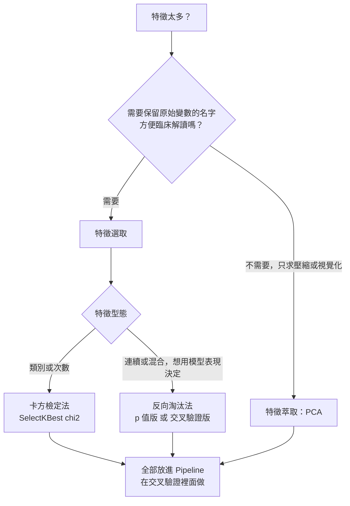
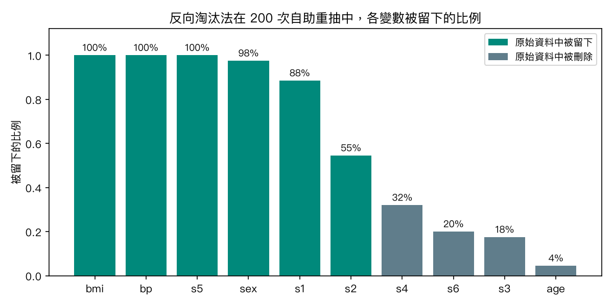
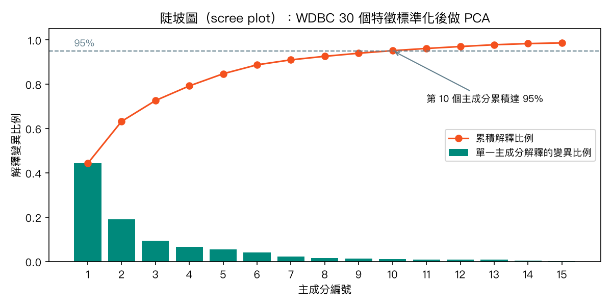
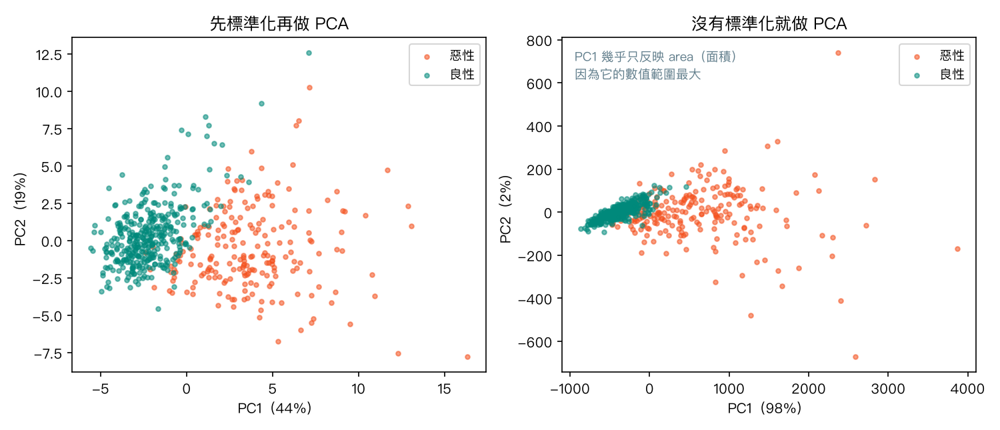

# 第 10 章　資料降維：反向淘汰法、卡方檢定法、主成分分析法（PCA）

<p class="chapter-meta">預計閱讀 30 分鐘 ・ 先備：第 3 章（標準化、Pipeline）、第 4 章（線性迴歸、邏輯迴歸）</p>

!!! abstract "本章你會學到"
    - 分辨「特徵選取」與「特徵萃取」，知道什麼時候該降維
    - 用 statsmodels 實作以 p 值為準的反向淘汰法，並說得出它在方法學上的問題
    - 用 `SelectKBest(chi2)` 挑出與結果最相關的類別變數，避開「非負」與「類別代碼」兩個坑
    - 用 PCA 把 30 個高度相關的特徵壓成少數幾個主成分，會看陡坡圖、會解讀主成分
    - 把降維步驟放進 Pipeline，避免資料洩漏把準確率灌水

<div class="nb-links" markdown>
[:simple-googlecolab: 在 Colab 開啟](https://colab.research.google.com/github/fireman333/ml-for-med-students/blob/main/docs/notebooks/ch10_dimensionality-reduction.ipynb){ .md-button .md-button--primary }
[:material-download: 下載 Notebook](../notebooks/ch10_dimensionality-reduction.ipynb){ .md-button }
</div>

## 1. 直覺：從一張過長的入院檢查單開始

想像你在內科病房寫入院病歷。病人抽了一大套血：CBC、生化、電解質、凝血、甲狀腺……四十幾項。學長問：「只能留五項來預測他一週內會不會轉加護病房，你留哪五項？」

你大概會這樣想：

- **有些項目高度重複**：BUN 跟 creatinine 常一起升降；Hb 跟 Hct 幾乎是同一件事。兩個都留，資訊沒多多少。
- **有些項目跟結果幾乎無關**：對轉 ICU 這件事，TSH 大概幫不上忙。
- **項目越多，越容易被巧合騙**：一百個病人、四十項檢驗，總有幾項「碰巧」跟結果相關。

這就是**降維（dimensionality reduction）**要處理的問題。每個欄位叫一個「維度」，特徵太多有三個麻煩：

1. **維度詛咒（curse of dimensionality）**：特徵越多，資料點越稀疏，需要的樣本數急速上升；樣本不夠就容易過擬合（overfitting）——訓練資料上很好，換一批病人就失靈。
2. **共線性（collinearity）**：特徵彼此高度相關時，迴歸係數會變得很不穩定，解讀也會出問題。
3. **難以視覺化與解讀**：人眼最多看懂三維，三十個特徵畫不出來，也難跟臨床同事解釋。

降維的方法可以粗分成兩大類，這是本章最重要的一張地圖：

| | 特徵選取（feature selection） | 特徵萃取（feature extraction） |
|---|---|---|
| 做法 | 從原有欄位中**挑出一部分** | 把原有欄位**混合成新的軸** |
| 結果長相 | 還是「BMI、血壓」這些原本的名字 | 變成「PC1、PC2」這種新變數 |
| 可解釋性 | 高，直接對應臨床變數 | 較低，要看每個新軸由誰組成 |
| 本章代表 | 反向淘汰法、卡方檢定法 | 主成分分析（PCA） |
| 需不需要結果標籤 | 需要 | PCA 不需要（非監督式） |

用入院檢查單來比喻：特徵選取是「從四十項裡圈出五項」；特徵萃取則像把身高、體重、腰圍合成一個「體型大小」分數——壓縮更有效率，但這個分數不再「就是」哪一項檢驗。



## 2. 核心概念

### 2.1 反向淘汰法（backward elimination）

反向淘汰法的邏輯很像「從一張完整的術前檢查清單，一項一項拿掉，看拿掉後有沒有差」：

1. 先把**全部**特徵放進迴歸模型。
2. 找出 p 值最大（最「不顯著」）的那個特徵。
3. 如果它的 p 值大於門檻（常用 0.05），就把它刪掉，重新配適模型。
4. 重複第 2–3 步，直到剩下的特徵 p 值都 ≤ 門檻。

它和「向前選取（forward selection）」、「逐步迴歸（stepwise regression）」是同一家族，醫學論文裡常見的「backward stepwise」指的就是這一類。

在 Python 裡要注意一件事：**scikit-learn 沒有內建 p 值版的反向淘汰**。它提供的 `SequentialFeatureSelector(direction="backward")` 判準是交叉驗證（cross-validation）分數——每一步刪掉「刪了之後預測表現掉最少」的特徵。兩者名字很像、目的不同：

| | p 值版（statsmodels 手寫迴圈） | 交叉驗證版（sklearn `SequentialFeatureSelector`） |
|---|---|---|
| 刪除依據 | p 值最大者 | 刪掉後交叉驗證分數下降最少者 |
| 回答的問題 | 「哪些變數在這份資料上達統計顯著？」 | 「哪些變數組合的預測表現好？」 |
| 停止條件 | 所有 p 值 ≤ 門檻 | 指定保留幾個，或分數改善小於 `tol` |
| 常見用途 | 傳統醫學統計論文 | 預測模型 |

#### 方法學上的問題：為什麼統計學家不太喜歡它

反向淘汰法在醫學研究很常見，但方法學文獻對它有不少批評。Heinze、Wallisch 與 Dunkler 在 2018 年的回顧文章中指出，變數選擇（尤其用在以「解釋效應」為目的的模型時）可能損害最終模型的穩定性、讓迴歸係數產生偏誤，並使 p 值與信賴區間失去原本的有效性；Harrell 在《Regression Modeling Strategies》中也對逐步選擇提出類似的批評。用醫學生熟悉的話講：

- **先看答案再出考題**：同一份資料既拿來挑變數、又拿來算 p 值。被留下來的變數，本來就是「在這份資料上碰巧看起來最有關」的那幾個，所以最後報告的 p 值偏小、信賴區間偏窄、係數偏大。
- **換一批病人就選出不同變數**：特徵之間有相關時，誰被留下常取決於資料中的小小隨機波動。
- **未達統計顯著 ≠ 沒有作用**：被刪掉的變數只是「在這份樣本裡未達統計顯著」，不代表它真的與結果無關；樣本數不足時，真的有關的變數也可能被刪掉。
- **選出來的不是因果**：反向淘汰只是資料驅動的篩選，被留下的變數不能直接解讀成「危險因子」。

該怎麼辦？這篇回顧的建議大致是：優先依**背景知識**（臨床文獻、致病機轉、因果圖）決定變數；若仍要資料驅動選擇，要報告**選擇的穩定性**（例如自助重抽下每個變數被選中的比例），並考慮懲罰式方法（如 LASSO，即 L1 正則化）。「動手做」會親手示範前兩個問題。

### 2.2 卡方檢定法（chi-square）

卡方檢定你在第 2 章用 `scipy.stats.chi2_contingency` 做過：對「類別變數 × 結果」的列聯表，檢驗兩者是否獨立。卡方檢定法借用類似的想法做成篩選器：**替每個特徵各自算一個卡方分數，保留分數最高的 k 個**。在 scikit-learn 裡就是 `SelectKBest(chi2, k=...)`。

但要記得：sklearn 的 `chi2` **不是**列聯表卡方檢定。它把特徵值當成「次數」，把每個結果組別的特徵值加總，再和依組別人數比例分配的期望值比較；一個 0/1 欄位只用到「值為 1 的人」，值為 0 的人沒有進入計算。所以它的分數適合拿來**排序、篩選特徵**，附帶的 p 值不宜當作統計推論的依據。要回答「這個類別變數和結果有沒有關聯」，仍要用 `chi2_contingency`（3.5 節會把兩者並排比較）。

它快又直覺，缺點是**一次只看一個特徵**：看不到組合效果，也不處理特徵間的重複（兩個高度相關的特徵可能同時被選進來）。

用 sklearn 的 `chi2` 篩選時，還有兩個一定要知道的限制：

1. **只接受非負值**。sklearn 的 `chi2` 原本為「次數」設計（例如每個字在文章中出現幾次），標準化後出現負值會報錯 `Input X must be non-negative`。
2. **類別代碼不是次數**。胸痛型態編成 1–4，sklearn 會把 4 當成 1 的四倍。要先 one-hot 編碼，讓每個類別各自成為一欄 0/1。

### 2.3 主成分分析（principal component analysis, PCA）

想像替一座雕塑拍平面照片，要從「最看得出形狀」的角度拍。PCA 就是替資料找這個角度——**找一條軸，讓資料投影上去後分散得最開（變異數最大）**，叫第一主成分（PC1）；再找與 PC1 垂直、剩餘變異最大的軸，叫 PC2，依此類推。

幾個關鍵概念：

- **解釋變異比例（explained variance ratio）**：每個主成分保留了總變異的百分之多少。由大到小畫出來就是**陡坡圖（scree plot）**，用來決定保留幾個主成分，常看「累積達 80%–95%」或曲線的「手肘」。
- **載荷（loading）**：主成分是原始特徵的加權總和，權重叫載荷。看哪些特徵權重大，就能大致猜出主成分代表什麼。
- **一定要先標準化**：某個特徵數值特別大（例如面積動輒上千），PCA 就會幾乎只看它。sklearn 的 `PCA` 會置中但**不會縮放**，要自己先用 `StandardScaler`。
- **PCA 不看結果標籤**：它是非監督式學習，變異大的方向不一定對預測有用。

??? note "數學補充（可跳過）"
    設標準化後的資料矩陣為 $X$（$n$ 筆 × $p$ 個特徵，每欄平均為 0），其共變異數矩陣為

    $$ S = \frac{1}{n-1} X^\top X $$

    第一主成分的方向 $w_1$ 是在 $\lVert w \rVert = 1$ 的限制下使投影變異數最大的向量：

    $$ w_1 = \arg\max_{\lVert w \rVert = 1} \; w^\top S\, w $$

    解出來 $w_1$ 恰好是 $S$ 最大特徵值 $\lambda_1$ 對應的特徵向量，且投影後的變異數就等於 $\lambda_1$。第 $j$ 個主成分的解釋變異比例為 $\lambda_j / \sum_k \lambda_k$。實際計算上 sklearn 用奇異值分解（SVD）完成。

## 3. 動手做

以下程式碼與 notebook 相同（notebook 第 0 節另有匯入 numpy、pandas、statsmodels 的程式碼），建議開著 Colab 一邊跑一邊看。

### 3.1 反向淘汰法：sklearn diabetes 資料

先載入 sklearn 內建的 diabetes 資料集：442 位糖尿病人、10 個基線特徵（age、sex、bmi、bp，以及 s1–s6 六項血清指標），目標是一年後的疾病進展分數。

```python
from sklearn.datasets import load_diabetes

X, y = load_diabetes(return_X_y=True, as_frame=True)
print(X.shape)
X.head()
```

輸出 `(442, 10)`。sklearn 已經把特徵置中並縮放過，所以係數大小不好直接解讀，我們只看 p 值。

接著寫一個反向淘汰的函式：每一輪用 statsmodels 的 `OLS` 配適線性迴歸，刪掉 p 值最大且大於 0.05 的特徵。注意 statsmodels 不會自動加截距，要用 `sm.add_constant`。

```python
def backward_eliminate(X, y, alpha=0.05, verbose=True):
    cols = list(X.columns)
    while cols:
        model = sm.OLS(y, sm.add_constant(X[cols])).fit()
        pvals = model.pvalues.drop("const")
        worst = pvals.idxmax()
        if pvals[worst] <= alpha:
            break
        if verbose:
            print(f"drop {worst:>4s}  p = {pvals[worst]:.3f}")
        cols.remove(worst)
    return model, cols

model, kept = backward_eliminate(X, y)
print("kept:", kept)
print(f"R2 = {model.rsquared:.3f}, adjusted R2 = {model.rsquared_adj:.3f}")
```

依序刪掉 age（p = 0.867）、s3（0.639）、s6（0.304）、s4（0.262），最後留下 sex、bmi、bp、s1、s2、s5 六個變數，R² = 0.515、調整後 R² = 0.508。

### 3.2 親手驗證問題①：純雜訊也能「找到」顯著變數

我們造一份刻意**沒有任何關聯**的資料：100 人、20 個隨機特徵、結果也是隨機數，再跑一次同樣的反向淘汰。

```python
rng = np.random.default_rng(42)
Z = pd.DataFrame(rng.normal(size=(100, 20)), columns=[f"z{i}" for i in range(20)])
y_noise = pd.Series(rng.normal(size=100))

noise_model, noise_kept = backward_eliminate(Z, y_noise, verbose=False)
print("kept:", noise_kept)
print(noise_model.pvalues.drop("const").round(3))
```

最後留下 z2、z10、z17 三個變數，p 值分別是 0.006、0.027、0.041——每一個都「達統計顯著」，但我們知道它們全是雜訊。這就是「先挑再算」讓 p 值失真的具體樣子：如果把這份結果寫成論文，會變成「發現三個獨立預測因子」。

### 3.3 親手驗證問題②：換一批病人，選出的變數不一樣

用自助重抽（bootstrap）模擬「重新收一批病人」：從 442 人中有放回地抽 442 人，每次重跑反向淘汰，統計每個變數被留下的比例。

```python
from collections import Counter

rng = np.random.default_rng(42)
n_boot = 200
freq = Counter()
selected_sets = Counter()
for _ in range(n_boot):
    idx = rng.integers(0, len(X), len(X))
    Xb = X.iloc[idx].reset_index(drop=True)
    yb = y.iloc[idx].reset_index(drop=True)
    _, kept_b = backward_eliminate(Xb, yb, verbose=False)
    freq.update(kept_b)
    selected_sets[tuple(sorted(kept_b))] += 1

inclusion = pd.Series({c: freq[c] / n_boot for c in X.columns}).sort_values(ascending=False)
print(inclusion.round(2))
print("number of different final models:", len(selected_sets))
print("most common model:", selected_sets.most_common(1))
```

{ loading=lazy }

bmi、bp、s5 每次都被留下，相當穩定；但 s2 只有 55%，跟丟銅板差不多，原本被刪的 s4 也有 32% 的機會被留下。200 次重抽共出現 **23 種不同的最終模型**，最常見的那組（剛好就是原始資料選出的）只占 73 次，約 37%。你在論文裡報告的「最終模型」，只是眾多可能結果之一。s1 與 s2 都是血清膽固醇相關指標、彼此高度相關，誰被留下容易搖擺，這就是共線性造成的不穩定。

### 3.4 交叉驗證版：`SequentialFeatureSelector`

如果目的是**預測**而不是解釋，可以改用以交叉驗證分數為準的向後選擇：

```python
from sklearn.feature_selection import SequentialFeatureSelector
from sklearn.linear_model import LinearRegression
from sklearn.model_selection import cross_val_score

sfs = SequentialFeatureSelector(
    LinearRegression(), n_features_to_select=5, direction="backward", cv=5
)
sfs.fit(X, y)
print("SFS kept:", list(X.columns[sfs.get_support()]))

r2_all = cross_val_score(LinearRegression(), X, y, cv=5, scoring="r2").mean()
r2_kept = cross_val_score(LinearRegression(), X[kept], y, cv=5, scoring="r2").mean()
print(f"5-fold CV R2, all 10 features: {r2_all:.3f}")
print(f"5-fold CV R2, 6 kept features: {r2_kept:.3f}")
```

保留 5 個時選出 sex、bmi、bp、s1、s5，和 p 值版大致重疊。全部 10 個特徵的交叉驗證 R² 是 0.482，反向淘汰留下的 6 個是 0.491：刪掉四個變數，預測表現大致持平。不過 `kept` 是用全部資料選的，這個比較仍有點「偷看」，嚴謹做法見 3.7。

### 3.5 卡方檢定法：Cleveland 心臟病資料的類別欄

資料來自 UCI Cleveland Heart Disease（303 人），我們取 7 個類別型欄位，結果是有沒有 coronary artery disease（冠狀動脈疾病）。這一段需要網路。

```python
URL = ("https://archive.ics.uci.edu/ml/machine-learning-databases/"
       "heart-disease/processed.cleveland.data")
names = ["age", "sex", "cp", "trestbps", "chol", "fbs", "restecg", "thalach",
         "exang", "oldpeak", "slope", "ca", "thal", "num"]
try:
    heart = pd.read_csv(URL, names=names, na_values="?")
except Exception as e:
    raise RuntimeError(
        "Cannot download Cleveland data from UCI. Check the network, "
        "or download processed.cleveland.data manually and change URL to the local path."
    ) from e

cat_cols = ["sex", "cp", "fbs", "restecg", "exang", "slope", "thal"]
heart = heart.dropna(subset=cat_cols)
Xc = heart[cat_cols].astype(int)
yc = (heart["num"] > 0).astype(int)
print(Xc.shape, "disease rate:", round(yc.mean(), 3))
Xc.head()
```

thal 有 2 筆遺漏值，刪掉後剩 301 人，有病比例 45.8%。接著用 `SelectKBest(chi2)` 挑 4 個：

```python
from sklearn.feature_selection import SelectKBest, chi2

selector = SelectKBest(chi2, k=4).fit(Xc, yc)
chi_table = pd.DataFrame(
    {"chi2": selector.scores_.round(2), "p": selector.pvalues_},
    index=cat_cols,
).sort_values("chi2", ascending=False)
print(chi_table)
print("selected:", list(Xc.columns[selector.get_support()]))
```

分數由高到低是 thal（65.89）、exang（37.16）、cp（14.99）、restecg（9.40），最低的 fbs（空腹血糖是否 > 120 mg/dL）只有 0.06。但 cp 是 1–4 的類別代碼，被當成次數加總了，所以再做一次 one-hot 版本：

```python
from sklearn.preprocessing import OneHotEncoder

ohe = OneHotEncoder(sparse_output=False)
X_onehot = pd.DataFrame(ohe.fit_transform(Xc), columns=ohe.get_feature_names_out())
scores_onehot = pd.Series(chi2(X_onehot, yc)[0], index=X_onehot.columns)
print(scores_onehot.sort_values(ascending=False).round(2).head(8))
```

排名最前面變成 thal_7（43.04）、cp_4（41.62）、exang_1（37.16）、thal_3（37.11）。cp 的「第 4 類」單獨拿出來就排第二；而在未 one-hot 的版本裡，整個 cp 只排第三、分數 14.99——代碼被當成次數時，訊號被稀釋了。

再仔細看：`exang_1` 是 37.16，`exang_0` 卻是 17.94。這兩欄只是互補（不是 1 就是 0），如果做的是「exang × 結果」的 2×2 列聯表檢定，兩者應該是同一個數字。這正說明 sklearn 的 `chi2` 分數不是列聯表卡方檢定。要做統計推論，對每個變數建「類別 × 結果」列聯表，用 `chi2_contingency`：

```python
from scipy.stats import chi2_contingency

sk_scores, sk_p = chi2(Xc, yc)
rows = []
for i, col in enumerate(cat_cols):
    table = pd.crosstab(Xc[col], yc)  # categories x outcome contingency table
    stat, p, dof, expected = chi2_contingency(table)
    rows.append({"feature": col, "chi2": stat, "dof": dof, "p": p,
                 "min_expected": expected.min(),
                 "sklearn_chi2": sk_scores[i], "sklearn_p": sk_p[i]})

test_table = pd.DataFrame(rows).set_index("feature").sort_values("chi2", ascending=False)
fmt = {"chi2": "{:.2f}".format, "p": "{:.2g}".format, "min_expected": "{:.1f}".format,
       "sklearn_chi2": "{:.2f}".format, "sklearn_p": "{:.2g}".format}
print(test_table.to_string(formatters=fmt))
print()
print("disease rate by fbs:", yc.groupby(Xc["fbs"]).mean().round(3).to_dict())
```

| 變數 | 列聯表 χ² | 自由度 | p 值 | 最小期望次數 | sklearn `chi2` 分數 |
|---|---|---|---|---|---|
| thal | 83.29 | 2 | 8.2 × 10⁻¹⁹ | 8.3 | 65.89 |
| cp | 80.27 | 3 | 2.7 × 10⁻¹⁷ | 10.5 | 14.99 |
| exang | 53.29 | 1 | 2.9 × 10⁻¹³ | 44.9 | 37.16 |
| slope | 44.52 | 2 | 2.2 × 10⁻¹⁰ | 9.6 | 8.04 |
| sex | 21.11 | 1 | 4.3 × 10⁻⁶ | 44.0 | 7.10 |
| restecg | 10.81 | 2 | 0.0045 | 1.8 | 9.40 |
| fbs | 0.01 | 1 | 0.91 | 20.2 | 0.06 |

兩種數字差很多：cp 的列聯表 χ² 是 80.27（自由度 3），sklearn 分數只有 14.99，排名也跟著變。依列聯表檢定，thal、cp、exang、slope、sex、restecg 與冠心病的關聯都達統計顯著（p < 0.05）；但 restecg 有一格期望次數只有 1.8，低於常用的 5，這個 p 值宜保守看待。fbs（空腹血糖是否 > 120 mg/dL）p = 0.91，兩組有病比例分別是 45.5% 與 47.7%，**未達統計顯著**。2×2 表（自由度 1）時 `chi2_contingency` 預設會做 Yates 連續性校正，所以 exang、sex、fbs 的 χ² 比未校正版略小。

### 3.6 PCA：把 WDBC 的 30 個特徵壓扁

WDBC 是本站的老朋友：569 個乳房腫瘤的細胞核影像特徵，30 個欄位其實是 10 種測量（半徑、周長、面積、凹陷程度……）各取平均、標準誤、最差值，彼此高度相關，是 PCA 的教科書級範例。記得 sklearn 的編碼是 **0 = malignant、1 = benign**。

```python
from sklearn.datasets import load_breast_cancer
from sklearn.preprocessing import StandardScaler
from sklearn.decomposition import PCA

data = load_breast_cancer()
Xw, yw = data.data, data.target
print(Xw.shape, data.target_names)

Xw_std = StandardScaler().fit_transform(Xw)
pca = PCA().fit(Xw_std)
ratio = pca.explained_variance_ratio_
cum = np.cumsum(ratio)
print("PC1-PC5 explained variance ratio:", ratio[:5].round(3))
print("cumulative, first 5:", cum[:5].round(3))
print("PCs needed for 95%:", int(np.argmax(cum >= 0.95) + 1))
```

PC1 一個軸就解釋了 44.3% 的變異，PC2 再加 19.0%，前兩個合計 63.2%；要 10 個主成分才累積到 95%。畫成陡坡圖：

{ loading=lazy }

長條在第 3 個之後就變得很矮，這個「手肘」表示前幾個主成分已抓住大部分結構。把每個腫瘤投影到 PC1、PC2，再用真正的診斷上色（PCA 本身沒看過診斷）：

{ loading=lazy }

左圖中惡性與良性在 PC1 方向上大致分開。notebook 裡印出 PC1 的載荷，權重最大的是 mean concave points（凹點數）、mean concavity（凹陷程度）、worst concave points、mean compactness（緊密度）、worst perimeter（周長），而且正負號一致——可以把 PC1 粗略理解為「細胞核又大又不規則的程度」，這和病理學上惡性細胞核較大、較不規則的直覺方向一致。（主成分的正負號本身沒有意義，整條軸反過來也是同一個主成分。）

右圖是**沒有標準化**的下場：PC1 看似解釋了 98% 的變異，但那只是因為 worst area 的變異數高達三十多萬、遠大於其他特徵，PC1 幾乎等於「面積」。數字好看，資訊卻被一個特徵獨占了。

### 3.7 把降維放進 Pipeline

第 3 章說過：任何「從資料學東西」的前處理（標準化、PCA、特徵選取）都只能在訓練資料上學。用 `Pipeline` 串起來，交叉驗證每一折就只在訓練折上配適：

```python
from sklearn.pipeline import make_pipeline
from sklearn.linear_model import LogisticRegression
from sklearn.model_selection import StratifiedKFold

cv = StratifiedKFold(n_splits=5, shuffle=True, random_state=42)
for n in [1, 2, 3, 5, 10, 30]:
    pipe = make_pipeline(StandardScaler(), PCA(n_components=n),
                         LogisticRegression(max_iter=1000))
    acc = cross_val_score(pipe, Xw, yw, cv=cv).mean()
    print(f"{n:2d} PCs: CV accuracy = {acc:.3f}")
```

| 主成分數 | 1 | 2 | 3 | 5 | 10 | 30（等同不降維） |
|---|---|---|---|---|---|---|
| 5 折交叉驗證準確率 | 0.910 | 0.947 | 0.942 | 0.963 | 0.977 | 0.974 |

只用 2 個主成分就有 0.947，10 個主成分與全部 30 個特徵相當。但要提醒：WDBC 是單一來源、569 筆、未經外部驗證的資料，這些準確率不能直接外推到別家醫院的病理影像。

最後示範**沒放進 Pipeline** 會發生什麼。造 100 位「病人」、5,000 個純雜訊特徵、隨機的 0/1 結果——正確答案應該接近 0.5（跟丟銅板一樣）：

```python
from sklearn.feature_selection import f_classif

rng = np.random.default_rng(42)
X_noise = rng.normal(size=(100, 5000))
y_coin = rng.integers(0, 2, size=100)

# Wrong: select features on ALL data, then cross-validate
X_selected = SelectKBest(f_classif, k=20).fit_transform(X_noise, y_coin)
acc_wrong = cross_val_score(LogisticRegression(max_iter=1000), X_selected, y_coin, cv=cv).mean()

# Right: feature selection inside the pipeline
pipe_right = make_pipeline(SelectKBest(f_classif, k=20), LogisticRegression(max_iter=1000))
acc_right = cross_val_score(pipe_right, X_noise, y_coin, cv=cv).mean()

print(f"selection outside CV: {acc_wrong:.2f}")
print(f"selection inside pipeline: {acc_right:.2f}")
```

先在全部資料上挑特徵，準確率被灌到 0.88；放進 Pipeline 後回到 0.53，這才是真相——挑特徵時已偷看了測試折的答案。（這裡用 `f_classif` 而非 `chi2`，因為雜訊特徵有負值。）

## 4. 醫學案例：三種方法各自回答什麼問題

!!! info "僅供學習"
    本節三個資料集都是公開的教學資料集，分析僅為方法示範，本例僅供學習，不構成臨床建議。

    - diabetes：Efron 等人 2004 年發表於 *Annals of Statistics* 的資料，sklearn 內建；原始授權條款未能查得。
    - Cleveland Heart Disease：Detrano 等人 1989 年，UCI Machine Learning Repository，CC BY 4.0。
    - WDBC：Street、Wolberg、Mangasarian 1993 年，UCI，CC BY 4.0，sklearn 內建。

**反向淘汰（diabetes）**：常見寫法是「BMI、血壓、s5 等為疾病進展的獨立預測因子」。比較嚴謹的說法是：「在這份 442 人的資料中，以 p < 0.05 為門檻的反向淘汰留下 6 個變數；自助重抽顯示 bmi、bp、s5 的選入穩定，s2 則不穩定（約 55%）。」後者交代了選擇的不確定性，也不把「被選入」講成因果。臨床研究若目的是估計某個暴露的效應（例如「高血壓是否增加某結果的風險」），調整哪些干擾因子宜依臨床知識與因果圖預先決定，不宜交給 p 值自動挑。

**卡方檢定法（Cleveland）**：thal（thallium stress test，鉈-201 心肌灌注掃描）的「可逆性缺損」（thal_7）、無症狀型胸痛（cp_4）、exercise-induced angina（運動誘發心絞痛，exang）排在前面，與一般臨床認知方向一致。但這是 1980 年代單一醫學中心、約三百人的資料，卡方也只看單一變數，不代表它們在多變量模型中仍然重要。要判斷顯著性，看的是 `chi2_contingency` 的列聯表檢定，不是 sklearn `chi2` 的 p 值：fbs 的列聯表檢定 p = 0.91，只能說「在這份約三百人的資料中未偵測到與結果的關聯（未達統計顯著）」，不能說空腹血糖與冠心病無關。

**PCA（WDBC）**：兩個主成分就能畫出良性、惡性大致分開的圖，適合呈現「這些影像特徵整體有分辨力」。但病理科同事問「PC1 高代表什麼？」時，你只能說「一組大小與形狀特徵的加權組合」。需要可解釋性時，特徵選取通常比 PCA 合適。

## 5. 互動體驗：親手轉動投影軸

下面是 80 個模擬的「身高、體重」資料點（已標準化，相關係數約 0.8）。拖動滑桿轉動橘色虛線（投影軸），每個點會垂直投影到這條線上。觀察「投影後的變異數」：轉到哪個角度時，點在線上分得最開？按「對齊第一主成分」看答案。

<div class="demo-box"><div id="ch10-demo"></div><div class="controls">
<label for="ch10-angle">投影軸角度</label>
<input type="range" id="ch10-angle" min="0" max="179" step="1" value="100">
<span id="ch10-angle-val">100°</span>
<button id="ch10-snap" class="md-button">對齊第一主成分</button>
<span id="ch10-readout"></span>
</div></div>

變異數最大的方向大約在 47°，保留近九成總變異，也就是「身高體重一起增加」的方向——這就是 PC1（「體型大小」）；與它垂直的 PC2 是「同身高下偏重或偏輕」，只剩一成左右。想看更多視覺化，推薦 setosa.io 的 [Principal Component Analysis Explained Visually](https://setosa.io/ev/principal-component-analysis/)（外部網站）。

## 6. 常見陷阱

!!! warning "陷阱一：把反向淘汰留下的變數當成「找到的危險因子」"
    先挑後算使 p 值偏小、信賴區間偏窄，3.2 節的純雜訊都能留下三個「顯著」變數。要交代選擇方法與穩定性；談因果或效應大小時，變數宜依臨床知識預先決定。

!!! warning "陷阱二：卡方檢定法用錯資料，或把它的 p 值當成統計檢定"
    `chi2` 只接受非負值；類別代碼要先 one-hot。連續特徵（年齡、膽固醇）雖然非負，用卡方意義不大，改用 `f_classif` 或 `mutual_info_classif`。另外，sklearn 的 `chi2` 把特徵值當次數加總，不是列聯表卡方檢定（one-hot 後 `exang_1` 與 `exang_0` 分數不同就是證據）；它適合排序、篩選特徵，要寫「某變數與結果有關聯」或「未達統計顯著」，改用 `scipy.stats.chi2_contingency`，並檢查期望次數是否太小。

!!! warning "陷阱三：PCA 前沒有標準化"
    `PCA` 只置中不縮放。WDBC 不標準化時 PC1 看似解釋 98% 變異，其實只是「面積」數值最大。除非特徵同單位、同尺度，否則一律先 `StandardScaler`。

!!! warning "陷阱四：在全部資料上先降維或選特徵，再切訓練／測試集"
    3.7 節中純雜訊資料的準確率從 0.53 被灌到 0.88。特徵選取、PCA、標準化都要放進 `Pipeline`，讓它們只在訓練折上學。

## 7. 小測驗

??? question "Q1. 下列哪一個屬於「特徵萃取」而不是「特徵選取」？（A）反向淘汰法（B）SelectKBest(chi2)（C）PCA（D）SequentialFeatureSelector"
    **答案：C。** PCA 產生的是原始特徵混合而成的新軸（主成分），其他三者都是從原有欄位中挑出一部分。

??? question "Q2. 一篇觀察性研究寫道：「經反向淘汰後，變數 X 的 p = 0.03，故 X 為結果的獨立危險因子。」這句話有什麼問題？"
    **答案：** 第一，p 值是在同一份資料「挑過變數之後」算的，會偏小；第二，觀察性資料的統計關聯不等於因果，「危險因子」需要因果推論的設計支持。較嚴謹的寫法是報告選擇方法與穩定性，定位為探索性發現。

??? question "Q3. 對 WDBC 資料做 PCA 前忘了標準化，PC1 解釋了 98% 的變異。這代表 PC1 抓到了資料中最重要的結構嗎？"
    **答案：這裡幾乎可以確定不是。** 沒有標準化時，數值範圍最大的特徵（面積，變異數數十萬）會主導 PC1，98% 反映的是單位與尺度，而非特徵間的共同結構。標準化後 PC1 只解釋約 44%，但它綜合了多個形狀與大小特徵。

## 8. 重點整理

- 降維處理特徵太多帶來的過擬合、共線性與難解讀；分為**特徵選取**（挑原有欄位）與**特徵萃取**（產生新軸）。
- **反向淘汰法**從全部特徵出發，逐步刪掉 p 值最大者。它簡單常見，但先挑後算會使 p 值與信賴區間失真，選擇結果也不穩定；醫學研究宜優先依臨床知識選變數，並報告選擇的穩定性。
- sklearn 的 `SequentialFeatureSelector` 是**以交叉驗證分數為準**的向後選擇，適合預測目的，和 p 值版不同。
- **卡方檢定法**（`SelectKBest(chi2)`）快速篩選類別或次數型特徵；只接受非負值，類別代碼要先 one-hot，且看不到特徵間的組合效果。它的分數是排序用的篩選分數，不是列聯表卡方檢定；要做統計推論（有沒有關聯、是否達統計顯著）用 `chi2_contingency`。
- **PCA** 找變異最大的方向；一定要先標準化；用陡坡圖決定保留幾個主成分；主成分可以從載荷大致解讀，但可解釋性不如原始變數。
- 所有降維與特徵選取步驟都要放進 **Pipeline**，否則交叉驗證結果會被資料洩漏灌水。

## 延伸閱讀

- [Heinze G, Wallisch C, Dunkler D. Variable selection – A review and recommendations for the practicing statistician. *Biom J*. 2018;60(3):431–449.](https://doi.org/10.1002/bimj.201700067) — 變數選擇的方法學回顧與建議，開放取用（[PMC5969114](https://www.ncbi.nlm.nih.gov/pmc/articles/PMC5969114/)）。
- [Harrell FE Jr. *Regression Modeling Strategies*. 2nd ed. Springer; 2015.](https://doi.org/10.1007/978-3-319-19425-7) — 臨床預測模型經典教科書，含對逐步選擇的批評。
- [scikit-learn 使用手冊：Feature selection](https://scikit-learn.org/stable/modules/feature_selection.html) — `SelectKBest`、`chi2`、`SequentialFeatureSelector` 的官方說明。
- [scikit-learn 使用手冊：Decomposing signals in components](https://scikit-learn.org/stable/modules/decomposition.html) — PCA 的官方說明與範例。
- [setosa.io：Principal Component Analysis Explained Visually](https://setosa.io/ev/principal-component-analysis/) — 可拖曳的 PCA 視覺化，適合搭配本章互動體驗。
- [Jake VanderPlas, *Python Data Science Handbook*：In Depth: Principal Component Analysis](https://jakevdp.github.io/PythonDataScienceHandbook/05.09-principal-component-analysis.html) — 用手寫數字示範 PCA 降維與重建。

<script src="../../assets/js/demos/ch10-pca-projection.js"></script>
