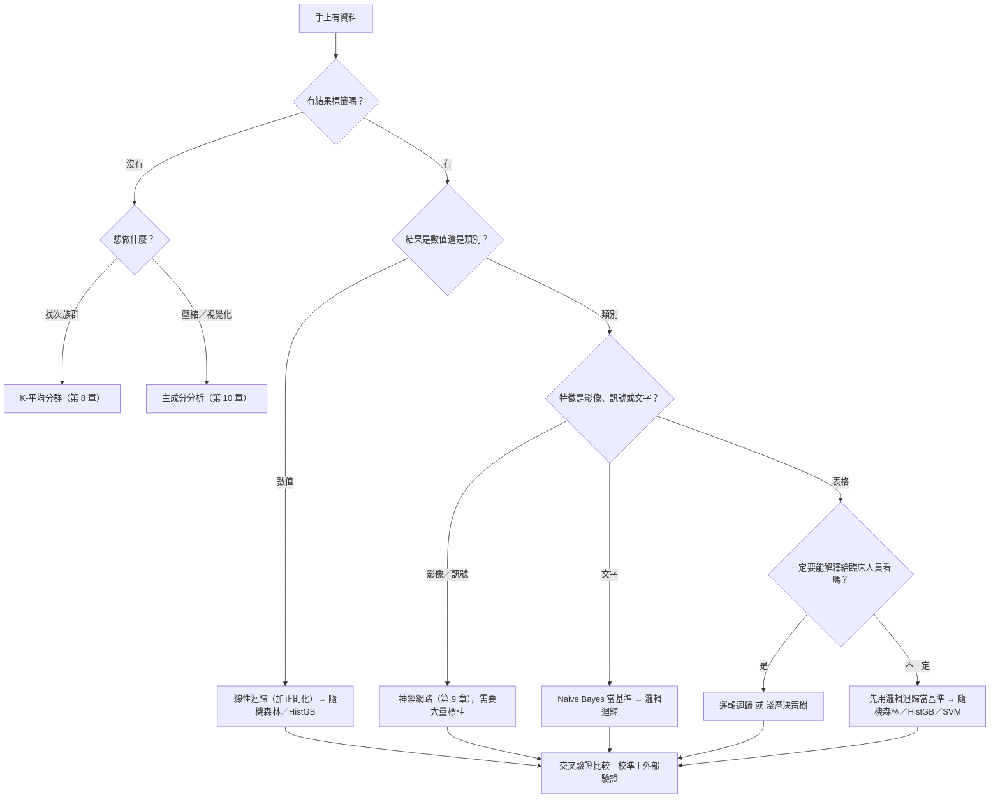
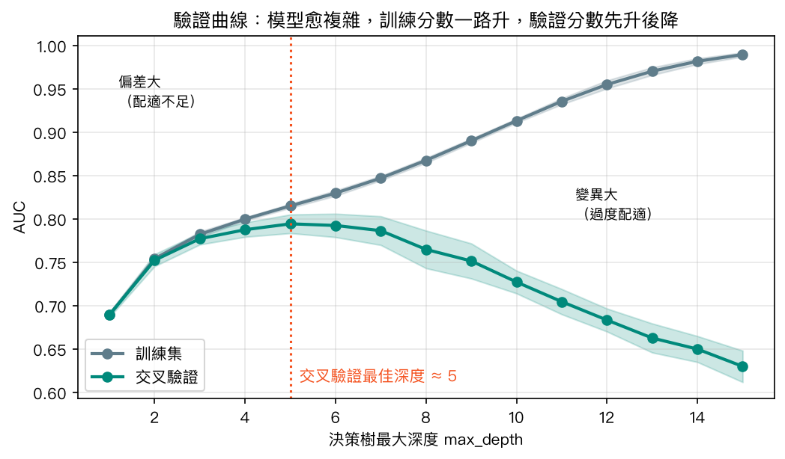
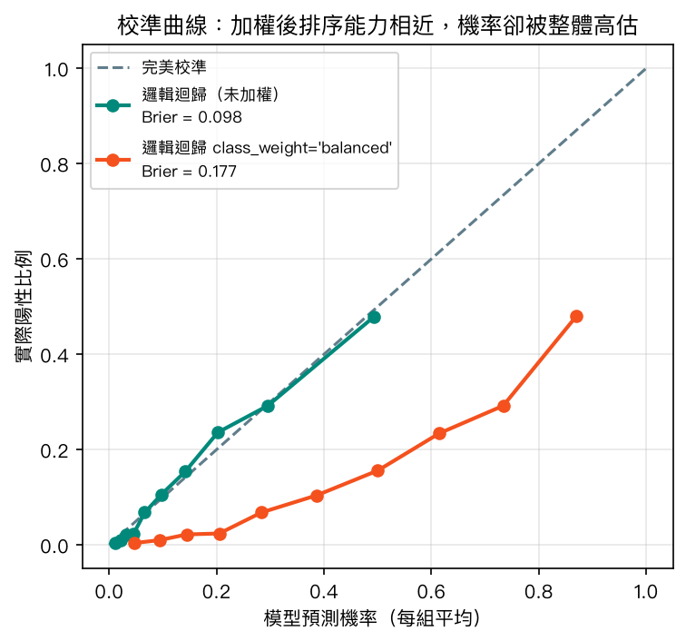
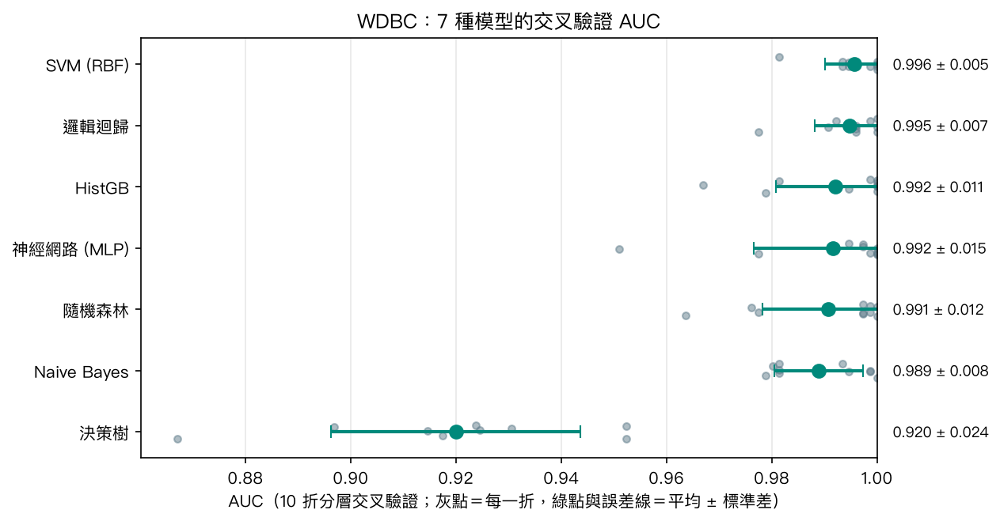
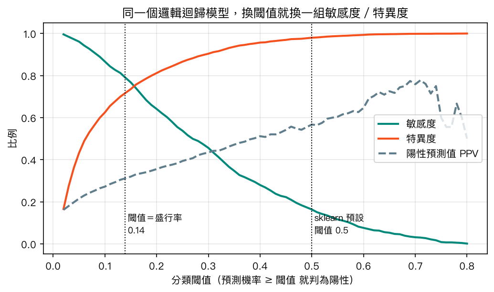
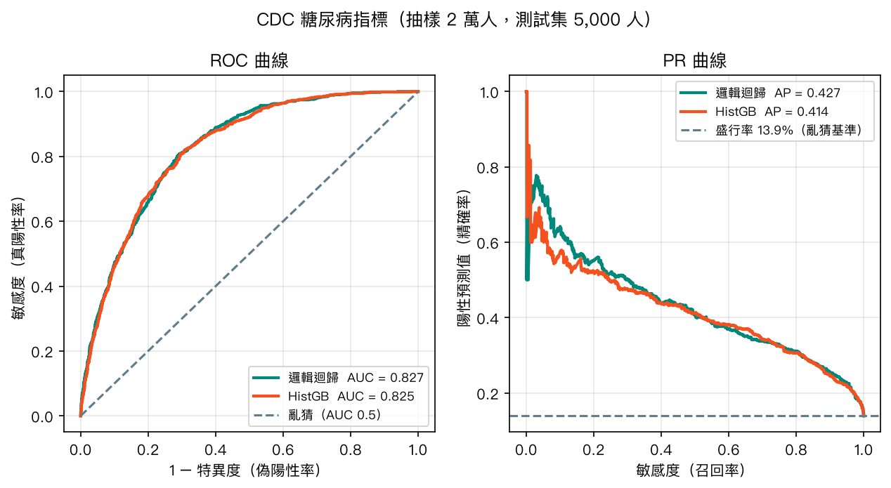

# 第 11 章　各種模型使用時機比較與效能提升策略

<p class="chapter-meta">預計閱讀 35 分鐘 ・ 先備：第 3–10 章（至少讀過第 4、7 章）</p>

!!! abstract "本章你會學到"
    - 比較前面各章的模型：什麼資料、什麼目的該先試哪一個
    - 用交叉驗證（cross-validation）公平比較模型，並用「平均 ± 標準差」解讀分數差距
    - 把機器學習的評估指標翻譯成熟悉的敏感度、特異度、PPV、C-statistic
    - 處理類別不平衡：調閾值、類別加權，並檢查機率校準
    - 用超參數搜尋、集成學習提升效能，並知道外部驗證為什麼不能省

<div class="nb-links" markdown>
[:simple-googlecolab: 在 Colab 開啟](https://colab.research.google.com/github/fireman333/ml-for-med-students/blob/main/docs/notebooks/ch11_model-selection.ipynb){ .md-button .md-button--primary }
[:material-download: 下載 Notebook](../notebooks/ch11_model-selection.ipynb){ .md-button }
</div>

## 1. 直覺：從一個臨床情境開始

假設醫院想在健檢中心導入一個「第 2 型糖尿病風險篩檢」工具，你被分到的任務是：從一堆候選模型中挑一個，並決定「分數多少以上要轉介抽血驗 HbA1c」。

這其實和你在臨床流行病學課學過的「選一個診斷檢驗」幾乎是同一件事：

- **選檢驗前先問目的**：要篩檢（不想漏掉）還是確診（不想誤判）？對應到模型，就是要追求高敏感度還是高特異度。
- **看的是整體鑑別力**：同一個檢驗在不同 cutoff 下有一整條 ROC 曲線，曲線下面積（AUC）就是大家熟悉的 C-statistic。
- **cutoff 要依情境訂**：同一個檢驗，篩檢和診斷用的切點不一樣；同一個模型也一樣，預設的 0.5 往往不是最好的選擇。
- **換一群病人要重新驗證**：在醫學中心算出來的敏感度，搬到基層診所不一定成立。模型也需要外部驗證。

所以這一章不教新的演算法，而是教你**怎麼選、怎麼比、怎麼調**：把前面十章的工具箱攤開，練習什麼情況拿哪一把，以及怎麼知道自己拿對了。

## 2. 核心概念

### 2.1 模型比較總表

下表整理第 4–10 章介紹過的模型。「需要標準化」指特徵單位差很多時（例如年齡與血小板數），不先標準化會明顯影響結果。

| 模型（章） | 適合的資料與任務 | 樣本量需求 | 需要標準化？ | 可解釋性 | 輸出機率可信度 | 主要風險 |
|---|---|---|---|---|---|---|
| 線性迴歸（[第 4 章](04-regression.md)） | 預測連續數值、關係大致線性 | 少即可 | 看係數時建議 | 高：係數即效果大小 | 不適用（輸出數值） | 非線性關係抓不到、離群值 |
| 邏輯迴歸（第 4 章） | 二元分類、表格資料 | 少到中 | 建議（sklearn 預設帶 L2 正則化，實務上要做） | 高：勝算比 | 通常不錯 | 需要自己加交互作用與非線性項 |
| Naive Bayes（[第 5 章](05-naive-bayes.md)） | 文字、高維度、當快速基準 | 很少也能跑 | 不需要 | 中 | 常偏極端，不可盡信 | 條件獨立假設不成立 |
| 支援向量機（[第 6 章](06-svm.md)） | 中小型表格資料、邊界複雜 | 中（數萬筆以上變很慢） | **必須** | 低（RBF kernel） | 預設不給機率，需另外校準 | 對 C、gamma 敏感 |
| 決策樹（[第 7 章](07-tree-forest.md)） | 需要畫成流程圖解釋 | 中 | 不需要 | 很高 | 差（機率呈階梯狀） | 很容易過擬合、不穩定 |
| 隨機森林（第 7 章） | 表格資料的強力預設選擇 | 中到大 | 不需要 | 低（可看特徵重要性） | 尚可，常需校準 | 特徵重要性易被誤讀 |
| 提升法 HistGB（本章） | 表格資料、大樣本 | 中到大 | 不需要 | 低（可看特徵重要性） | 尚可，常需校準 | 參數多，易在調參時過擬合 |
| 類神經網路（[第 9 章](09-ann.md)） | 影像、訊號、文字；大量資料 | 大 | **必須** | 低 | 不一定，需檢查 | 小樣本表格資料上常不佔優勢 |
| K-平均分群（[第 8 章](08-kmeans.md)） | 沒有標籤、想找次族群 | 中 | **必須** | 中（看群中心） | 不適用 | 分群結果不等於診斷 |
| 主成分分析（[第 10 章](10-dimensionality-reduction.md)） | 降維、視覺化、處理共線性 | 中 | **必須** | 低（主成分難命名） | 不適用 | 變異量大不代表和結果有關 |

這張表是**起點不是定論**：它告訴你先試誰，最終仍要在自己的資料上用交叉驗證比出來。

### 2.2 模型選擇流程圖

scikit-learn 官方有一張給工程師的 algorithm cheat-sheet（連結見延伸閱讀）。我們依醫學情境自行重畫一張簡化版：



每條路最後都匯到同一個方框：**不管選了誰，都要交叉驗證比較、檢查校準、做外部驗證**。另一個重點是先做簡單的基準模型——花俏的模型若贏不了邏輯迴歸，就沒有理由用它。

### 2.3 交叉驗證：每位病人輪流當一次「新病人」

只切一次訓練／測試集，分數會受切分運氣影響。**K 折交叉驗證（K-fold cross-validation）**把資料分成 K 份，輪流拿其中一份當考卷、其餘 K−1 份當教材，最後得到 K 個分數。可以想成：**每位病人都輪流當了一次模型沒見過的新病人**。

報告時要寫「平均 ± 標準差」，例如 AUC 0.995 ± 0.007。標準差告訴你分數有多穩；兩個模型的平均差距如果比標準差還小，就不能說誰比較好。

三種常見切法（外加時間序列）：

| 切法 | 做法 | 醫學情境 |
|---|---|---|
| K-fold | 隨機分 K 份 | 資料平衡、每人一筆 |
| **分層 K-fold（Stratified K-fold）** | 每份都維持相同的陽性比例 | 類別不平衡時的預設選擇 |
| **分組 K-fold（Group K-fold）** | 同一組（同一位病人）只會出現在同一份 | 一位病人有多次回診、多張影像 |
| 時間序列切法（TimeSeriesSplit） | 只用過去預測未來 | 依時間累積的資料，避免「用未來預測過去」 |

分組切法特別重要：同一位病人的兩張胸部 X 光若分別落在訓練集與測試集，模型可能只是「認出這個人」，分數虛高。這是醫學影像研究常見的洩漏來源。

### 2.4 偏差與變異：為什麼模型不是愈複雜愈好

**偏差（bias）**是模型太簡單、抓不到真正規律（配適不足，underfitting）；**變異（variance）**是模型太複雜、連雜訊都背下來（過擬合，overfitting）。這裡的「偏差」是模型的偏差，和流行病學說的選擇偏誤、資訊偏誤是不同概念。

{ loading=lazy }

上圖用 CDC 糖尿病資料畫決策樹的**驗證曲線（validation curve）**：深度愈大，訓練集 AUC 一路升到接近 1，交叉驗證 AUC 卻在深度 5 左右達到高峰後下滑。訓練分數與驗證分數之間的落差，就是過擬合的程度。調超參數的目的，就是找那個兩者之間的平衡點。

### 2.5 評估指標：ML 名稱與醫學名稱對照

機器學習的評估指標和你在臨床流行病學學過的名詞，大多是**同一件事換個名字**：

| 機器學習名稱 | 醫學名稱 | 白話說明 |
|---|---|---|
| 混淆矩陣（confusion matrix） | 2×2 表 | TP、FP、FN、TN 四格 |
| 召回率（recall）、真陽性率 TPR | **敏感度 sensitivity** | 真的有病的人裡，抓到幾成 |
| 真陰性率 TNR | **特異度 specificity** | 沒病的人裡，正確排除幾成 |
| 精確率（precision） | **陽性預測值 PPV** | 被判陽性的人裡，真的有病幾成（受盛行率影響） |
| NPV（ML 較少用） | **陰性預測值 NPV** | 被判陰性的人裡，真的沒病幾成 |
| 偽陽性率 FPR | 1 − 特異度 | ROC 曲線的橫軸 |
| 分類閾值（threshold） | 診斷切點（cutoff） | 分數多少以上判陽性 |
| ROC 曲線下面積 AUC | **C-statistic（一致性統計量）** | 隨機挑一位病人和一位非病人，模型給病人較高分的機率 |
| 平衡準確率（balanced accuracy） | （敏感度＋特異度）÷ 2 | 不平衡時較不會被多數類騙 |
| F1 分數 | 敏感度與 PPV 的調和平均 | 同時在意兩者時的單一分數 |
| PR 曲線、平均精確率（AP） | 敏感度對 PPV 的曲線 | 陽性很少時比 ROC 更能看出差異 |
| 校準（calibration）、Brier 分數 | 校準 | 預測 20% 風險的人，實際是否約 20% 發病（Brier 分數同時受鑑別力與校準影響） |

??? note "數學補充（可跳過）"
    以 2×2 表的四格表示：

    $$\text{敏感度}=\frac{TP}{TP+FN},\quad \text{特異度}=\frac{TN}{TN+FP},\quad \text{PPV}=\frac{TP}{TP+FP},\quad \text{NPV}=\frac{TN}{TN+FN}$$

    $$F_1=\frac{2\cdot\text{PPV}\cdot\text{敏感度}}{\text{PPV}+\text{敏感度}}$$

    Brier 分數是預測機率 $\hat p_i$ 與實際結果 $y_i\in\{0,1\}$ 的均方差，越小越好：

    $$\text{Brier}=\frac{1}{n}\sum_{i=1}^{n}(\hat p_i-y_i)^2$$

    AUC 的機率解釋：$\text{AUC}=P(\hat s_{\text{病人}}>\hat s_{\text{非病人}})$，同分時算一半。這正是二元結果下 C-statistic 的定義。

有兩件事 AUC 不會告訴你：**切點要切在哪**，以及**在你的族群中 PPV 會是多少**。前者要依臨床錯誤成本決定（漏診比較貴還是誤報比較貴），後者取決於盛行率——同一個模型搬到盛行率低的族群，PPV 會下降，這不代表模型變差，而是貝氏定理（[第 5 章](05-naive-bayes.md)）的必然結果。

### 2.6 類別不平衡：準確率陷阱與三種對策

當陽性只有少數時，**準確率（accuracy）會騙人**。CDC 資料的糖尿病（含糖尿病前期）比例約 13.9%，一個永遠回答「沒有糖尿病」的模型，準確率就有約 86%，但敏感度是 0。

第一步永遠是**換指標**：改看敏感度、特異度、平衡準確率、PR 曲線，不要只看準確率。之後常見三種對策，由簡單到複雜：

1. **調整閾值**：sklearn 的 `predict()` 固定用 0.5 當切點，但在不平衡資料上，模型給陽性的機率很少超過 0.5。改用 `predict_proba()` 拿到機率，自己選切點。這是最簡單、也最不會破壞機率意義的方法。
2. **類別加權**：`class_weight="balanced"` 讓模型在訓練時更重視少數類。代價是預測機率會被整體推高（見 2.7）。
3. **重抽樣**：減少多數類（undersampling）或增加少數類（oversampling、SMOTE）。**只能在訓練折內做**，測試集必須保持真實盛行率，否則等於洩漏。

### 2.7 校準：分數排得對，不代表機率說得準

AUC 只看**排序**：病人的分數是否比非病人高。但如果要告訴健檢者「你有 X% 的機率有糖尿病」，就需要機率本身準確，這叫**校準（calibration）**。

{ loading=lazy }

上圖比較同一份資料上的兩個邏輯迴歸：未加權版的點幾乎貼著對角線；加了 `class_weight="balanced"` 的版本，AUC 幾乎相同（測試集 0.827 vs 0.828），但每一組的預測機率都比實際陽性比例高很多，Brier 分數從 0.098 變差到 0.177。它仍適合排序、挑出高風險者，但不適合直接把數字當作個人風險。臨床風險分數要同時報告鑑別力與校準，就是這個道理。

### 2.8 集成學習：讓多個模型一起投票

**集成學習（ensemble learning）**是把多個模型的結果合起來：

- **自助聚合法（Bagging）**：從資料中重複抽樣，各訓練一棵樹再平均，主要降低變異。隨機森林就是代表（[第 7 章](07-tree-forest.md)的「多位醫師會診」）。
- **提升法（Boosting）**：一棵接一棵訓練，每一棵專門修正前面還錯的地方，主要降低偏差。scikit-learn 的 `HistGradientBoostingClassifier`（簡稱 HistGB）速度快、可直接處理遺漏值，是表格資料的常用選擇；XGBoost、LightGBM 是同家族的其他實作。

集成模型常在資料競賽名列前茅，但在臨床預測研究中不一定勝過邏輯迴歸。一篇系統性回顧（檢索 Medline 2016 年 1 月至 2017 年 8 月，927 篇中納入 71 篇、共 282 組比較）發現：在偏誤風險低的 145 組比較中，機器學習模型與邏輯迴歸的 logit(AUC) 差距為 0.00（95% CI −0.18 到 0.18），未顯示機器學習較優；機器學習看起來較好的情形，主要出現在驗證方法有偏誤風險的研究中（Christodoulou 等，2019）。這個結論針對的是二元結果的臨床預測模型，不能直接推廣到影像等非表格資料。

### 2.9 超參數搜尋：讓電腦幫你試參數

**超參數（hyperparameter）**是訓練前由你決定的設定，例如 SVM 的 `C` 和 `gamma`、決策樹的 `max_depth`。常見兩種自動搜尋方式：

- **網格搜尋 `GridSearchCV`**：列出所有候選值，每一種組合都做交叉驗證。4 個 C × 4 個 gamma ＝ 16 組，每組 5 折，共訓練 80 次（最後再用最佳參數在整個訓練集重訓一次）。
- **隨機搜尋 `RandomizedSearchCV`**：給每個參數一個範圍，只隨機抽 `n_iter` 組來試。參數多時效率較好。

關鍵紀律：**挑參數用的資料，不能拿來報告最終成績**。先把測試集鎖起來，搜尋只在訓練集內做，結束後才用測試集算一次最終表現。

## 3. 動手做

以下程式碼與 Notebook 一致。

**第一步：7 種模型在 WDBC 上做 10 折分層交叉驗證。**需要標準化的模型把 `StandardScaler` 放進 Pipeline，讓每一折都只用訓練折來計算平均與標準差。

```python
from sklearn.datasets import load_breast_cancer
from sklearn.model_selection import StratifiedKFold, cross_val_score
from sklearn.pipeline import make_pipeline
from sklearn.preprocessing import StandardScaler
from sklearn.linear_model import LogisticRegression
from sklearn.svm import SVC
from sklearn.ensemble import RandomForestClassifier, HistGradientBoostingClassifier

X, y = load_breast_cancer(return_X_y=True, as_frame=True)
models = {
    "LogReg": make_pipeline(StandardScaler(), LogisticRegression(max_iter=1000)),
    "SVM (RBF)": make_pipeline(StandardScaler(), SVC()),
    "RandomForest": RandomForestClassifier(n_estimators=200, random_state=42),
    "HistGB": HistGradientBoostingClassifier(random_state=42),
    # Notebook 另含 Naive Bayes、決策樹、MLP
}
cv = StratifiedKFold(n_splits=10, shuffle=True, random_state=42)
for name, m in models.items():
    s = cross_val_score(m, X, y, cv=cv, scoring="roc_auc")
    print(f"{name}: {s.mean():.3f} ± {s.std():.3f}")
```

{ loading=lazy }

結果怎麼讀：SVM（0.996 ± 0.005）、邏輯迴歸（0.995 ± 0.007）、HistGB、神經網路、隨機森林、Naive Bayes 的平均 AUC 都落在 0.989–0.996，彼此差距大致在標準差範圍內，**在這份資料上看不出誰穩定勝出**；只有單棵決策樹（0.920 ± 0.024）明顯落後。WDBC 很好分，重點不是排名，而是「看標準差再下結論」。

**第二步：網格搜尋 SVM 的參數。**先鎖住 25% 測試集，搜尋只在訓練集內進行。

```python
from sklearn.model_selection import train_test_split, GridSearchCV
from sklearn.metrics import roc_auc_score

X_tr, X_te, y_tr, y_te = train_test_split(X, y, test_size=0.25, stratify=y, random_state=42)
grid = GridSearchCV(make_pipeline(StandardScaler(), SVC()),
                    {"svc__C": [0.1, 1, 10, 100], "svc__gamma": [0.001, 0.01, 0.1, 1]},
                    cv=StratifiedKFold(5, shuffle=True, random_state=42), scoring="roc_auc")
grid.fit(X_tr, y_tr)
print(grid.best_params_, round(grid.best_score_, 3))
print("test AUC:", round(roc_auc_score(y_te, grid.decision_function(X_te)), 3))
```

Pipeline 裡的參數要寫成「步驟名__參數名」（兩個底線）。輸出會告訴你挑到的 `C`、`gamma`，以及測試集上的 AUC；要報告的是後者。

**第三步：在不平衡的 CDC 資料上，換閾值看醫學指標。**我們從 25 萬筆中分層抽樣 2 萬人，75% 訓練、25%（5,000 人）測試。

```python
import numpy as np
import pandas as pd
from sklearn.metrics import confusion_matrix

cdc = pd.read_csv("https://archive.ics.uci.edu/static/public/891/data.csv").drop(columns=["ID"])
sub, _ = train_test_split(cdc, train_size=20000, stratify=cdc["Diabetes_binary"], random_state=42)
Xd, yd = sub.drop(columns="Diabetes_binary"), sub["Diabetes_binary"]
Xd_tr, Xd_te, yd_tr, yd_te = train_test_split(Xd, yd, test_size=0.25, stratify=yd, random_state=42)

lr = make_pipeline(StandardScaler(), LogisticRegression(max_iter=1000)).fit(Xd_tr, yd_tr)
p = np.round(lr.predict_proba(Xd_te)[:, 1], 3)
for t in [0.14, 0.3, 0.5]:
    tn, fp, fn, tp = confusion_matrix(yd_te, (p >= t).astype(int)).ravel()
    print(f"t={t}: sensitivity={tp/(tp+fn):.3f} specificity={tn/(tn+fp):.3f} PPV={tp/(tp+fp):.3f}")
```

實際輸出整理如下（測試集 5,000 人，陽性 697 人）：

| 閾值 | TP | FP | FN | TN | 敏感度 | 特異度 | PPV |
|---|---|---|---|---|---|---|---|
| 0.14 | 550 | 1,215 | 147 | 3,088 | 0.789 | 0.718 | 0.312 |
| 0.30 | 318 | 414 | 379 | 3,889 | 0.456 | 0.904 | 0.434 |
| 0.50 | 114 | 87 | 583 | 4,216 | 0.164 | 0.980 | 0.567 |

同一個模型只換切點：用預設的 0.5，敏感度只有 16.4%；降到接近盛行率的 0.14，敏感度升到 78.9%，代價是特異度與 PPV 下降。

{ loading=lazy }

把所有閾值畫成 ROC 與 PR 曲線，並和 HistGB 對照：

{ loading=lazy }

在這個測試集上，邏輯迴歸 AUC 0.827、HistGB 0.825，兩條曲線幾乎重疊。為了確認這不是單次切分的巧合，Notebook 另在訓練集上做 5 折交叉驗證：邏輯迴歸 0.819 ± 0.010、HistGB 0.816 ± 0.006，**差距在標準差範圍內，未顯示 HistGB 較佳**。在這種情況下，可解釋、容易校準的邏輯迴歸通常是比較合理的選擇。

## 4. 醫學案例

!!! info "僅供學習"
    本節使用公開資料集做教學示範，本例僅供學習，不構成臨床建議。

**資料來源**：CDC Diabetes Health Indicators（UCI Machine Learning Repository id 891，DOI 10.24432/C53919），整理自美國 CDC 2015 年行為危險因子監測系統（Behavioral Risk Factor Surveillance System, BRFSS）電話問卷，約 25 萬人、21 個特徵（高血壓、高膽固醇、BMI、自評健康、年齡分組等）。原始整理版在 Kaggle 以 **CC0（公眾領域）** 釋出。

**這份資料的限制要先講清楚**：

- 糖尿病狀態是**自陳**的（受訪者自述是否曾被告知有糖尿病或糖尿病前期），不是 HbA1c 或空腹血糖確診。
- 年齡、收入、教育都是分組編碼，不是連續數值。
- 這是橫斷面問卷：模型學到的是「目前有糖尿病的人有哪些特徵」，不是「未來會不會發生」；特徵與結果之間是關聯，不能解讀成因果。
- 單一國家、單一年份，沒有外部驗證。

**如果要把這種模型用在臨床，還差什麼？**以下三個問題，也是閱讀任何一篇醫學 ML 論文時的起手式（參考 Liu 等人 2019 年在 JAMA 的使用者指引）：

1. **資料從哪來、參考標準是什麼？**結果是自陳、病歷編碼，還是檢驗確診？族群和你要用的場域像不像？
2. **有沒有獨立的外部驗證？**在另一家醫院、另一個時期、另一個族群上，鑑別力與校準是否仍然成立？只做內部交叉驗證，分數通常偏樂觀。
3. **有沒有證明臨床效益？**AUC 高不等於病人結果變好。模型改變了什麼決策？轉介量增加多少？有沒有前瞻性研究？

撰寫或審閱預測模型研究時，可以對照 **TRIPOD+AI**（2024 年發表於 BMJ 的報告指引，涵蓋迴歸與機器學習模型），檢查樣本量、遺漏值處理、校準、外部驗證、公平性等項目是否交代清楚。

回到本章的 CDC 例子：閾值 0.14 時，模型每判 100 人陽性，約 31 人是真陽性（PPV 0.312），而全部陽性者中約 79% 會被找出來。這個取捨好不好，取決於後續檢驗成本與漏診代價，不是模型能回答的。

## 5. 互動體驗：ROC 曲線與閾值滑桿

下方 demo 使用上面 CDC 測試集（5,000 人）的邏輯迴歸預測機率。拖動滑桿改變閾值，橘點會在 ROC 曲線上移動，下方 2×2 表與敏感度、特異度、PPV、NPV 會即時更新。規則與 Python 相同：預測機率 ≥ 閾值就判陽性，因此滑桿設在 0.14、0.30、0.50 時，數字會和上面的表格一致。

<div class="demo-box">
  <div id="ch11-demo"></div>
  <div class="controls">
    <label for="ch11-thr">分類閾值</label>
    <input type="range" id="ch11-thr" min="0" max="1" step="0.01" value="0.5">
    <span id="ch11-thr-val">0.50</span>
  </div>
  <div id="ch11-cm"></div>
</div>

試試看：把閾值往下拉，看 FN（漏診）減少、FP（誤報）增加；再注意準確率在閾值很高時反而最高——這就是準確率陷阱。

## 6. 常見陷阱

!!! warning "陷阱 1：只看一次切分的分數就宣布「A 模型最好」"
    單次測試集的 AUC 差 0.002，很可能只是切分運氣。至少做交叉驗證並報告「平均 ± 標準差」；平均差距落在標準差範圍內時，應寫「未見明顯差異」，而不是挑數字最大的那個。

!!! warning "陷阱 2：在全部資料上先做前處理或重抽樣，再交叉驗證"
    在切分前就對全部資料標準化、補遺漏值、做 SMOTE 或挑特徵，測試折的資訊就會流進訓練過程，分數虛高。把這些步驟都放進 `Pipeline`，讓每一折各自 fit。同一位病人的多筆資料要用 `GroupKFold`。

!!! warning "陷阱 3：用調參過程中的最佳分數當最終成績"
    `GridSearchCV` 的 `best_score_` 是在訓練集內挑過的最高分，帶有樂觀偏差。要報告的是鎖在一旁、從未參與挑選的測試集分數，最好還有外部驗證。

!!! warning "陷阱 4：把加權或重抽樣後的機率當成真實風險"
    `class_weight="balanced"` 或 SMOTE 會改變模型看到的盛行率，預測機率因此整體偏高。要把機率給臨床人員看之前，先畫校準曲線，必要時用 `CalibratedClassifierCV` 重新校準。

## 7. 小測驗

??? question "Q1. 陽性比例 2% 的資料，一個模型準確率 98%。這代表模型很好嗎？"
    **答案：** 不一定。永遠預測陰性就能得到 98% 準確率，但敏感度是 0。不平衡資料要看敏感度、特異度、平衡準確率或 PR 曲線。

??? question "Q2. 模型 A 的交叉驗證 AUC 是 0.84 ± 0.03，模型 B 是 0.82 ± 0.02。可以說 A 比 B 好嗎？"
    **答案：** 不能直接這樣說。兩者平均差 0.02，不大於各自的標準差，這份資料看不出穩定差異。此時可改依可解釋性、校準等因素選擇。

??? question "Q3. 一個篩檢模型在醫學中心內部驗證 AUC 0.90，搬到盛行率低很多的社區診所使用。最可能發生什麼事？"
    **答案：** 即使 AUC 大致維持，PPV 也會下降（盛行率低，被判陽性者中真陽性比例變少），校準也可能跑掉。這就是為什麼需要在目標族群做外部驗證，並依當地盛行率重新選閾值。

## 8. 重點整理

- 模型比較總表與流程圖是起點；最後要在自己的資料上用交叉驗證比較，並從簡單的基準模型（例如邏輯迴歸）開始。
- 交叉驗證報告「平均 ± 標準差」；差距小於標準差時，不宣稱誰較好。不平衡用分層切法，同一病人多筆資料用分組切法。
- ML 指標就是熟悉的醫學指標：recall＝敏感度、precision＝PPV、AUC＝C-statistic。AUC 不告訴你切點，也不告訴你在新族群的 PPV。
- 不平衡資料：先換指標與調閾值；加權或重抽樣會破壞機率校準，要檢查校準曲線。
- 超參數搜尋只在訓練集內做；集成學習不保證在臨床表格資料上勝過邏輯迴歸。
- 醫學 ML 的最後一關是外部驗證與臨床效益，報告時可對照 TRIPOD+AI。

## 延伸閱讀

- [scikit-learn：Choosing the right estimator（algorithm cheat-sheet）](https://scikit-learn.org/stable/machine_learning_map.html) — 本章流程圖的原型，給工程師的版本
- [scikit-learn：Cross-validation](https://scikit-learn.org/stable/modules/cross_validation.html) — 各種切法與 Pipeline 防洩漏的官方說明
- [scikit-learn：Tuning the hyper-parameters of an estimator](https://scikit-learn.org/stable/modules/grid_search.html) — GridSearchCV、RandomizedSearchCV 用法
- [scikit-learn：Probability calibration](https://scikit-learn.org/stable/modules/calibration.html) — 校準曲線與 `CalibratedClassifierCV`
- [Google Machine Learning Crash Course：ROC and AUC](https://developers.google.com/machine-learning/crash-course/classification/roc-and-auc) — ROC 與閾值的圖解說明
- [Google Machine Learning Crash Course：Imbalanced datasets](https://developers.google.com/machine-learning/crash-course/overfitting/imbalanced-datasets) — 下抽樣與加權的做法
- [Collins GS, et al. TRIPOD+AI statement. BMJ 2024;385:e078378](https://doi.org/10.1136/bmj-2023-078378) — 臨床預測模型（含機器學習）的報告指引
- [Christodoulou E, et al. J Clin Epidemiol 2019;110:12-22](https://doi.org/10.1016/j.jclinepi.2019.02.004) — 機器學習與邏輯迴歸於臨床預測模型的系統性回顧
- [Liu Y, et al. How to Read Articles That Use Machine Learning. JAMA 2019;322:1806-1816](https://doi.org/10.1001/jama.2019.16489) — 醫學文獻使用者指引：如何讀 ML 論文

<script src="../../assets/js/demos/ch11-roc-data.js"></script>
<script src="../../assets/js/demos/ch11-roc.js"></script>
