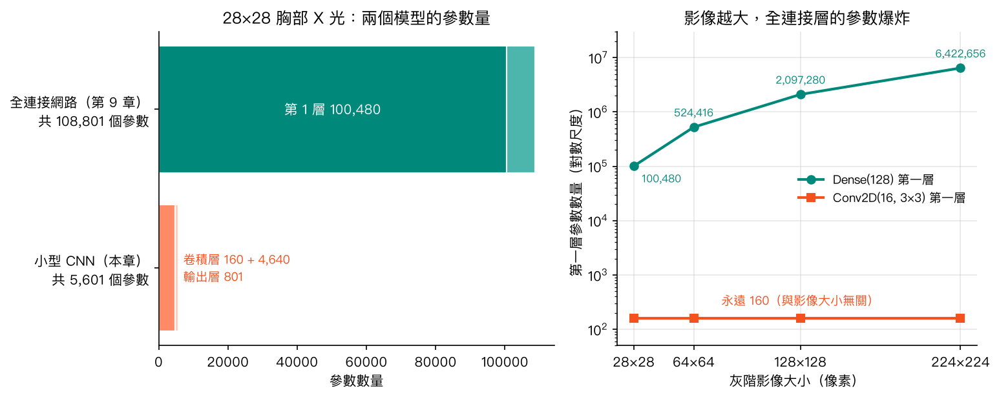
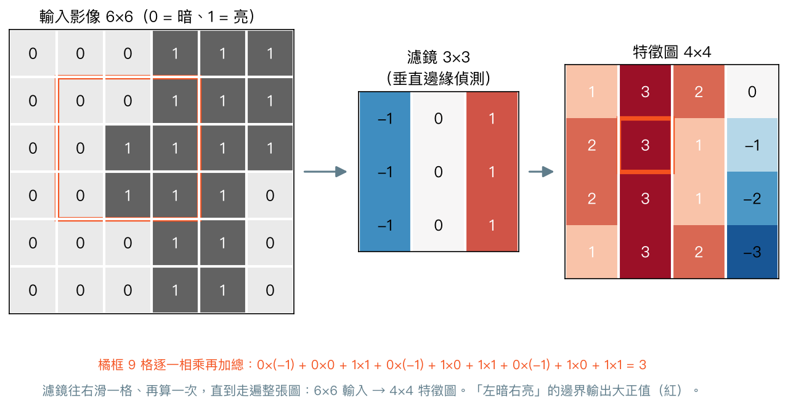
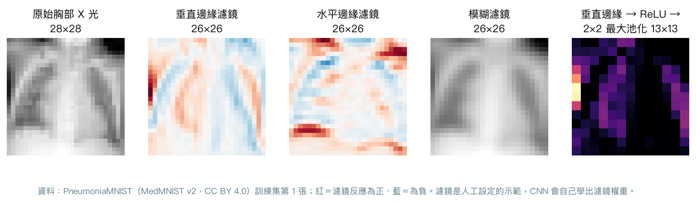
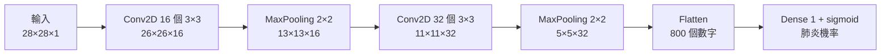

# 第 12 章　卷積神經網路（CNN）：讓模型看懂影像

<p class="chapter-meta">預計閱讀 30 分鐘 ・ 先備：第 9 章（Keras、損失、epoch、早停）、第 11 章（AUC、類別不平衡）</p>

!!! abstract "本章你會學到"
    - 說明全連接網路處理影像的兩個問題：參數爆炸、忽略像素的鄰居關係
    - 用「一個小濾鏡在片子上滑動」理解卷積、特徵圖、步幅、填補與池化
    - 算出卷積層的參數量，解釋為什麼權重共享讓 CNN 比全連接網路省參數
    - 用 Keras 3 在 PneumoniaMNIST 上建立小型 CNN，和第 9 章的全連接網路在同一份測試集上比較 AUC、敏感度、特異度
    - 認識 CNN 在醫學影像的代表研究，以及「捷徑學習」這類常見的失誤

<div class="nb-links" markdown>
[:simple-googlecolab: 在 Colab 開啟](https://colab.research.google.com/github/fireman333/ml-for-med-students/blob/main/docs/notebooks/ch12_cnn.ipynb){ .md-button .md-button--primary }
[:material-download: 下載 Notebook](../notebooks/ch12_cnn.ipynb){ .md-button }
</div>

## 1. 直覺：從一個臨床情境開始

回想你第一次跟放射科讀胸部 X 光。學長姐不會叫你「把整張片子的每一個點同時記住」，而是教你一套順序：先看邊緣與輪廓（肋骨、橫膈、心臟邊界），再看局部的紋理（肺紋理是否增加、有沒有一片模糊的浸潤），最後把這些局部發現組合起來，得出「右下肺葉肺炎」這種整體判讀。

這個讀片流程有兩個特點：

1. **先看局部**：判斷「這裡有沒有一條邊界」只需要看一小塊區域，不需要同時看整張片子。
2. **同一套眼光到處用**：你在左上肺找邊界的方法，和在右下肺找邊界的方法是同一套；不會因為位置不同就換一種看法。

第 9 章的全連接網路沒有這兩個特點。它把 28×28 的片子攤平成 784 個數字，第一層的每個神經元都要同時看全部 784 個像素，而且「左上角的那個像素」和「右下角的那個像素」各自有一個獨立的權重。對它來說，像素之間誰跟誰相鄰的資訊已經消失了；病灶往旁邊移兩格，就像換了一組完全不同的輸入。

卷積神經網路（convolutional neural network, CNN）正是把放射科的讀片習慣寫進網路結構：**用一個小小的偵測器在片子上到處掃，先找局部特徵，再一層層組合成整體判讀。**

## 2. 核心概念

### 2.1 全連接網路看影像的兩個問題

**問題一：參數爆炸。** 第 9 章的網路第一層有 128 個神經元，每個都連到 784 個像素，光這一層就有 784 × 128 + 128 = 100,480 個參數。28×28 已經是郵票大小的縮圖；換成臨床常見的 224×224，同樣的第一層會變成約 642 萬個參數。參數越多，需要的資料越多，也越容易過擬合（overfitting）。

**問題二：位置一換就不認得。** 全連接網路為每個像素位置各學一組權重。如果訓練資料裡的浸潤多半出現在右下肺，它對左上肺的浸潤可能就學得不好，因為那些位置的權重沒被充分訓練。

{ loading=lazy }

### 2.2 卷積：一個 3×3 小濾鏡在影像上滑動

卷積（convolution）的做法很簡單：準備一個 3×3 的小方格，稱為濾鏡（filter，又稱卷積核 kernel），裡面有 9 個權重。把它疊在影像左上角，**9 個權重和底下 9 個像素對應相乘、全部加起來**，得到一個數字；然後往右滑一格，再算一次；一列滑完就往下一列，直到走遍整張圖。所有位置算出來的數字排成一張新的圖，叫做特徵圖（feature map）。

{ loading=lazy }

上圖的濾鏡左行是 −1、右行是 +1，等於在問：「這一小塊的右邊比左邊亮多少？」遇到「左暗右亮」的邊界，輸出就是大正值；整塊一樣亮或一樣暗，左右抵銷，輸出接近 0。所以這個濾鏡是一個**垂直邊緣偵測器**。

換成真的胸部 X 光，效果如下：

{ loading=lazy }

垂直邊緣濾鏡凸顯了肋骨與縱膈的左右邊界，水平邊緣濾鏡凸顯了鎖骨與橫膈，模糊濾鏡則把每一格換成鄰居的平均。這幾個濾鏡是我們手動設定的；**CNN 的重點是濾鏡裡的 9 個數字不用人設計，而是當成權重，用第 9 章的反向傳播自動學出來**。

這就回答了第 1 節的兩個特點：濾鏡只看 3×3 的局部（先看局部）；同一個濾鏡在整張圖上重複使用（同一套眼光到處用）。後者稱為**權重共享（weight sharing）**：不論影像是 28×28 還是 224×224，一個 3×3 濾鏡永遠只有 9 個權重加 1 個偏差。

??? note "數學補充（可跳過）"
    設輸入影像為 $X$、濾鏡為 $K$（3×3）、偏差為 $b$，特徵圖在位置 $(i, j)$ 的值是

    $$ Y_{i,j} = \sum_{a=0}^{2}\sum_{b'=0}^{2} K_{a,b'}\, X_{i+a,\, j+b'} + b $$

    嚴格說，深度學習套件做的是「互相關（cross-correlation）」，數學上的卷積還要把濾鏡上下左右翻轉；因為濾鏡是學出來的，翻不翻轉沒有差別，所以大家仍叫它卷積。

    一個卷積層若輸入有 $C_{in}$ 個通道、輸出 $C_{out}$ 張特徵圖、濾鏡大小 $k \times k$，參數量為

    $$ (k \times k \times C_{in} + 1) \times C_{out} $$

    例如本章第二個卷積層：$(3 \times 3 \times 16 + 1) \times 32 = 4{,}640$。注意公式裡完全沒有影像的長寬。

### 2.3 通道、步幅與填補

**通道（channel）**：灰階 X 光每個像素只有一個亮度值，是 1 個通道；彩色的血球抹片每個像素有紅、綠、藍三個值，是 3 個通道。一個卷積層通常有很多個濾鏡（例如 16 個），每個濾鏡產生一張特徵圖，於是輸出就有 16 個通道。下一層的濾鏡會同時看這 16 張特徵圖的同一小塊，所以它的形狀其實是 3×3×16。

**步幅（stride）**：濾鏡每次滑幾格。步幅 1 是一格一格滑；步幅 2 是一次跳兩格，輸出的長寬大約減半。

**填補（padding）**：3×3 的濾鏡放不到影像最外圈的中心，所以 28×28 的輸入只會得到 26×26 的輸出。如果在外圍先補一圈 0，輸出就能維持 28×28。Keras 的 `padding="valid"`（預設）是不補，`padding="same"` 是補到輸出大小不變。

輸出邊長可以用一條公式算（$n$ 輸入邊長、$k$ 濾鏡大小、$p$ 填補圈數、$s$ 步幅，除不盡時無條件捨去）：

$$ \text{輸出邊長} = \frac{n + 2p - k}{s} + 1 $$

| 設定 | 計算 | 輸出 |
|---|---|---|
| 不填補、步幅 1 | (28 + 0 − 3) / 1 + 1 | 26×26 |
| 填補 1 圈、步幅 1 | (28 + 2 − 3) / 1 + 1 | 28×28 |
| 不填補、步幅 2 | (28 + 0 − 3) / 2 + 1 | 13×13 |

### 2.4 池化：縮小影像、保留最明顯的訊號

池化（pooling）把特徵圖切成 2×2 的小格，每格只留一個代表值。最常用的是最大池化（max pooling）：每格留最大值。它有三個作用：

- **縮小**：長寬各減半，後面的層要算的量少很多。
- **保留最強的訊號**：在這 2×2 範圍內「有沒有偵測到邊緣」比「邊緣精確在哪一格」更重要。
- **對小幅位移比較不敏感**：病灶往旁邊挪一格，池化後的結果常常不變（但本章模型最後攤平接全連接層，位置資訊仍會影響輸出，不是完全不受影響）。

池化層沒有任何要學的權重，只是一個固定的縮圖規則。

### 2.5 疊起來：從邊緣到形狀

一個典型的小型 CNN 就是「卷積 → 池化」重複幾次，最後攤平（flatten）接到一般的全連接輸出層。本章用的架構如下：



越往後，每個數字「看得到」的原始影像範圍越大，這個範圍叫做感受野（receptive field）。第一層的每格只看到 3×3 個像素；經過池化與第二層卷積後，每格已經涵蓋約 8×8 的區域。於是前面的層傾向偵測邊緣、亮暗變化這類**低階特徵**，後面的層把它們組合成較大範圍的**高階特徵**，有點像從「看到一條邊」進展到「看到一片浸潤的輪廓」。

不過要記得：這個「由低階到高階」的描述是幫助理解的比喻。CNN 學到的特徵**不保證**對應到人類的醫學概念，它也可能學到與疾病無關的線索，第 4 節會看到例子。

## 3. 動手做

完整程式在 notebook。前半段只用 NumPy 手刻卷積與池化（不需要 Keras）；後半段用 Keras 3，Colab 已預裝。數字來自本機實測（Keras 3.13、TensorFlow 2.20、CPU），`keras.utils.set_random_seed(42)` 只能固定大部分隨機性，你的結果會略有不同。

### 3.1 親手做一次卷積

先用最直白的雙層迴圈寫出卷積，對照 2.2 節的說明：

```python
def conv2d(img, kernel, stride=1, padding=0):
    """Plain 2D convolution (cross-correlation, as in deep learning libraries)."""
    if padding > 0:
        img = np.pad(img, padding)                       # zero padding around the border
    k = kernel.shape[0]
    out_size = (img.shape[0] - k) // stride + 1
    out = np.zeros((out_size, out_size))
    for i in range(out_size):
        for j in range(out_size):
            patch = img[i * stride:i * stride + k, j * stride:j * stride + k]
            out[i, j] = np.sum(patch * kernel)           # multiply element-wise, then sum
    return out
```

notebook 會把垂直邊緣、水平邊緣、模糊三個濾鏡套在同一張 X 光上，並印出不同步幅與填補下的輸出大小（26×26、28×28、13×13、14×14），和上面公式算的完全一致。

### 3.2 資料與對照組

資料用第 9 章同一份 PneumoniaMNIST（從 Zenodo 下載 `.npz`，程式與第 9 章相同）。為了公平比較，notebook 先原封不動重訓第 9 章的全連接網路當對照組。兩個模型唯一的資料差別在形狀：全連接網路吃攤平後的 `(n, 784)`，CNN 吃保留空間結構的 `(n, 28, 28, 1)`，最後那個 1 就是灰階的通道數。

```python
X = pneu[f"{split}_images"].astype("float32") / 255.0
X = X.reshape(-1, 28 * 28) if flat else X[..., None]          # (n, 784) or (n, 28, 28, 1)
```

### 3.3 建立小型 CNN

```python
cnn = keras.Sequential([
    keras.Input(shape=(28, 28, 1)),
    keras.layers.Conv2D(16, 3, activation="relu"),   # 16 filters of 3x3 -> 26x26x16
    keras.layers.MaxPooling2D(2),                    # -> 13x13x16
    keras.layers.Conv2D(32, 3, activation="relu"),   # 32 filters of 3x3x16 -> 11x11x32
    keras.layers.MaxPooling2D(2),                    # -> 5x5x32
    keras.layers.Flatten(),                          # -> 800 numbers
    keras.layers.Dropout(0.3),
    keras.layers.Dense(1, activation="sigmoid"),
])
cnn.compile(optimizer=keras.optimizers.Adam(learning_rate=1e-3),
            loss="binary_crossentropy",
            metrics=["accuracy", keras.metrics.AUC(name="auc")])
cnn.summary()
```

`Conv2D(16, 3)` 代表 16 個 3×3 濾鏡，`MaxPooling2D(2)` 是 2×2 最大池化。`summary()` 的結果：兩個卷積層分別是 160 與 4,640 個參數，輸出層 801 個，**全部只有 5,601 個參數**；第 9 章的全連接網路是 108,801 個，大約是 CNN 的 19 倍。

訓練設定（Adam、學習率 0.001、batch 64、以驗證損失做早停）和第 9 章相同，只是為了控制執行時間，CNN 最多訓練 15 個 epoch：

```python
hist_cnn = cnn.fit(Xi_tr, y_tr, validation_data=(Xi_va, y_va),
                   epochs=15, batch_size=64, verbose=2,
                   callbacks=[keras.callbacks.EarlyStopping(
                       monitor="val_loss", patience=5, restore_best_weights=True)])
```

本機 CPU 實測約 31 秒（全連接網路約 15 秒）；CNN 每個 epoch 要做大量的滑動相乘，所以參數雖少、訓練卻比較慢。在實測中，驗證損失到第 14 個 epoch 仍在下降，15 個 epoch 內早停沒有觸發，代表多訓練幾輪可能還有進步空間（留作練習）。

### 3.4 在同一份測試集上比較

最後才碰測試集（624 張），兩個模型用同樣的閾值 0.5：

| 指標 | 全連接網路（第 9 章） | 小型 CNN |
|---|---|---|
| 參數量 | 108,801 | 5,601 |
| 準確率（多數類基準 0.625） | 0.829 | 0.861 |
| AUC | 0.916 | 0.929 |
| 敏感度 | 0.982 | 0.962 |
| 特異度 | 0.573 | 0.692 |

「全部猜肺炎」的多數類基準準確率是 0.625，兩個模型都高於它。CNN 的 AUC 高 0.013，特異度從 0.57 提高到 0.69，代價是敏感度從 0.98 降到 0.96。

這 0.013 的差距可信嗎？notebook 用配對自助法（paired bootstrap）估計：從測試集有放回地重抽 624 張，兩個模型在同一批圖上各算一次 AUC、相減，重複 1,000 次。結果 AUC 差值的 95% 信賴區間為 0.006 到 0.020，沒有跨過 0。但解讀時請保守：

- 這個區間只反映**測試集抽樣**的變動，沒有包含**換一個隨機種子重新訓練**的變動。神經網路每次訓練的結果都會有些不同，只訓練一次就下結論，容易高估差距的穩定性。
- 測試集只有 624 張、來自單一醫學中心、解析度 28×28、沒有外部驗證。
- 比較恰當的說法是：**在這份測試集上，CNN 用大約 1/20 的參數，得到相近或略高的 AUC 與較高的特異度**，而不是「CNN 明顯比較好」。

真正讓 CNN 拉開差距的通常是更高的解析度、更深的網路與更多資料，這些放到第 13 章討論。

### 3.5 打開 CNN 看看

notebook 最後畫出第一個卷積層學到的 16 個濾鏡，以及一張肺炎 X 光通過這一層後的 16 張特徵圖：有些凸顯某個方向的邊緣，有些對整體亮度起反應。

### 3.6 練習：多類別的 BloodMNIST

BloodMNIST 是周邊血液抹片的單一細胞彩色影像（28×28×3），共 8 類血球。從二元改成多類別只要改兩處：輸出層改成 `Dense(8, activation="softmax")`（輸出 8 個加總為 1 的機率），損失改成 `sparse_categorical_crossentropy`；輸入形狀改成 `(28, 28, 3)`。只訓練 5 個 epoch，測試準確率約 0.79（多數類基準 0.195），但各類別差異很大：在實測中，platelet（血小板）、eosinophil（嗜酸性球）的敏感度都在 0.95 上下，monocyte（單核球）卻只有 0.19、basophil（嗜鹼性球）0.45。多類別問題一定要看混淆矩陣與各類別的表現，不能只看整體準確率。這一節要另外下載 35 MB，Colab 免費 CPU 上會比較久，可以開 GPU 或跳過。

## 4. 醫學案例：CNN 讀醫學影像的成就與陷阱

!!! info "僅供學習"
    本章使用公開教學資料集 PneumoniaMNIST 與 BloodMNIST（MedMNIST v2，CC BY 4.0），結果僅供學習，不構成臨床建議。

### 代表性研究

- **Kermany 等（Cell, 2018）**：PneumoniaMNIST 的原始影像就來自這篇研究。作者用遷移學習（transfer learning，第 13 章的主題）訓練 CNN，先分類視網膜 optical coherence tomography（OCT，光學同調斷層掃描）影像中的 age-related macular degeneration（AMD，老年性黃斑部病變）與 diabetic macular edema（糖尿病黃斑部水腫），表現與受測專家相當；再把同一套方法用在小兒胸部 X 光的肺炎判讀。
- **CheXNeXt（Rajpurkar 等，PLoS Medicine, 2018）**：一個 CNN 同時偵測正面胸部 X 光的 14 種異常，在 420 張驗證影像上和 9 位放射科醫師比較 AUC。14 項中有 10 項兩者的 AUC 差異未達統計顯著，3 項（cardiomegaly 心臟擴大、emphysema 肺氣腫、hiatal hernia 食道裂孔疝氣）放射科醫師顯著較高，1 項（atelectasis 肺塌陷）CNN 顯著較高。作者自己列出的限制包括：回溯性設計、讀片時不能參考病史與舊片、資料只來自單一機構。這類研究的正確讀法是「在某資料集、某回溯設計下，某些指標與受測醫師相當」，不是「AI 比醫師準」。

### 捷徑學習：模型學到的可能不是病

Zech 等人（PLoS Medicine, 2018）做了一個很有教育意義的研究。他們從三個醫療體系收集約 15.8 萬張胸部 X 光，訓練 CNN 判斷是否有肺炎。結果發現：

- CNN 能從片子本身辨認出影像來自哪一家醫院，正確率超過 99.9%。
- 其中一家醫院的肺炎盛行率是 34.2%，另一家只有 1.2%。**單純按「來自哪家醫院」排序，AUC 就有 0.861**——完全不用看肺部。
- 把兩院資料混在一起訓練的模型，在同院測試集 AUC 0.931，拿到第三家醫院外部驗證時降到 0.815。

也就是說，模型可能部分是靠「這張片子長得像那家肺炎很多的醫院」在做判斷，就像住院醫師發現「ICU 送來的片子比較常是肺炎」，於是靠送單單位猜診斷。這種現象叫做捷徑學習（shortcut learning）：模型找到一條在訓練資料上有效、但和疾病本身無關的捷徑。醫院的機型、片子上的側標文字、病人的擺位、是否已經放了管路，都可能成為捷徑。

捷徑學習的教訓：

1. **內部測試集表現好，不等於換一家醫院也好**，外部驗證不可少。
2. **多來源拼湊的資料集要特別小心**：如果疾病比例在各來源差很多，模型可能學到的是「來源」。
3. **漂亮的特徵圖或熱圖不代表推理正確**。第 13 章會介紹 Grad-CAM，它可以幫忙檢查模型「看哪裡」，但也有自己的限制。

回到本章的 PneumoniaMNIST：它只來自單一醫學中心、只有 28×28，我們的 AUC 0.93 完全沒有經過外部驗證，不能推論到任何臨床情境。

## 5. 互動體驗

### 卷積核在 X 光上滑動

選一張 X 光與一個濾鏡，按「下一步」看濾鏡一格一格滑過片子：左邊橘框是濾鏡目前的位置，右邊特徵圖對應的格子會被填上，下方顯示 9 個像素乘上 9 個權重的加總過程。你也可以直接改 9 個權重（例如把垂直邊緣濾鏡的正負號對調），或改步幅與填補，觀察輸出大小如何跟著公式變化。開啟填補時注意特徵圖的外框：補上的 0 和片子邊緣形成強烈的明暗落差，邊緣濾鏡會在那裡出現「假的」強反應。

<div class="demo-box">
  <div id="ch12-demo"></div>
  <div class="controls">
    <label>影像 <select id="ch12-img"></select></label>
    <label>濾鏡 <select id="ch12-preset"></select></label>
    <label>步幅 <select id="ch12-stride"><option value="1">1</option><option value="2">2</option></select></label>
    <label>填補 <select id="ch12-pad"><option value="0">0（valid）</option><option value="1">1（same）</option></select></label>
    <button type="button" id="ch12-step" class="md-button">下一步</button>
    <button type="button" id="ch12-play" class="md-button">自動播放</button>
    <button type="button" id="ch12-all" class="md-button">全部算完</button>
  </div>
  <p id="ch12-info" style="font-size:.75rem;margin:.4rem 0 0;"></p>
</div>

影像來源：PneumoniaMNIST 測試集（MedMNIST v2，CC BY 4.0；Yang 等，Scientific Data 2023）。

### CNN Explainer

CNN Explainer 在瀏覽器裡跑一個訓練好的小型 CNN，可以逐層點開看卷積、ReLU、池化與 softmax 各自做了什麼。建議點第一個卷積層的任一張特徵圖，觀察它是由上一層哪些通道、哪個濾鏡算出來的。

<iframe src="https://poloclub.github.io/cnn-explainer/" loading="lazy" title="CNN Explainer" style="width:100%;height:800px;border:1px solid var(--md-default-fg-color--lightest);border-radius:6px;"></iframe>

出處：[CNN Explainer](https://poloclub.github.io/cnn-explainer/)（Wang ZJ 等，Georgia Tech Polo Club of Data Science），授權 MIT（[原始碼](https://github.com/poloclub/cnn-explainer)）。頁面較大、手機上不易操作，建議[開新分頁](https://poloclub.github.io/cnn-explainer/){ target=_blank rel=noopener }使用。

## 6. 常見陷阱

!!! warning "陷阱 1：輸入少了通道維度"
    `Conv2D` 期待的輸入形狀是（張數, 高, 寬, 通道）。灰階影像從 `.npz` 讀出來是 `(n, 28, 28)`，直接丟進 `keras.Input(shape=(28, 28, 1))` 的模型會報形狀錯誤。用 `X[..., None]` 補上最後一維；彩色影像則是 `(28, 28, 3)`，不用補。

!!! warning "陷阱 2：小測試集上的小差距，當成「CNN 明顯比較好」"
    624 張測試集上 AUC 0.929 對 0.916，差距只有 0.013，而且只訓練一次。換個隨機種子、換一批病人，差距可能變大、變小或反轉。報告時附上信賴區間或明講「差距未必有意義」，並同時報告敏感度、特異度與多數類基準。

!!! warning "陷阱 3：把好看的特徵圖當成醫學上合理的證據"
    第一層特徵圖看起來像邊緣偵測，不代表模型的最終判斷依據是肺部病灶。Zech 2018 顯示 CNN 可以輕易辨認影像來自哪家醫院；只要疾病比例在各來源不同，這就是一條現成的捷徑。外部驗證比「看起來合理」更可靠。

!!! warning "陷阱 4：以為 CNN 天生不怕旋轉、翻轉、亮度改變"
    權重共享與池化讓 CNN 對**小幅平移**比較不敏感，但對旋轉、縮放、對比度改變並沒有天生的抵抗力。常見的做法是在訓練時隨機旋轉、平移、調亮度來擴充資料，這部分留到[第 13 章](13-transfer-learning.md)。

## 7. 小測驗

??? question "Q1. 一個 `Conv2D(8, 3)` 層接在 28×28 灰階影像後面（不填補、步幅 1），它有幾個參數？輸出形狀是什麼？"
    **答案：** 參數 8 × (3 × 3 × 1 + 1) = 80 個；輸出 26×26×8。參數量只和濾鏡大小、輸入通道數、濾鏡數有關，和影像長寬無關，這就是權重共享。

??? question "Q2. 把同一個 CNN 的輸入從 28×28 換成 224×224，第一個卷積層的參數量會怎麼變？全連接網路的第一層呢？"
    **答案：** 卷積層的參數量不變（濾鏡還是 3×3）；全連接層的第一層參數量會隨像素數成比例增加，從約 10 萬變成約 642 萬（以 128 個神經元計）。

??? question "Q3. 某研究的 CNN 在同院測試集 AUC 0.95，換到另一家醫院只剩 0.80。可能的原因有哪些？"
    **答案：** 可能是模型學到了與疾病無關的捷徑（醫院機型、側標文字、擺位、疾病盛行率差異等），或兩院病人族群、影像設備不同。這正是為什麼醫學影像模型需要外部驗證。

## 8. 重點整理

- 全連接網路處理影像有兩個問題：參數隨像素數爆炸、忽略像素的鄰居關係。
- 卷積＝一個小濾鏡在影像上滑動，每個位置「對應相乘再加總」，得到特徵圖；濾鏡的權重是學出來的。
- 權重共享：同一個濾鏡在整張圖上重複使用，卷積層的參數量為（k × k × 輸入通道 + 1）× 濾鏡數，與影像大小無關。
- 輸出邊長＝（n + 2p − k）/ s + 1；填補可維持大小，步幅與池化會縮小影像。
- 典型小型 CNN：卷積 → 池化重複幾次 → 攤平 → 全連接輸出；越後面的層感受野越大、特徵越抽象。
- 在 PneumoniaMNIST 上，小型 CNN 用約 1/20 的參數得到相近或略高的 AUC（0.929 對 0.916）與較高的特異度；測試集小、只訓練一次、未經外部驗證，差距要保守解讀。
- 多類別：輸出層改成 softmax，並用混淆矩陣檢查各類別表現。
- 捷徑學習（Zech 2018）提醒我們：內部測試好看不等於可以推論到別家醫院。

## 延伸閱讀

- [CNN Explainer](https://poloclub.github.io/cnn-explainer/) — 在瀏覽器裡逐層看 CNN 的運算，本章互動區的完整版（MIT）。
- [Dive into Deep Learning：Convolutional Neural Networks](https://d2l.ai/chapter_convolutional-neural-networks/index.html) — 從全連接層的限制推導出卷積，附程式實作（CC BY-SA 4.0）。
- [李宏毅 Machine Learning 2021 Spring](https://speech.ee.ntu.edu.tw/~hylee/ml/2021-spring.php) — 中文授課，CNN 那一講用「偵測局部圖樣＋同一個偵測器到處用」解釋卷積，非常直覺。
- [Zech JR, et al. Variable generalization performance of a deep learning model to detect pneumonia in chest radiographs（PLoS Med, 2018）](https://doi.org/10.1371/journal.pmed.1002683) — 捷徑學習與外部驗證的經典案例，開放取用。
- [Rajpurkar P, et al. Deep learning for chest radiograph diagnosis: CheXNeXt（PLoS Med, 2018）](https://doi.org/10.1371/journal.pmed.1002686) — CNN 與放射科醫師的回溯性比較，開放取用。
- [Yang J, et al. MedMNIST v2（Scientific Data, 2023）](https://doi.org/10.1038/s41597-022-01721-8) — PneumoniaMNIST 與 BloodMNIST 的出處。

<script src="../../assets/js/demos/ch12-conv-data.js"></script>
<script src="../../assets/js/demos/ch12-conv.js"></script>
