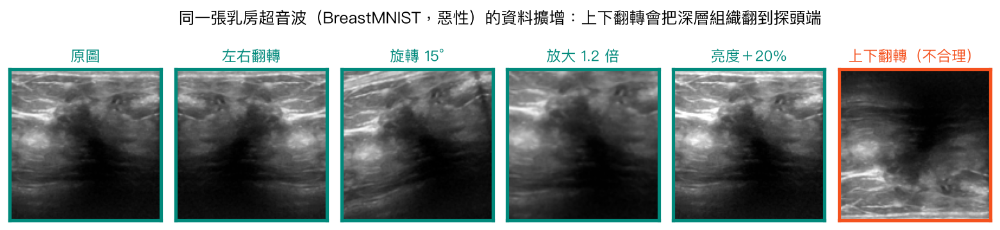
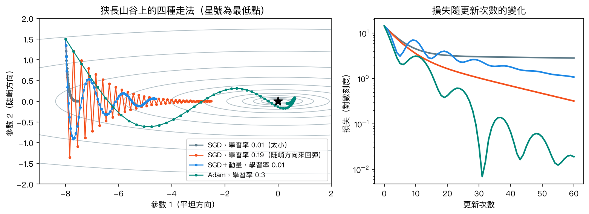
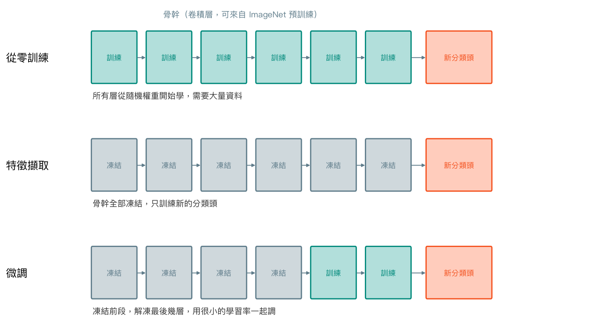
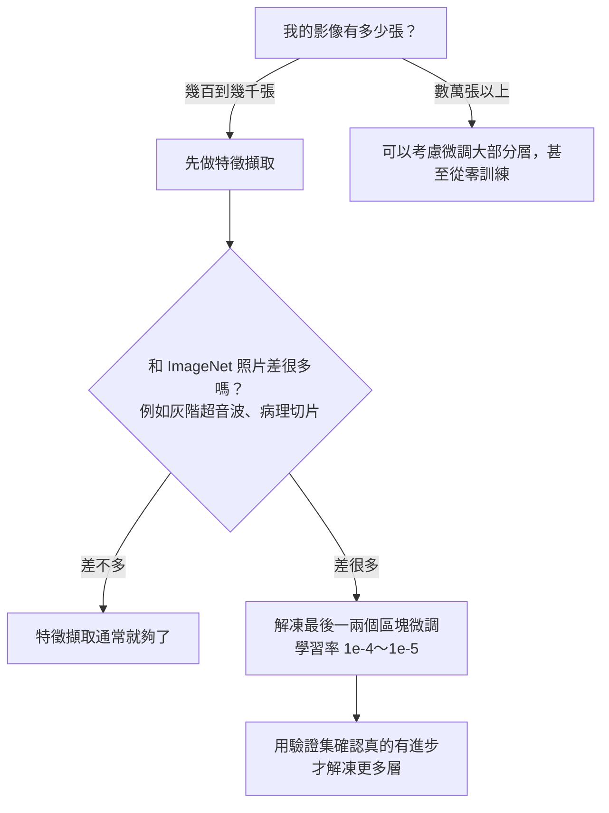
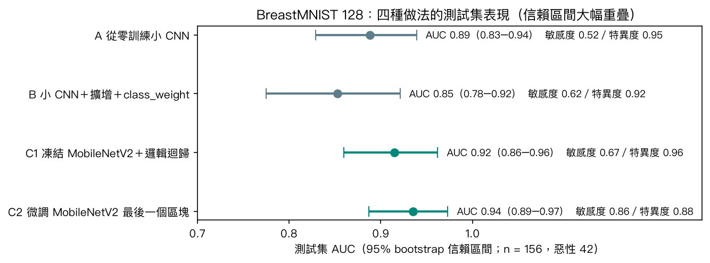
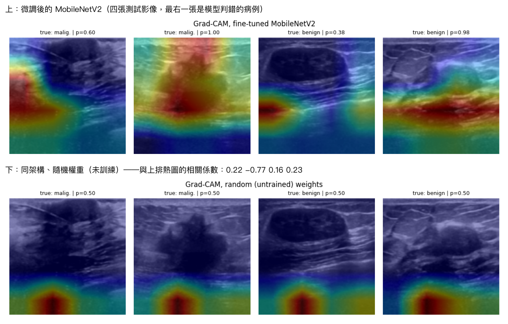

# 第 13 章　訓練深度網路的實戰技巧與遷移學習

<p class="chapter-meta">預計閱讀 35 分鐘 ・ 先備：第 12 章（卷積神經網路）</p>

!!! abstract "本章你會學到"
    - 判斷哪些資料擴增在醫學影像上合理、哪些會造出不存在的影像
    - 用直覺說明學習率、動量與 Adam，以及批次正規化在做什麼
    - 用 `class_weight` 與 callbacks（EarlyStopping、ModelCheckpoint）把訓練流程整理乾淨
    - 區分遷移學習的兩種用法：凍結骨幹做特徵擷取，以及解凍最後幾層微調
    - 實作 Grad-CAM 熱圖，並說出「熱圖好看不代表模型對」的理由

<div class="nb-links" markdown>
[:simple-googlecolab: 在 Colab 開啟](https://colab.research.google.com/github/fireman333/ml-for-med-students/blob/main/docs/notebooks/ch13_transfer-learning.ipynb){ .md-button .md-button--primary }
[:material-download: 下載 Notebook](../notebooks/ch13_transfer-learning.ipynb){ .md-button }
</div>

## 1. 直覺：從一個臨床情境開始

想像兩位第一天到乳房外科跟診的人。一位是沒學過醫的新人，一位是住院醫師。主治給他們 500 張乳房超音波，請他們學會分辨良惡性。

新人得從「什麼是邊緣、哪裡是皮膚哪裡是肌肉」學起，500 張根本不夠，他很可能只記住某幾張片子的長相，換一批病人就不會了。住院醫師不一樣：解剖、一般影像判讀這些底子早就有了，他只需要把注意力放在「邊緣不規則、縱橫比、後方聲影」這些專科線索上，500 張就能學得有模有樣。

深度學習裡的**遷移學習**（transfer learning）就是第二種學法：先拿一個已經在上百萬張一般照片上練過「看東西」的網路，再用少量醫學影像教它專科判讀。醫學影像研究幾乎都卡在「有專家標註的影像很少」，所以這一章的技巧在實務上非常常用。

本章用 BreastMNIST（只有 546 張訓練影像），先看從零訓練的 CNN 卡在哪裡，再加上訓練技巧與遷移學習，最後用 Grad-CAM 檢查模型在看哪裡。卷積、池化這些基礎請見[第 12 章](12-cnn.md)，這裡不再重講。

## 2. 核心概念

### 2.1 小資料的困境

一個三層卷積的小 CNN 有二十八萬多個參數，訓練影像卻只有 546 張。就像第 9 章看過的，參數比資料多時，模型很容易把訓練集「背起來」：在 notebook 的實測中，訓練損失一路降到 0.10，驗證損失卻在第 13 個 epoch 就觸底，之後不再下降、反而上下跳動。後面幾節的技巧，都是在對付這個問題。

### 2.2 資料擴增：合理的變化，不是亂變

**資料擴增**（data augmentation）是在訓練時把每張影像隨機做一點變化——翻轉、旋轉、縮放、調亮度——讓模型每個 epoch 看到的都是「稍微不一樣的同一個病灶」。它的前提是：**這些變化不改變答案**。一顆惡性腫塊稍微轉個 15 度，仍然是惡性。

{ loading=lazy }

醫學影像的擴增要先問「真實世界會不會出現這張圖」：

- **超音波**：上方永遠是靠近探頭的淺層組織，上下翻轉會造出不存在的影像。左右翻轉通常可以，因為掃描方向本來就可能左右相反。
- **胸部 X 光**：左右翻轉會把心臟翻到右邊，等於造出 dextrocardia（右位心），而且會讓 L/R 側標反過來；多數研究只用小角度旋轉與縮放。
- **病理切片**：組織沒有固定方向，任意旋轉與翻轉都合理，但染色調整別超出真實範圍。

在 Keras 裡，擴增是模型的前幾層（`RandomFlip`、`RandomRotation`、`RandomZoom`），只在訓練時作用，預測時自動關閉。

### 2.3 學習率與最佳化器

第 9 章說過，梯度下降像蒙眼下山，**學習率**（learning rate）是每一步的步伐。真實的損失地形常常是「狹長的山谷」：一個方向很陡、另一個方向幾乎是平的。下圖在這種山谷上比較四種走法：

{ loading=lazy }

- **SGD**（隨機梯度下降）：學習率小，在平坦方向幾乎走不動（灰線）；調大一點，平坦方向進步了，卻在陡峭方向左右彈跳（橘線）。notebook 裡學習率從 0.15 調到 0.21，100 步後的損失就從 0.16 暴增到約 2×10⁹。
- **動量**（momentum）：把過去幾步的方向累積起來，像推一顆有重量的球下坡。平坦方向越滾越快，陡峭方向的左右晃動會互相抵消一部分。
- **Adam**：替每個參數各自調整步伐——一直很陡的方向自動縮小步伐、一直很平的方向自動放大。對入門者最省心的預設選擇是 `Adam(learning_rate=1e-3)`。

微調預訓練模型時，學習率要再降一到兩個數量級（`1e-4`～`1e-5`），因為預訓練的權重已經在不錯的位置，大步伐反而會把學到的東西洗掉。訓練途中「卡住」時，`ReduceLROnPlateau` 會自動把學習率減半，相當於快到谷底時放慢腳步。

??? note "數學補充（可跳過）"
    令 $g_t$ 為第 $t$ 步的梯度、$\eta$ 為學習率。

    SGD：$\theta_{t} = \theta_{t-1} - \eta\, g_t$

    動量（$\beta = 0.9$）：$v_t = \beta v_{t-1} + g_t$，$\theta_t = \theta_{t-1} - \eta\, v_t$

    Adam：分別追蹤梯度的移動平均 $m_t$ 與梯度平方的移動平均 $s_t$，

    $$ m_t = \beta_1 m_{t-1} + (1-\beta_1) g_t,\quad s_t = \beta_2 s_{t-1} + (1-\beta_2) g_t^2,\quad \theta_t = \theta_{t-1} - \eta\,\frac{\hat m_t}{\sqrt{\hat s_t}+\epsilon} $$

    其中 $\hat m_t, \hat s_t$ 是校正初期偏差後的值，預設 $\beta_1=0.9,\ \beta_2=0.999$。除以 $\sqrt{\hat s_t}$ 就是「每個參數各自調步伐」的來源。

### 2.4 批次正規化

**批次正規化**（batch normalization）在網路中間插一層，把每一批資料在該層的輸出重新調整成平均約 0、標準差約 1，再讓模型自己學要不要放大或平移。直覺上像第 3 章的標準化，只是對象從「輸入特徵」換成「網路每一層的中間結果」。它讓深網路比較好訓練；MobileNetV2 幾乎每個卷積後面都接一層。

它有兩個要記得的地方：

1. 訓練時用「這一批」的統計量，預測時改用訓練期間累積的平均值；批次太小時統計量很不穩。在小資料、小批次的情況下，加上批次正規化反而可能讓驗證損失劇烈跳動——不是加了就一定比較好，可以在 notebook 練習 2 自己試試看。
2. 微調預訓練模型時，批次正規化層通常**保持凍結**、以推論模式執行，否則小批次的醫學影像統計量會把 ImageNet 上學到的平均數與變異數覆蓋掉。

### 2.5 類別不平衡與 callbacks

BreastMNIST 的訓練集裡，惡性只占 27%（147／546）。第 11 章談過類別不平衡；在 Keras 裡最簡單的處理是 `class_weight`：讓少數類別的錯誤在損失裡罰得比較重。我們用「總數 ÷（2 × 該類別數）」計算，惡性權重 1.86、良性 0.68。

訓練過程的雜事交給 **callbacks**（回呼）處理，它們會在每個 epoch 結束時自動被呼叫：

| callback | 做什麼 | 常用設定 |
|---|---|---|
| `EarlyStopping` | 驗證指標連續幾個 epoch 沒進步就停，並還原最佳權重 | `monitor="val_loss", patience=8, restore_best_weights=True` |
| `ModelCheckpoint` | 把目前最好的模型存成檔案 | 檔名用 `.keras`（Keras 3 原生格式），`save_best_only=True` |
| `ReduceLROnPlateau` | 卡住時降低學習率 | `factor=0.5, patience=4` |

### 2.6 遷移學習：特徵擷取與微調

在 ImageNet（約 120 萬張、1,000 類一般照片）上預訓練的 CNN，前面幾層學會了邊緣、紋理、形狀這類**通用的視覺特徵**，後面幾層則越來越專門（「這是貓耳朵」）。遷移學習就是把前面這段**骨幹**（backbone）借過來，換上自己的分類頭。

{ loading=lazy }

- **特徵擷取**（feature extraction）：骨幹完全**凍結**（frozen），每張影像通過骨幹變成一串數字（MobileNetV2 是 1,280 個），再接任何分類器——甚至是第 4 章的邏輯迴歸。最快、最不容易過擬合。
- **微調**（fine-tuning）：先用特徵擷取把分類頭訓練好，再**解凍**最後幾層，用很小的學習率一起調。讓骨幹的高階特徵往超音波的方向修正一點。

要解凍多少層？下面是常見的判斷流程：



預訓練模型可以從 `keras.applications` 一行載入。本章用 MobileNetV2（約 226 萬參數，為手機設計的輕量網路），權重第一次執行時從 Google 的伺服器下載約 9 MB。

## 3. 動手做

完整程式在 notebook。資料直接從 Zenodo 下載 MedMNIST 的 `breastmnist_128.npz`（約 11 MB），寫法和第 9 章相同，下載失敗會印出清楚訊息。原始標籤 0 是惡性，我們用 `y = 1 - label` 讓惡性當陽性。小 CNN 為了在 CPU 上省時間，把影像縮成 64×64；遷移學習用完整的 128×128。

### 3.1 從零訓練與加上擴增

小 CNN 的寫法用一個函式包起來，參數決定要不要加擴增：

```python
def small_cnn(augment=False, batchnorm=False, dropout=0.0):
    layers = [keras.Input(shape=(64, 64, 1))]
    if augment:
        layers += [keras.layers.RandomFlip("horizontal"),     # left-right flip only
                   keras.layers.RandomRotation(0.05),           # about +/- 18 degrees
                   keras.layers.RandomZoom(0.1)]
    for filters in (16, 32, 64):
        layers.append(keras.layers.Conv2D(filters, 3, padding="same", use_bias=not batchnorm))
        if batchnorm:
            layers.append(keras.layers.BatchNormalization())
        layers += [keras.layers.Activation("relu"), keras.layers.MaxPooling2D()]
    layers += [keras.layers.Flatten(), keras.layers.Dropout(dropout),
               keras.layers.Dense(64, activation="relu"),
               keras.layers.Dense(1, activation="sigmoid")]
    return keras.Sequential(layers)
```

基準 A 不加任何技巧、跑滿 20 個 epoch；基準 B 加上擴增、Dropout 0.5、`class_weight` 與三個 callbacks：

```python
callbacks = [
    keras.callbacks.EarlyStopping(monitor="val_loss", patience=8, restore_best_weights=True),
    keras.callbacks.ModelCheckpoint("data/ch13_cnn_aug_best.keras", monitor="val_loss", save_best_only=True),
    keras.callbacks.ReduceLROnPlateau(monitor="val_loss", factor=0.5, patience=4, min_lr=1e-5),
]
model_b = small_cnn(augment=True, dropout=0.5)
model_b.compile(optimizer=keras.optimizers.Adam(learning_rate=1e-3),
                loss="binary_crossentropy", metrics=[keras.metrics.AUC(name="auc")])
hist_b = model_b.fit(Xg_tr, y_tr, validation_data=(Xg_va, y_va), epochs=25, batch_size=32,
                     class_weight=class_weight, callbacks=callbacks, verbose=0)
```

存下的 `.keras` 檔可以用 `keras.models.load_model()` 讀回來，交給別人或下次繼續訓練。

### 3.2 特徵擷取：MobileNetV2 ＋ 邏輯迴歸

灰階影像複製成 3 個通道、用 `preprocess_input` 縮放到 −1～1，再載入預訓練骨幹。下載包在 `try/except` 裡，網路不通時會說明原因而不是讓整本 notebook 中斷：

```python
from keras.applications import mobilenet_v2

def to_rgb(X_):
    return mobilenet_v2.preprocess_input(np.repeat(X_[..., None], 3, axis=-1).astype("float32"))

try:
    base = keras.applications.MobileNetV2(input_shape=(128, 128, 3), include_top=False, weights="imagenet")
except Exception as e:
    print("Could not download the ImageNet weights for MobileNetV2:", repr(e))
```

notebook 把骨幹切成兩段：下段（到倒數第二個區塊）只算一次並存起來，上段（最後一個區塊＋最後一層卷積）之後再決定要不要訓練。對 546 張影像抽出 1,280 個特徵後，直接接第 4 章的邏輯迴歸：

```python
clf = make_pipeline(StandardScaler(), LogisticRegression(C=0.1, max_iter=2000))
clf.fit(F_tr, y_tr)
p_c1 = clf.predict_proba(F_te)[:, 1]
```

### 3.3 微調最後一個區塊

分兩階段：先只訓練新的分類頭（1,281 個參數），再解凍最後一個區塊的卷積層（批次正規化層維持凍結），用 `learning_rate=1e-4` 一起調，可訓練參數增加到 88 萬個：

```python
upper.trainable = True
for layer in upper.layers:
    if isinstance(layer, keras.layers.BatchNormalization):
        layer.trainable = False          # keep the pretrained statistics
model_c.compile(optimizer=keras.optimizers.Adam(learning_rate=1e-4),
                loss="binary_crossentropy", metrics=[keras.metrics.AUC(name="auc")])
```

因為下段的輸出已經算好，每個 epoch 只需算最後一個區塊，CPU 也跑得動；代價是這種做法無法同時做資料擴增。要「擴增＋解凍更多層」的完整微調，建議開 GPU。

### 3.4 結果

{ loading=lazy }

實測（Keras 3.13、TensorFlow 2.20，筆電 CPU，整本 notebook 約 2 分鐘；不同版本與硬體數字會略有不同）：

| 做法 | 測試 AUC（95% CI） | 敏感度 | 特異度 | 訓練時間 |
|---|---|---|---|---|
| A 從零訓練小 CNN | 0.888（0.829–0.939） | 0.52 | 0.95 | 約 20 秒 |
| B ＋擴增＋Dropout＋class_weight | 0.853（0.775–0.921） | 0.62 | 0.92 | 約 35 秒 |
| C1 凍結 MobileNetV2＋邏輯迴歸 | 0.915（0.860–0.962） | 0.67 | 0.96 | 特徵擷取約 10 秒 |
| C2 微調最後一個區塊 | 0.935（0.887–0.973） | 0.86 | 0.88 | 約 20 秒 |

怎麼讀這張表：

1. **四條信賴區間大幅重疊**。測試集只有 156 張、其中惡性 42 張，C2 比 A 高 0.05 的 AUC，在這個樣本數下**差距未必有意義**。我們只跑了一個隨機種子，也沒有做正式檢定。
2. **B 沒有比 A 好**。擴增、Dropout、`class_weight` 一次加三樣，結果 AUC 反而略低（同樣在信賴區間內）。技巧不保證有效，要比較才知道；一次加太多樣，也無法分辨是哪一項造成的（notebook 練習 4）。
3. 遷移學習的兩種做法 AUC 都落在較高的位置，C1 更是不用訓練任何卷積層。這和「小資料時預訓練模型通常是較好的起點」的經驗一致，但本例本身不足以證明。
4. 敏感度與特異度取決於閾值 0.5。C2 敏感度較高，部分原因是訓練時用了 `class_weight`。比鑑別力看 AUC；臨床怎麼用，要依用途重選閾值（第 11 章）。

## 4. 醫學案例：Grad-CAM 與「模型在看哪裡」

!!! info "僅供學習"
    本例使用公開教學資料集 BreastMNIST，結果僅供學習，不構成臨床建議。

### 資料與它的問題

BreastMNIST 是 MedMNIST v2 的子集（授權 CC BY 4.0），來自 Al-Dhabyani 等人 2020 年公開的 BUSI 乳房超音波資料集（單一醫院、780 張），MedMNIST 將它縮成 128×128 並分成訓練 546、驗證 78、測試 156 張。

BUSI 在 2023 年被 Pawłowska 等人檢查過，發現：約 19%（155 張）是其他影像的重複或近似重複、70 張拍的其實是腋下而非乳房、至少 19 張的類別標籤有疑問，而且許多影像上有**測量游標與文字標註**，常常直接標在病灶上。BreastMNIST 的總數也是 780 張，**推測**沿用了原始集合而沒有剔除這些重複；若同一顆腫瘤的近似影像同時落在訓練與測試集，測試成績會偏高。我們沒有逐張核對，但上一節的 AUC 0.9 多，要打上一個大問號。

### Grad-CAM 怎麼做

**Grad-CAM**（Gradient-weighted Class Activation Mapping）回答一個問題：「這次的輸出，主要受影像哪些區域影響？」步驟：

1. 取骨幹最後一層卷積的特徵圖。MobileNetV2 在 128×128 輸入時，這層只有 **4×4 格**、1,280 個通道。
2. 計算「惡性分數（sigmoid 之前的 logit）對每個通道的梯度」，在空間上平均，當作該通道的重要性。
3. 用重要性把 1,280 張特徵圖加權相加、只保留正值，放大回 128×128 疊在原圖上。

```python
with tf.GradientTape() as tape:
    fmap = upper_m(z, training=False)        # (1, 4, 4, 1280)
    tape.watch(fmap)
    logit = head_m(fmap, training=False)     # malignant score before sigmoid
grads = tape.gradient(logit, fmap)[0]
channel_w = tf.reduce_mean(grads, axis=(0, 1))
cam = tf.nn.relu(tf.reduce_sum(fmap[0] * channel_w, axis=-1))
```

注意第 1 步：熱圖原本只有 16 個格子，看起來平滑是因為被內插放大了。

{ loading=lazy }

上排是微調後的模型。第二張惡性病例（機率 1.00），熱區落在腫塊與它後方的聲影上，看起來「很合理」。但第一張惡性病例的熱區在影像左緣，第三張良性病灶的熱區也在左緣；第四張良性病灶被判為惡性（機率 0.98），熱區落在病灶下方的深層組織帶。

### 熱圖好看，不代表模型對

這是本章最重要的一段。

- **Grad-CAM 只說「哪裡影響了輸出」，不說「推理是否正確」**。像學生圈出重點：圈對位置，不代表理由對。Ghassemi、Oakden-Rayner 與 Beam 在 2021 年的評論中主張，這類事後解釋無法保證單一病人的預測可信，臨床上更該依賴嚴謹的驗證。
- **熱圖定位本身也不準**。Saporta 等人 2022 年用胸部 X 光系統性比較多種 saliency 方法，發現它們定位病灶的表現低於人類基準。本例 4×4 的解析度更粗。
- **解釋方法要先通過健全性檢查**。Adebayo 等人 2018 年提出：把模型權重換成隨機數字，解釋圖應該要明顯改變；他們發現部分方法（例如 Guided Backprop）在權重隨機化後圖仍然很相似，代表那些圖反映的多半是影像本身的邊緣。上圖下排就是這個檢查：隨機權重模型的熱圖不管哪張影像都集中在下方中央，和訓練後的熱圖相關係數只有 −0.77～0.23，Grad-CAM 在這裡**通過**了檢查。不過這是最粗的版本：隨機權重模型對每張影像的輸出幾乎都是 0.50，本來就和任何熱圖都不像；更嚴格的做法是 Adebayo 提出的逐層隨機化。而且就算通過，也只代表熱圖確實跟模型學到的東西有關，不代表模型看對。
- **熱圖最實用的地方，是抓捷徑學習**（shortcut learning）。模型可能學到的不是病灶，而是和答案剛好相關的其他線索：Zech 等人 2018 年（第 12 章介紹過）發現胸部 X 光模型能以極高準確率辨認影像來自哪家醫院，而各院肺炎盛行率不同，模型便可借此「猜」診斷，換到外院時表現下降；Winkler 等人 2019 年發現皮膚上的手術筆圈記會提高 CNN 判為惡性的機率。BUSI 影像上的測量游標也是同一類風險——醫師多半會量可疑的病灶。熱圖若一再落在游標、文字或影像邊緣，就是該回頭檢查資料的訊號。

### 從回溯性成績到臨床

就算測試集表現很好，距離臨床使用還很遠。糖尿病視網膜病變是最完整的例子：Gulshan 等人 2016 年在兩個回溯性驗證集上得到 AUC 0.991 與 0.990，作者也寫明仍需研究能否改善照護；Beede 等人 2020 年到泰國診所觀察實際使用，發現照片品質、網路連線與工作流程都會讓系統無法順利運作；Ruamviboonsuk 等人 2022 年才在泰國 9 個基層站做前瞻性研究（7,651 人），報告敏感度 91.4%、特異度 95.4%，並強調工作流程與環境因素。另一個系統 IDx-DR 則以預先登記終點的樞紐試驗（900 人）取得美國 FDA 授權。

法規面，美國 FDA 公開的 AI 醫材清單在 2026-10-06 擷取時列有 1,614 筆（頁面標示內容更新於 2026-09-04；FDA 自己註明清單並不完整）。台灣食藥署（TFDA）則在 2020-09-11 公告《人工智慧/機器學習技術之醫療器材軟體查驗登記技術指引》。本章的模型連外部驗證都還沒做。

## 5. 互動體驗：學習率太大會怎樣？

在最簡單的損失 $L(w) = w^2$ 上做 20 步梯度下降（起點 $w = 4$）。拖動滑桿改變學習率，左圖是每一步在山谷上的位置，右圖是損失隨更新次數的變化（對數刻度）。試試 0.01、0.1、0.5、0.9 與 1.1。

<div class="demo-box">
  <div id="ch13-demo"></div>
  <div id="ch13-curve"></div>
  <div class="controls">
    <label>學習率（對數刻度） <input type="range" id="ch13-lr" min="-2" max="0.1" step="0.02" value="-1"> <span id="ch13-lr-val">0.10</span></label>
  </div>
  <p id="ch13-info" style="font-size:.75rem;margin:.4rem 0 0;"></p>
</div>

## 6. 常見陷阱

!!! warning "陷阱 1：擴增造出不存在的影像"
    「多翻幾種，資料就變多」是錯的。上下翻轉超音波、左右翻轉胸部 X 光，都在教模型認識真實世界不會出現的影像。每加一種擴增，先問：同一個病人換個角度拍，真的可能長這樣嗎？

!!! warning "陷阱 2：微調時學習率太大、或解凍了批次正規化"
    預訓練權重已經在不錯的位置。用 `1e-3` 微調整個骨幹，前幾個 epoch 就可能把通用特徵洗掉；讓批次正規化層用小批次醫學影像重新統計，也會破壞預訓練的狀態。先凍結骨幹訓練分類頭，再小學習率（`1e-4`～`1e-5`）解凍少數幾層。

!!! warning "陷阱 3：預處理和預訓練模型不一致"
    每個 `keras.applications` 模型都有自己的 `preprocess_input`：MobileNetV2 要 −1～1，EfficientNet 要 0～255。灰階醫學影像也要先複製成 3 個通道。用錯不一定會報錯，只會讓結果默默變差。

!!! warning "陷阱 4：拿熱圖當作模型可信的證據"
    在論文或簡報裡放幾張「熱圖剛好落在病灶上」的例子很有說服力，但那可能是挑過的。熱圖應該拿來找問題（捷徑、標註、邊框），而不是證明模型正確；模型可不可信，要看外部驗證與前瞻性研究。

## 7. 小測驗

??? question "Q1. 你有 800 張皮膚鏡影像要分良惡性，哪個起點最合理？（a）50 層新 CNN 從零訓練（b）預訓練骨幹做特徵擷取，再視驗證結果微調最後幾層（c）影像攤平後丟進全連接網路"
    **答案：** (b)。資料只有幾百張時，預訓練骨幹提供的通用特徵通常是比從零訓練更好的起點；(c) 丟掉了空間結構（第 12 章）。

??? question "Q2. 某模型偵測氣胸的 AUC 很高，Grad-CAM 顯示熱區常落在胸管上。這代表什麼？"
    **答案：** 模型可能學到「有胸管＝有氣胸」的捷徑。已放胸管的病人多半已被診斷並處理，真正需要模型幫忙的是還沒放胸管的病人，應該另外評估這個子群的表現。

??? question "Q3. 把模型權重換成隨機數字後，某解釋方法產生的熱圖幾乎沒變。你會怎麼解讀？"
    **答案：** 這個解釋方法沒通過健全性檢查，它的圖主要反映影像本身的邊緣與亮度，而不是模型學到的東西，不宜用來解釋這個模型的判斷。

## 8. 重點整理

- 資料擴增只能做「真實世界可能出現」的變化：超音波不上下翻、胸部 X 光不左右翻。
- Adam（`learning_rate=1e-3`）是好起點；微調預訓練模型時把學習率降到 `1e-4`～`1e-5`。批次正規化讓深網路好訓練，但小批次時不穩，微調時通常保持凍結。
- 用 `class_weight` 處理類別不平衡；用 EarlyStopping、ModelCheckpoint（存 `.keras`）、ReduceLROnPlateau 管理訓練。
- 遷移學習兩種用法：凍結骨幹做特徵擷取（快、穩），或解凍最後幾層微調（可能更好，但要小心學習率與過擬合）。
- 本例四種做法的測試 AUC 介於 0.85～0.94，但信賴區間大幅重疊，差距未必有意義；資料本身也有重複與標註問題。
- Grad-CAM 告訴你「哪裡影響了輸出」，不告訴你「推理對不對」；它最大的用途是抓捷徑學習。模型可不可信，要靠外部驗證與前瞻性研究。

## 延伸閱讀

- [Keras 官方指南：Transfer learning & fine-tuning](https://keras.io/guides/transfer_learning/) — 凍結、解凍與批次正規化的官方說明。
- [fast.ai Practical Deep Learning for Coders](https://course.fast.ai/) — 第一課就用遷移學習，再回頭拆原理。
- [Selvaraju RR, et al. Grad-CAM（Int J Comput Vis, 2020）](https://doi.org/10.1007/s11263-019-01228-7) — Grad-CAM 原始論文。
- [Adebayo J, et al. Sanity Checks for Saliency Maps（NeurIPS 2018）](https://arxiv.org/abs/1810.03292) — 解釋方法的健全性檢查。
- [Ghassemi M, Oakden-Rayner L, Beam AL. The false hope of current approaches to explainable AI in health care（Lancet Digit Health, 2021）](https://pubmed.ncbi.nlm.nih.gov/34711379/) — 為什麼事後解釋不能取代嚴謹驗證。
- [Saporta A, et al. Benchmarking saliency methods for chest X-ray interpretation（Nat Mach Intell, 2022）](https://doi.org/10.1038/s42256-022-00536-x) — saliency 方法定位病灶的系統性比較。
- [Zech JR, et al. Variable generalization performance of a deep learning model to detect pneumonia in chest radiographs（PLoS Med, 2018）](https://pubmed.ncbi.nlm.nih.gov/30399157/) — 跨醫院外部驗證與捷徑學習的經典案例。
- [Pawłowska A, et al. Letter to the Editor re: Dataset of breast ultrasound images（Data Brief, 2023）](https://doi.org/10.1016/j.dib.2023.109247) — BUSI 資料集重複影像、腋下影像與標註問題的檢查。
- [Ruamviboonsuk P, et al. Real-time diabetic retinopathy screening by deep learning in a multisite national screening programme（Lancet Digit Health, 2022）](https://pubmed.ncbi.nlm.nih.gov/35272972/) — 從回溯性成績走到前瞻性部署的例子。

<script src="../../assets/js/demos/ch13-lr.js"></script>
