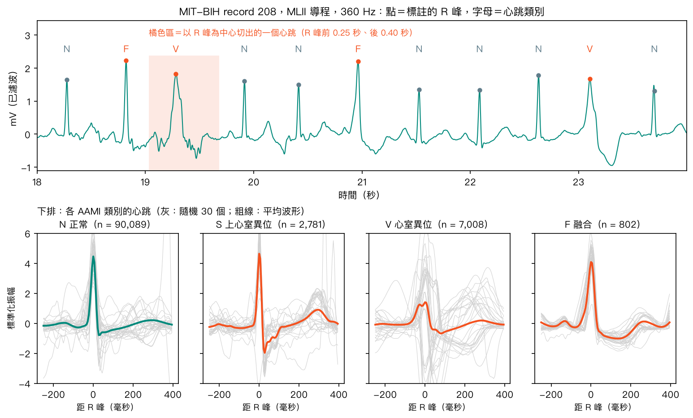
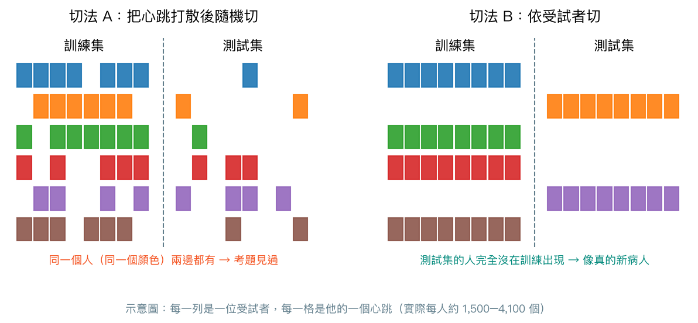
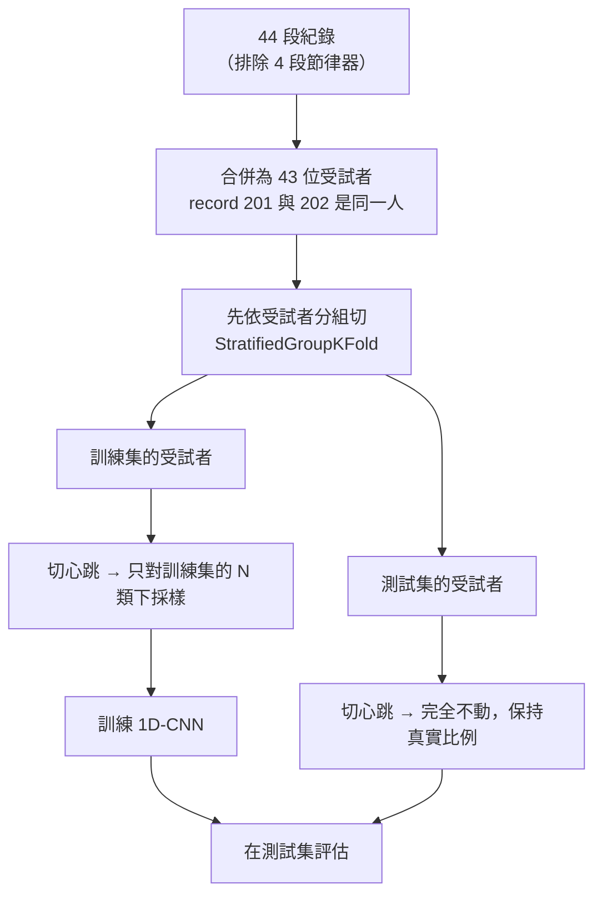
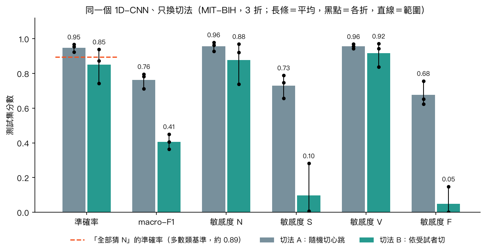

# 第 14 章　序列資料：心電圖、一維卷積與資料洩漏

<p class="chapter-meta">預計閱讀 30 分鐘 ・ 先備：第 12 章（卷積、池化）、第 11 章（交叉驗證、分組 K-fold、類別不平衡）</p>

!!! abstract "本章你會學到"
    - 說明心電圖這類「序列資料」和影像有什麼不同：順序有意義、取樣率決定時間解析度
    - 以 R 峰為中心把一段長心電圖切成一個個心跳，並對應到 AAMI 的五個心跳類別
    - 把第 12 章的卷積改成沿時間軸滑動的一維卷積，並用直覺理解循環神經網路（RNN）
    - 親手比較「隨機切心跳」與「依受試者切」：同一個模型，成績差多少、差在哪一類
    - 讀醫學 AI 論文時，檢查資料切分的單位與有沒有外部驗證

<div class="nb-links" markdown>
[:simple-googlecolab: 在 Colab 開啟](https://colab.research.google.com/github/fireman333/ml-for-med-students/blob/main/docs/notebooks/ch14_ecg.ipynb){ .md-button .md-button--primary }
[:material-download: 下載 Notebook](../notebooks/ch14_ecg.ipynb){ .md-button }
</div>

## 1. 直覺：從一個臨床情境開始

想像你在心臟內科跟一位學長看 24 小時 Holter（攜帶式心電圖）。你拿到一條很長的 electrocardiogram（ECG，心電圖），一次只看幾秒：先找每個心跳最尖的 R 峰，再往前看有沒有 P wave（P 波），看 QRS complex（QRS 波群）寬不寬，看 T wave（T 波）的方向。遇到一個沒有 P 波、QRS 又寬又怪、後面還停頓一下的心跳，你會說：「這是 premature ventricular contraction（PVC，心室早期收縮）。」

這段判讀有兩個特點：

1. **資料是一條隨時間排列的訊號**，不是一張圖。前後順序有意義：把訊號點的時間順序打亂，P 波可能跑到 QRS 後面，整個判讀就失去意義。
2. **你學會的是「PVC 長什麼樣子」，不是「這位病人的 PVC 長什麼樣子」**。換一位沒看過的病人，你一樣認得出來。

第二點就是本章的主角。假設學長拿同一位病人 Holter 的前半段教你，再拿**同一位病人的後半段**考你，你很容易拿高分，因為你可能只是記住了「這個人的心跳長這樣」。這種考法高估了你的實力。機器學習也會發生一模一樣的事，叫做資料洩漏（data leakage）。

## 2. 核心概念

### 2.1 心電圖是一種序列資料

心電圖是電壓隨時間變化的一串數字。每秒記錄幾個數字，叫做取樣率（sampling rate）。本章用的 MIT-BIH Arrhythmia Database 取樣率是 **360 Hz**，也就是每秒 360 個數字，一段 30 分鐘的紀錄就有 650,000 個點。取樣率決定了時間解析度：360 Hz 時相鄰兩點相隔約 2.8 毫秒，足以描出一個約 100 毫秒寬的 QRS 波群。

序列資料（sequence data）有三個和表格資料不同的地方：

- **順序有意義**：第 100 點和第 101 點是相鄰的時間，不能像表格的欄位那樣隨意調換。
- **長度可以不同**：病人的紀錄可長可短。本章的做法是先切成固定長度的心跳，再交給模型。
- **同一個來源會產生非常多筆**：一位受試者 30 分鐘就有約一千五到四千個心跳，它們彼此高度相似。這一點是資料洩漏的溫床。

### 2.2 以 R 峰為中心切心跳

MIT-BIH 共有 48 段 30 分鐘的雙導程紀錄，來自 47 位受試者；依 AAMI 慣例排除 4 段裝有 pacemaker（節律器）的紀錄後，本章用 44 段、43 位受試者（record 201 與 202 是同一人），只取 MLII 導程。每個心跳都由心臟科醫師標註過位置（就在 R 峰上）和類別。我們以每個 R 峰為中心，往前取 0.25 秒、往後取 0.40 秒，大致涵蓋 P 波、QRS 與 T 波；再每 2 個點取 1 個（360 Hz 變 180 Hz），每個心跳就變成 117 個數字。

{ loading=lazy }

醫師標註的符號很多（例如 L 代表 left bundle branch block（左束支傳導阻滯）的心跳），研究上通常依 AAMI EC57 標準合併成五類：

| AAMI 類別 | 包含的心跳 | 本章資料的數量（佔比） |
|---|---|---|
| N（正常類） | 正常、左右束支傳導阻滯、心房或結性逸搏 | 90,089（89.48%） |
| S（上心室異位） | atrial premature beat（心房早期收縮）等上心室來源的早期收縮 | 2,781（2.76%） |
| V（心室異位） | PVC、心室逸搏 | 7,008（6.96%） |
| F（融合） | fusion beat（融合波）：正常與心室激動同時發生 | 802（0.80%） |
| Q（無法分類） | 節律器心跳、節律器與正常的融合波、無法分類的心跳 | 15（本章排除） |

兩件事要先記住：**類別極度不平衡**，N 類接近九成；而且**少數類集中在少數人身上**。notebook 實測：S 類 63% 來自兩位受試者（232、209），F 類更有 92% 來自兩位受試者（208、213）。

從上圖的平均波形可以看到：V 的波形和 N 明顯不同，F 介於兩者之間，S 的平均波形卻和 N 非常像。這不意外，臨床上判斷心房早期收縮主要靠「來得太早」，也就是 RR interval（RR 間期，前後兩個 R 峰的距離）縮短，而不是 QRS 的形狀；我們切的窗只看得到單一心跳的形狀。

### 2.3 一維卷積：濾鏡沿時間軸滑動

[第 12 章](12-cnn.md)的卷積是一個 3×3 的小濾鏡在影像上左右上下滑動。把它換成一條長度 7 的濾鏡，只沿著時間軸往右滑，就是一維卷積（1D convolution，Keras 的 `Conv1D`）。每到一個位置，7 個權重和底下 7 個訊號點對應相乘再加總，得到一個輸出；全部位置的輸出排成一條新的序列，也就是一維的特徵圖。

直覺上，一個濾鏡就是一個「波形偵測器」：如果它的權重長得像一個寬而高的波，它在 PVC 的 QRS 上輸出就會特別大。權重共享、池化、參數量與影像長度無關，這些性質和第 12 章完全相同，不再重講。本章模型三層卷積的濾鏡長度分別是 7、5、5 個點（180 Hz 下約 39、28、28 毫秒），最後用 `GlobalAveragePooling1D` 把每個濾鏡在整個心跳上的反應取平均，再接 `Dense(4, softmax)`。全部只有 8,004 個參數。

### 2.4 循環神經網路的直覺（選讀）

另一類處理序列的模型是循環神經網路（recurrent neural network, RNN）。它不是用濾鏡一次看一小段，而是**從頭到尾一個時間點一個時間點讀**，邊讀邊更新一組叫隱藏狀態（hidden state）的數字，像你看 Holter 時腦中一直記著「前一個心跳在哪、節律規不規則」。讀到最後，隱藏狀態就是對整段序列的摘要。

單純的 RNN 很難記住很久以前的資訊：訓練時誤差要沿著時間一步步往回傳，傳越遠訊號越弱，叫做梯度消失（vanishing gradient）。LSTM（long short-term memory）與 GRU（gated recurrent unit）加上了「閘門」，由網路自己學習什麼時候保留舊記憶、什麼時候寫入新資訊，就像交班時決定哪些事要寫進交班單、哪些可以不提。對 117 個點的單一心跳，1D-CNN 通常已經夠用而且快得多；要看長時間的節律（例如心房顫動）時，1D-CNN、RNN 與[第 15 章](15-transformer.md)的 Transformer 都很常用。notebook 的練習有把卷積層換成 `GRU` 的寫法。

??? note "數學補充（可跳過）"
    一維卷積：輸入序列 $x$、長度 $k$ 的濾鏡 $w$、偏差 $b$，位置 $t$ 的輸出是

    $$ y_t = \sum_{j=0}^{k-1} w_j\, x_{t+j} + b $$

    有 $C_{in}$ 個輸入通道、$C_{out}$ 個濾鏡時，參數量為 $(k \times C_{in} + 1) \times C_{out}$。例如本章第二層：$(5 \times 16 + 1) \times 32 = 2{,}592$。

    最簡單的 RNN：$h_t = \tanh(W_x x_t + W_h h_{t-1} + b)$，同一組 $W_x, W_h$ 在每個時間點重複使用（又是權重共享）。GRU 多了兩個介於 0 到 1 的閘門，決定 $h_{t-1}$ 要保留多少、新資訊要寫入多少。

### 2.5 資料洩漏：考題已經在課本裡

[第 11 章](11-model-selection.md)提過：同一位病人的多張影像若分別落在訓練集與測試集，模型可能只是「認出這個人」，分數虛高，所以要用分組 K-fold。心電圖把這個問題放大到極致：一位受試者貢獻一千五百到四千多個心跳，彼此的波形幾乎一樣。

{ loading=lazy }



順序很重要：**先依人切，再在訓練集裡面做抽樣**。如果先把 N 類下採樣再切，或先用全部資料算標準化參數再切，也都是洩漏（Kapoor 與 Narayanan 2023 把這類問題整理成八種洩漏類型）。程式實作上是先把每段紀錄各自切好心跳、再依受試者分配；切心跳只在單一紀錄內進行，不會用到別人的資料，所以和圖中的順序結果相同。

## 3. 動手做

完整程式在 notebook。數字來自本機實測（Keras 3.13.2、TensorFlow 後端、CPU），`keras.utils.set_random_seed(42)` 只能固定大部分隨機性，你的結果會略有不同。

### 3.1 從官方來源下載原始資料

notebook 執行時直接從 PhysioNet 下載官方 zip（77 MB），失敗時改為從官方網址逐檔下載，再失敗才用 Hugging Face 上的第三方公開鏡像。走官方 zip 這條路時，會用 zip 內附的 `SHA256SUMS.txt` 檢查 132 個檔案都沒有損壞（逐檔下載與鏡像這兩條備援路線沒有做這項檢查）。為了在 Colab 免安裝，notebook 用 NumPy 寫了一個小讀檔器，讀出來的訊號與標註和官方 `wfdb` 套件完全一致（我們在 48 段紀錄上逐點比對過）。

### 3.2 切心跳

先帶通濾波 0.5–40 Hz 去掉基線飄移與高頻雜訊，再把每段紀錄各自標準化，然後以 R 峰為中心切窗：

```python
PRE, POST, STEP = 90, 144, 2          # 0.25 s before / 0.40 s after the R peak at 360 Hz; keep every 2nd point
...
    for s, label in zip(samp, sym):
        if label in AAMI and PRE <= s < len(sig) - POST:
            if AAMI[label] == "Q":
                n_q += 1
                continue
            X.append(sig[s - PRE:s + POST:STEP])
            y.append(CLASSES.index(AAMI[label]))
            groups.append(SUBJECT[r])
```

`groups` 記下每個心跳屬於哪位受試者（record 202 併入 201）。輸出是 100,680 個心跳、形狀 `(100680, 117, 1)`：最後的 1 是通道數，和第 12 章灰階影像的道理一樣。程式裡用 `assert` 確認各類別數相加等於總心跳數、受試者共 43 位。

### 3.3 兩種切法

兩種切法都分成 3 折（每次 2/3 訓練、1/3 測試），差別只在打散的單位：

```python
splits = {
    "A: random beats": list(StratifiedKFold(3, shuffle=True, random_state=RS).split(X, y)),
    "B: by subject": list(StratifiedGroupKFold(3, shuffle=True, random_state=RS).split(X, y, groups)),
}
```

`StratifiedGroupKFold` 是分組 K-fold 的變形：同一組（同一位受試者）一定在同一折，同時盡量讓各折的類別比例接近。notebook 印出的檢查結果很說明問題：切法 A 每一折的測試集有 33,560 個心跳，來自 43 位受試者，**而這 43 位全部也在訓練集裡**；切法 B 的測試集分別只有 15、15、13 位受試者，和訓練集**沒有任何一人重疊**（程式用 `assert` 確認）。也注意切法 B 的第 2 折只分到 27 個 F 類心跳，因為 F 類幾乎都集中在兩個人身上。

### 3.4 模型與訓練

```python
def build_model():
    return keras.Sequential([
        keras.Input(shape=(X.shape[1], 1)),
        keras.layers.Conv1D(16, 7, padding="same", activation="relu"),   # 16 filters, 7 points long
        keras.layers.MaxPooling1D(2),
        keras.layers.Conv1D(32, 5, padding="same", activation="relu"),
        keras.layers.MaxPooling1D(2),
        keras.layers.Conv1D(32, 5, padding="same", activation="relu"),
        keras.layers.GlobalAveragePooling1D(),                           # average over time
        keras.layers.Dense(4, activation="softmax"),
    ])
```

為了控制 CPU 時間並減輕不平衡，**在切好之後**只對訓練集的 N 類隨機抽 8,000 個，其他類全部保留；測試集完全不動：

```python
    tr_n = tr[y[tr] == 0]
    keep = np.concatenate([rng.choice(tr_n, min(N_KEEP, len(tr_n)), replace=False), tr[y[tr] != 0]])
```

於是每個模型實際的訓練集約 1.5 萬個心跳（第 1 折：切法 A 15,061 個、切法 B 14,668 個），Adam、學習率 0.003、batch 128、固定訓練 12 個 epoch，本機 CPU 每個模型約 18–20 秒。要說明的是：學習率、epoch 數與「不加類別權重」是寫作時先試過幾組後決定的（試過 `class_weight="balanced"`，N 類被大量誤判為 S、結果不穩），沒有另外留獨立驗證集來選，加權版本留在練習 1 自己比較；類別權重的概念見[第 13 章](13-transfer-learning.md)。

### 3.5 結果：同一個模型，換一種切法

先看第 1 折。`baseline_acc` 是「全部猜 N」的多數類基準：

| 指標（第 1 折） | 切法 A：隨機切心跳 | 切法 B：依受試者切 |
|---|---|---|
| 準確率（多數類基準） | 0.924（0.895） | 0.873（0.883） |
| macro-F1 | 0.712 | 0.406 |
| 敏感度 N | 0.928 | 0.923 |
| 敏感度 S | 0.789 | 0.000 |
| 敏感度 V | 0.943 | 0.944 |
| 敏感度 F | 0.757 | 0.000 |

macro-F1 是四個類別 F1 的單純平均，每一類權重相同，所以少數類表現差會直接把它拉低。準確率 0.924 對 0.873，看起來差不多；但切法 B 的 S 類與 F 類敏感度都是 0，**在這一折，模型對沒見過的人完全認不出這兩類**，而且準確率 0.873 甚至略低於「全部猜 N」的 0.883。

只看一折可能是運氣，notebook 把 3 折都跑完：

{ loading=lazy }

| 3 折平均〔最小, 最大〕 | 切法 A：隨機切心跳 | 切法 B：依受試者切 |
|---|---|---|
| 準確率 | 0.948〔0.924, 0.967〕 | 0.851〔0.742, 0.938〕 |
| 多數類基準 | 0.895〔0.895, 0.895〕 | 0.894〔0.883, 0.914〕 |
| macro-F1 | 0.763〔0.712, 0.796〕 | 0.407〔0.364, 0.450〕 |
| 敏感度 S | 0.731〔0.657, 0.789〕 | 0.096〔0.000, 0.282〕 |
| 敏感度 V | 0.956〔0.943, 0.969〕 | 0.918〔0.838, 0.971〕 |
| 敏感度 F | 0.677〔0.623, 0.757〕 | 0.049〔0.000, 0.148〕 |

怎麼解讀：

- **macro-F1、S 與 F 的敏感度**：兩種切法的 3 折範圍完全不重疊，方向一致。切法 A 的高分主要來自「測試集的人在訓練時都見過」。
- **準確率**：兩種切法的範圍重疊，單看準確率看不出明顯差異；切法 B 的第 3 折準確率 0.742，還低於該折「全部猜 N」的 0.886。**準確率在這種不平衡資料上會騙人**。
- **V 類**：切法 B 的平均敏感度 0.918，範圍與切法 A 部分重疊。PVC 的 QRS 跨病人都偏寬（極性則因人而異），這可能是它換人後掉得最少的原因。
- 只有 3 折、43 位受試者，這裡沒有做正式的統計檢定，範圍只反映「換一批人當考題」的變動。比較恰當的說法是：**在 MIT-BIH 上，依受試者切的 macro-F1 與 S、F 類敏感度明顯較低**，而不是給出一個精確的「虛高幾個百分點」。

本機實測整本 notebook 約 125 秒（官方 zip 已在本機時，讀檔 1.7 秒、切心跳 1.5 秒，其餘幾乎都是訓練 6 個模型）。

## 4. 醫學案例：資料洩漏與外部驗證

!!! info "僅供學習"
    本章使用公開資料庫 MIT-BIH Arrhythmia Database（PhysioNet，ODC-By v1.0），結果僅供學習，不構成臨床建議。

**MIT-BIH 的 inter-patient 評估。** 把 MIT-BIH 的心跳混在一起隨機切，很容易得到漂亮的分數，本章切法 A 就是例子。de Chazal 等人（IEEE Trans Biomed Eng, 2004）改把 44 段非節律器紀錄分成兩半，各約 5 萬個心跳、來自 22 段紀錄，一半用來選模型，另一半當獨立測試，同一段紀錄不會同時出現在兩邊。要注意的是，它是**依紀錄**切：201 與 202 來自同一位受試者，卻分屬兩半，嚴格說不算完全依受試者切，本章切法 B 則把兩者合併成同一組。在這個設計下，S 類的敏感度 75.9%、陽性預測值只有 38.5%；V 類敏感度 77.7%、陽性預測值 81.9%。他們的特徵包含 RR 間期與兩個導程，比本章的單一心跳形狀多了節律資訊，這也是他們 S 類表現比我們好的可能原因之一。值得注意的是，即使在這個設計下，S 類的陽性預測值仍偏低：模型標為 S 的心跳，多數其實不是 S。

**洩漏不是少數人的疏忽。** Kapoor 與 Narayanan（Patterns, 2023）整理使用機器學習的研究文獻，在 17 個領域找到受資料洩漏影響的論文共 294 篇，有些結論因此過度樂觀；他們把洩漏分成八種類型，例如「沒有獨立測試集」「在切分前對全部資料做前處理（包括過採樣、下採樣）」，以及「訓練與測試樣本彼此不獨立」，最典型的就是兩邊來自同一批人（本章切法 A 的情況）。他們建議研究者用一張「模型資訊表」逐項檢查。

**資料集設計者可以先替你做好。** PTB-XL（Wagner 等，Sci Data, 2020）是一個大型公開 12 導程心電圖資料庫，有兩萬多筆 10 秒紀錄。它的 metadata 提供官方建議的 10 折切分（`strat_fold`）：同一位病人的所有紀錄只會落在同一折，各折的診斷比例也做過分層，PhysioNet 頁面建議以第 1–8 折訓練、第 9 折驗證、第 10 折測試。用官方切分，不同論文的數字才能比較，也避免每個人自己切出不同程度的洩漏。

**依病人切仍然不是外部驗證。** 本章切法 B 的測試集雖然是沒見過的人，但他們和訓練集來自同一家醫院、同一批記錄器、同一組標註者、同一個年代。真正要回答「拿到別家醫院還準不準」，需要外部驗證（external validation）：在另一個獨立收集的資料庫上測試，例如用其他醫院或其他國家的心電圖資料庫。讀醫學 AI 論文時，可以問三個問題：

1. **切分的單位是什麼？** 是心跳、紀錄、病人，還是醫院？同一位病人會不會同時出現在訓練與測試？
2. **標準化、抽樣、挑特徵是在切分前還是切分後做的？**
3. **有沒有外部驗證？** 內部測試集的高分，只能說明模型在「同一個來源」表現好。

## 5. 互動體驗

### 一維卷積在心電圖上滑動

選一個濾鏡，拖動滑桿或按「播放」，看濾鏡沿時間軸滑過一段心電圖：上方橘色區是濾鏡目前的位置，中間是濾鏡的權重，下方是輸出的特徵圖。滑到最後會顯示最大輸出出現在哪個心跳。試試「寬 QRS 偵測器」和「窄 QRS 偵測器」，最大輸出分別落在 PVC 還是正常心跳？勾選 ReLU 後，負的輸出會被歸零。這段心電圖是用數學公式合成的示意訊號，不是病人資料。

<div class="demo-box">
  <div id="ch14-demo"></div>
  <div class="controls">
    <label>濾鏡 <select id="ch14-filter"></select></label>
    <label>位置 <input type="range" id="ch14-pos" min="0" max="480" value="0" step="1"></label>
    <label><input type="checkbox" id="ch14-relu"> ReLU</label>
    <button type="button" id="ch14-play" class="md-button">播放</button>
  </div>
  <p id="ch14-info" style="font-size:.75rem;margin:.4rem 0 0;"></p>
</div>

## 6. 常見陷阱

!!! warning "陷阱 1：用 `train_test_split` 直接切心跳"
    `train_test_split` 和 `StratifiedKFold` 只看「一列一個樣本」，不知道哪些列屬於同一個人。只要一位病人有多筆資料（多個心跳、多張影像、多次回診），就要把病人 ID 傳給 `GroupKFold`、`StratifiedGroupKFold` 或 `GroupShuffleSplit` 的 `groups`，並且確認 ID 真的代表同一個人：MIT-BIH 的 record 201 與 202 是同一位受試者，若各自當成一組，仍會漏掉一點洩漏。

!!! warning "陷阱 2：先下採樣或標準化，再切分"
    先把 N 類抽少、或先用全部資料算平均與標準差，再切訓練與測試，等於讓測試集的資訊影響了訓練流程。本章的順序是：先依受試者切，再只在訓練集內抽樣；測試集保持真實比例。每段紀錄各自標準化只用到那個人自己的訊號，不會跨人洩漏。

!!! warning "陷阱 3：只報準確率"
    N 類接近九成，「全部猜 N」就有約 0.89 的準確率。依受試者切時，模型的準確率可能接近甚至低於這個基準，而 S、F 類幾乎全部漏掉。不平衡資料要同時報多數類基準、macro-F1 與各類別敏感度，必要時附混淆矩陣。

!!! warning "陷阱 4：把「依病人切」當成「可以上臨床」"
    依病人切只排除了「認得這個人」的洩漏。同一家醫院的病人族群、儀器與標註習慣仍然相同；部署到別的醫院前，需要外部驗證，最好還要前瞻性評估。

## 7. 小測驗

??? question "Q1. 一篇論文用 MIT-BIH 把所有心跳隨機切成 80% 訓練、20% 測試，報告準確率 99%。你最先想問什麼？"
    **答案：** 同一位受試者的心跳是否同時出現在訓練與測試集。隨機切心跳時幾乎一定會，模型可能只是記住了每個人的波形；應改用依受試者切（如分組 K-fold；常見的 de Chazal 2004 兩半切法是依紀錄切，大致接近，但 201／202 這位受試者跨到兩邊），並同時報告各類別敏感度與多數類基準。

??? question "Q2. 在本章實驗中，依受試者切之後，為什麼 S 類掉得比 V 類多？"
    **答案：** V 類（PVC）的 QRS 跨病人都偏寬，單一心跳的形狀就可能辨認；S 類的形狀和正常心跳很像，臨床上主要靠 RR 間期縮短辨認，而本章的切窗只有單一心跳的形狀。加上 S 類集中在少數受試者，換成沒見過的人時就幾乎認不出來。

??? question "Q3. 一個長度 7 的 `Conv1D` 濾鏡層，輸入 1 個通道、輸出 16 個濾鏡，有幾個參數？把每個心跳從 117 點加長到 180 點，參數會變多嗎？"
    **答案：** (7 × 1 + 1) × 16 = 128 個。參數量只和濾鏡長度、輸入通道數、濾鏡數有關，與序列長度無關（權重共享），所以加長輸入不會增加這一層的參數。

## 8. 重點整理

- 心電圖是序列資料：順序有意義，取樣率決定時間解析度（MIT-BIH 為 360 Hz）。
- 以 R 峰為中心切出固定長度的心跳，依 AAMI 標準合併成 N、S、V、F、Q；類別極度不平衡，少數類集中在少數人身上。
- 一維卷積＝濾鏡沿時間軸滑動；RNN（LSTM、GRU）則是一步步讀、帶著隱藏狀態往下走，適合需要長時間記憶的任務。
- 同一個 1D-CNN 在 MIT-BIH 上：隨機切心跳的 3 折平均 macro-F1 0.763，依受試者切只有 0.407；S、F 類敏感度降到 0.096 與 0.049。準確率的範圍兩者重疊，單看準確率看不出問題。
- 先依病人切，再在訓練集內做抽樣、標準化等前處理；病人 ID 要正確（201 與 202 是同一人）。
- 依病人切仍不等於外部驗證；本章結果來自單一資料庫、44 段紀錄、單一導程，只能當方向參考。

## 延伸閱讀

- [MIT-BIH Arrhythmia Database（PhysioNet）](https://physionet.org/content/mitdb/1.0.0/) — 本章資料的官方頁面，含紀錄說明與授權（ODC-By v1.0）。
- [de Chazal P, et al. Automatic classification of heartbeats using ECG morphology and heartbeat interval features（IEEE Trans Biomed Eng, 2004）](https://doi.org/10.1109/TBME.2004.827359) — 在 MIT-BIH 上採用依紀錄分兩半的獨立評估。
- [Kapoor S, Narayanan A. Leakage and the reproducibility crisis in machine-learning-based science（Patterns, 2023）](https://doi.org/10.1016/j.patter.2023.100804) — 八種資料洩漏類型與檢查表，開放取用。
- [PTB-XL（PhysioNet）](https://physionet.org/content/ptb-xl/1.0.3/) 與 [Wagner P, et al.（Sci Data, 2020）](https://doi.org/10.1038/s41597-020-0495-6) — 附官方依病人切分 `strat_fold` 的 12 導程心電圖資料庫。
- [Dive into Deep Learning：Recurrent Neural Networks](https://d2l.ai/chapter_recurrent-neural-networks/index.html) — RNN、GRU、LSTM 的完整推導與程式（CC BY-SA 4.0）。
- [scikit-learn：Cross-validation iterators for grouped data](https://scikit-learn.org/stable/modules/cross_validation.html#group-k-fold) — `GroupKFold`、`StratifiedGroupKFold`、`GroupShuffleSplit` 的官方說明與圖解。

<script src="../../assets/js/demos/ch14-conv1d.js"></script>
