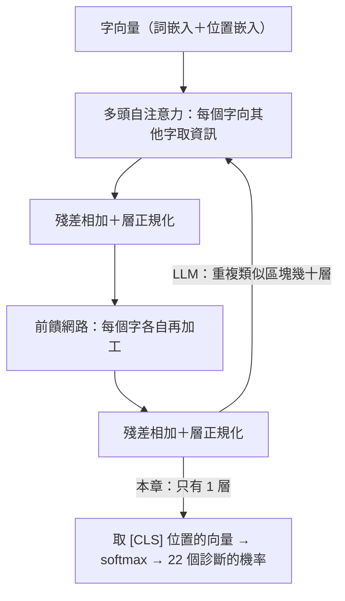
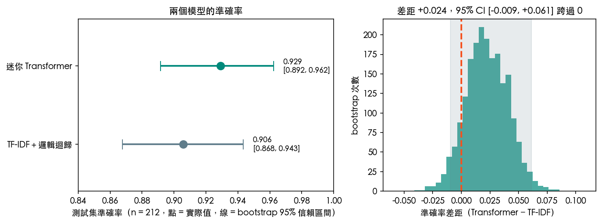

# 第 15 章　注意力機制與 Transformer：從病人主訴到大型語言模型

<p class="chapter-meta">預計閱讀 35 分鐘 ・ 先備：第 9 章（神經網路、Keras）；建議先讀第 5 章（詞袋）、第 4 章（邏輯迴歸）</p>

!!! abstract "本章你會學到"
    - 說明詞袋與 TF-IDF 為什麼會丟掉字序與上下文，以及斷詞、詞嵌入怎麼把文字變成向量
    - 用「查病歷」的比喻解釋自注意力的 Query、Key、Value，並看懂一個 Transformer 區塊的零件
    - 用 Keras 3 自己組一個迷你 Transformer 分類症狀描述，和 TF-IDF＋邏輯迴歸公平比較，並把注意力權重畫出來
    - 說出大型語言模型「預測下一個字」的訓練方式，以及幻覺從哪裡來
    - 評估醫療 LLM 的研究時，分得清「考試答對」和「臨床上可用」的差別

<div class="nb-links" markdown>
[:simple-googlecolab: 在 Colab 開啟](https://colab.research.google.com/github/fireman333/ml-for-med-students/blob/main/docs/notebooks/ch15_transformer.ipynb){ .md-button .md-button--primary }
[:material-download: 下載 Notebook](../notebooks/ch15_transformer.ipynb){ .md-button }
</div>

## 1. 直覺：從一個臨床情境開始

急診檢傷時，病人說「胸痛」。光這兩個字，你的鑑別診斷清單還很長：是 acute coronary syndrome（急性冠心症）、GERD（胃食道逆流）、肋軟骨炎，還是焦慮？接著病人補充：「**爬樓梯時**會痛，**休息就好**，痛會**跑到左手**。」同樣是「胸痛」，意思已經完全不同，你的注意力也會自動落在「爬樓梯」「休息」「左手」這幾個字上。

如果病人說的是「吃飽**躺下**才胸痛，**喉嚨酸酸的**」，同一個「胸痛」又指向另一個方向。**一個字的意思取決於它周圍的字**，這是所有語言的基本性質，也是本章的主角。

第 5 章的詞袋模型（bag-of-words）只數「每個字出現幾次」，字序全部丟掉：「飯後痛、飯前不痛」和「飯前痛、飯後不痛」在詞袋裡一模一樣。

2017 年提出的 Transformer 用一個很直白的想法解決這件事：**讓句子裡的每個字，主動去問其他字「你跟我有多相關？」**，再依相關程度把它們的資訊混進自己身上，這叫注意力（attention）。今天的 ChatGPT、Gemini、Claude 等大型語言模型（large language model, LLM），骨架都是 Transformer。

## 2. 核心概念

### 2.1 文字變數字：斷詞與詞彙表

模型只會算數字，所以第一步是斷詞（tokenization）：把句子切成一個個單位，每個單位叫一個 token（詞元），再查詞彙表（vocabulary）換成整數編號。

- 最簡單的做法是用空白切英文單字，本章的實作就是這樣：在本章的詞彙表裡，`pain` → 20、`neck` → 33。
- 詞彙表外的字（例如訓練時沒看過的藥名）只能變成一個代表「不認識」的記號 `[UNK]`。
- 真正的 LLM 用子詞（subword）斷詞：常見的字自成一個 token，罕見的長字切成幾段，例如 *gastroesophageal* 可能被切成好幾塊。這樣就沒有「不認識的字」。

### 2.2 詞嵌入：意思相近的字住得近

編號本身沒有意義，不能說 neck（33）比 pain（20）「大」。所以下一步是詞嵌入（embedding）：每個編號查表換成一串**訓練出來的**數字（本章用 64 個）。

訓練後，用法相近的字向量會彼此靠近，像在 64 維空間裡幫每個字排座位：理想上「fever」「chills」坐同一區，「itchy」「rash」坐另一區（資料夠多才會排得整齊）。TF-IDF 則是每個字各占獨立一欄，「fever」和「pyrexia」毫無關係；在詞嵌入裡它們有機會被學成鄰居。

詞嵌入還要補上一個資訊：**位置**。注意力本身不管順序（下一節會看到），所以 Transformer 會再加上一個「第幾個字」的位置嵌入（positional embedding），讓模型分得出「not」是在「pain」前面還是後面。

![流程示意：斷詞並加上 [CLS]、查編號、變成嵌入向量，[CLS] 再用自注意力把權重分給每個字](../assets/img/ch15/pipeline.png){ loading=lazy }

### 2.3 自注意力：每個字去「查病歷」

自注意力（self-attention）可以用「查病歷系統」來比喻。每個字在這一步都會產生三個向量：

| 向量 | 比喻 | 作用 |
|---|---|---|
| Query（查詢） | 你在搜尋欄打的關鍵字：「我想知道跟我有關的資訊」 | 拿來和別人的 Key 比對 |
| Key（索引） | 每份病歷的標題與標籤 | 被別人的 Query 比對，決定相關程度 |
| Value（內容） | 病歷的實際內容 | 依相關程度被加權混合，成為輸出 |

以「pain」這個字為例：它的 Query 和句子裡每個字的 Key 一一比對，得到一排相關分數；分數經過 softmax（第 9 章學過，把一排分數轉成加總為 1 的權重），變成「我要從每個字拿多少比例的資訊」；最後把每個字的 Value 依這些權重加起來，就是「pain」更新後的新向量。如果「exertion」的權重高，新的「pain」向量就帶有「勞動時的痛」的意味。

三件事值得記住：

1. **權重每一列加總為 1**：注意力是在分配一份固定的「注意力預算」。
2. **每個字都會這樣做一次**，所以一句 25 個字的句子會有一個 25 × 25 的注意力矩陣。
3. **Query、Key、Value 都是學出來的**：模型自己學會「什麼字該去找什麼字」，沒有人寫規則。

??? note "數學補充（可跳過）"
    把一句話的 $n$ 個字向量排成矩陣 $X$（$n \times d$），用三個可學習的權重矩陣算出

    $$ Q = XW_Q,\qquad K = XW_K,\qquad V = XW_V $$

    注意力的輸出是

    $$ \mathrm{Attention}(Q, K, V) = \mathrm{softmax}\!\left(\frac{QK^\top}{\sqrt{d_k}}\right) V $$

    $QK^\top$ 的第 $i$ 列第 $j$ 欄是「第 $i$ 個字的 Query」和「第 $j$ 個字的 Key」的內積，代表相關程度；除以 $\sqrt{d_k}$ 是為了避免維度大時內積太大、softmax 過度集中；softmax 對每一列做，所以每一列加總為 1。填充用的位置會在 softmax 前被設成負無限大，權重就變成 0。

    多頭注意力（multi-head attention）就是用 $h$ 組不同的 $W_Q, W_K, W_V$ 平行做 $h$ 次，再把結果接起來：

    $$ \mathrm{MultiHead}(X) = \mathrm{Concat}(\mathrm{head}_1, \dots, \mathrm{head}_h)\, W_O $$

**多頭注意力**像同時請幾位不同專科的醫師讀同一份主訴：一位看時間線索，一位看部位，一位看伴隨症狀，最後彙整。實際上每個頭學到什麼不一定能這樣乾淨地命名，這只是比喻。

### 2.4 Transformer 區塊：注意力之外的零件

一個 Transformer 編碼器區塊（encoder block）就是把下面這幾個零件串起來：



- **前饋網路**：第 9 章的全連接網路，對每個字各做一次。注意力負責字與字交換資訊，前饋網路負責各自消化。
- **殘差連接（residual connection）**：把輸入直接加回輸出，像病歷「新增紀錄」而非「覆蓋舊紀錄」，資訊不會在層層加工中流失。
- **層正規化（layer normalization）**：把每個字向量的數值尺度拉回穩定範圍，和第 3 章的標準化是同一個精神。
- **[CLS] 記號**：句首加一個本身沒有意義的特殊 token，它透過注意力「讀」整句話，分類時只看它的輸出（BERT 的做法）。

和[第 12 章](12-cnn.md)的卷積神經網路比較：兩者都是「同一組權重到處重複使用」，只是 CNN 的偵測器只看相鄰像素，注意力讓每個字直接看到全句任何一個字。

## 3. 動手做

完整程式在 notebook，下面挑重點。TF-IDF 基準只需要 scikit-learn；沒有 Keras 的環境會自動跳過 Keras 段落。

### 3.1 讀資料

資料集是 Gretel 的 `symptom_to_diagnosis`：853 筆訓練、212 筆測試，每筆是一段英文的症狀描述，標籤是 22 種診斷之一（每類約 32–40 筆，刻意均衡）。直接從 Hugging Face 讀 `.jsonl` 檔，不需要安裝 `datasets` 套件：

```python
BASE = "https://huggingface.co/datasets/gretelai/symptom_to_diagnosis/resolve/main/"
try:
    train_df = pd.read_json(BASE + "train.jsonl", lines=True)
    test_df = pd.read_json(BASE + "test.jsonl", lines=True)
except Exception as e:
    raise RuntimeError(
        "Could not download the dataset from Hugging Face. Check your internet connection, "
        "or download train.jsonl / test.jsonl manually from " + BASE) from e

print("train:", train_df.shape, "| test:", test_df.shape)
```

輸出 `train: (853, 2) | test: (212, 2)`。每筆長得像這樣：「I've been coughing a lot, and it's hard to breathe. I've also been coughing up a lot of thick, mucusy saliva...」，標籤是 bronchial asthma（支氣管氣喘）。

### 3.2 基準：TF-IDF＋邏輯迴歸

先建一個簡單的基準。TF-IDF 是詞袋的加權版：在這句話出現越多、在所有句子裡越少見的字，分數越高；`ngram_range=(1, 2)` 讓「chest pain」這種兩字片語也成為一欄。

```python
from sklearn.feature_extraction.text import TfidfVectorizer
from sklearn.linear_model import LogisticRegression
from sklearn.pipeline import make_pipeline

baseline = make_pipeline(TfidfVectorizer(ngram_range=(1, 2)),
                         LogisticRegression(max_iter=2000))
baseline.fit(X_train_text, y_train_text)
pred_base = baseline.predict(X_test_text)
print(f"TF-IDF + logistic regression, test accuracy: {np.mean(pred_base == y_test_text):.3f}")
```

不到一秒，測試準確率 **0.906**。這就是後面要比較的標準：新方法要明顯超過它，才值得多花的運算與複雜度。

### 3.3 斷詞與 [CLS]

Keras 的 `TextVectorization` 負責建詞彙表、把句子轉成固定長度 64 的整數序列（不足的補 0）。我們在最前面再接一個 `[CLS]` 的編號：

```python
vectorizer = layers.TextVectorization(max_tokens=5000, output_sequence_length=MAXLEN)
vectorizer.adapt(X_train_text.to_numpy())          # build the vocabulary from training text only
vocab = [str(t) for t in vectorizer.get_vocabulary()] + ["[CLS]"]
CLS_ID = len(vocab) - 1

def encode(texts):
    ids = vectorizer(np.asarray(texts)).numpy()
    cls = np.full((len(ids), 1), CLS_ID)
    return np.concatenate([cls, ids], axis=1).astype("int32")
```

注意 `adapt` 只用訓練集：詞彙表也是從資料「學」來的，用到測試集就是第 3 章講過的資料洩漏。這份資料的詞彙表含特殊記號只有 1,040 個字。

### 3.4 組一個迷你 Transformer

模型就是 2.4 節流程圖的程式版：詞嵌入＋位置嵌入 → 一個 Transformer 區塊 → 取 `[CLS]` → softmax。重點是中間這幾行（位置嵌入層的定義見 notebook）：

```python
inputs = keras.Input(shape=(MAXLEN + 1,), dtype="int32")
pad_mask = ops.expand_dims(ops.not_equal(inputs, 0), 1)       # do not attend to padding
x = TokenAndPositionEmbedding(MAXLEN + 1, VOCAB_SIZE, 64)(inputs)
attn_out, attn_scores = layers.MultiHeadAttention(
    num_heads=2, key_dim=32, name="self_attention")(
    x, x, attention_mask=pad_mask, return_attention_scores=True)
x = layers.LayerNormalization()(x + layers.Dropout(0.1)(attn_out))   # residual + norm
ff = layers.Dense(128, activation="relu")(x)
ff = layers.Dense(64)(ff)
x = layers.LayerNormalization()(x + layers.Dropout(0.1)(ff))        # residual + norm
cls_vec = layers.Dropout(0.2)(x[:, 0, :])                           # read the [CLS] position
outputs = layers.Dense(22, activation="softmax")(cls_vec)

model = keras.Model(inputs, outputs)
attn_model = keras.Model(inputs, attn_scores)   # shares weights; outputs the attention weights
```

`MultiHeadAttention(x, x)` 的兩個 `x` 分別是「發問的一方」和「被查的一方」，兩個都是同一句話，所以叫**自**注意力。`return_attention_scores=True` 讓我們之後可以把權重拿出來看。整個模型約 10.6 萬個參數，接著用 Adam（`learning_rate=3e-3`）、15% 驗證集與 EarlyStopping 訓練：

```python
hist = model.fit(X_tr, y_tr, validation_split=0.15, epochs=60, batch_size=32, verbose=0,
                 callbacks=[keras.callbacks.EarlyStopping(
                     monitor="val_loss", patience=6, restore_best_weights=True)])
```

在我們的實測（Keras 3.13、TensorFlow 2.20，筆電 CPU）中，訓練 17 個 epoch 後停下，約 30 秒；Colab 免費版 CPU 預估 1–2 分鐘。`keras.utils.set_random_seed(42)` 固定了大部分隨機性，但不同版本與硬體的數字仍會略有不同。

### 3.5 公平比較：差距有沒有意義？

測試集上，迷你 Transformer 準確率 **0.929**，TF-IDF 基準 **0.906**，看起來高了 2.4 個百分點。但測試集只有 212 筆，答錯一題就差 0.5 個百分點。notebook 用自助法（bootstrap）把測試集重抽 2,000 次，估計兩者差距的 95% 信賴區間：

{ loading=lazy }

差距 +0.024，95% 信賴區間 [−0.009, +0.061]，**跨過 0**。在這份測試集上，兩者的差距**未必有意義**，不能說 Transformer 比較好。notebook 的練習題還會請你只換隨機種子重訓，你可以觀察同一個 Transformer 的準確率會不會隨種子上下跳動。

這和第 9 章的結論一致：**資料少的時候，簡單方法常常就夠了**。Transformer 的威力要在大量文字上預訓練後才會出現（第 4 節）。

### 3.6 打開黑盒子：注意力權重

最後把 `attn_model` 的輸出畫出來。下圖是測試集第 12 句（真實診斷 malaria，模型也預測 malaria）：

![一則 malaria 描述的注意力熱圖：上為兩個頭的 [CLS] 權重，下為第 1 頭完整矩陣，sweating 最深](../assets/img/ch15/attention_heatmap.png){ loading=lazy }

這句話含 `[CLS]` 共 25 個 token，平均分配的話每個字約 0.04。第 1 頭的 `[CLS]` 把約 0.22 的權重給了 *sweating*，其次是 *muscles*（約 0.07），其他字大多在 0.01–0.05 之間；下方的完整矩陣裡，*sweating* 那一欄在很多列都偏深，代表許多字都去向它取資訊。週期性發燒、畏寒、大量出汗正是瘧疾典型的描述，模型在這句話上抓到的線索看起來說得通。

但請帶著三點保留來看這張圖：

1. **大部分權重其實接近平均**。小資料、只有一層的模型，注意力不會像教科書插圖那樣集中在一兩個字。
2. **注意力不等於解釋**。權重高只代表那個字的資訊被多混進來一些，後面還有前饋網路與分類頭在做決定；研究上已有不少討論指出，注意力權重不能直接當成「模型為什麼這樣判斷」的證據。
3. **只看一句話會被挑選偏誤騙**。我們挑的是一句模型答對、圖又好看的例子。notebook 裡請換別的句子看看，包含答錯的。

錯誤分析也很有啟發：部分錯誤落在臨床上本來就要鑑別的組合，例如 dengue（登革熱）、typhoid（傷寒）、malaria（瘧疾），或 peptic ulcer disease（消化性潰瘍）與 GERD，光靠一句主訴本來就難分；但也有 diabetes 被判成 pneumonia 這類臨床上並不相近的錯誤，提醒我們模型抓的線索未必是臨床推理。

## 4. 醫學案例：從迷你 Transformer 到大型語言模型

!!! info "僅供學習"
    本章資料集與模型皆為教學示範，結果僅供學習，不構成臨床建議。

### 本章資料集的身分

依 Hugging Face 上的資料集說明，`symptom_to_diagnosis` 改編自 Kaggle 的 Symptom2Disease 資料集，並**用大型語言模型把症狀改寫成病人口吻**，說明中也註明不含個人資料。換句話說，這些句子**看起來像病人主訴，但不是真實病人說的話**，而是合成、改寫過的文字；22 個診斷每類筆數幾乎相同，和真實門診的盛行率毫無關係。

這有兩個後果：一、句子的寫法很規律（幾乎都以第一人稱 I... 開頭，例如 I've been...），模型很容易抓到模板化的線索，成績會比真實病歷好看；二、模型從來沒看過「以上皆非」的病人，就算你輸入一句與 22 類都無關的話，softmax 還是會選出一個答案。所以本章的 0.93 不能外推到臨床。

### 預訓練＋微調：LLM 是怎麼來的

我們的迷你 Transformer 只看過 853 句話。LLM 的差別主要不在架構，而在兩階段訓練：

1. **預訓練（pre-training）**：拿網路文章、書籍、論文等海量文字，反覆做同一個練習——**預測下一個 token**（next-token prediction）。給它「The patient presents with chest」，它要猜下一個字；猜錯就用反向傳播修正。這個任務不需要人工標註，所以能用海量文字來練；為了猜得準，模型被迫學到文法、常識與醫學知識的「文字樣貌」。
2. **微調（fine-tuning）**：再用較少但品質較高的資料調整，例如「指令＋好回答」的範例、人類對回答的偏好評分，讓它變成會聽指令、會對話的助手。

生成回答時，模型每一步輸出下一個 token 的機率分布，抽一個字接上去再重複；第 5 節的 demo 可以調「溫度」看這個抽樣過程。

### 幻覺從哪裡來

理解了「預測下一個字」，就能理解幻覺（hallucination）：模型被訓練成產生**通順**的文字，而不是**正確**的文字。不知道答案時，最順口的接續往往是語氣篤定、內容編造的回答，典型例子是作者、期刊、年份都像樣，論文卻不存在的參考文獻。

另外幾個限制也和訓練方式直接相關：

- **訓練資料有截止日**：新指引、新藥可能不知道，也不會主動說。
- **偏誤**：訓練文字裡的族群與性別刻板印象會一起被學進去。
- **隱私**：病人資料貼進雲端 LLM 等於交給第三方，需遵守機構與個資法規範。
- **信心 ≠ 正確率**：高機率只代表「接下去很順」，不是校準過的正確機率。

### 怎麼評估醫療 LLM：考試成績 ≠ 臨床表現

最常見的報導是「AI 通過醫師國考」。兩篇常被引用的研究：

- Kung 等人（*PLOS Digital Health* 2023）測試 ChatGPT 回答 USMLE 三個階段的題目，表現落在及格線上或附近。
- Singhal 等人（*Nature* 2023）的 Med-PaLM 研究中，Flan-PaLM 在 MedQA（USMLE 型選擇題）達到 67.6% 的正確率；但研究團隊另外請臨床人員評估長篇回答，發現明顯缺口；經過指令提示調整（instruction prompt tuning）的 Med-PaLM 有所改善，作者仍結論其表現不如臨床人員。

讀這類研究時，可以用這幾個問題檢查：

| 問題 | 為什麼重要 |
|---|---|
| 測的是選擇題，還是開放式回答、真實病例？ | 選擇題有選項提示，真實門診沒有；病人也不會照教科書描述症狀 |
| 題目會不會已經出現在訓練資料裡？ | 公開題庫可能被模型「背過」（資料汙染），分數會虛高 |
| 有沒有評估錯誤的**嚴重度**與潛在傷害？ | 答對 90% 的模型，剩下 10% 可能有一題是致命錯誤 |
| 和誰比較？比較的情境公平嗎？ | 「與幾位受測醫師相當」不等於「可以取代醫師」 |
| 有沒有前瞻性、真實工作流程中的研究？ | 回溯性的考題成績，不等於部署後病人結局有改善 |

實用原則：**把 LLM 當成一位反應很快、但會一本正經講錯話的同學**——適合整理、改寫、腦力激盪，事實性內容都要回到原始文獻查證。

## 5. 互動體驗

### 注意力檢視器

下面是本章模型實際算出來的注意力權重（第 3.6 節那一句）。把滑鼠移到（或點一下）任何一個字，顏色越深代表那個字越常去「看」這個字；橘框是你選的字。試試看 `[CLS]`、`sweating`、`and`，再切換不同的注意力頭比較。

<div class="demo-box">
  <div id="ch15-attn-demo"></div>
  <div class="controls">
    <label>注意力頭
      <select id="ch15-attn-head">
        <option value="0">第 1 頭</option>
        <option value="1">第 2 頭</option>
        <option value="avg">兩頭平均</option>
      </select>
    </label>
  </div>
  <p id="ch15-attn-info" style="font-size:.75rem;margin:.4rem 0 0;"></p>
</div>

### Softmax 溫度：LLM 怎麼挑下一個字

一個玩具語言模型已經算好「The patient presents with chest ___」下一個字的分數。拖動溫度滑桿：溫度低，機率集中在最可能的字；溫度高，分布被壓平，連不合理的字也有機會被抽到。

<div class="demo-box">
  <div id="ch15-softmax-demo"></div>
  <div class="controls">
    <label>溫度 T <input type="range" id="ch15-temp" min="0.2" max="3" step="0.1" value="1"> <span id="ch15-temp-val">1.0</span></label>
  </div>
  <p id="ch15-softmax-info" style="font-size:.75rem;margin:.4rem 0 0;"></p>
</div>

### Transformer Explainer

[Transformer Explainer](https://poloclub.github.io/transformer-explainer/){ target=_blank rel=noopener }（Georgia Tech Polo Club，MIT 授權）在瀏覽器裡實際跑一個 GPT-2 小模型，可以輸入句子、逐層看 Query／Key／Value 與注意力，最後看到下一個字的機率分布與溫度的作用，和本章內容一一對應。模型檔較大，載入需要一點時間；手機上建議開新分頁。

??? example "在本頁開啟 Transformer Explainer（載入較慢）"
    <iframe src="https://poloclub.github.io/transformer-explainer/" loading="lazy" title="Transformer Explainer" style="width:100%;height:720px;border:1px solid var(--md-default-fg-color--lightest);border-radius:6px;"></iframe>

## 6. 常見陷阱

!!! warning "陷阱 1：用測試集建詞彙表或 TF-IDF"
    `TextVectorization.adapt()`、`TfidfVectorizer.fit()` 都會從資料學東西（詞彙表、IDF 權重）。用全部資料做，測試集資訊就漏進訓練，成績虛高。一律只用訓練集，scikit-learn 的部分放進 Pipeline。

!!! warning "陷阱 2：小測試集上的差距當成「贏了」"
    212 筆測試資料，2.4 個百分點的差距，95% 信賴區間跨過 0。報告模型比較時要附信賴區間，並記得只換隨機種子，深度學習模型的成績就會跳動。先建 TF-IDF＋邏輯迴歸這類簡單基準，新方法要穩定超過它才有意義。

!!! warning "陷阱 3：把注意力熱圖當成模型的「理由」"
    注意力權重只描述資訊怎麼在字之間流動，不是完整的因果解釋；權重高的字拿掉，預測不一定會變。熱圖適合拿來找問題（例如模型一直在看「I've」這種模板字），不適合拿來證明模型「懂醫學」。

!!! warning "陷阱 4：相信 LLM 的篤定語氣與引用"
    語氣篤定不代表內容正確，附上的參考文獻也可能不存在。劑量、指引、文獻一律回到原始出處查證。

## 7. 小測驗

??? question "Q1. 「pain after eating, not before」和「pain before eating, not after」在單字詞袋（CountVectorizer）裡的向量有什麼關係？Transformer 靠什麼分辨它們？"
    **答案：** 兩者的詞袋向量完全相同，因為用到的字和次數一樣。Transformer 靠位置嵌入知道字的順序，再用自注意力讓「not」和它附近的字交換資訊，才分得出差別。

??? question "Q2. 在自注意力裡，某個字的 Query 和其他字的 Key 比對後，分數經過什麼運算？得到的一排權重有什麼性質？"
    **答案：** 經過 softmax，得到的權重都介於 0 到 1、且加總為 1；接著用這些權重把每個字的 Value 加權平均，成為這個字的新向量。

??? question "Q3. 一篇新聞說「某 LLM 在醫師國考題庫拿到 85 分，表現超越多數考生」。在相信它可以用於臨床之前，你至少會追問哪兩件事？"
    **答案：** 例如：題目是否已出現在訓練資料中（資料汙染）、是選擇題還是真實病例、錯誤的嚴重度、有無真實工作流程中的前瞻性評估。考試成績不等於臨床表現。

## 8. 重點整理

- 詞袋與 TF-IDF 丟掉字序，但在小資料上很強，永遠先建這個基準。
- 斷詞把文字切成 token 換成編號；詞嵌入換成可學習的向量；位置嵌入補上字序。
- 自注意力：每個字用 Query 去比對所有字的 Key，softmax 得到加總為 1 的權重，再加權混合 Value；多頭注意力是平行做好幾組。
- Transformer 區塊＝多頭自注意力＋前饋網路，各自搭配殘差連接與層正規化；GPT 類 LLM 把類似區塊疊幾十層，並加上因果遮罩（每個字只能看前面的字），才能做「預測下一個字」。
- 本章迷你 Transformer 準確率 0.929、TF-IDF 基準 0.906，差距的 95% 信賴區間跨過 0，未必有意義；資料集是 LLM 改寫的合成主訴，不能外推到臨床。
- LLM＝大量文字上「預測下一個 token」的預訓練＋指令微調；幻覺來自「通順」與「正確」是兩回事。
- 評估醫療 LLM：考試成績 ≠ 臨床表現，要問資料汙染、題型、錯誤嚴重度與真實情境的驗證。

## 延伸閱讀

- [Vaswani A, et al. Attention Is All You Need（NeurIPS 2017）](https://arxiv.org/abs/1706.03762) — Transformer 的原始論文，可以只讀圖 1 與第 3 節。
- [Transformer Explainer](https://poloclub.github.io/transformer-explainer/) — 在瀏覽器裡互動拆解 GPT-2 的注意力與下一字預測（MIT 授權）。
- [Jay Alammar：The Illustrated Transformer](https://jalammar.github.io/illustrated-transformer/) — 經典圖解，逐步走過 Query、Key、Value。
- [Dive into Deep Learning：Attention Mechanisms and Transformers](https://d2l.ai/chapter_attention-mechanisms-and-transformers/index.html) — 想看數學推導與完整實作的進階讀物（CC BY-SA 4.0）。
- [Google Machine Learning Crash Course：Embeddings、Intro to Large Language Models](https://developers.google.com/machine-learning/crash-course/llm) — 詞嵌入與 LLM 的簡明入門，附互動練習。
- [李宏毅 Machine Learning 2021 Spring](https://speech.ee.ntu.edu.tw/~hylee/ml/2021-spring.php) — 中文授課，Self-attention 與 Transformer 兩講非常直覺。
- [Singhal K, et al. Large language models encode clinical knowledge（Nature, 2023）](https://doi.org/10.1038/s41586-023-06291-2) — Med-PaLM 研究，以人類評估補足選擇題成績。
- [Kung TH, et al. Performance of ChatGPT on USMLE（PLOS Digital Health, 2023）](https://doi.org/10.1371/journal.pdig.0000198) — ChatGPT 回答 USMLE 題目的早期研究。
- [gretelai/symptom_to_diagnosis（Hugging Face）](https://huggingface.co/datasets/gretelai/symptom_to_diagnosis) — 本章資料集，Apache-2.0。

<script src="../../assets/js/demos/ch15-attention-data.js"></script>
<script src="../../assets/js/demos/ch15-attention.js"></script>
<script src="../../assets/js/demos/ch15-softmax.js"></script>
