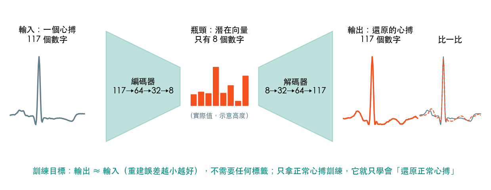
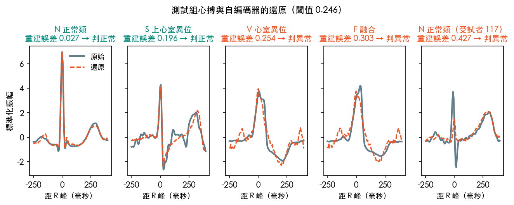
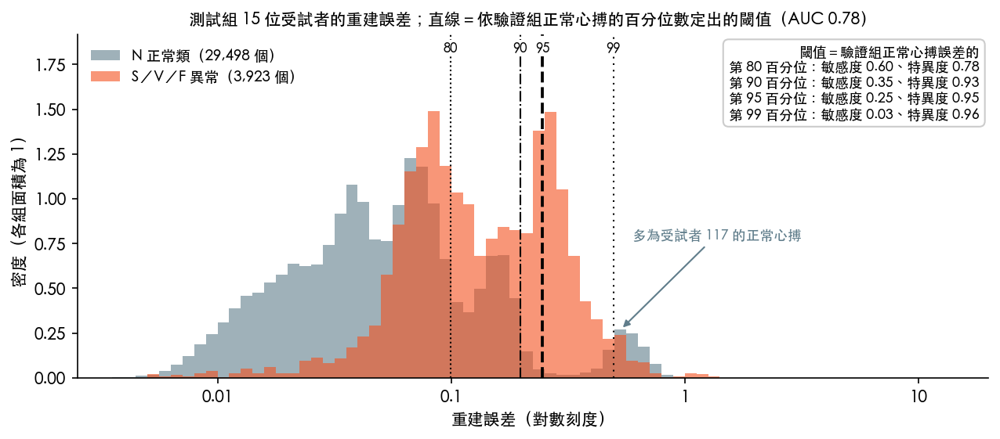
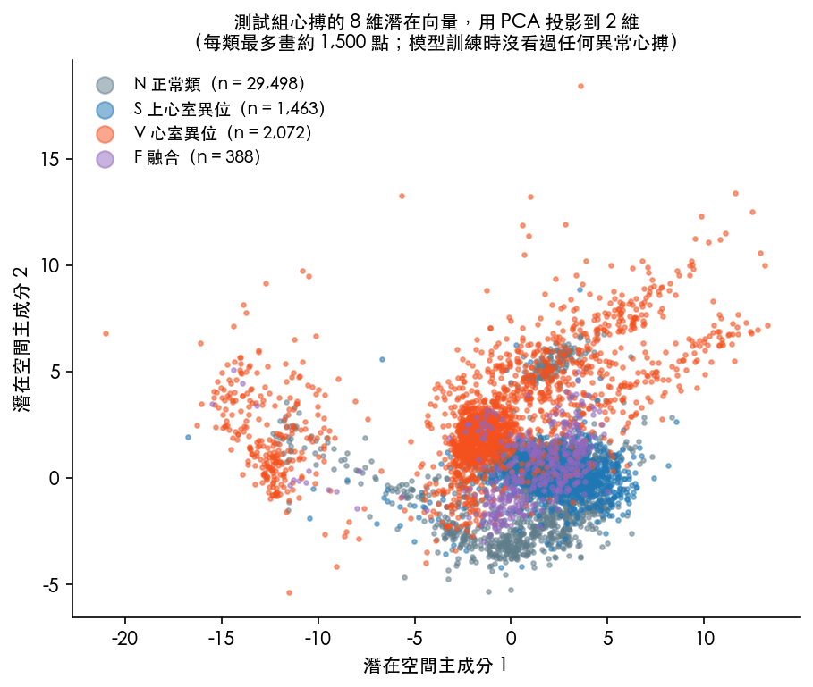
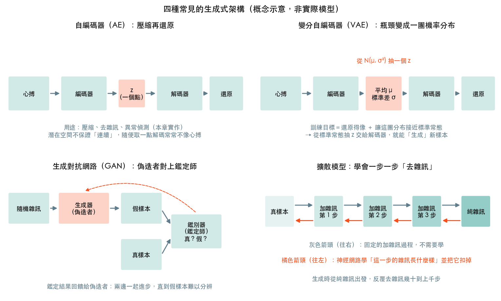
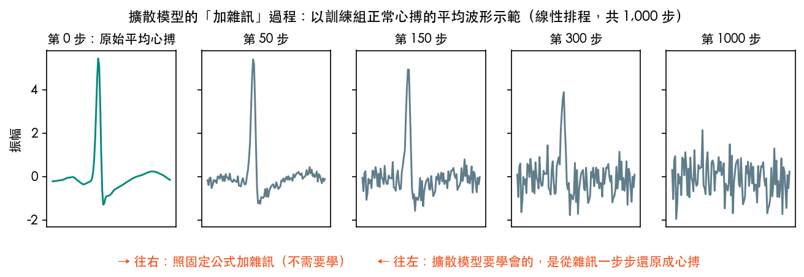

# 第 16 章　自編碼器與生成模型：學會「正常」，才認得「異常」

<p class="chapter-meta">預計閱讀 30 分鐘 ・ 先備：第 14 章（MIT-BIH、依受試者切）、第 10 章（PCA）、第 11 章（閾值、敏感度、AUC）</p>

!!! abstract "本章你會學到"
    - 用「壓縮＋還原」解釋自編碼器，並說出它和第 10 章 PCA 的關係
    - 只拿正常心搏訓練自編碼器，把重建誤差當異常分數，選閾值、算敏感度、特異度與 AUC
    - 用換種子、換測試折、換超參數的結果，判斷一個數字有多穩定
    - 用直覺說明變分自編碼器、生成對抗網路與擴散模型怎麼「生成」新資料
    - 評估合成醫學資料時，追問隱私、偏誤與評估三件事

<div class="nb-links" markdown>
[:simple-googlecolab: 在 Colab 開啟](https://colab.research.google.com/github/fireman333/ml-for-med-students/blob/main/docs/notebooks/ch16_generative.ipynb){ .md-button .md-button--primary }
[:material-download: 下載 Notebook](../notebooks/ch16_generative.ipynb){ .md-button }
</div>

## 1. 直覺：看過一千個正常心搏之後

剛學心電圖時，你一條條背規則：PR interval（PR 間期）幾毫秒以內、QRS 多寬算寬。看過幾千張之後，一張 ECG 遞過來，還沒量任何間期，你就覺得「這個 QRS 怪怪的」：未必說得出是哪一種心律不整，但知道它**不像你看過的正常心搏**。

這種能力有兩個特點：

1. **不需要先看過每一種異常**：罕見的心律不整只要和「正常」差得夠多，你就會多看一眼。
2. **你的「正常」來自你看過的病人**：換到另一群人，可能把某些人的正常變異也當成怪怪的。

本章要讓模型學會第一點，也會親眼看到第二點帶來的麻煩。做法是自編碼器（autoencoder）：只給它看正常心搏，訓練它把心搏「壓縮再還原」。遇到沒看過的形狀就還原得不像，**還原得有多不像，就是異常分數**。訓練時不需要標籤，屬於[第 8 章](08-kmeans.md)的非監督式學習。

## 2. 核心概念：自編碼器＝壓縮＋還原

### 2.1 一個「輸出要等於輸入」的網路

- **編碼器（encoder）**：把 117 個點的心搏壓成 8 個數字。
- **解碼器（decoder）**：拿這 8 個數字還原回 117 個點。

中間那 8 個數字叫潛在向量（latent vector），所在的空間叫潛在空間（latent space）；這一層刻意做窄，又叫瓶頸（bottleneck）。訓練目標是輸出和輸入越像越好，用均方誤差（mean squared error, MSE）衡量，這個誤差稱為重建誤差（reconstruction error）。

{ loading=lazy }

沒有瓶頸，網路只要把輸入抄到輸出就好；瓶頸逼它只留下最重要的資訊，像交班只有三句話的時間。用正常心搏訓練，留下的就是「正常心搏的重點」。

### 2.2 和 PCA 的關係

[第 10 章](10-dimensionality-reduction.md)的 PCA 也是壓縮＋還原：投影到幾個主成分，再用 `inverse_transform` 投影回來。

| | PCA | 自編碼器 |
|---|---|---|
| 壓縮方式 | 線性投影 | 多層神經網路，可非線性 |
| 怎麼找到 | 公式解 | 梯度下降訓練 |
| 本章設定 | 8 個主成分 | 117→64→32→**8**→32→64→117 |

拿掉所有非線性活化函數，自編碼器的最佳解就和 PCA 落在同一個子空間；加上 ReLU 才有機會學到更彎曲的結構。Hinton 與 Salakhutdinov（Science, 2006）在他們的資料上展示了深層自編碼器壓縮得比 PCA 好得多，但「有機會」不等於「一定」，本章正好可以檢驗。

??? note "數學補充（可跳過）"
    編碼器 $f$、解碼器 $g$，心搏 $x \in \mathbb{R}^{117}$，訓練時最小化正常心搏的平均重建誤差：

    $$ \mathcal{L} = \frac{1}{n}\sum_{i=1}^{n} \frac{1}{117}\,\lVert x_i - g(f(x_i)) \rVert^2 $$

    PCA 是 $f(x) = W^\top (x - \mu)$、$g(z) = Wz + \mu$，$W$ 為前 8 個主成分組成的 $117 \times 8$ 矩陣，是所有線性壓縮中重建誤差最小的。

### 2.3 重建誤差當異常分數

只用正常心搏訓練之後，重建誤差就是「可疑程度」。要變成判斷，需要[第 11 章](11-model-selection.md)的閾值：誤差超過閾值就判異常。閾值必須在另一組資料上定，不能偷看測試組。

## 3. 動手做：用重建誤差抓異常心搏

!!! info "僅供學習"
    本章使用公開資料庫 MIT-BIH Arrhythmia Database（PhysioNet，ODC-By v1.0），結果僅供學習，不構成臨床建議。

完整程式在 notebook，數字來自本機實測（Keras 3.13.2、CPU；自編碼器訓練約 4 秒，含延伸實驗全本約 1 分鐘）。`keras.utils.set_random_seed(42)` 只能固定大部分隨機性，你的結果會略有不同。

### 3.1 資料與切分

下載、讀檔與切心搏和[第 14 章](14-ecg.md)完全相同：從 PhysioNet 官方下載，44 段紀錄、43 位受試者，切成 100,680 個心搏（每個 117 點），依 AAMI 分成 N、S、V、F。注意 **AAMI 的 N 類包含束支傳導阻滯**，所以「正常」其實是「正常類」。

延續第 14 章的教訓，**以受試者為單位切成三組**，同一個人只在一組：

```python
tr, te = next(StratifiedGroupKFold(3, shuffle=True, random_state=RS).split(X, y, groups))
fit_i, val_i = next(GroupShuffleSplit(n_splits=1, test_size=0.25, random_state=RS).split(tr, groups=groups[tr]))
fit, val = tr[fit_i], tr[val_i]
S_fit, S_val, S_te = set(groups[fit]), set(groups[val]), set(groups[te])

# no subject in two groups; every beat in exactly one group
assert not (S_fit & S_val) and not (S_fit & S_te) and not (S_val & S_te)
```

| 組別 | 受試者 | 心搏 | 用途 |
|---|---|---|---|
| 訓練組 | 21 位 | 45,184 個 N 類 | 訓練自編碼器與 PCA |
| 驗證組 | 7 位 | 15,407 個 N 類（另有異常心搏） | 用 N 類定閾值；用全部心搏的 AUC 選潛在維度 |
| 測試組 | 15 位 | 33,421 個（N 29,498、S 1,463、V 2,072、F 388） | 只在最後評估 |

測試組就是第 14 章「切法 B」第 1 折的 15 位受試者。要說清楚選模過程：**訓練只用正常心搏；潛在維度是用驗證組受試者的 AUC 挑的（用到驗證組的異常心搏標籤），測試組沒有參與這一步。**但寫作初期還試過較窄的網路、40 個 epoch 與一維卷積版本，當時看過它們的測試組 AUC，所以本章的數字對「沒看過的新病人」可能偏樂觀。真實研究要把測試集鎖起來，所有設定定案後才打開一次。

### 3.2 模型

PCA 基準只用訓練組 N 類找 8 個主成分（解釋 91.5% 變異）。自編碼器共 19,901 個參數：

```python
encoder = keras.Sequential([
    keras.Input(shape=(X2.shape[1],)),
    keras.layers.Dense(64, activation="relu"),
    keras.layers.Dense(32, activation="relu"),
    keras.layers.Dense(latent),                      # the bottleneck: 8 numbers per beat
], name="encoder")
decoder = keras.Sequential([
    keras.Input(shape=(latent,)),
    keras.layers.Dense(32, activation="relu"),
    keras.layers.Dense(64, activation="relu"),
    keras.layers.Dense(X2.shape[1]),                 # back to 117 points
], name="decoder")
```

訓練時輸入和目標是同一份資料：`ae.fit(X2[train_idx], X2[train_idx], ...)`。20 個 epoch 後，訓練組受試者的 MSE 是 0.0172，驗證組受試者 0.0800：**模型對見過的人還原得特別好**。

{ loading=lazy }

### 3.3 閾值與結果

閾值取**驗證組 N 類重建誤差的第 95 百分位數**，目標特異度約 95%：

```python
def evaluate(err_val, err_te, q=0.95):
    thr = np.quantile(err_val, q)
    flag = err_te > thr
```

S、V、F 合稱異常（3,923 個），測試組結果（第 1 折、種子 42）：

| 指標 | PCA（8 個主成分） | 自編碼器（8 維） |
|---|---|---|
| AUC | 0.775 | 0.783 |
| 敏感度（S／V／F 合計） | 0.223 | 0.249 |
| 特異度 | 0.942 | 0.945 |
| 敏感度 S／V／F | 0.019／0.401／0.039 | 0.011／0.458／0.031 |

單看這一次：特異度達到目標，敏感度偏低；V 類（波形和正常差很多）抓得最多，S 類（形狀像正常，臨床上主要靠「來得太早」）幾乎抓不到，和第 14 章一致。自編碼器和 PCA 很接近，**差距未必有意義**。

**這些數字有多穩定？** notebook 第 9 節做了延伸實驗：

| 換什麼 | AUC | 敏感度 | 敏感度 V | 敏感度 S |
|---|---|---|---|---|
| 主結果（第 1 折、種子 42） | 0.783 | 0.249 | 0.458 | 0.011 |
| 第 1 折、3 個種子（42、1、2） | 0.760–0.859 | 0.249–0.427 | 0.458–0.699 | 0.011–0.137 |
| 3 個測試折 × 3 個種子（9 個模型） | 0.760–0.859 | 0.120–0.427 | 0.151–0.699 | 0.011–0.321 |

只換隨機種子，敏感度就從 0.249 跳到 0.427，主結果是偏低的那一個（只試了 3 個種子，範圍是下限，種子更多時可能更寬）；換測試折，V 與 S 的敏感度變化更大。所以「抓到幾成」只能講範圍。種子 42 下，三折的自編碼器 AUC 都只比 PCA 高 0.008–0.036，但第 1 折種子 1 的自編碼器（0.760）反而低於 PCA（0.775）。

潛在維度也一樣。第 1 折、種子 42 下：

| 潛在維度 | 2 | 4 | 8 | 16 |
|---|---|---|---|---|
| 驗證組 AUC（選模依據） | 0.692 | 0.744 | **0.792** | 0.754 |
| 測試組 AUC | 0.847 | 0.859 | 0.783 | 0.813 |

依驗證組選中的 8 維，在測試組反而是四個裡最低的。這不是要改選 4 維，而是說明**為什麼不能拿測試組挑模型**：看著測試組挑，一定挑到測試組上運氣最好的那個，成績偏樂觀。PCA 若照同樣規則挑會選 4 維，測試 AUC 只有 0.710。

### 3.4 誤判集中在誰身上？

第 1 折的 1,619 個偽陽性中，**1,530 個來自同一位受試者（record 117）**：他的 1,533 個正常類心搏 99.8% 被判異常；不算他，特異度是 0.997。PCA 也一樣（1,709 個偽陽性中 1,531 個來自他），所以問題不在非線性模型，而在這個人的心搏和訓練組的人不像。

這是第 1 折的現象。第 2 折的偽陽性也有一半以上來自單一受試者，但總數少得多（特異度 0.970–0.992）；第 3 折則分散在多人身上。模型學到的「正常」，只是訓練組那些人的正常。

### 3.5 換閾值

| 驗證組百分位數 | 閾值 | 敏感度 | 特異度 | 敏感度 V |
|---|---|---|---|---|
| 第 80 | 0.099 | 0.604 | 0.779 | 0.874 |
| 第 90 | 0.198 | 0.350 | 0.935 | 0.636 |
| 第 95 | 0.246 | 0.249 | 0.945 | 0.458 |
| 第 99 | 0.495 | 0.028 | 0.959 | 0.048 |

{ loading=lazy }

閾值往下調，敏感度上升、特異度下降，和第 11 章的 ROC 曲線是同一回事。第 99 百分位數的特異度只有 0.959，遠低於預期的 99%，因為右側那群受試者 117 的心搏連這個閾值都有不少蓋不過：**驗證組定出的誤判率，只在測試對象和驗證對象相似時才成立。**

### 3.6 潛在空間

{ loading=lazy }

V 類有很大一部分落在正常類聚集區之外，S 類大多和 N 疊在一起。模型沒看過任何異常心搏，這些結構完全是「學還原正常心搏」順便學到的。

### 3.7 對照：隨機切心搏

同一個自編碼器改用第 14 章的「切法 A」，所有心搏打散後隨機切，訓練與驗證的 N 類數量相同：

| 測試組結果 | 依受試者切 | 隨機切心搏（有洩漏） |
|---|---|---|
| AUC | 0.783 | 0.955 |
| 敏感度 | 0.249 | 0.854 |
| 特異度 | 0.945 | 0.950 |

主因和第 14 章相同：測試組每個人都在訓練時出現過，模型早就記住「這個人的正常」，他的異常心搏自然顯眼。**不用標籤的非監督式方法，一樣會因切分單位而虛高。**但兩組測試心搏的組成不同：隨機切的 V 較多、S 較少（V 2,336、S 927；依受試者切是 V 2,072、S 1,463），V 本來就比較好抓，所以差距有一部分來自組成；這個對照也只跑了一個種子。

## 4. 生成模型與合成醫學資料

### 4.1 從還原到生成：VAE、GAN、擴散模型

一般自編碼器的潛在空間只在訓練資料附近有意義，隨便取一點解碼常得到四不像，不適合用來「生成」。生成模型（generative model）的目標是**學會資料的分布，再從分布中抽樣**：

{ loading=lazy }

| | 怎麼學 | 怎麼生成 | 常見弱點 |
|---|---|---|---|
| 變分自編碼器（VAE；Kingma 與 Welling, 2013） | 編碼器輸出一團分布（平均 $\mu$、標準差 $\sigma$），損失再加一項 KL divergence（KL 散度）讓它接近標準常態 | 從標準常態抽 $z$ 交給解碼器 | 樣本常偏模糊 |
| 生成對抗網路（GAN；Goodfellow 等, 2014） | 生成器（偽造者）與鑑別器（鑑定師）互相對抗 | 隨機雜訊丟進生成器 | 訓練不穩；模式崩塌（mode collapse），只生成少數幾種樣本 |
| 擴散模型（diffusion model；Ho 等, 2020） | 學預測「這一步加進去的雜訊」 | 從純雜訊反覆去雜訊幾十到上千步 | 生成步數多、較慢 |

{ loading=lazy }

上圖照 Ho 等人論文的線性雜訊排程，把平均正常心搏一步步加雜訊（只是示意，本章沒有訓練擴散模型）。往右加雜訊不需要學；擴散模型學的是往左，從雜訊一步步還原。模式崩塌對醫學特別危險，因為罕見表現往往最重要。

??? note "數學補充（可跳過）"
    VAE 最大化證據下界（ELBO）：

    $$ \mathcal{L}(x) = \mathbb{E}_{q(z \mid x)}\big[\log p(x \mid z)\big] - \mathrm{KL}\big(q(z \mid x)\,\Vert\,\mathcal{N}(0, I)\big) $$

    抽樣用重新參數化技巧：$z = \mu + \sigma \odot \epsilon$，$\epsilon \sim \mathcal{N}(0, I)$，讓梯度能傳回編碼器。

### 4.2 合成醫學資料：隱私、偏誤、評估難題

合成資料（synthetic data）常被寄望補足罕見病資料，或取代真實病人資料來分享。Chen 等人（Nat Biomed Eng, 2021）整理了這些期待與陷阱，讀相關研究時可追問三件事：

- **隱私**：生成模型過擬合時可能把訓練資料「背」出來。Chen 等人舉例，公開以特定病人臉部影像訓練的 GAN 權重，第三方可能生成出真實病人的臉；Carlini 等人（2023）從主流影像擴散模型抽出上千張與訓練影像幾乎相同的圖片。「合成的」本身不是隱私保證。
- **偏誤**：用有偏差的資料訓練的生成模型仍會偏向資料中較常見的狀況。Shumailov 等人（Nature, 2024）發現反覆用生成資料訓練下一代模型，原始分布的尾巴會消失（模型崩塌，model collapse），而醫學上的尾巴正是罕見病與非典型表現。
- **評估**：Chen 等人指出常用量化指標不易被臨床人員解讀；請專家用肉眼判斷真假既費時，同一位專家前後判讀也可能不一致，心電圖、病歷又比影像更難判斷。Alaa 等人（2021）把評估拆成逼真度（fidelity）、多樣性（diversity）、泛化（generalization，是否只是複製訓練樣本）三面向。最終仍要問：用合成資料訓練的模型，在真實的外部資料上表現如何？

## 5. 互動體驗

### 重建誤差與閾值

下面是測試組 33,421 個心搏的重建誤差分布（由 notebook 主模型匯出）。拖動滑桿移動閾值：要讓 V 類抓到八成以上，特異度得讓到多少？右側那群正常類心搏，閾值要多高才能放過？閾值以對數間隔 0.05 跳動，數字會和 3.5 節略有不同。

<div class="demo-box">
  <div id="ch16-demo"></div>
  <div class="controls">
    <label for="ch16-thr">閾值</label>
    <input type="range" id="ch16-thr" min="20" max="70" step="1" value="48">
    <span id="ch16-thr-val"></span>
  </div>
  <p id="ch16-info" style="font-size:.75rem;margin:.4rem 0 0;"></p>
</div>

### GAN Lab

[GAN Lab](https://poloclub.github.io/ganlab/){ target=_blank rel=noopener }（Georgia Tech Polo Club，Apache-2.0）在瀏覽器裡展示生成器與鑑別器如何在二維平面上互相拉扯，也可能親眼看到模式崩塌。

## 6. 常見陷阱

!!! warning "陷阱 1：拿測試組挑模型或閾值"
    看著測試組挑維度或閾值，報出的成績會偏樂觀。本章依驗證組選 8 維，它在測試組卻是最差的一個；誠實的流程就是接受這個結果。

!!! warning "陷阱 2：非監督式就不會資料洩漏"
    只要同一個人的心搏同時在訓練與測試，模型一樣會「認得這個人」。本章隨機切心搏的 AUC 是 0.955，依受試者切是 0.783。

!!! warning "陷阱 3：以為模型的「正常」就是醫學上的正常"
    AAMI 的 N 類包含束支傳導阻滯，不等於正常竇性心搏。另外，訓練組沒涵蓋到的個人差異也會被當成異常：第 1 折的受試者 117 就被整段報警。

!!! warning "陷阱 4：只報一個種子的數字"
    同一切分只換隨機種子，敏感度就從 0.249 變到 0.427。報告深度學習結果時，要附上換種子、換切分的範圍。

## 7. 小測驗

??? question "Q1. 自編碼器的訓練目標是「輸出等於輸入」。為什麼中間一定要有窄瓶頸？"
    **答案：** 沒有瓶頸，網路把輸入原樣抄到輸出就能讓誤差變成 0，什麼也沒學到。瓶頸逼它只留下最重要的資訊；用正常心搏訓練，遇到不一樣的形狀才會還原得不像。

??? question "Q2. 本章不論換種子或換折，S 類敏感度最高只有 0.321，常常接近 0。要提升 S 類偵測，你會先改什麼？"
    **答案：** 讓模型看到節律資訊，例如加長切窗包含前後心搏，或加入 RR 間期。S 類的單一心搏形狀和正常很像，臨床上主要靠「來得太早」辨認。

??? question "Q3. 一篇研究說「我們用 GAN 生成了 1 萬筆合成病歷，可以自由公開，沒有隱私問題」。你會追問哪兩件事？"
    **答案：** 例如：有沒有檢查合成樣本是否幾乎複製了真實病人（最近距離、成員推論測試或差分隱私）；用合成資料訓練的模型是否在真實資料上驗證過，原始資料的族群組成會不會讓合成資料帶有偏誤。

## 8. 重點整理

- 自編碼器＝編碼器（壓縮到窄瓶頸）＋解碼器（還原），訓練不需要標籤；線性版本和 PCA 落在同一個子空間。
- 只用正常心搏訓練，重建誤差就是異常分數；閾值與潛在維度都在驗證組決定，測試組留到最後評估（寫作初期曾看過測試組結果，見 3.1，數字可能偏樂觀）。
- 本章依受試者切：自編碼器 AUC 0.783（換種子與測試折為 0.760–0.859）、敏感度 0.249（0.120–0.427）；和 PCA 的差距未必有意義。V 類抓得最多；S 類在第 1、3 折幾乎抓不到，第 2 折約三成（0.291–0.321）。
- 第 1 折的偽陽性集中在受試者 117，自編碼器與 PCA 皆然：模型的「正常」只代表訓練組的人。隨機切心搏時 AUC 虛高到 0.955。
- VAE、GAN、擴散模型都在學資料的分布，再從中抽樣生成。
- 合成醫學資料要追問隱私、偏誤與評估。
- 結果來自單一資料庫、43 位受試者、單一導程，未經外部驗證，只能當方向參考。

## 延伸閱讀

- [Hinton GE, Salakhutdinov RR. Reducing the dimensionality of data with neural networks（Science, 2006）](https://doi.org/10.1126/science.1127647) — 深層自編碼器與 PCA 的經典比較。
- [Kingma DP, Welling M. Auto-Encoding Variational Bayes（arXiv, 2013）](https://arxiv.org/abs/1312.6114) — VAE 的原始論文。
- [Goodfellow IJ, et al. Generative Adversarial Networks（arXiv, 2014）](https://arxiv.org/abs/1406.2661) — GAN 的原始論文。
- [Ho J, Jain A, Abbeel P. Denoising Diffusion Probabilistic Models（arXiv, 2020）](https://arxiv.org/abs/2006.11239) — 擴散模型的代表性論文。
- [Chen RJ, et al. Synthetic data in machine learning for medicine and healthcare（Nat Biomed Eng, 2021）](https://doi.org/10.1038/s41551-021-00751-8) — 合成醫學資料的期待、隱私與法規挑戰。
- [Carlini N, et al. Extracting Training Data from Diffusion Models（arXiv, 2023）](https://arxiv.org/abs/2301.13188) — 擴散模型會記住並吐出訓練影像。
- [Alaa AM, et al. How Faithful is your Synthetic Data?（arXiv, 2021）](https://arxiv.org/abs/2102.08921) — 以逼真度、多樣性、泛化評估合成資料。
- [Shumailov I, et al. AI models collapse when trained on recursively generated data（Nature, 2024）](https://doi.org/10.1038/s41586-024-07566-y) — 反覆用生成資料訓練，分布的尾巴會消失。
- [GAN Lab](https://poloclub.github.io/ganlab/) — 在瀏覽器裡互動觀察 GAN 的訓練（Apache-2.0）。
- [Dive into Deep Learning：Generative Adversarial Networks](https://d2l.ai/chapter_generative-adversarial-networks/index.html) — GAN 的推導與實作（CC BY-SA 4.0）。
- [MIT-BIH Arrhythmia Database（PhysioNet）](https://physionet.org/content/mitdb/1.0.0/) — 本章資料的官方頁面（ODC-By v1.0）。

<script src="../../assets/js/demos/ch16-threshold-data.js"></script>
<script src="../../assets/js/demos/ch16-threshold.js"></script>
