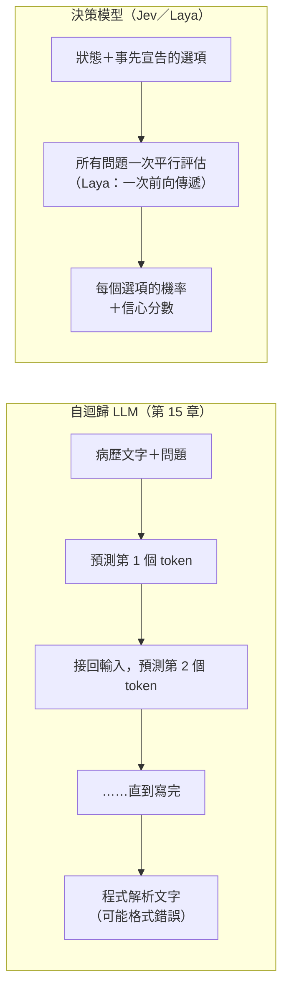

# 專欄：不寫字的語言模型——Jev 與 Laya

預計閱讀 12 分鐘 ・ 先備：第 9 章（輸出層）、第 11 章（校準與閾值）、第 15 章（Transformer）

!!! note "撰寫時間與資料來源"
    本專欄撰寫於 2026-10，兩個產品都在上市一個月內，資訊變動很快。文中數字**皆為開發者自報**，標明「第三方」者除外；查證紀錄與每個數字的出處見本站原始碼的 `research/refs/column_jev_laya.md`。

## 1. 一句話定位

2026 年 9 月出現兩個話題模型：TypeSafe AI 的 **Jev** 與 Convai Innovations 的 **Laya**。它們讀得懂文字，卻**一個字也不寫**：你給它一段資料和幾個事先定義好的選擇題，它直接交回每個選項的機率。說穿了，就是你在本站學過的**分類器**，只是做得很大、選項可以臨時換。

## 2. 自迴歸生成 vs 一次平行評估的決策

[第 15 章](15-transformer.md)講過，ChatGPT 這類 LLM 是**自迴歸（autoregressive）**模型：每次只預測下一個 token，把它接回輸入，再預測下一個，一個字一個字寫出答案。拿它來分類，得請它「只回答 A、B 或 C」再解析文字，偶爾會格式跑掉或編出不存在的選項。

Jev 與 Laya 都屬於**非自迴歸（non-autoregressive）**設計：不逐字生成，所有問題一次平行評估，輸出是固定格式的機率分布。但兩家說法的精確程度不同：Laya 官方明說所有問題在**一次前向傳遞（forward pass）**裡算完；Jev 官方只說所有問題「平行、各自獨立、一次」評估，內部怎麼算沒有公開，發表文還提到選項很多時改用兩階段（先各自打分，再明確做選擇）。

官方稱 Jev「不會出現型別錯誤」「can't hallucinate」。比較精確的意思是：**輸出一定落在你給的選項裡**，因為模型根本沒有能力寫出選項以外的東西。但「格式永遠正確」不等於「答案正確」，選錯選項依然會發生（見第 6 節）。

## 3. 它其實就是你學過的分類器

回想[第 9 章](09-ann.md)：二元分類的輸出層用 sigmoid，多類別用 softmax，把一排分數轉成加總為 1 的機率。第 15 章的迷你 Transformer 最後一步，正是「取 `[CLS]` 位置的向量 → softmax → 22 個診斷的機率」。

Laya 的 model card 寫得很清楚：它的骨幹是 ModernBERT 這類**雙向編碼器**（和第 15 章的分類 Transformer 同一家族，不是 GPT 那種生成模型），每個選項放在自己的 `[MASK]` 位置打分，再對該題的選項做 softmax。差別只在**選項是請求時才給的**，換題目不必重新訓練。Jev 的內部架構官方沒有公開，只說是「新架構＋平行取樣器」。

兩者都提供三種題型：選一個（choice）、依量表評分（score）、是非題並回傳「是」的機率（官方叫 noul）。

## 4. 「校準機率」為什麼是賣點

兩家都主打「校準過的機率」，並把訓練方法命名為 RLCD（reinforcement learning for calibrated decisions）。依 Laya 的說明，做法是用**嚴格適當評分規則（strictly proper scoring rule）**當獎勵，這類規則只有在模型誠實報出自己的機率時，期望得分才會最高。[第 11 章](11-model-selection.md)的 Brier 分數就是其中一種。

第 11 章說過：**排得對不代表機率說得準**。決策模型的典型用法是「信心夠高就自動處理，不夠就轉給人」，等於在機率上切閾值；機率不準，閾值就沒有意義。三個值得記住的事實：

- Laya 自報**出廠時過度自信**：model card「Honest Limits」一節寫，平均期望校準誤差（expected calibration error, ECE）0.466，在自己的資料上做溫度縮放（temperature scaling）後才降到 0.081（同一份 model card 其他表格的 ECE 數字與此不一致，這裡只引這一節）。換句話說，「校準」要靠**你在自己的資料上再校一次**。
- Laya 英文版遇到高棉文時，準確度 0.000，信心卻有 0.952。模型在自己沒見過的資料上，可以**錯得很有信心**。
- 第三方評測（DMB）提醒：Jev 回傳的信心分數是「廠商自訂的分數，不是經過校準的答對機率」。

## 5. Jev 與 Laya 各自是什麼

| | Jev（jev-1.13） | Laya 家族 |
|---|---|---|
| 開發者 | TypeSafe AI（共同創辦人兼執行長 Diogo Almeida）[^t1] | Convai Innovations[^l1] |
| 釋出 | 2026-09-15，early access[^t1] | 2026-09-18 起陸續上架 Hugging Face[^l2] |
| 開放權重 | 否，只能呼叫 API[^t3] | 是[^l1] |
| 授權 | 商業服務條款（[Master Customer Agreement](https://typesafe.ai/legal/mca)） | Apache-2.0[^l1] |
| 大小 | 未公開 | Laya 421M（context 512）、Laya Multilingual 322M、Laya Typed-Decisions 421M[^l1][^l2] |
| 價格 | 輸入每百萬 token 0.042 美元，輸出免費[^t3] | 自架，無授權費[^l1] |
| 自報速度 | 端到端 70–500 ms[^t1] | 1 題約 33–40 ms（T4 GPU）[^l1] |
| 選項上限／弱點 | 最多 255 個選項；官方列出計數、算數、日期比較、字面理解等弱點[^t1][^t4] | 預設設定下超過 20 個選項明顯變差（77 類時 0.425；可調大選項的 token 預算改善）[^l1] |
| 能否用自己資料微調 | 不提供[^t3] | 可以，官方附微調 notebook[^l1] |

兩個重要的「自報」細節：

- **Laya 零樣本接近隨機**：在開發者自己的 typed-decisions 基準上，未微調的 Laya 準確度 0.362，隨機猜是 0.318，永遠猜最常見答案是 0.461，未微調版本甚至低於後者。微調後的 0.766，是用**同一基準自己的訓練切分**練出來的。官方也說它是拿來特化的底座。
- **Jev 的官方評估沒有人工標準答案**：它比的是「和 GPT-6 Astra、Fable 5.1 兩個大模型平均答案的一致程度」，官方也承認評估題目由自家團隊設計，可能有偏誤。

兩者都已有少量第三方實測（皆未經同儕審查，題目與設定各不相同）：

- **Jev**：一個 pilot 每個資料集 100 題，AG News 0.910、Banking77（72 類版本）0.870，但情緒分類資料集只有 0.480，且該資料集有 16% 的例子把**正確答案的機率給 0**[^x1]；另一份評測在 Banking77 完整測試集（3,080 則）上只有 79.2%[^x2]；兩者的標籤版本與樣本數不同，不宜只引較高的那個。兩份評測的中位延遲約 236–316 ms，落在官方 70–500 ms 區間的中段，而非下緣[^x1][^x2]。
- **Laya**：第三方 JevBench（v1.2.2）在 CPU 上跑過 Laya 英文版，共 534 個決策：standard 題組 0.729（96 題），hard 題組只有 0.341（220 題；長題目會被 512 token 上限截斷）[^x4]。
- **對抗脆弱性**：一篇 arXiv 預印本對每個原本答對的題目**固定一個錯誤選項當目標**，利用模型回傳的選項機率反覆修改、加入讀起來自然的語境；在 Jev 原本答對的 508 個決策中，有 312 個（61.4%）被翻轉。這是有目標的搜尋，不是隨手加一句話就會翻；而且作者測的另外三個決策系統，翻轉率也有 64.9–73.2%，不是 Jev 獨有的問題[^x3]。

## 6. 醫學情境想像（概念性）

!!! info "僅供學習"
    以下是概念性想像，用來說明這類模型的「形狀」適合什麼問題。Jev 與 Laya 的官方文件都**沒有任何醫療用途宣稱**，它們不是醫療器材，也未經臨床驗證。本例僅供學習，不構成臨床建議。

這類模型的輸入是一段文字，輸出是固定選項的機率，形狀上很像下面這些任務：

- **檢傷分流的輔助標記**：讀護理紀錄，回答「是否提到 chest pain（胸痛）合併冒冷汗」（是非題）。
- **表單欄位判讀**：讀出院摘要，回答「吸菸狀態：現在吸／已戒／從未／未記載」（選擇題，記得保留「未記載」選項）。
- **病歷文字分類**：把轉診單分到應會診的科別。

要真的在醫療環境用，至少需要：用**在地、標註過的資料**微調或驗證（Laya 零樣本接近隨機，Jev 不提供微調）；做**外部驗證**，確認換一家醫院仍然成立；在本地資料上**重新校準**後再設信心閾值；檢查**子群偏誤**（不同語言、書寫習慣的病歷表現是否一致）。另外，Jev 是雲端 API，病歷送出去之前要先處理個資與機構規範。

## 7. 限制與保留

!!! warning "讀這類新聞時要記得"
    - **數字多半是自報**：第三方評測不多、都未經同儕審查，樣本也小（Jev 的 pilot 每資料集 100 題，Laya 的 JevBench 共 534 題），彼此題目與設定不同，不能直接拿來排名。
    - **兩家數字不能直接比**：Laya model card 裡和 Jev 的比較表，用的是第三方已發表的 Jev 數字，題目與提示都不同，官方也自己註明這點。
    - **零樣本接近隨機、預設設定下選項多時退化**（Laya 自報）；Jev 官方自列不擅長計數、算數、日期比較與多層推理。
    - **格式正確 ≠ 答案正確**：「不會幻覺」只代表不會寫出選項以外的字，不代表不會選錯；而且有預印本顯示，針對性地加入自然語境就能翻轉多數原本答對的題目（不只 Jev）。
    - **產品變動快**：Jev 的別名 `jev-latest` 會隨新版本移動，同一個請求未來可能得到不同答案。

## 8. 重點整理

- Jev 與 Laya 是**非自迴歸的決策模型**：所有問題一次平行評估（Laya 明說是一次前向傳遞，Jev 架構未公開），直接輸出事先宣告選項的機率，不產生文字。
- 本質上就是第 9 章的 softmax 輸出層、第 15 章的 `[CLS]`／編碼器分類器，差別是選項可以在請求時才定義。
- 「校準機率」是賣點，但 Laya 自報出廠過度自信、需要在自己資料上溫度縮放；第三方也指出 Jev 的信心分數不等於答對機率。
- 「不會幻覺」的精確意思是「不會輸出選項以外的東西」，選錯照樣會發生。
- 目前證據以開發者自報為主，第三方評測少且未經同儕審查；兩者都沒有醫療宣稱，用在醫療必須在地微調、外部驗證、重新校準並檢查偏誤。

## 延伸閱讀

- [TypeSafe：Introducing System One Models & Jev](https://typesafe.ai/blog/introducing-system-one-models-and-jev) — 官方發表文，含價格、速度與評估方法的自我說明。
- [TypeSafe 文件：Jev 1.13 jaggedness](https://docs.typesafe.ai/model-jaggedness/jev-1.13) — 官方自列的已知弱點，比發表文更值得讀。
- [TypeSafe 文件：Models](https://docs.typesafe.ai/models) — 價格、context 長度、輸入限制與不提供微調的說明。
- [Laya model card（Hugging Face）](https://huggingface.co/convaiinnovations/laya) — 架構、訓練方法與「Honest Limits」一節。
- [Laya GitHub](https://github.com/NandhaKishorM/laya) — 原始碼、微調 notebook 與完整基準報告。
- [AbdelStark／jev-benchmarks](https://github.com/AbdelStark/jev-benchmarks) — 第三方對 Jev 的機率品質評測，含 Brier 分數與 bootstrap 信賴區間。
- [nibzard／decision-model-benchmark](https://github.com/nibzard/decision-model-benchmark) — 第三方決策模型評測，含驗證集定閾值、測試集檢查的做法。
- [JevBench（Benchmark Heaven）](https://github.com/fstandhartinger/jevbench) — 第三方決策模型排行，含 Laya 英文版的分題組結果。
- [Xu Z. JevOut: Natural Context Can Flip Decision Models（arXiv 預印本）](https://arxiv.org/abs/2609.30243) — 決策模型對自然語境的脆弱性，未經同儕審查。

[^t1]: [TypeSafe 官方發表文](https://typesafe.ai/blog/introducing-system-one-models-and-jev)（2026-09-15）與 [Team 頁](https://typesafe.ai/team)。
[^t3]: [TypeSafe 文件：Models](https://docs.typesafe.ai/models)。
[^t4]: [TypeSafe 文件：Jev 1.13 jaggedness](https://docs.typesafe.ai/model-jaggedness/jev-1.13)。
[^l1]: [Laya model card](https://huggingface.co/convaiinnovations/laya)。
[^l2]: Hugging Face 模型建立日期（laya 與 laya-typed-decisions 為 2026-09-18，laya-multilingual 為 2026-09-19，UTC）與參數量 metadata。
[^x1]: [AbdelStark／jev-benchmarks](https://github.com/AbdelStark/jev-benchmarks)（第三方，每資料集 100 題，自法國呼叫）。
[^x2]: [nibzard／decision-model-benchmark](https://github.com/nibzard/decision-model-benchmark)（第三方）。
[^x3]: [arXiv 2609.30243](https://arxiv.org/abs/2609.30243)（第三方預印本）。
[^x4]: [JevBench `results/v1.2/additions/laya.json`](https://github.com/fstandhartinger/jevbench/blob/main/results/v1.2/additions/laya.json)（第三方，Florian Standhartinger，2026-09-19 加入）。
