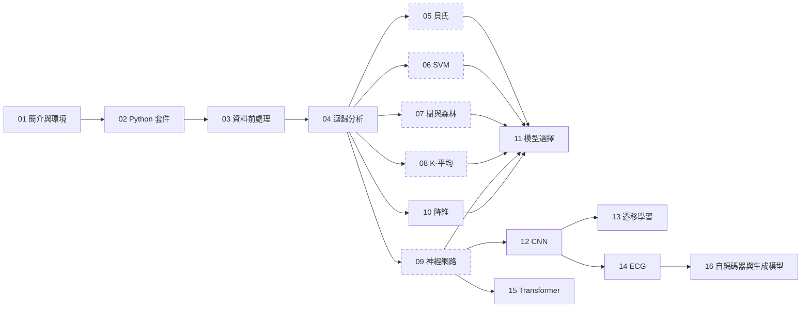

# 醫學生的機器學習入門

**給醫學與生醫相關科系學生的機器學習（Machine Learning）入門：直覺先行、圖解為主，搭配可直接在瀏覽器執行的 Python 實作與公開醫學資料集。**

## 為什麼醫學生要學機器學習

臨床與研究裡的風險預測、影像判讀輔助、文獻分類，越來越常出現機器學習的身影，讀論文時也需要判斷「這個模型的結果能不能信」。你不必成為工程師，但要看得懂模型在做什麼、能做到什麼、哪裡容易出錯。機器學習和你已熟悉的統計方法（例如邏輯迴歸、敏感度與特異度）有很多相通之處，本站會用這些既有知識當橋梁。要提醒的是，機器學習不是萬能：它需要好的資料與嚴謹的驗證，本站也會反覆強調這一點。

## 這個網站怎麼用

1. **讀章節**：每章從一個臨床情境開始，先建立直覺，再看核心概念與圖解。
2. **開 Colab notebook**：每章附一份 Jupyter notebook，點「在 Colab 開啟」即可在瀏覽器執行，不用安裝任何東西。
3. **做小測驗**：章末有 3 題自我檢查，附答案與一句解釋。

## 章節總覽

-   :material-rocket-launch:{ .lg .middle } __[01　機器學習簡介與環境安裝](chapters/01-intro.md)__

    ---

    機器學習到底在做什麼？跑出你的第一個模型。

-   :material-language-python:{ .lg .middle } __[02　Python 四大套件實務](chapters/02-python-toolkit.md)__

    ---

    NumPy、Pandas、Matplotlib、SciPy：處理與描述資料的基本功。

-   :material-broom:{ .lg .middle } __[03　資料收集與前處理實戰](chapters/03-data-preprocessing.md)__

    ---

    遺漏值、編碼、標準化與資料洩漏：把髒資料整理乾淨。

-   :material-chart-line:{ .lg .middle } __[04　迴歸分析](chapters/04-regression.md)__

    ---

    線性迴歸、多項式迴歸與邏輯迴歸，連結到你熟悉的流病統計。

-   :material-percent:{ .lg .middle } __[05　簡單貝氏分類](chapters/05-naive-bayes.md)__

    ---

    從檢驗前後機率談起，看貝氏定理如何變成分類器。

-   :material-vector-line:{ .lg .middle } __[06　支援向量機 SVM](chapters/06-svm.md)__

    ---

    最大間隔與核函數：怎麼畫出一條最穩的分界線。

-   :material-file-tree:{ .lg .middle } __[07　決策樹與隨機森林](chapters/07-tree-forest.md)__

    ---

    像臨床決策流程圖的模型，以及「多位醫師會診」的森林。

-   :material-scatter-plot:{ .lg .middle } __[08　K-平均分群](chapters/08-kmeans.md)__

    ---

    沒有標籤時，讓資料自己分成幾群。

-   :material-graph-outline:{ .lg .middle } __[09　人工神經網路基礎](chapters/09-ann.md)__

    ---

    從單一神經元到多層網路，以及何時才需要深度學習。

-   :material-arrow-collapse-vertical:{ .lg .middle } __[10　資料降維](chapters/10-dimensionality-reduction.md)__

    ---

    特徵選取與主成分分析：用更少的變數保留主要資訊。

-   :material-scale-balance:{ .lg .middle } __[11　模型選擇與效能提升](chapters/11-model-selection.md)__

    ---

    交叉驗證、調參、類別不平衡與評估指標，總結整個流程。

### 深度學習篇

讀完第 09 章之後的進階內容：從影像、訓練技巧到語言模型。程式改用 Keras 3，Colab 免費 CPU 可跑完，開 GPU 會更快。

-   :material-image-filter-center-focus:{ .lg .middle } __[12　卷積神經網路 CNN](chapters/12-cnn.md)__

    ---

    讓模型保留影像的空間結構，用更少參數看懂胸部 X 光。

-   :material-tune-variant:{ .lg .middle } __[13　訓練技巧與遷移學習](chapters/13-transfer-learning.md)__

    ---

    資料擴增、批次正規化、借用預訓練模型，以及 Grad-CAM 熱圖的限制。

-   :material-heart-pulse:{ .lg .middle } __[14　心電圖與資料洩漏](chapters/14-ecg.md)__

    ---

    用一維卷積分類心跳，親手看到「同一病人跨訓練與測試」讓成績虛高多少。

-   :material-text-search:{ .lg .middle } __[15　注意力機制與 Transformer](chapters/15-transformer.md)__

    ---

    從病人主訴的文字分類，一路講到大型語言模型的原理與限制。

-   :material-vector-combine:{ .lg .middle } __[16　自編碼器與生成模型](chapters/16-generative.md)__

    ---

    只用正常心搏訓練自編碼器，以重建誤差找出可疑心跳，再概覽 VAE、GAN 與擴散模型。

## 學習路徑

第 01–04 章是共同基礎，建議依序閱讀。第 05–09 章是各種模型，彼此相對獨立，可依興趣挑著讀；第 11 章整合前面所有內容。深度學習篇（12–16）建立在第 09 章之上，第 12、13 章建議依序讀，第 14 章接在第 12 章之後，第 15 章可直接從第 09 章接過去。第 16 章接在第 14 章之後，用同一份 MIT-BIH，並用到第 10 章的降維與第 11 章的閾值。

虛線框（05–09）表示可依興趣跳讀；第 10 章建議在讀過至少一種模型後閱讀。

## 先備知識

- **不需要會寫程式**：第 01 章從零開始，所有程式都在 Colab 上執行。
- 高中程度的數學（函數、平均、簡單的機率）。
- 基礎統計概念：平均、標準差、p 值、敏感度與特異度。

## 關於本站

本站作者是醫學系畢業、正在學習資料科學的學習者。內容為教學用途，所用資料集皆為公開資料，醫學案例僅供學習，**不構成醫療建議**，也不能取代專業臨床判斷。內容若有錯誤，歡迎指正。

本站文字以 CC BY 4.0、程式碼以 MIT 授權釋出。各資料集的授權與引用請見[資料集一覽](appendix/datasets.md)，名詞對照請見[中英術語對照](appendix/glossary.md)。
